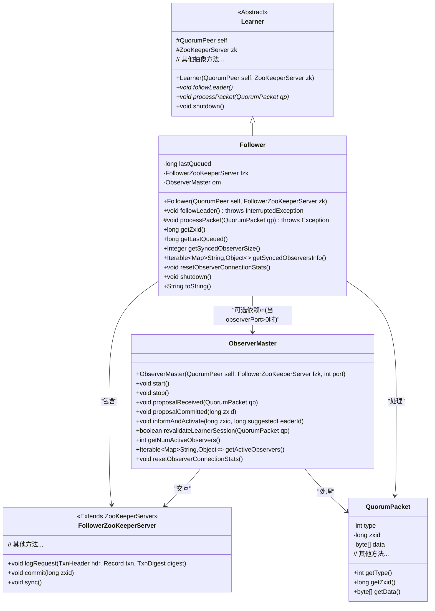

# 基础信息

|      |      |
|------|------|
| 名称 | Follower |
| 编码语言 | .java |
| 代码路径 | zookeeper/zookeeper-server/src/main/java/org/apache/zookeeper/server/quorum/Follower.java |
| 包名 | org.apache.zookeeper.server.quorum |
| 依赖项 | ['java.nio.charset.StandardCharsets.UTF_8', 'java.io.IOException', 'java.nio.ByteBuffer', 'java.util.Collections', 'java.util.Map', 'java.util.Objects', 'org.apache.jute.Record', 'org.apache.zookeeper.ZooDefs.OpCode', 'org.apache.zookeeper.common.Time', 'org.apache.zookeeper.server.Request', 'org.apache.zookeeper.server.ServerMetrics', 'org.apache.zookeeper.server.TxnLogEntry', 'org.apache.zookeeper.server.quorum.QuorumPeer.QuorumServer', 'org.apache.zookeeper.server.quorum.flexible.QuorumVerifier', 'org.apache.zookeeper.server.util.SerializeUtils', 'org.apache.zookeeper.server.util.ZxidUtils', 'org.apache.zookeeper.txn.SetDataTxn', 'org.apache.zookeeper.txn.TxnDigest', 'org.apache.zookeeper.txn.TxnHeader'] |
| 概述说明 | Follower类继承Learner，实现跟随Leader的逻辑，包括连接Leader、同步数据、处理消息包等。维护最后队列的zxid，支持ObserverMaster管理观察者。关键方法有followLeader和processPacket，处理不同消息类型如PING、PROPOSAL、COMMIT等。 |

# 说明

该内容描述了一个名为Follower的类，继承自Learner类，用于实现ZooKeeper中跟随者节点的功能。Follower类包含与领导者节点交互的逻辑，如连接领导者、同步数据、处理来自领导者的数据包等。关键字段包括lastQueued记录最后入队的操作zxid，fzk为FollowerZooKeeperServer实例，om为ObserverMaster实例。主要方法followLeader负责跟随领导者，包括发现领导者、注册、同步数据等流程。processPacket方法处理不同类型的领导者数据包，如PING、PROPOSAL、COMMIT等。此外还提供了获取zxid、观察者信息等方法，以及关闭资源的shutdown方法。整体实现了跟随者节点的核心功能，确保与领导者节点的数据一致性。

# 类列表 Class Summary

| 名称   | 类型  | 说明 |
|-------|------|-------------|
| Follower | class | Follower类继承Learner，负责跟随Leader节点。主要功能包括连接Leader、同步数据、处理Leader发送的提案和提交请求，支持动态配置变更。包含状态管理、数据同步、提案处理及ObserverMaster管理。 |

## 类 Follower

|      |      |
|------|------|
| 访问范围 | public |
| 类型 | class |
| 名称 | Follower |
| 说明 | Follower类继承Learner，负责跟随Leader节点。主要功能包括连接Leader、同步数据、处理Leader发送的提案和提交请求，支持动态配置变更。包含状态管理、数据同步、提案处理及ObserverMaster管理。 |

### UML类图

类图描述：
该图展示了ZooKeeper中Follower角色的核心类结构。Follower继承自抽象类Learner，包含关键组件FollowerZooKeeperServer和可选的ObserverMaster。Follower通过processPacket方法处理来自Leader的QuorumPacket消息，支持多种消息类型（PROPOSAL/COMMIT等）。ObserverMaster负责管理与Observer的交互，当配置observer端口时才会实例化。整个设计体现了ZooKeeper的集群同步机制，Follower通过精确的状态转换（DISCOVERY→SYNCHRONIZATION→BROADCAST）实现与Leader的数据同步。

### 内部方法调用关系图

```mermaid
graph TD
    A["类Follower extends Learner"]
    B["属性: long lastQueued"]
    C["属性: FollowerZooKeeperServer fzk"]
    D["属性: ObserverMaster om"]
    E["构造方法: Follower(QuorumPeer self, FollowerZooKeeperServer zk)"]
    F["重写方法: String toString()"]
    G["核心方法: void followLeader()"]
    H["处理方法: void processPacket(QuorumPacket qp)"]
    I["辅助方法: long getZxid()"]
    J["辅助方法: long getLastQueued()"]
    K["辅助方法: Integer getSyncedObserverSize()"]
    L["辅助方法: Iterable<Map<String, Object>> getSyncedObserversInfo()"]
    M["辅助方法: void resetObserverConnectionStats()"]
    N["重写方法: void shutdown()"]

    A --> B
    A --> C
    A --> D
    A --> E
    A --> F
    A --> G
    A --> H
    A --> I
    A --> J
    A --> K
    A --> L
    A --> M
    A --> N

    G --> G1["设置选举时间指标"]
    G --> G2["注册JMX"]
    G --> G3["发现Leader并连接"]
    G --> G4["与Leader同步状态"]
    G --> G5["启动ObserverMaster"]
    G --> G6["循环处理数据包"]
    G --> G7["异常处理和资源清理"]

    H --> H1["处理PING包"]
    H --> H2["处理PROPOSAL包"]
    H --> H3["处理COMMIT包"]
    H --> H4["处理COMMITANDACTIVATE包"]
    H --> H5["处理REVALIDATE包"]
    H --> H6["处理SYNC包"]
    H --> H7["默认未知包处理"]
```

该流程图展示了ZooKeeper中Follower类的核心结构和主要行为。Follower作为Learner的子类，负责跟随Leader节点并处理各类ZooKeeper协议包。关键流程包括：初始化时注册JMX监控，通过followLeader方法实现Leader跟随机制，包含状态转换(发现→同步→广播)、数据包循环处理、异常恢复等核心逻辑。processPacket方法实现了对不同类型协议包(提案、提交、验证等)的分发处理，同时维护ObserverMaster相关功能。整体设计体现了ZooKeeper的分布式一致性协议实现，包含状态管理、错误处理和性能监控等关键要素。

### 字段列表 Field List

| 名称  | 类型  | 说明 |
|-------|-------|------|
| fzk | FollowerZooKeeperServer | 最终FollowerZooKeeperServer实例fzk。 |
| lastQueued | long | 私有长整型变量lastQueued，记录最后入队时间。 |
| om | ObserverMaster | ObserverMaster对象实例化。 |

### 方法列表 Method List

| 名称  | 类型  | 说明 |
|-------|-------|------|
| getSyncedObserverSize | Integer | 该方法返回当前活跃观察者数量，若对象为空则返回null。 |
| followLeader | void | 方法followLeader处理跟随者节点逻辑：记录选举耗时，连接并同步领导者数据，处理通信包，异常时关闭连接并清理资源。 |
| getZxid | long | 同步获取fzk对象的zxid值。 |
| getLastQueued | long | 获取最后入队时间的方法，返回变量lastQueued的值。 |
| processPacket | void | 处理QuorumPacket的分发逻辑：PING直接处理；PROPOSAL记录日志并更新配置；COMMIT提交事务；COMMITANDACTIVATE处理重配置；其他类型如UPTODATE、REVALIDATE、SYNC有对应操作，未知类型报错。 |
| toString | String | 重写toString方法，返回Follower信息：socket、最后队列zxid和待验证计数。 |
| getSyncedObserversInfo | Iterable<Map<String, Object>> | 该方法返回同步观察者信息。若观察者管理器存在且有活跃观察者，返回其信息；否则返回空集合。 |
| resetObserverConnectionStats | void | 方法resetObserverConnectionStats在观察者管理器om非空且存在活跃观察者时，重置观察者连接统计。 |
| shutdown | void | 重写shutdown方法，记录日志并调用父类方法。 |

