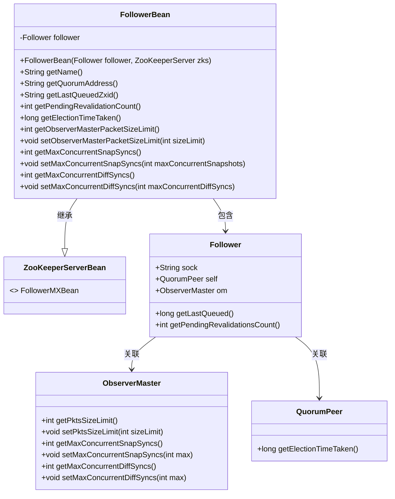

# 基础信息

|      |      |
|------|------|
| 名称 | FollowerBean |
| 编码语言 | .java |
| 代码路径 | zookeeper/zookeeper-server/src/main/java/org/apache/zookeeper/server/quorum/FollowerBean.java |
| 包名 | org.apache.zookeeper.server.quorum |
| 依赖项 | ['org.apache.zookeeper.server.ZooKeeperServer', 'org.apache.zookeeper.server.ZooKeeperServerBean'] |
| 概述说明 | FollowerBean类继承ZooKeeperServerBean，实现FollowerMXBean接口，提供获取和设置Follower节点信息的方法，包括选举耗时、同步限制等。 |

# 说明

FollowerBean类继承ZooKeeperServerBean并实现FollowerMXBean接口，用于管理ZooKeeper的Follower节点。它包含Follower实例，提供获取节点名称、仲裁地址、最后排队事务ID、待验证请求数等方法。还支持获取和设置选举耗时、主观察者包大小限制、最大并发快照同步数和差异同步数等功能，通过内部ObserverMaster实例进行相关操作。

# 类列表 Class Summary

| 名称   | 类型  | 说明 |
|-------|------|-------------|
| FollowerBean | class | FollowerBean类继承ZooKeeperServerBean，实现FollowerMXBean接口，提供获取和设置Follower节点信息的方法，包括选举时间、队列Zxid、待验证计数及同步限制等。 |

## 类 FollowerBean

|      |      |
|------|------|
| 访问范围 | public |
| 类型 | class |
| 名称 | FollowerBean |
| 说明 | FollowerBean类继承ZooKeeperServerBean，实现FollowerMXBean接口，提供获取和设置Follower节点信息的方法，包括选举时间、队列Zxid、待验证计数及同步限制等。 |

### UML类图

这段代码描述了一个ZooKeeper的Follower节点管理类FollowerBean，该类继承自ZooKeeperServerBean并实现了FollowerMXBean接口。FollowerBean通过聚合方式持有一个Follower对象，用于获取和设置Follower节点的各种状态信息，包括选举耗时、待验证请求数、主从同步参数等。类图中清晰地展示了FollowerBean与Follower、ObserverMaster、QuorumPeer等组件之间的继承和关联关系，体现了ZooKeeper集群节点状态监控的核心结构。

### 内部方法调用关系图

```mermaid
graph TD
    A["类FollowerBean"]
    B["继承: ZooKeeperServerBean"]
    C["实现: FollowerMXBean"]
    D["属性: Follower follower"]
    E["构造方法: FollowerBean(Follower, ZooKeeperServer)"]
    F["方法: String getName()"]
    G["方法: String getQuorumAddress()"]
    H["方法: String getLastQueuedZxid()"]
    I["方法: int getPendingRevalidationCount()"]
    J["重写方法: long getElectionTimeTaken()"]
    K["重写方法: int getObserverMasterPacketSizeLimit()"]
    L["重写方法: void setObserverMasterPacketSizeLimit(int)"]
    M["重写方法: int getMaxConcurrentSnapSyncs()"]
    N["重写方法: void setMaxConcurrentSnapSyncs(int)"]
    O["重写方法: int getMaxConcurrentDiffSyncs()"]
    P["重写方法: void setMaxConcurrentDiffSyncs(int)"]

    A -->|继承| B
    A -->|实现| C
    A --> D
    A --> E
    A --> F
    A --> G
    A --> H
    A --> I
    A --> J
    A --> K
    A --> L
    A --> M
    A --> N
    A --> O
    A --> P
```

这段代码展示了一个ZooKeeper的FollowerBean类，继承自ZooKeeperServerBean并实现了FollowerMXBean接口。该类主要用于管理Follower节点的状态和配置，包括获取选举时间、设置数据包大小限制、控制并发同步数量等核心功能。通过封装Follower对象，提供了对底层ZooKeeper服务器状态的监控和管理接口，是ZooKeeper集群管理的重要组成部分。

### 字段列表 Field List

| 名称  | 类型  | 说明 |
|-------|-------|------|
| follower | Follower | 私有成员变量follower，类型为Follower。 |

### 方法列表 Method List

| 名称  | 类型  | 说明 |
|-------|-------|------|
| getLastQueuedZxid | String | 该方法返回跟随者最后排队的事务ID，格式为十六进制字符串"0x"前缀。 |
| getMaxConcurrentSnapSyncs | int | 方法getMaxConcurrentSnapSyncs检查follower.om是否存在，存在则返回其最大并发快照同步数，否则返回-1。 |
| getQuorumAddress | String | 方法getQuorumAddress返回follower.sock的字符串表示形式。 |
| getPendingRevalidationCount | int | 该方法返回待重新验证的数量，通过调用follower的getPendingRevalidationsCount方法实现。 |
| getObserverMasterPacketSizeLimit | int | 该方法返回观察者主节点的数据包大小限制，若无主节点则返回-1。 |
| getElectionTimeTaken | long | 该代码重写getElectionTimeTaken方法，返回follower.self的选举耗时值。 |
| setObserverMasterPacketSizeLimit | void | 重写方法，设置观察者主控包大小限制，调用ObserverMaster的setPktsSizeLimit方法实现。 |
| setMaxConcurrentSnapSyncs | void | 重写方法setMaxConcurrentSnapSyncs，若ObserverMaster存在则设置最大并发快照同步数。 |
| getMaxConcurrentDiffSyncs | int | 重写方法getMaxConcurrentDiffSyncs，检查follower.om是否存在，存在则返回其最大并发差异同步数，否则返回-1。 |
| setMaxConcurrentDiffSyncs | void | 重写方法setMaxConcurrentDiffSyncs，若ObserverMaster对象om非空则调用其同名方法设置最大并发差异同步数。 |
| getName | String | 方法返回字符串"Follower"。 |

