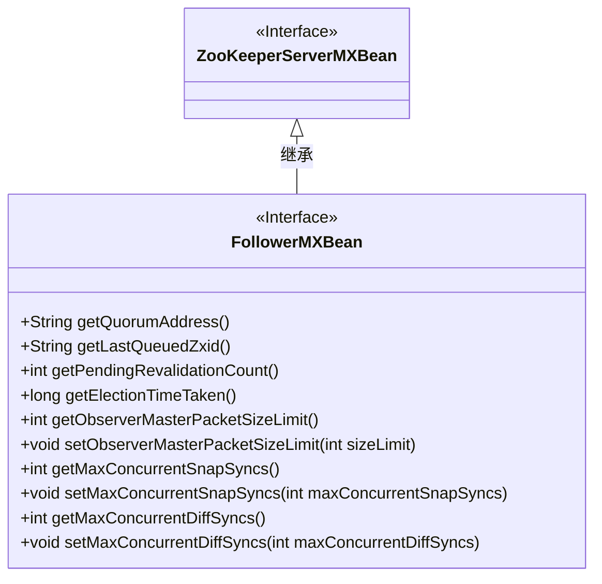

# 基础信息

|      |      |
|------|------|
| 名称 | FollowerMXBean |
| 编码语言 | .java |
| 代码路径 | zookeeper/zookeeper-server/src/main/java/org/apache/zookeeper/server/quorum/FollowerMXBean.java |
| 包名 | org.apache.zookeeper.server.quorum |
| 依赖项 | ['org.apache.zookeeper.server.ZooKeeperServerMXBean'] |
| 概述说明 | FollowerMXBean接口扩展ZooKeeperServerMXBean，提供获取仲裁地址、最后队列zxid、待验证计数、选举耗时、主包队列大小限制及设置、并发快照和差异同步数量及设置的方法。 |

# 说明

FollowerMXBean接口扩展了ZooKeeperServerMXBean，提供了获取和设置ZooKeeper跟随者节点相关配置和状态的方法。关键方法包括获取仲裁地址、最后入队ZXID、待验证计数、选举耗时、观察者主包队列大小限制及其设置方法。还包含控制并发快照同步和差异同步数量的方法，分别通过get和set方法管理最大并发快照同步数和差异同步数。这些功能用于监控和调整跟随者节点的性能和同步行为。

# 类列表 Class Summary

| 名称   | 类型  | 说明 |
|-------|------|-------------|
| FollowerMXBean | interface | FollowerMXBean接口扩展ZooKeeperServerMXBean，提供获取仲裁地址、最后队列zxid、待验证计数、选举耗时等方法，并支持设置观察者主包大小限制及并发快照和差异同步数量。 |

## 类 FollowerMXBean

|      |      |
|------|------|
| 访问范围 | public |
| 类型 | interface |
| 名称 | FollowerMXBean |
| 说明 | FollowerMXBean接口扩展ZooKeeperServerMXBean，提供获取仲裁地址、最后队列zxid、待验证计数、选举耗时等方法，并支持设置观察者主包大小限制及并发快照和差异同步数量。 |

### UML类图

该类图展示了一个ZooKeeper的FollowerMXBean接口，它继承自ZooKeeperServerMXBean接口。FollowerMXBean定义了多个方法用于获取和设置Follower节点的状态信息，包括选举时间、待验证请求数、主节点通信包大小限制等。这些方法主要用于监控和管理ZooKeeper集群中Follower节点的运行状态，通过JMX暴露给外部监控系统使用。

### 内部方法调用关系图

```mermaid
graph TD
    A["接口FollowerMXBean"]
    B["继承: ZooKeeperServerMXBean"]
    C["方法: String getQuorumAddress()"]
    D["方法: String getLastQueuedZxid()"]
    E["方法: int getPendingRevalidationCount()"]
    F["方法: long getElectionTimeTaken()"]
    G["方法: int getObserverMasterPacketSizeLimit()"]
    H["方法: void setObserverMasterPacketSizeLimit(int)"]
    I["方法: int getMaxConcurrentSnapSyncs()"]
    J["方法: void setMaxConcurrentSnapSyncs(int)"]
    K["方法: int getMaxConcurrentDiffSyncs()"]
    L["方法: void setMaxConcurrentDiffSyncs(int)"]

    A --> B
    A --> C
    A --> D
    A --> E
    A --> F
    A --> G
    A --> H
    A --> I
    A --> J
    A --> K
    A --> L
```

该流程图展示了FollowerMXBean接口的结构，它继承自ZooKeeperServerMXBean并定义了10个关键方法。这些方法主要分为两类：获取器（如getQuorumAddress）和设置器（如setObserverMasterPacketSizeLimit），用于监控和管理ZooKeeper follower节点的状态、选举时间、同步队列等核心功能。所有方法都通过单向箭头与接口主体连接，清晰地表明了它们属于接口的组成部分。

### 字段列表 Field List

| 名称  | 类型  | 说明 |
|-------|-------|------|

### 方法列表 Method List

| 名称  | 类型  | 说明 |
|-------|-------|------|
| getElectionTimeTaken | long | 获取选举耗时的方法。 |
| setMaxConcurrentSnapSyncs | void | 设置最大并发快照同步数的方法，参数为maxConcurrentSnapSyncs。 |
| getMaxConcurrentSnapSyncs | int | 获取最大并发快照同步数的方法。 |
| getObserverMasterPacketSizeLimit | int | 获取观察者主数据包大小限制的函数。 |
| getQuorumAddress | String | 
获取法定人数地址的方法。 |
| getMaxConcurrentDiffSyncs | int | 获取最大并发差异同步数的方法。 |
| setObserverMasterPacketSizeLimit | void | 设置主数据包观察者的最大尺寸限制。参数为sizeLimit。 |
| getLastQueuedZxid | String | 获取最后排队的事务ID。 |
| getPendingRevalidationCount | int | 获取待重新验证的任务数量。 |
| setMaxConcurrentDiffSyncs | void | 设置最大并发差异同步数。 |

