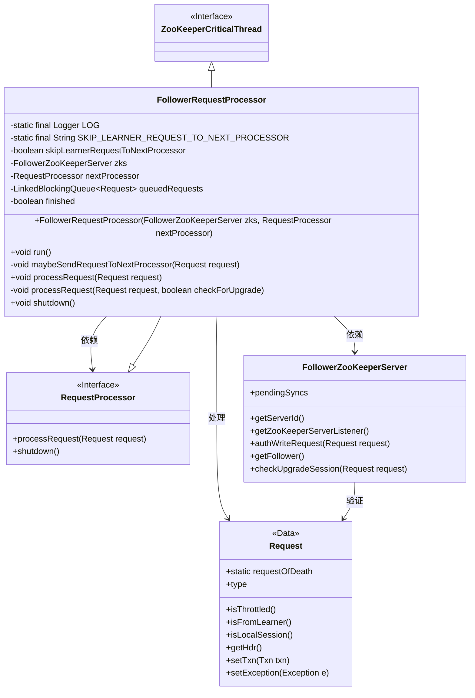
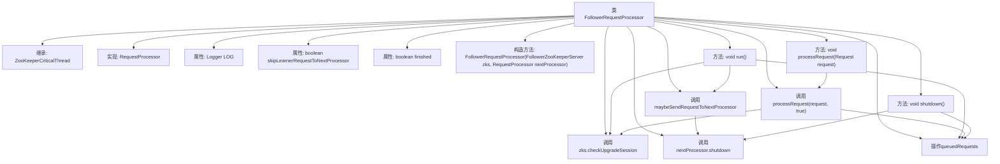

# 基础信息

|      |      |
|------|------|
| 名称 | FollowerRequestProcessor |
| 编码语言 | .java |
| 代码路径 | zookeeper/zookeeper-server/src/main/java/org/apache/zookeeper/server/quorum/FollowerRequestProcessor.java |
| 包名 | org.apache.zookeeper.server.quorum |
| 依赖项 | ['java.io.IOException', 'java.util.concurrent.LinkedBlockingQueue', 'org.apache.zookeeper.KeeperException', 'org.apache.zookeeper.ZooDefs.OpCode', 'org.apache.zookeeper.server.Request', 'org.apache.zookeeper.server.RequestProcessor', 'org.apache.zookeeper.server.ServerMetrics', 'org.apache.zookeeper.server.ZooKeeperCriticalThread', 'org.apache.zookeeper.server.ZooTrace', 'org.apache.zookeeper.txn.ErrorTxn', 'org.slf4j.Logger', 'org.slf4j.LoggerFactory'] |
| 概述说明 | FollowerRequestProcessor是ZooKeeper的请求处理器，负责处理跟随者服务器的请求队列，筛选并转发请求至下一处理器或领导者，支持会话升级和异常处理。 |

# 说明

FollowerRequestProcessor是ZooKeeper中处理跟随者请求的线程类，继承自ZooKeeperCriticalThread并实现RequestProcessor接口。它通过LinkedBlockingQueue管理请求队列，根据请求类型决定是否转发给下一个处理器或领导者。主要功能包括处理会话升级请求、ACL验证、请求限流及同步操作跟踪。通过skipLearnerRequestToNextProcessor配置可跳过学习者请求。运行时循环处理队列请求，遇到终止信号或异常时退出。提供shutdown方法用于清理资源。

# 类列表 Class Summary

| 名称   | 类型  | 说明 |
|-------|------|-------------|
| FollowerRequestProcessor | class | FollowerRequestProcessor是ZooKeeper的请求处理线程，继承ZooKeeperCriticalThread并实现RequestProcessor接口。主要功能包括：处理队列请求、验证ACL、转发请求至Leader、管理会话升级及优雅关闭。通过LinkedBlockingQueue管理请求，支持跳过学习者请求配置，并处理多种操作类型如sync/create/delete等。 |

## 类 FollowerRequestProcessor

|      |      |
|------|------|
| 访问范围 | public |
| 类型 | class |
| 名称 | FollowerRequestProcessor |
| 说明 | FollowerRequestProcessor是ZooKeeper的请求处理线程，继承ZooKeeperCriticalThread并实现RequestProcessor接口。主要功能包括：处理队列请求、验证ACL、转发请求至Leader、管理会话升级及优雅关闭。通过LinkedBlockingQueue管理请求，支持跳过学习者请求配置，并处理多种操作类型如sync/create/delete等。 |

### UML类图

该类图展示了ZooKeeper中FollowerRequestProcessor的核心结构，它继承自ZooKeeperCriticalThread并实现RequestProcessor接口，主要处理来自客户端的请求。通过队列机制管理请求流，支持ACL验证、会话升级检查和请求转发逻辑，与FollowerZooKeeperServer紧密协作实现分布式一致性。关键设计包括可配置的学习者请求跳过机制、异常处理和优雅停机功能。

### 内部方法调用关系图

这段代码是ZooKeeper中FollowerRequestProcessor类的实现，主要用于处理来自客户端的请求。该类继承自ZooKeeperCriticalThread并实现了RequestProcessor接口，包含请求队列管理、请求转发、会话升级检查等功能。核心流程包括：从队列获取请求、ACL验证、请求转发判断、不同类型请求处理（如sync、create等操作）、异常处理等。通过skipLearnerRequestToNextProcessor配置可控制是否跳过学习者请求，同时提供了shutdown方法用于优雅停止处理器。

### 字段列表 Field List

| 名称  | 类型  | 说明 |
|-------|-------|------|
| LOG = LoggerFactory.getLogger(FollowerRequestProcessor.class) | Logger | 类FollowerRequestProcessor中定义了一个私有静态常量LOG，用于记录日志。 |
| zks | FollowerZooKeeperServer | FollowerZooKeeperServer实例zks，表示一个ZooKeeper服务器的从属节点。 |
| skipLearnerRequestToNextProcessor | boolean | 私有布尔变量，控制是否跳过学习者请求至下一处理器。 |
| SKIP_LEARNER_REQUEST_TO_NEXT_PROCESSOR = "zookeeper.follower.skipLearnerRequestToNextProcessor" | String | 这是一个静态常量字符串，用于标识ZooKeeper中跳过学习者请求到下一个处理器的配置项。 |
| queuedRequests = new LinkedBlockingQueue<>() | LinkedBlockingQueue<Request> | 创建线程安全的阻塞队列queuedRequests，用于存储Request对象。 |
| finished = false | boolean | 定义布尔变量finished并初始化为false。 |
| nextProcessor | RequestProcessor | 声明一个名为nextProcessor的RequestProcessor类型变量。 |

### 方法列表 Method List

| 名称  | 类型  | 说明 |
|-------|-------|------|
| maybeSendRequestToNextProcessor | void | 私有方法maybeSendRequestToNextProcessor处理请求转发逻辑：若请求来自Learner且配置跳过，则增加指标计数；否则交由下一处理器处理。异常可能抛出RequestProcessorException。 |
| run | void | 该代码是ZooKeeper中FollowerRequestProcessor的run方法，主要处理队列请求。循环检查未完成请求，记录队列大小，取出请求后验证ACL权限，根据请求类型转发给Leader或处理本地会话，异常时调用handleException处理。 |
| processRequest | void | 处理请求方法，调用带布尔参数的内部方法。 |
| processRequest | void | 处理请求时检查升级，若需升级则创建升级请求并加入队列，异常时记录错误。未完成时所有请求入队。 |
| shutdown | void | 方法关闭系统：设置完成标志，清空请求队列，添加终止请求，并通知下一处理器关闭。 |

