# 基础信息

|      |      |
|------|------|
| 名称 | FollowerZooKeeperServer |
| 编码语言 | .java |
| 代码路径 | zookeeper/zookeeper-server/src/main/java/org/apache/zookeeper/server/quorum/FollowerZooKeeperServer.java |
| 包名 | org.apache.zookeeper.server.quorum |
| 依赖项 | ['java.io.IOException', 'java.util.concurrent.ConcurrentLinkedQueue', 'java.util.concurrent.LinkedBlockingQueue', 'javax.management.JMException', 'org.apache.jute.Record', 'org.apache.zookeeper.jmx.MBeanRegistry', 'org.apache.zookeeper.metrics.MetricsContext', 'org.apache.zookeeper.server.ExitCode', 'org.apache.zookeeper.server.FinalRequestProcessor', 'org.apache.zookeeper.server.Request', 'org.apache.zookeeper.server.RequestProcessor', 'org.apache.zookeeper.server.ServerMetrics', 'org.apache.zookeeper.server.SyncRequestProcessor', 'org.apache.zookeeper.server.ZKDatabase', 'org.apache.zookeeper.server.persistence.FileTxnSnapLog', 'org.apache.zookeeper.txn.TxnDigest', 'org.apache.zookeeper.txn.TxnHeader', 'org.apache.zookeeper.util.ServiceUtils', 'org.slf4j.Logger', 'org.slf4j.LoggerFactory'] |
| 概述说明 | FollowerZooKeeperServer是ZooKeeper的从节点实现，处理同步请求、事务提交和请求处理链，支持JMX监控和性能指标注册。 |

# 说明

FollowerZooKeeperServer是ZooKeeper中作为跟随者的服务器实现，继承自LearnerZooKeeperServer。它维护了待处理同步请求队列pendingSyncs和待处理事务队列pendingTxns。构造函数初始化日志工厂和超时参数，并创建空队列。核心方法setupRequestProcessors设置请求处理链，包括FollowerRequestProcessor、SyncRequestProcessor和FinalRequestProcessor。commit方法处理事务提交，验证zxid匹配后提交请求。sync方法处理同步请求，发送SYNC包并提交。其他功能包括处理观察者请求、JMX注册、指标监控等。该类实现了跟随者服务器的核心逻辑，确保与领导者同步并处理客户端请求。

# 类列表 Class Summary

| 名称   | 类型  | 说明 |
|-------|------|-------------|
| FollowerZooKeeperServer | class | FollowerZooKeeperServer是ZooKeeper的从节点实现，处理同步请求、事务提交和请求处理链，支持JMX监控和性能指标统计。 |

## 类 FollowerZooKeeperServer

|      |      |
|------|------|
| 访问范围 | public |
| 类型 | class |
| 名称 | FollowerZooKeeperServer |
| 说明 | FollowerZooKeeperServer是ZooKeeper的从节点实现，处理同步请求、事务提交和请求处理链，支持JMX监控和性能指标统计。 |

### UML类图

```mermaid
classDiagram
    class FollowerZooKeeperServer {
        -ConcurrentLinkedQueue~Request~ pendingSyncs
        -LinkedBlockingQueue~Request~ pendingTxns
        -Logger LOG
        +FollowerZooKeeperServer(FileTxnSnapLog logFactory, QuorumPeer self, ZKDatabase zkDb) throws IOException
        +Follower getFollower()
        +void setupRequestProcessors()
        +void logRequest(TxnHeader hdr, Record txn, TxnDigest digest)
        +void appendRequest(TxnHeader hdr, Record txn, TxnDigest digest) throws IOException
        +void commit(long zxid)
        +void sync()
        +int getGlobalOutstandingLimit()
        +String getState()
        +Learner getLearner()
        +void processObserverRequest(Request request)
        +boolean registerJMX(LearnerHandlerBean handlerBean)
        +void registerMetrics()
        +void unregisterMetrics()
        -Request buildRequestToProcess(TxnHeader hdr, Record txn, TxnDigest digest)
    }

    class LearnerZooKeeperServer {
        <<Abstract>>
        +void setupRequestProcessors()*
        +int getGlobalOutstandingLimit()*
        +String getState()*
        +Learner getLearner()*
        +void registerMetrics()
        +void unregisterMetrics()
    }

    class Request {
        +long zxid
        +Request(long clientId, int cxid, int type, TxnHeader hdr, Record txn, long zxid)
        +void setTxnDigest(TxnDigest digest)
        +void logLatency(ServerMetrics metrics)
    }

    class FinalRequestProcessor {
        +FinalRequestProcessor(ZooKeeperServer zks)
    }

    class CommitProcessor {
        +CommitProcessor(RequestProcessor nextProcessor, String id, boolean matchSyncs, ZooKeeperServerListener listener)
        +void commit(Request request)
        +void start()
    }

    class FollowerRequestProcessor {
        +FollowerRequestProcessor(FollowerZooKeeperServer zks, RequestProcessor nextProcessor)
        +void processRequest(Request request, boolean checkUpgrade)
        +void start()
    }

    class SyncRequestProcessor {
        +SyncRequestProcessor(ZooKeeperServer zks, RequestProcessor nextProcessor)
        +void processRequest(Request request)
        +void start()
    }

    class SendAckRequestProcessor {
        +SendAckRequestProcessor(Learner learner)
    }

    class Learner {
        <<Interface>>
    }

    class Follower {
        +void queuePacket(QuorumPacket packet)
    }

    FollowerZooKeeperServer --|> LearnerZooKeeperServer : 继承
    FollowerZooKeeperServer --> Request : 包含
    FollowerZooKeeperServer --> FinalRequestProcessor : 创建
    FollowerZooKeeperServer --> CommitProcessor : 创建
    FollowerZooKeeperServer --> FollowerRequestProcessor : 创建
    FollowerZooKeeperServer --> SyncRequestProcessor : 创建
    FollowerZooKeeperServer --> SendAckRequestProcessor : 创建
    FollowerZooKeeperServer --> Follower : 关联
    Follower ..|> Learner : 实现
    FinalRequestProcessor --> ZooKeeperServer : 依赖
    CommitProcessor --> RequestProcessor : 依赖
    FollowerRequestProcessor --> FollowerZooKeeperServer : 依赖
    SyncRequestProcessor --> ZooKeeperServer : 依赖
    SendAckRequestProcessor --> Learner : 依赖
```

该类图展示了ZooKeeper中Follower服务器的核心架构。FollowerZooKeeperServer继承自抽象类LearnerZooKeeperServer，管理着待处理请求队列(pendingSyncs/pendingTxns)和多个请求处理器(Final/Commit/Follower/SyncRequestProcessor)。通过组合模式处理请求流水线，其中CommitProcessor作为核心协调者，SyncRequestProcessor负责持久化，FollowerRequestProcessor处理来自Leader的请求。系统还包含JMX监控、度量指标注册和Learner角色接口实现，体现了分布式一致性协议中Follower节点的完整职责。

### 内部方法调用关系图

```mermaid
graph TD
    A["类FollowerZooKeeperServer"]
    B["继承: LearnerZooKeeperServer"]
    C["属性: ConcurrentLinkedQueue<Request> pendingSyncs"]
    D["属性: LinkedBlockingQueue<Request> pendingTxns"]
    E["构造方法: FollowerZooKeeperServer(FileTxnSnapLog, QuorumPeer, ZKDatabase)"]
    F["方法: Follower getFollower()"]
    G["方法: setupRequestProcessors()"]
    H["方法: logRequest(TxnHeader, Record, TxnDigest)"]
    I["方法: appendRequest(TxnHeader, Record, TxnDigest)"]
    J["方法: commit(long zxid)"]
    K["方法: sync()"]
    L["方法: getGlobalOutstandingLimit()"]
    M["方法: getState()"]
    N["方法: getLearner()"]
    O["方法: processObserverRequest(Request)"]
    P["方法: registerJMX(LearnerHandlerBean)"]
    Q["方法: registerMetrics()"]
    R["方法: unregisterMetrics()"]
    S["私有方法: buildRequestToProcess(TxnHeader, Record, TxnDigest)"]

    A --> B
    A --> C
    A --> D
    A --> E
    A --> F
    A --> G
    A --> H
    A --> I
    A --> J
    A --> K
    A --> L
    A --> M
    A --> N
    A --> O
    A --> P
    A --> Q
    A --> R
    A --> S

    G --> G1["创建FinalRequestProcessor"]
    G --> G2["创建CommitProcessor"]
    G --> G3["创建FollowerRequestProcessor"]
    G --> G4["创建SyncRequestProcessor"]
    G1 --> G2
    G2 --> G3
    G3 --> G4

    H --> H1["调用buildRequestToProcess"]
    H --> H2["调用syncProcessor.processRequest"]
    H1 --> H2

    J --> J1["检查pendingTxns队列"]
    J --> J2["验证zxid匹配"]
    J --> J3["提交请求到commitProcessor"]
    J1 -->|空队列| J4["记录警告日志"]
    J1 -->|非空| J2
    J2 -->|匹配| J3
    J2 -->|不匹配| J5["记录错误并退出"]

    K --> K1["检查pendingSyncs队列"]
    K --> K2["处理LearnerSyncRequest"]
    K --> K3["提交请求到commitProcessor"]
    K1 -->|空队列| K4["记录警告日志"]
    K1 -->|非空| K2
    K2 --> K3
```

这段代码是ZooKeeper中Follower服务器的实现，继承自LearnerZooKeeperServer。主要功能包括处理同步请求、事务日志记录、请求处理器链的初始化、事务提交和同步操作。通过ConcurrentLinkedQueue和LinkedBlockingQueue管理待处理请求，使用多种RequestProcessor实现请求处理流水线，并提供了JMX监控和度量指标注册功能。代码重点处理了事务提交时的zxid验证、同步请求处理和观察者请求注入等核心逻辑。

### 字段列表 Field List

| 名称  | 类型  | 说明 |
|-------|-------|------|
| pendingTxns = new LinkedBlockingQueue<>() | LinkedBlockingQueue<Request> | 创建阻塞队列pendingTxns，用于存储Request类型请求。 |
| pendingSyncs | ConcurrentLinkedQueue<Request> | 并发队列pendingSyncs，用于存储待同步的请求，基于ConcurrentLinkedQueue实现线程安全。 |
| LOG = LoggerFactory.getLogger(FollowerZooKeeperServer.class) | Logger | 定义私有静态日志对象LOG，用于FollowerZooKeeperServer类的日志记录。 |

### 方法列表 Method List

| 名称  | 类型  | 说明 |
|-------|-------|------|
| getLearner | Learner | 重写getLearner方法，返回getFollower()的结果。 |
| getFollower | Follower | 方法getFollower返回当前对象的follower属性。 |
| setupRequestProcessors | void | 初始化请求处理器链：创建FinalRequestProcessor作为最终处理器，启动CommitProcessor处理提交请求，FollowerRequestProcessor作为首个处理器处理跟随者请求，SyncRequestProcessor同步请求并发送确认。 |
| registerJMX | boolean | 该方法尝试注册JMX Bean，成功返回true，失败记录警告并返回false。 |
| getState | String | 重写getState方法，返回字符串"follower"。 |
| logRequest | void | 记录请求日志并同步处理请求，通过构建请求对象传递给处理器。 |
| processObserverRequest | void | 处理观察者请求，调用首个处理器的processRequest方法处理请求，不返回结果。 |
| getGlobalOutstandingLimit | int | 重写getGlobalOutstandingLimit方法，根据法定人数调整全局限额：若法定人数大于2则除以(法定人数-1)，否则除以1。 |
| buildRequestToProcess | Request | 构建请求方法：根据事务头、记录和摘要创建请求对象，设置摘要并检查条件后加入待处理列表。 |
| commit | void | 方法commit处理事务提交：检查待处理事务队列，若为空或首个事务ID不匹配则记录错误并退出；否则移除队列首项，记录延迟并提交。 |
| appendRequest | void | 方法appendRequest接收事务头、记录和摘要，构建请求对象并设置摘要，最后提交到ZK数据库。 |
| sync | void | 同步方法检查待处理请求队列，若空则警告；否则取出请求，若为学习器同步请求则发送SYNC包，最后提交请求至处理器。 |
| registerMetrics | void | 覆盖registerMetrics方法，调用父类方法后注册名为synced_observers的指标，通过getSynced_observers_metric获取值。 |
| unregisterMetrics | void | 覆盖方法unregisterMetrics，先调用父类方法，再获取根上下文并注销synced_observers指标。 |

