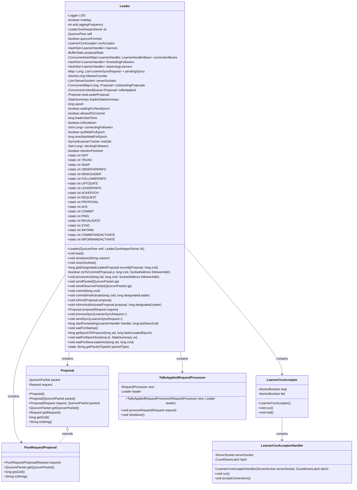
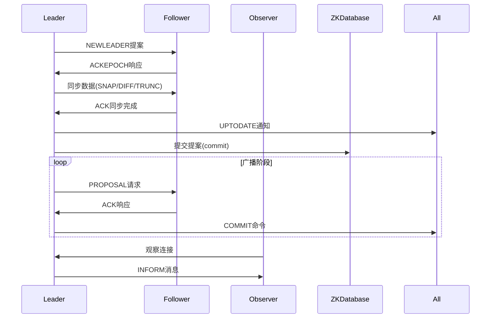

# 基础信息

|      |      |
|------|------|
| 名称 | Leader |
| 编码语言 | .java |
| 代码路径 | zookeeper/zookeeper-server/src/main/java/org/apache/zookeeper/server/quorum/Leader.java |
| 包名 | org.apache.zookeeper.server.quorum |
| 依赖项 | ['java.nio.charset.StandardCharsets.UTF_8', 'java.io.BufferedInputStream', 'java.io.ByteArrayInputStream', 'java.io.ByteArrayOutputStream', 'java.io.DataInputStream', 'java.io.DataOutputStream', 'java.io.IOException', 'java.net.InetSocketAddress', 'java.net.ServerSocket', 'java.net.Socket', 'java.net.SocketAddress', 'java.net.SocketException', 'java.nio.ByteBuffer', 'java.util.ArrayList', 'java.util.Collections', 'java.util.HashMap', 'java.util.HashSet', 'java.util.Iterator', 'java.util.LinkedList', 'java.util.List', 'java.util.Map', 'java.util.Objects', 'java.util.Optional', 'java.util.Set', 'java.util.concurrent.ConcurrentHashMap', 'java.util.concurrent.ConcurrentLinkedQueue', 'java.util.concurrent.ConcurrentMap', 'java.util.concurrent.CountDownLatch', 'java.util.concurrent.ExecutorService', 'java.util.concurrent.Executors', 'java.util.concurrent.TimeUnit', 'java.util.concurrent.atomic.AtomicBoolean', 'java.util.concurrent.atomic.AtomicLong', 'java.util.stream.Collectors', 'javax.security.sasl.SaslException', 'org.apache.zookeeper.KeeperException', 'org.apache.zookeeper.ZooDefs.OpCode', 'org.apache.zookeeper.common.Time', 'org.apache.zookeeper.jmx.MBeanRegistry', 'org.apache.zookeeper.server.ExitCode', 'org.apache.zookeeper.server.FinalRequestProcessor', 'org.apache.zookeeper.server.Request', 'org.apache.zookeeper.server.RequestProcessor', 'org.apache.zookeeper.server.ServerMetrics', 'org.apache.zookeeper.server.ZKDatabase', 'org.apache.zookeeper.server.ZooKeeperCriticalThread', 'org.apache.zookeeper.server.ZooTrace', 'org.apache.zookeeper.server.quorum.QuorumPeer.LearnerType', 'org.apache.zookeeper.server.quorum.auth.QuorumAuthServer', 'org.apache.zookeeper.server.quorum.flexible.QuorumVerifier', 'org.apache.zookeeper.server.util.ZxidUtils', 'org.apache.zookeeper.util.ServiceUtils', 'org.slf4j.Logger', 'org.slf4j.LoggerFactory'] |
| 概述说明 | Leader类实现ZooKeeper集群的领导者功能，负责处理提案提交、追随者同步、选举确认等核心逻辑。关键点包括：提案管理（Proposal类）、追随者状态跟踪（LearnerHandler）、TCP连接优化（nodelay配置）、ACK延迟日志记录、动态重配置支持、领导者选举超时控制。通过QuorumVerifier验证法定人数，使用LearnerCnxAcceptor线程处理追随者连接，确保数据一致性和集群可用性。 |

# 说明

Leader类继承自LearnerMaster，是ZooKeeper集群中的领导者实现，负责处理提案提交、追随者同步和集群状态维护。关键功能包括：1. 管理提案队列(outstandingProposals)和待提交队列(toBeApplied)；2. 通过LearnerHandler处理与追随者/观察者的网络通信；3. 使用QuorumVerifier验证法定人数；4. 支持动态重配置；5. 实现ZAB协议的领导者逻辑（NEWLEADER/PROPOSAL/COMMIT等消息类型）。核心机制包含：提案提交需获得多数派确认、等待epoch确认的同步控制、TCP_NODELAY优化网络传输，以及通过JMX暴露监控指标。系统通过心跳检测维持活性，并在失去法定人数时自动关闭服务。

# 类列表 Class Summary

| 名称   | 类型  | 说明 |
|-------|------|-------------|
| Leader | class | Leader类继承LearnerMaster，是ZooKeeper集群中的领导者实现。主要功能包括：处理提案、管理学习者连接、维护提案状态、处理ACK、提交提案等。关键点：使用QuorumPacket通信，维护提案队列，处理同步请求，支持动态重配置，管理学习者状态，提供JMX监控接口。 |

## 类 Leader

|      |      |
|------|------|
| 访问范围 | public |
| 类型 | class |
| 名称 | Leader |
| 说明 | Leader类继承LearnerMaster，是ZooKeeper集群中的领导者实现。主要功能包括：处理提案、管理学习者连接、维护提案状态、处理ACK、提交提案等。关键点：使用QuorumPacket通信，维护提案队列，处理同步请求，支持动态重配置，管理学习者状态，提供JMX监控接口。 |

### UML类图

这段代码是ZooKeeper中Leader类的实现，负责处理集群中的领导者逻辑。主要功能包括：提案处理（Proposal）、学习者连接管理（LearnerCnxAcceptor）、请求处理（ToBeAppliedRequestProcessor）等。Leader类通过维护多个集合（如learners、forwardingFollowers）来跟踪集群成员状态，并提供方法如commit()、propose()来协调集群操作。关键设计点包括：使用QuorumVerifier进行法定人数验证、通过LearnerHandler管理学习者连接、以及处理各种ZooKeeper协议包类型（如PROPOSAL、COMMIT等）。代码结构复杂，涉及多线程同步和网络通信，是ZooKeeper一致性协议的核心实现。

### 内部方法调用关系图

```mermaid
graph TD
    A["类Leader"]
    B["继承自: LearnerMaster"]
    C["内部类: Proposal"]
    D["内部类: PureRequestProposal"]
    E["内部类: LearnerCnxAcceptor"]
    F["内部类: ToBeAppliedRequestProcessor"]
    G["属性: LeaderZooKeeperServer zk"]
    H["属性: QuorumPeer self"]
    I["属性: BufferStats proposalStats"]
    J["核心方法: lead()"]
    K["核心方法: shutdown()"]
    L["核心方法: propose()"]
    M["核心方法: processAck()"]
    N["核心方法: tryToCommit()"]

    A --> B
    A --> C
    A --> D
    A --> E
    A --> F
    A --> G
    A --> H
    A --> I
    A --> J
    A --> K
    A --> L
    A --> M
    A --> N

    C --> P["属性: QuorumPacket packet"]
    C --> Q["属性: Request request"]
    C --> R["方法: getZxid()"]
    D --> S["重写方法: getQuorumPacket()"]
    E --> T["线程类: 处理学习者连接"]
    F --> U["处理器链: 管理待提交提案"]
    J --> V["流程: 选举→同步→广播"]
    K --> W["流程: 关闭所有学习者连接"]
    L --> X["流程: 创建并发送提案"]
    M --> Y["流程: 处理ACK并尝试提交"]
    N --> Z["流程: 检查法定人数并提交提案"]
```

该流程图展示了ZooKeeper Leader的核心架构和交互流程。Leader类继承自LearnerMaster，包含提案处理、网络通信、状态同步等核心功能。时序图描述了完整的Leader工作周期：从选举成功后的初始同步阶段，到正常运行时的提案广播流程，以及Observer的特殊处理逻辑。关键设计包括两阶段提交机制（PROPOSAL+COMMIT）、动态集群配置支持（通过Reconfig操作）、以及TCP_NODELAY等网络优化参数控制。所有操作都依赖法定人数验证，确保数据一致性。

### 字段列表 Field List

| 名称  | 类型  | 说明 |
|-------|-------|------|
| INFORM = 8 | int | 定义静态常量INFORM，值为8。 |
| leaderStateSummary | StateSummary | 州长概要信息 |
| leaderStartTime | long | 私有长整型变量leaderStartTime，用于记录开始时间。 |
| pendingSyncs = new HashMap<>() | Map<Long, List<LearnerSyncRequest>> | 私有哈希映射，键为长整型，值为学习者同步请求列表，用于存储待处理同步请求。 |
| lastProposed | long | 变量`lastProposed`为长整型。 |
| ACK = 3 | int | 定义静态常量ACK，值为3。 |
| forwardingFollowers = new HashSet<>() | HashSet<LearnerHandler> | 私有集合forwardingFollowers，存储LearnerHandler对象，使用HashSet实现。 |
| timeStartWaitForEpoch = -1 | long | 私有可变长整型变量timeStartWaitForEpoch，初始值为-1，用于记录等待纪元开始的时间戳。 |
| waitingForNewEpoch = true | boolean | 等待新周期中。 |
| COMMITANDACTIVATE = 9 | int | 定义静态常量COMMITANDACTIVATE，值为9。 |
| proposalStats | BufferStats | 私有不可变的提案统计缓冲区对象。 |
| voteSet | SyncedLearnerTracker | 私有可变同步学习跟踪器voteSet |
| PROPOSAL = 2 | int | 定义常量PROPOSAL，值为2，类型为int，访问权限为public static final。 |
| ackLoggingFrequency | int | 私有静态整型变量，用于记录日志频率。 |
| REQUEST = 1 | int | 定义静态常量REQUEST，值为1。 |
| toBeApplied = new ConcurrentLinkedQueue<>() | ConcurrentLinkedQueue<Proposal> | 私有并发队列，存储待处理的Proposal对象，线程安全。 |
| FOLLOWERINFO = 11 | int | 静态常量FOLLOWERINFO值为11，用于标识跟随者信息。 |
| connectionBeans = new ConcurrentHashMap<>() | ConcurrentHashMap<LearnerHandler, LearnerHandlerBean> | 私有并发哈希映射，存储LearnerHandler到LearnerHandlerBean的键值对，线程安全。 |
| cnxAcceptor = null | LearnerCnxAcceptor | 初始化volatile变量cnxAcceptor为null。 |
| SYNC = 7 | int | 定义静态常量SYNC，值为7。 |
| TRUNC = 14 | int | 定义静态常量TRUNC，值为14。 |
| isShutdown | boolean | 声明了一个布尔类型变量isShutdown，用于表示关闭状态。 |
| MAX_TIME_TO_WAIT_FOR_EPOCH = "zookeeper.leader.maxTimeToWaitForEpoch" | String | ZooKeeper配置参数，定义等待Leader选举完成的最长时间。 |
| NEWLEADER = 10 | int | 定义静态常量NEWLEADER，值为10。 |
| lastCommitted = -1 | long | 变量lastCommitted初始化为-1。 |
| INFORMANDACTIVATE = 19 | int | 静态常量INFORMANDACTIVATE值为19。 |
| REVALIDATE = 6 | int | 定义静态常量REVALIDATE，值为6。 |
| electionFinished = false | boolean | 保护布尔变量electionFinished初始值为false，表示选举未完成。 |
| ACKEPOCH = 18 | int | 静态常量ACKEPOCH，值为18。 |
| OBSERVERINFO = 16 | int | 定义静态常量OBSERVERINFO，值为16。 |
| self | QuorumPeer | QuorumPeer实例变量声明。 |
| followerCounter = new AtomicLong(-1) | AtomicLong | 声明一个原子长整型变量followerCounter，初始值为-1。 |
| PING = 5 | int | 定义静态常量PING，值为5。 |
| electingFollowers = new HashSet<>() | Set<Long> | 这是一个被保护的最终Set集合，用于存储选举中的跟随者ID，初始化为HashSet实现。 |
| serverSockets = new LinkedList<>() | List<ServerSocket> | 私有链表存储ServerSocket对象。 |
| allowedToCommit = true | boolean | 允许提交的布尔值为真。 |
| connectingFollowers = new HashSet<>() | Set<Long> | 这是一个受保护的最终Set集合，用于存储长整型连接中的关注者ID，初始化时创建为HashSet实例。 |
| outstandingProposals = new ConcurrentHashMap<>() | ConcurrentMap<Long, Proposal> | 定义线程安全的ConcurrentMap变量outstandingProposals，键为Long类型，值为Proposal对象。 |
| observingLearners = new HashSet<>() | HashSet<LearnerHandler> | 私有集合变量observingLearners，存储LearnerHandler对象，使用HashSet实现。 |
| zk | LeaderZooKeeperServer | final修饰的LeaderZooKeeperServer实例zk |
| maxTimeToWaitForEpoch | int | 私有静态整型变量，定义等待最大时间。 |
| LOG = LoggerFactory.getLogger(Leader.class) | Logger | 定义Leader类的私有静态日志常量LOG，使用LoggerFactory获取Logger实例。 |
| newLeaderProposal = new Proposal() | Proposal | 声明一个受保护的最终Proposal对象newLeaderProposal并实例化。 |
| quitWaitForEpoch = false | boolean | 私有易变布尔变量quitWaitForEpoch初始值为false。 |
| quorumFormed = false | boolean | 声明一个受保护的布尔变量quorumFormed，初始值为false。 |
| epoch = -1 | long | 初始化长整型变量epoch，默认值为-1。 |
| nodelay = System.getProperty("leader.nodelay", "true").equals("true") | boolean | 私有静态布尔变量nodelay，通过系统属性"leader.nodelay"设置，默认为true。 |
| LEADERINFO = 17 | int | 定义常量LEADERINFO，值为17，静态不可修改。 |
| ACK_LOGGING_FREQUENCY = "zookeeper.leader.ackLoggingFrequency" | String | 私有静态常量字符串ACK_LOGGING_FREQUENCY用于存储ZooKeeper领导者确认日志频率的配置键名。 |
| SNAP = 15 | int | 定义静态常量SNAP，值为15。 |
| COMMIT = 4 | int | 定义静态常量COMMIT，值为4。 |
| learners = new HashSet<>() | HashSet<LearnerHandler> | 私有集合变量learners，存储LearnerHandler对象，使用HashSet实现。 |
| UPTODATE = 12 | int | 静态常量UPTODATE值为12 |
| DIFF = 13 | int | 定义静态常量DIFF，值为13。 |

### 方法列表 Method List

| 名称  | 类型  | 说明 |
|-------|-------|------|
| waitForEpochAck | void | 方法等待追随者确认选举纪元。检查选举状态，若完成则返回。若追随者纪元更新则报错。满足法定人数时结束选举，否则等待超时或中断。同步块内操作确保线程安全。 |
| getDesignatedLeader | long | 
方法getDesignatedLeader确定新领导者：若自身在新配置中则保持；否则从确认重配置的候选者中，选择确认最多操作的节点作为最新且数据完整的领导者。 |
| revalidateSession | void | 该方法用于重新验证会话有效性，读取输入数据中的会话ID和超时时间，检查会话是否有效，若有效则设置会话所有者，最后将验证结果返回给请求方。 |
| tryToCommit | boolean | 该方法用于提交提案，确保按顺序提交并满足法定人数要求。检查前序提案是否存在，验证法定人数，处理重新配置或普通提案，更新状态并通知相关方。成功返回true，否则false。 |
| setLeadingVoteSet | void | 方法setLeadingVoteSet用于设置主导投票集合，参数为SyncedLearnerTracker类型的voteSet。 |
| lead | void | 该代码片段描述了ZooKeeper领导者选举后的处理流程，包括选举时间记录、状态设置、数据加载、新领导者提案、等待追随者确认、启动ZooKeeper服务器及维护领导者状态。关键点包括选举时间统计、状态同步、新领导者提案处理、追随者确认机制及领导者心跳维护。 |
| getQuorumVerifierBytes | byte[] | 重写getQuorumVerifierBytes方法，返回最新QuorumVerifier的UTF-8字节数组。 |
| quitLeading | void | 方法quitLeading同步通知连接中的跟随者退出领导状态，记录因投票者改变主意的日志和指标。 |
| getZKDatabase | ZKDatabase | 重写getZKDatabase方法，返回zk对象的ZKDatabase实例。 |
| getUptime | long | 获取系统运行时间的方法：若leaderStartTime大于0，返回当前时间与leaderStartTime的差值，否则返回0。 |
| getPeerInfo | String | 重写getPeerInfo方法，根据sid获取对应服务器信息，若不存在则返回空字符串。 |
| setMaxTimeToWaitForEpoch | void | 设置等待选举周期的最大时间，记录日志显示新值。 |
| processAck | void | 处理ACK请求的方法：检查提案状态，记录日志，验证ZXID有效性，更新提案ACK计数，尝试提交提案。若提案为配置变更，则检查后续提案是否可提交。 |
| recreateInetSocketAddr | InetSocketAddress | 方法recreateInetSocketAddr根据主机字符串和端口号创建并返回InetSocketAddress对象。 |
| shutdown | void | 方法shutdown执行系统关闭流程：记录日志，检查状态，停止连接接收器或关闭套接字，清空ZooKeeper服务器引用，关闭所有连接和LearnerHandler，标记为已关闭。 |
| isQuorumSynced | boolean | 检查当前节点及同步的跟随者是否达到法定人数。通过验证自身ID和已同步的跟随者ID是否满足投票成员要求，返回是否达成法定人数。 |
| processSync | void | 方法processSync处理同步请求：若无未决提案则直接发送同步，否则将请求加入待处理列表。 |
| propose | Proposal | 方法处理提案请求：检查限流和ZXID溢出，序列化数据后创建提案，同步更新仲裁验证器并记录日志，最后发送提案包。 |
| getEpoch | long | 获取最新提案的纪元时间戳。 |
| setAckLoggingFrequency | void | 设置确认日志频率的方法，参数为频率值。 |
| getAndDecrementFollowerCounter | long | 重写getAndDecrementFollowerCounter方法，调用AtomicLong的getAndDecrement实现线程安全的计数器递减并返回原值。 |
| getProposalStats | BufferStats | 获取提案统计数据的BufferStats方法，返回proposalStats对象。 |
| sendSync | void | 方法sendSync接收LearnerSyncRequest参数，创建QuorumPacket对象并设置类型为Leader.SYNC，将其加入请求的处理队列。 |
| getLastProposed | long | 同步方法返回最后提议值。 |
| getTickOfInitialAckDeadline | int | 方法getTickOfInitialAckDeadline返回初始确认期限的tick值，计算方式为当前tick值加上初始限制和同步限制之和。 |
| addLearnerHandler | void | Java方法：同步添加学习者处理器到列表。 |
| resetObserverConnectionStats | void | 同步遍历观察者列表并重置每个观察者的连接统计信息。 |
| getTickOfNextAckDeadline | int | 方法返回当前时间戳与同步限制之和，用于计算下次确认截止时间。 |
| submitLearnerRequest | void | Java方法重写，调用zk的submitLearnerRequest处理请求si。 |
| buildInformAndActivePacket | QuorumPacket | 构建包含指定领导者和提案数据的QuorumPacket，类型为INFORMANDACTIVATE，附带zxid标识。 |
| isParticipant | boolean | 检查sid是否为投票成员，通过验证器确认。 |
| addObserverLearnerHandler | void | 私有方法`addObserverLearnerHandler`将`LearnerHandler`对象`lh`添加到同步块保护的`observingLearners`集合中。 |
| removeLearnerHandler | void | 移除学习者处理程序：从转发跟随者、学习者和观察学习者列表中同步删除指定对等节点。 |
| sendPacket | void | 方法sendPacket同步遍历forwardingFollowers队列，向每个LearnerHandler发送QuorumPacket数据包。 |
| getLearners | List<LearnerHandler> | 获取学习者列表的线程安全方法，返回learners的拷贝。 |
| isRunning | boolean | 检查自身和zk是否都在运行。 |
| inform | void | 该方法用于通知观察者节点，创建包含提案信息的QuorumPacket并发送。参数为提案对象，操作类型为Leader.INFORM。 |
| sendObserverPacket | void | 方法`sendObserverPacket`向所有观察者学习者发送QuorumPacket数据包，通过遍历列表并调用`queuePacket`方法实现。 |
| getAckLoggingFrequency | int | 这是一个静态方法，返回整型变量ackLoggingFrequency的值。 |
| recreateSocketAddresses | MultipleAddresses | 该方法接收一个MultipleAddresses对象，提取其中所有地址的字符串和端口，生成新的InetSocketAddress集合，并返回新的MultipleAddresses对象。 |
| getEpochToPropose | long | 方法getEpochToPropose同步处理epoch提议，检查等待状态和参与者，验证法定人数后更新epoch或超时抛出异常。 |
| closeSockets | void | 同步方法关闭所有未关闭的ServerSocket，忽略关闭时的异常并记录警告。 |
| reportLookingSid | void | 方法reportLookingSid检查条件：若等待新周期未开始或超时则退出领导状态，否则忽略无效sid。 |
| getQuorumAuthServer | QuorumAuthServer | 重写方法返回QuorumAuthServer实例，若self为空则返回null。 |
| createServerSocket | Optional<ServerSocket> | 创建服务器套接字，支持端口统一和SSL仲裁。成功时返回绑定的套接字，失败返回空并记录错误。 |
| getNumPendingSyncs | int | 同步方法返回待处理同步任务数量。 |
| getQuorumVerifierVersion | long | 重写getQuorumVerifierVersion方法，返回当前节点的仲裁验证器版本号。 |
| touch | void | 这是一个Java方法重写，调用zk对象的touch方法，传入会话ID和超时参数。 |
| getObservingLearners | List<LearnerHandler> | 该方法返回观察者学习者的列表副本，使用同步块确保线程安全。 |
| addForwardingFollower | void | 方法`addForwardingFollower`将`LearnerHandler`加入`forwardingFollowers`列表，并同步更新仲裁验证器的Oracle需求状态。 |
| commit | void | Java方法commit同步更新lastCommitted为zxid，发送COMMIT类型QuorumPacket数据包，并增加COMMIT_COUNT指标计数。 |
| informAndActivate | void | 方法informAndActivate发送观察者数据包，包含提案的zxid、指定领导者和提案数据。 |
| isLearnerSynced | boolean | 检查指定peer是否在forwardingFollowers集合中，使用同步锁确保线程安全。 |
| startForwarding | long | 方法startForwarding处理LearnerHandler请求，检查并发送未处理的提案和提交消息，根据学习者类型添加处理程序，返回最新提案ID。 |
| commitAndActivate | void | 方法commitAndActivate提交并激活事务，同步更新lastCommitted为zxid，创建包含designatedLeader的字节数据，发送QuorumPacket类型为COMMITANDACTIVATE的包。 |
| getCurrentTick | int | 重写getCurrentTick方法，返回self.tick的当前值。 |
| getPacketType | String | 静态方法getPacketType根据输入packetType返回对应字符串，如DIFF、TRUNC等，未匹配则返回UNKNOWN。 |
| waitForNewLeaderAck | void | 方法等待新领导确认，检查法定人数是否形成，验证ZXID匹配，超时未确认则抛出异常。 |
| startZkServer | void | 私有同步方法startZkServer启动ZooKeeper服务，更新zxid，处理动态重配置（若启用），设置选举投票，并初始化数据库最后处理zxid。 |
| getNonVotingFollowers | List<LearnerHandler> | 获取非投票跟随者列表：遍历转发跟随者，筛选出未参与投票的成员并返回。 |
| getObservingLearnersInfo | Iterable<Map<String, Object>> | 该方法返回观察者学习者的信息集合，通过同步块确保线程安全，遍历observingLearners并收集每个学习者的处理信息。 |
| waitForStartup | void | 方法waitForStartup同步等待zk启动，未运行且线程未中断时循环等待20毫秒。 |
| getSidSetString | String | 将Long类型Set转为逗号分隔字符串，遍历元素逐个拼接，最后返回结果字符串。 |
| syncTimeout | int | Java方法重写，返回tickTime与syncLimit的乘积作为同步超时时间。 |
| getForwardingFollowers | List<LearnerHandler> | 获取转发关注者列表的同步方法，返回转发关注者的副本以确保线程安全。 |
| registerLearnerHandlerBean | void | 重写方法registerLearnerHandlerBean，创建LearnerHandlerBean实例并通过zk注册JMX，成功后将bean存入connectionBeans映射。 |
| unregisterLearnerHandlerBean | void | 移除学习者处理器Bean并注销其MBean注册。若存在则从连接Bean集合中删除并注销。 |

