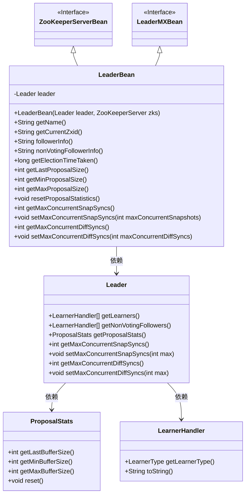

# 基础信息

|      |      |
|------|------|
| 名称 | LeaderBean |
| 编码语言 | .java |
| 代码路径 | zookeeper/zookeeper-server/src/main/java/org/apache/zookeeper/server/quorum/LeaderBean.java |
| 包名 | org.apache.zookeeper.server.quorum |
| 依赖项 | ['org.apache.zookeeper.server.ZooKeeperServer', 'org.apache.zookeeper.server.ZooKeeperServerBean', 'org.apache.zookeeper.server.quorum.QuorumPeer.LearnerType'] |
| 概述说明 | LeaderBean继承ZooKeeperServerBean，实现LeaderMXBean接口，封装Leader相关操作，包括获取选举耗时、提案大小统计、并发同步设置及处理跟随者信息等。 |

# 说明

LeaderBean类继承ZooKeeperServerBean并实现LeaderMXBean接口，用于管理ZooKeeper集群中的领导者节点信息。该类包含一个Leader对象实例，提供获取当前ZXID、选举耗时、提案统计信息（包括最近、最小和最大提案大小）的方法。支持重置提案统计信息。还提供获取和设置最大并发快照同步及差异同步数量的功能。此外，可获取参与投票和非投票跟随者的详细信息。

# 类列表 Class Summary

| 名称   | 类型  | 说明 |
|-------|------|-------------|
| LeaderBean | class | LeaderBean类继承ZooKeeperServerBean，实现LeaderMXBean接口，提供领导者节点信息管理功能，包括获取ZXID、选举耗时、提案统计及并发同步配置等。 |

## 类 LeaderBean

|      |      |
|------|------|
| 访问范围 | public |
| 类型 | class |
| 名称 | LeaderBean |
| 说明 | LeaderBean类继承ZooKeeperServerBean，实现LeaderMXBean接口，提供领导者节点信息管理功能，包括获取ZXID、选举耗时、提案统计及并发同步配置等。 |

### UML类图

这段代码展示了一个ZooKeeper集群中Leader节点的管理Bean实现。LeaderBean类同时继承了ZooKeeperServerBean接口和LeaderMXBean接口，提供了对Leader节点各种运行时信息的访问和控制功能，包括选举耗时统计、提案大小统计、并发同步控制等。该类通过组合方式持有一个Leader实例，并委托其完成大部分核心操作，同时与ProposalStats和LearnerHandler等辅助类协作完成特定功能。

### 内部方法调用关系图

```mermaid
graph TD
    A["类LeaderBean"]
    B["继承: ZooKeeperServerBean"]
    C["实现: LeaderMXBean"]
    D["属性: Leader leader"]
    E["构造方法: LeaderBean(Leader, ZooKeeperServer)"]
    F["方法: String getName()"]
    G["方法: String getCurrentZxid()"]
    H["方法: String followerInfo()"]
    I["重写方法: String nonVotingFollowerInfo()"]
    J["重写方法: long getElectionTimeTaken()"]
    K["重写方法: int getLastProposalSize()"]
    L["重写方法: int getMinProposalSize()"]
    M["重写方法: int getMaxProposalSize()"]
    N["重写方法: void resetProposalStatistics()"]
    O["重写方法: int getMaxConcurrentSnapSyncs()"]
    P["重写方法: void setMaxConcurrentSnapSyncs(int)"]
    Q["重写方法: int getMaxConcurrentDiffSyncs()"]
    R["重写方法: void setMaxConcurrentDiffSyncs(int)"]

    A -->|extends| B
    A -->|implements| C
    A --> D
    A --> E
    A --> F
    A --> G
    A --> H
    A --> I
    A --> J
    A --> K
    A --> L
    A --> M
    A --> N
    A --> O
    A --> P
    A --> Q
    A --> R
```

这段代码定义了一个LeaderBean类，继承自ZooKeeperServerBean并实现LeaderMXBean接口。主要功能包括管理Leader节点的各种属性和操作，如获取选举时间、提案大小统计、并发同步控制等。通过流程图可以清晰看到类继承关系、属性定义和14个主要方法（包含构造方法）的层级结构，其中9个是重写接口方法。

### 字段列表 Field List

| 名称  | 类型  | 说明 |
|-------|-------|------|
| leader | Leader | 私有不可变的Leader对象。 |

### 方法列表 Method List

| 名称  | 类型  | 说明 |
|-------|-------|------|
| followerInfo | String | 该方法遍历领导者的学习者列表，筛选出参与者类型的学习者，将其信息拼接成字符串返回。 |
| getName | String | 方法返回字符串"Leader"。 |
| getCurrentZxid | String | 获取当前Zxid的16进制字符串表示，格式为"0x"加长整型Zxid的16进制值。 |
| getMaxProposalSize | int | Java方法重写，返回leader提案状态的最大缓冲区大小。 |
| nonVotingFollowerInfo | String | 重写Java方法，遍历非投票跟随者列表并拼接字符串返回。 |
| setMaxConcurrentDiffSyncs | void | 重写setMaxConcurrentDiffSyncs方法，调用leader对象的同名方法设置最大并发差异同步数。 |
| getMaxConcurrentDiffSyncs | int | 重写getMaxConcurrentDiffSyncs方法，返回leader对象的maxConcurrentDiffSyncs值。 |
| setMaxConcurrentSnapSyncs | void | 重写setMaxConcurrentSnapSyncs方法，调用leader的同名方法设置最大并发快照同步数。 |
| getLastProposalSize | int | 重写getLastProposalSize方法，返回leader提案统计的最后缓冲区大小。 |
| getMaxConcurrentSnapSyncs | int | 重写方法getMaxConcurrentSnapSyncs，返回leader的maxConcurrentSnapSyncs值。 |
| getElectionTimeTaken | long | 重写getElectionTimeTaken方法，返回leader.self的选举耗时。 |
| getMinProposalSize | int | Java方法重写，返回领导者提案的最小缓冲区大小。 |
| resetProposalStatistics | void | 重置提案统计信息，调用leader的reset方法。 |

