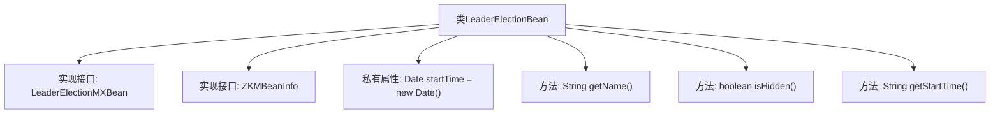

# 基础信息

|      |      |
|------|------|
| 名称 | LeaderElectionBean |
| 编码语言 | .java |
| 代码路径 | zookeeper/zookeeper-server/src/main/java/org/apache/zookeeper/server/quorum/LeaderElectionBean.java |
| 包名 | org.apache.zookeeper.server.quorum |
| 依赖项 | ['java.util.Date', 'org.apache.zookeeper.jmx.ZKMBeanInfo'] |
| 概述说明 | LeaderElectionBean类实现LeaderElectionMXBean和ZKMBeanInfo接口，记录启动时间并提供名称、隐藏状态和启动时间查询功能。 |

# 说明

LeaderElectionBean类实现了LeaderElectionMXBean和ZKMBeanInfo接口，用于领导者选举管理。该类包含一个不可变的startTime日期字段，记录实例创建时间。提供了三个方法：getName返回固定字符串"LeaderElection"作为名称；isHidden返回false表示该Bean不隐藏；getStartTime返回startTime的字符串表示形式。该类主要用于暴露领导者选举相关的管理信息。

# 类列表 Class Summary

| 名称   | 类型  | 说明 |
|-------|------|-------------|
| LeaderElectionBean | class | LeaderElectionBean类实现LeaderElectionMXBean和ZKMBeanInfo接口，记录启动时间并提供名称、可见性和启动时间查询功能。 |


## 类 LeaderElectionBean

|      |      |
|------|------|
| 访问范围 | public |
| 类型 | class |
| 名称 | LeaderElectionBean |
| 说明 | LeaderElectionBean类实现LeaderElectionMXBean和ZKMBeanInfo接口，记录启动时间并提供名称、可见性和启动时间查询功能。 |


### UML类图

```mermaid
classDiagram
    class LeaderElectionBean {
        -Date startTime
        +String getName()
        +boolean isHidden()
        +String getStartTime()
    }

    <<Interface>> LeaderElectionMXBean
    <<Interface>> ZKMBeanInfo

    LeaderElectionBean ..|> LeaderElectionMXBean : 实现
    LeaderElectionBean ..|> ZKMBeanInfo : 实现
```

这段类图展示了LeaderElectionBean类及其实现的接口关系。LeaderElectionBean是一个管理类，包含启动时间记录(startTime)和三个公共方法：获取名称(getName)、检查是否隐藏(isHidden)和获取启动时间(getStartTime)。该类实现了LeaderElectionMXBean和ZKMBeanInfo两个接口，表明它需要提供这两个接口定义的所有方法实现。类图中清晰地显示了类与接口之间的实现关系，以及类的成员变量和方法可见性。


### 内部方法调用关系图



该流程图展示了LeaderElectionBean类的结构，该类实现了LeaderElectionMXBean和ZKMBeanInfo两个接口。类中包含一个私有属性startTime记录创建时间，以及三个公共方法：getName()返回固定名称"LeaderElection"，isHidden()返回false表示不隐藏，getStartTime()返回格式化后的启动时间。所有方法都直接关联到主类，没有复杂的调用层级关系。

### 字段列表 Field List

| 名称  | 类型  | 说明 |
|-------|-------|------|
| startTime = new Date() | Date | 声明一个私有不可变的Date类型变量startTime，初始化为当前时间。 |

### 方法列表 Method List

| 名称  | 类型  | 说明 |
|-------|-------|------|
| getName | String | 方法返回字符串"LeaderElection"。 |
| isHidden | boolean | 方法isHidden返回false，表示对象未被隐藏。 |
| getStartTime | String | 获取开始时间的字符串表示方法。 |


