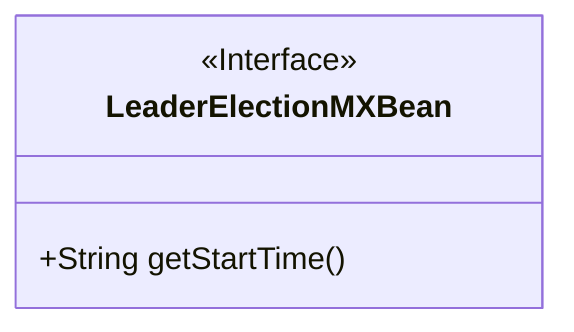
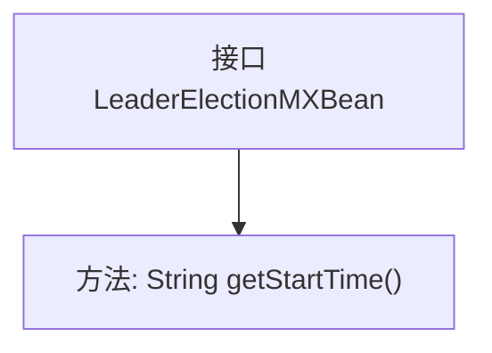

# 基础信息

|      |      |
|------|------|
| 名称 | LeaderElectionMXBean |
| 编码语言 | .java |
| 代码路径 | zookeeper/zookeeper-server/src/main/java/org/apache/zookeeper/server/quorum/LeaderElectionMXBean.java |
| 包名 | org.apache.zookeeper.server.quorum |
| 依赖项 | [] |
| 概述说明 | 公开接口LeaderElectionMXBean定义了获取选举开始时间的方法getStartTime()。 |

# 说明

这是一个名为LeaderElectionMXBean的公共接口，属于JMX管理Bean类型。该接口定义了一个方法getStartTime，用于获取领导者选举开始的时间。方法返回值为字符串类型，表示选举启动的具体时间点。注释说明该方法的功能是返回选举开始时间。该MXBean接口主要用于监控和管理领导者选举过程的相关信息。

# 类列表 Class Summary

| 名称   | 类型  | 说明 |
|-------|------|-------------|
| LeaderElectionMXBean | interface | LeaderElectionMXBean接口提供获取选举开始时间的方法getStartTime。 |

## 类 LeaderElectionMXBean

|      |      |
|------|------|
| 访问范围 | public |
| 类型 | interface |
| 名称 | LeaderElectionMXBean |
| 说明 | LeaderElectionMXBean接口提供获取选举开始时间的方法getStartTime。 |

### UML类图

这段类图描述了一个名为LeaderElectionMXBean的接口，该接口用于领导者选举机制的监控管理功能。接口中定义了一个公有方法getStartTime()，该方法返回字符串类型的选举开始时间戳。作为MXBean接口，它遵循Java管理扩展规范，主要用于暴露选举过程的关键监控指标。图中使用<<Interface>>标记明确表示了这是一个接口类型，符合JMX标准的管理接口设计模式。

### 内部方法调用关系图

这段流程图展示了LeaderElectionMXBean接口的结构，该接口定义了一个名为getStartTime的方法，用于获取领导者选举开始的时间。接口作为抽象类型，通过单一方法提供了获取时间信息的契约，实现该接口的类必须提供该方法的具体实现。流程图清晰地反映了接口与方法之间的从属关系，符合JMX管理Bean的设计模式。

### 字段列表 Field List

| 名称  | 类型  | 说明 |
|-------|-------|------|

### 方法列表 Method List

| 名称  | 类型  | 说明 |
|-------|-------|------|
| getStartTime | String | 获取开始时间的方法。 |

