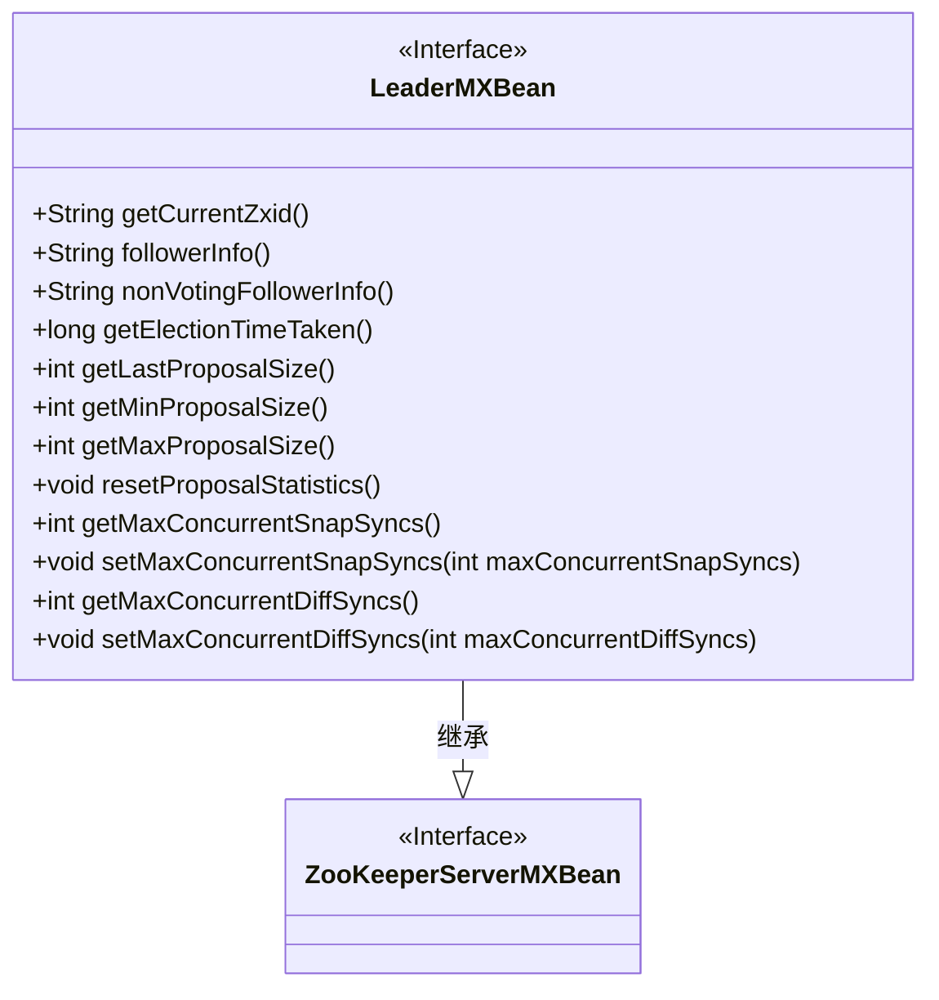

# 基础信息

|      |      |
|------|------|
| 名称 | LeaderMXBean |
| 编码语言 | .java |
| 代码路径 | zookeeper/zookeeper-server/src/main/java/org/apache/zookeeper/server/quorum/LeaderMXBean.java |
| 包名 | org.apache.zookeeper.server.quorum |
| 依赖项 | ['org.apache.zookeeper.server.ZooKeeperServerMXBean'] |
| 概述说明 | LeaderMXBean接口扩展ZooKeeperServerMXBean，提供集群当前zxid、跟随者信息、选举耗时、提案大小统计及并发同步配置等功能。 |

# 说明

LeaderMXBean接口扩展了ZooKeeperServerMXBean，提供了集群领导节点的监控和管理功能。主要方法包括获取当前集群ZXID、查询跟随者和非投票跟随者信息、获取选举耗时、获取提案大小统计（最新/最小/最大）、重置提案统计、以及设置/获取并发快照同步和差异同步的最大数量。该接口用于监控集群状态和性能指标。

# 类列表 Class Summary

| 名称   | 类型  | 说明 |
|-------|------|-------------|
| LeaderMXBean | interface | LeaderMXBean接口扩展ZooKeeperServerMXBean，提供集群当前zxid、选举耗时、提案大小统计、并发同步限制等功能，支持重置统计和设置同步参数。 |

## 类 LeaderMXBean

|      |      |
|------|------|
| 访问范围 | public |
| 类型 | interface |
| 名称 | LeaderMXBean |
| 说明 | LeaderMXBean接口扩展ZooKeeperServerMXBean，提供集群当前zxid、选举耗时、提案大小统计、并发同步限制等功能，支持重置统计和设置同步参数。 |

### UML类图

这段类图展示了LeaderMXBean接口继承自ZooKeeperServerMXBean接口的结构。LeaderMXBean定义了12个方法，主要用于获取ZooKeeper集群领导节点的状态信息，包括当前ZXID、跟随者信息、选举耗时、提案大小统计等，以及设置并发同步数量的方法。该接口扩展了基础监控功能，为ZooKeeper集群领导节点提供了详细的管理和监控能力。

### 内部方法调用关系图

```mermaid
graph TD
    A["接口LeaderMXBean"]
    B["继承关系: extends ZooKeeperServerMXBean"]
    C["方法: String getCurrentZxid()"]
    D["方法: String followerInfo()"]
    E["方法: String nonVotingFollowerInfo()"]
    F["方法: long getElectionTimeTaken()"]
    G["方法: int getLastProposalSize()"]
    H["方法: int getMinProposalSize()"]
    I["方法: int getMaxProposalSize()"]
    J["方法: void resetProposalStatistics()"]
    K["方法: int getMaxConcurrentSnapSyncs()"]
    L["方法: void setMaxConcurrentSnapSyncs(int)"]
    M["方法: int getMaxConcurrentDiffSyncs()"]
    N["方法: void setMaxConcurrentDiffSyncs(int)"]

    A --> B
    A --> C
    A --> D
    A --> E
    A --> F
    A --> G
    A --> H
    A --> I
    A --> J
    A --> K
    A --> L
    A --> M
    A --> N
```

这段代码定义了一个名为LeaderMXBean的Java接口，该接口扩展了ZooKeeperServerMXBean接口。该接口主要用于监控和管理ZooKeeper集群中的领导者节点，提供了获取当前ZXID、跟随者信息、选举耗时、提案大小统计以及并发同步控制等方法。通过这些方法可以监控集群状态、调整同步参数，并重置统计信息，是ZooKeeper服务器管理的重要扩展接口。

### 字段列表 Field List

| 名称  | 类型  | 说明 |
|-------|-------|------|

### 方法列表 Method List

| 名称  | 类型  | 说明 |
|-------|-------|------|
| getMaxProposalSize | int | 获取最大提案大小的整数值。 |
| followerInfo | String | 当前用户关注者数量为{{followerInfo}}，数据实时更新。 |
| getMaxConcurrentSnapSyncs | int | 获取最大并发快照同步数的方法。 |
| resetProposalStatistics | void | 重置提案统计数据。 |
| getMinProposalSize | int | 获取最小提案大小的方法。 |
| nonVotingFollowerInfo | String | 该用户关注了你但未参与投票，可能是静默支持或尚未找到合适内容互动。保持优质输出可促其参与。 |
| getElectionTimeTaken | long | 获取选举耗时的方法。 |
| getCurrentZxid | String | 获取当前ZXID（ZooKeeper事务ID）。 |
| getLastProposalSize | int | 获取最新提案的大小。 |
| setMaxConcurrentSnapSyncs | void | 设置最大并发快照同步数。 |
| getMaxConcurrentDiffSyncs | int | 获取最大并发差异同步数的方法。 |
| setMaxConcurrentDiffSyncs | void | 设置最大并发差异同步数的方法，参数为maxConcurrentDiffSyncs。 |

