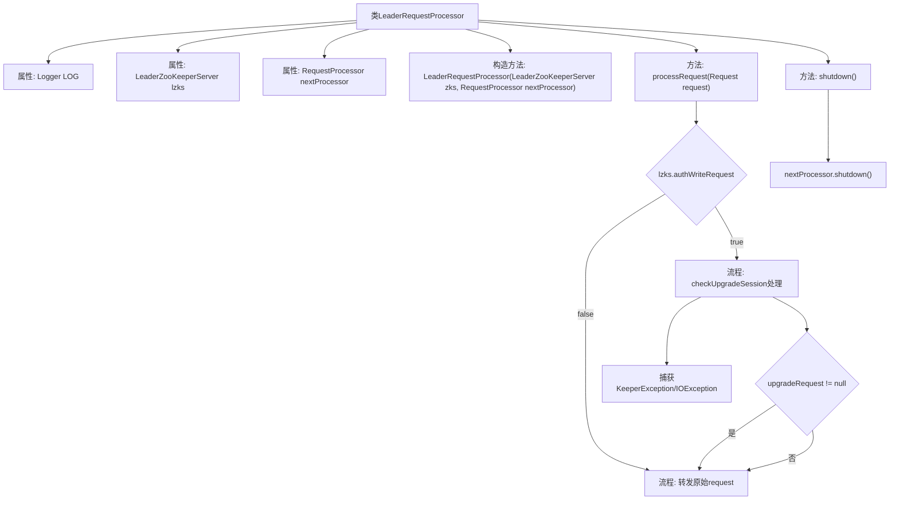

# 基础信息

|      |      |
|------|------|
| 名称 | LeaderRequestProcessor |
| 编码语言 | .java |
| 代码路径 | zookeeper/zookeeper-server/src/main/java/org/apache/zookeeper/server/quorum/LeaderRequestProcessor.java |
| 包名 | org.apache.zookeeper.server.quorum |
| 依赖项 | ['java.io.IOException', 'org.apache.zookeeper.KeeperException', 'org.apache.zookeeper.ZooDefs.OpCode', 'org.apache.zookeeper.server.Request', 'org.apache.zookeeper.server.RequestProcessor', 'org.apache.zookeeper.txn.ErrorTxn', 'org.slf4j.Logger', 'org.slf4j.LoggerFactory'] |
| 概述说明 | LeaderRequestProcessor处理ZooKeeper请求，先检查ACL权限，处理会话升级，再转发请求至下一处理器。 |

# 说明

LeaderRequestProcessor是ZooKeeper服务器中处理请求的组件，实现了RequestProcessor接口。它包含一个LeaderZooKeeperServer实例和下一个请求处理器。主要功能包括：处理请求时先通过ACL权限检查，拒绝未授权的写请求；检查会话是否需要升级（如本地会话创建临时节点时），若升级失败则记录错误并设置异常；最后将请求传递给下一个处理器。关闭时也会通知下一个处理器执行关闭操作。整个过程包含详细的日志记录和错误处理机制。

# 类列表 Class Summary

| 名称   | 类型  | 说明 |
|-------|------|-------------|
| LeaderRequestProcessor | class | LeaderRequestProcessor是ZooKeeper的请求处理器，负责处理领导者服务器的请求。它首先检查ACL权限，处理会话升级请求，然后将请求传递给下一个处理器。若出现错误，会记录日志并设置错误响应。关闭时通知下一处理器。 |


## 类 LeaderRequestProcessor

|      |      |
|------|------|
| 访问范围 | public |
| 类型 | class |
| 名称 | LeaderRequestProcessor |
| 说明 | LeaderRequestProcessor是ZooKeeper的请求处理器，负责处理领导者服务器的请求。它首先检查ACL权限，处理会话升级请求，然后将请求传递给下一个处理器。若出现错误，会记录日志并设置错误响应。关闭时通知下一处理器。 |


### UML类图

```mermaid
classDiagram
    class LeaderRequestProcessor {
        -LeaderZooKeeperServer lzks
        -RequestProcessor nextProcessor
        +LeaderRequestProcessor(LeaderZooKeeperServer zks, RequestProcessor nextProcessor)
        +processRequest(Request request) void
        +shutdown() void
    }

    class LeaderZooKeeperServer {
        <<Details omitted>>
    }

    <<Interface>> RequestProcessor {
        <<interface>>
        +processRequest(Request request) void
        +shutdown() void
    }

    LeaderRequestProcessor --> LeaderZooKeeperServer : 使用
    LeaderRequestProcessor --> RequestProcessor : 依赖
    LeaderRequestProcessor ..|> RequestProcessor : 实现
```

这段代码展示了一个ZooKeeper的Leader请求处理器实现，主要处理客户端请求的ACL验证、会话升级和请求转发。类图清晰地呈现了LeaderRequestProcessor与LeaderZooKeeperServer的关联关系，以及它作为RequestProcessor接口实现者的角色。处理器通过nextProcessor链式调用实现责任链模式，核心逻辑包含请求鉴权、会话升级异常处理和请求转发，体现了分布式系统中请求处理的典型分层架构。


### 内部方法调用关系图



这段代码是ZooKeeper中领导者请求处理器的实现，主要处理ACL权限验证、会话升级和请求转发。流程图展示了从请求处理到关闭的完整流程，包括权限检查、会话升级尝试、异常处理以及最终将请求转发给下一个处理器。特别注意对KeeperException和IOException的捕获处理，以及无论是否升级都会转发请求的设计逻辑。

### 字段列表 Field List

| 名称  | 类型  | 说明 |
|-------|-------|------|
| LOG = LoggerFactory.getLogger(LeaderRequestProcessor.class) | Logger | 定义LeaderRequestProcessor类的私有静态日志常量LOG。 |
| nextProcessor | RequestProcessor | 私有成员变量nextProcessor，类型为RequestProcessor，不可修改。 |
| lzks | LeaderZooKeeperServer | 私有不可变的LeaderZooKeeperServer实例变量lzks。 |

### 方法列表 Method List

| 名称  | 类型  | 说明 |
|-------|-------|------|
| shutdown | void | 方法重写，调用日志记录并关闭下一处理器。 |
| processRequest | void | 处理请求时先检查ACL权限，无权限则返回。检查是否为本地会话创建临时节点，是则升级会话。升级失败记录错误并设置异常。最后交由下一处理器处理请求或升级后的请求。 |


