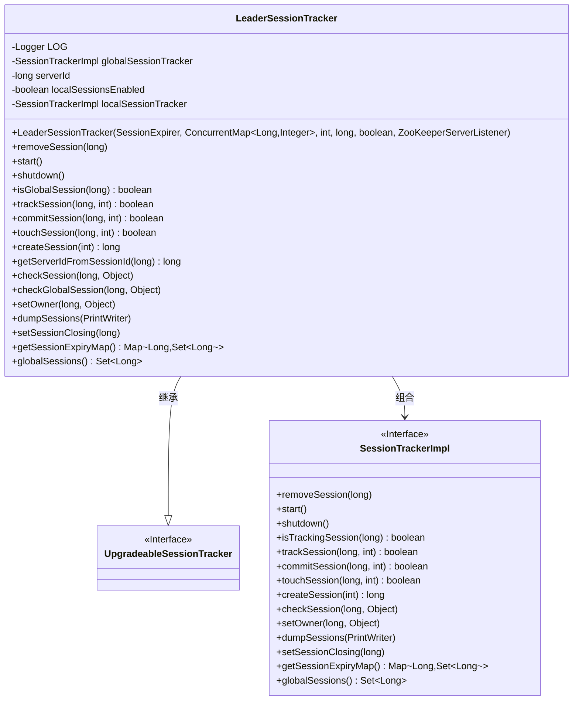

# 基础信息

|      |      |
|------|------|
| 名称 | LeaderSessionTracker |
| 编码语言 | .java |
| 代码路径 | zookeeper/zookeeper-server/src/main/java/org/apache/zookeeper/server/quorum/LeaderSessionTracker.java |
| 包名 | org.apache.zookeeper.server.quorum |
| 依赖项 | ['java.io.PrintWriter', 'java.util.Map', 'java.util.Set', 'java.util.TreeMap', 'java.util.concurrent.ConcurrentMap', 'org.apache.zookeeper.KeeperException.SessionExpiredException', 'org.apache.zookeeper.KeeperException.SessionMovedException', 'org.apache.zookeeper.KeeperException.UnknownSessionException', 'org.apache.zookeeper.server.SessionTrackerImpl', 'org.apache.zookeeper.server.ZooKeeperServerListener', 'org.slf4j.Logger', 'org.slf4j.LoggerFactory'] |
| 概述说明 | LeaderSessionTracker类继承UpgradeableSessionTracker，管理本地和全局会话，提供会话创建、移除、检查等功能，支持会话超时和所有权设置，确保会话一致性。 |

# 说明

LeaderSessionTracker是扩展自UpgradeableSessionTracker的类，用于管理本地和全局会话。它包含全局会话跟踪器globalSessionTracker，支持本地会话开关localSessionsEnabled，并通过serverId标识领导者服务器。主要功能包括：会话的创建、移除、提交、检查、设置所有者、关闭会话等操作，同时处理本地与全局会话的并发控制和竞态条件。提供会话过期检查、会话转储及会话到期映射获取等功能，确保会话在分布式环境中的一致性。

# 类列表 Class Summary

| 名称   | 类型  | 说明 |
|-------|------|-------------|
| LeaderSessionTracker | class | LeaderSessionTracker类用于管理ZooKeeper会话，支持全局和本地会话跟踪，提供会话创建、移除、检查及状态管理功能。 |

## 类 LeaderSessionTracker

|      |      |
|------|------|
| 访问范围 | public |
| 类型 | class |
| 名称 | LeaderSessionTracker |
| 说明 | LeaderSessionTracker类用于管理ZooKeeper会话，支持全局和本地会话跟踪，提供会话创建、移除、检查及状态管理功能。 |

### UML类图

类图描述：LeaderSessionTracker继承自UpgradeableSessionTracker接口，并组合了SessionTrackerImpl接口实现类。作为ZooKeeper领导者会话跟踪器，它通过双重会话管理机制（全局/本地）实现高可用性，提供会话创建、移除、超时检测等功能，并处理会话升级过程中的竞态条件，确保分布式环境下会话状态的一致性。

### 内部方法调用关系图

```mermaid
graph TD
    A["类LeaderSessionTracker"]
    B["属性: Logger LOG"]
    C["属性: SessionTrackerImpl globalSessionTracker"]
    D["属性: long serverId"]
    E["构造方法: LeaderSessionTracker(SessionExpirer, ConcurrentMap<Long, Integer>, int, long, boolean, ZooKeeperServerListener)"]
    F["方法: removeSession(long)"]
    G["方法: start()"]
    H["方法: shutdown()"]
    I["方法: isGlobalSession(long)"]
    J["方法: trackSession(long, int)"]
    K["方法: commitSession(long, int)"]
    L["方法: touchSession(long, int)"]
    M["方法: createSession(int)"]
    N["静态方法: getServerIdFromSessionId(long)"]
    O["方法: checkSession(long, Object)"]
    P["方法: checkGlobalSession(long, Object)"]
    Q["方法: setOwner(long, Object)"]
    R["方法: dumpSessions(PrintWriter)"]
    S["方法: setSessionClosing(long)"]
    T["方法: getSessionExpiryMap()"]
    U["方法: globalSessions()"]

    A --> B
    A --> C
    A --> D
    A --> E
    A --> F
    A --> G
    A --> H
    A --> I
    A --> J
    A --> K
    A --> L
    A --> M
    A -.-> N
    A --> O
    A --> P
    A --> Q
    A --> R
    A --> S
    A --> T
    A --> U
```

这段代码定义了一个`LeaderSessionTracker`类，用于管理ZooKeeper中的会话跟踪。该类继承自`UpgradeableSessionTracker`，包含全局和本地会话跟踪功能，提供会话创建、移除、检查、提交等操作。构造方法初始化会话跟踪器，根据配置决定是否启用本地会话。关键方法包括会话生命周期管理（start/shutdown）、会话状态检查（isGlobalSession/checkSession）以及会话数据处理（dumpSessions/getSessionExpiryMap）。代码通过双重检查机制处理会话升级过程中的竞争条件，并提供了详细的日志记录功能。

### 字段列表 Field List

| 名称  | 类型  | 说明 |
|-------|-------|------|
| LOG = LoggerFactory.getLogger(LeaderSessionTracker.class) | Logger | 定义LeaderSessionTracker类的私有静态日志常量LOG，使用LoggerFactory创建。 |
| globalSessionTracker | SessionTrackerImpl | 私有全局会话跟踪器实例。 |
| serverId | long | 私有长整型变量serverId，用于存储服务器ID。 |

### 方法列表 Method List

| 名称  | 类型  | 说明 |
|-------|-------|------|
| globalSessions | Set<Long> | 该方法返回全局会话的集合，调用globalSessionTracker的globalSessions方法获取结果。 |
| setSessionClosing | void | 方法`setSessionClosing`用于设置会话关闭状态。先检查本地会话跟踪器是否存在，存在则调用其关闭方法。无论是否存在，都会调用全局会话跟踪器的关闭方法。方法安全，无跟踪会话时无操作。 |
| getSessionExpiryMap | Map<Long, Set<Long>> | 获取会话过期时间映射表，优先合并本地会话，再添加全局会话，返回合并结果。 |
| removeSession | void | 移除指定会话ID的本地和全局会话跟踪记录。先检查本地跟踪器非空后移除，再移除全局跟踪。 |
| isGlobalSession | boolean | 检查sessionId是否在全局会话跟踪器中，返回布尔值。 |
| touchSession | boolean | 检查本地会话跟踪器是否存在且能更新会话，否则使用全局会话跟踪器更新。 |
| commitSession | boolean | 同步方法commitSession提交全局会话，若成功则记录日志。启用本地会话时需移除并标记完成升级，避免重复跟踪。返回提交结果。 |
| checkGlobalSession | void | 检查全局会话状态，若会话不存在则抛出过期异常，否则验证会话所有权。 |
| shutdown | void | 该方法用于关闭会话跟踪器，先检查并关闭本地会话跟踪器（若存在），然后关闭全局会话跟踪器。 |
| checkSession | void | 检查会话有效性，先尝试本地会话跟踪器，失败后检查全局跟踪器。若均无效且本地会话未启用或会话属于当前服务器，则抛出会话过期异常。 |
| getServerIdFromSessionId | long | 从会话ID中提取服务器ID，通过右移56位实现。 |
| createSession | long | 方法根据localSessionsEnabled决定使用本地或全局会话跟踪器创建会话，参数为超时时间，返回会话ID。 |
| start | void | 启动全局和本地会话跟踪器。 |
| trackSession | boolean | 方法跟踪会话，调用全局会话跟踪器记录会话ID和超时时间。若本地会话启用且跟踪成功，记录日志信息。返回跟踪结果。 |
| setOwner | void | 方法setOwner设置会话所有者，先尝试本地会话跟踪器，失败后改用全局会话跟踪器。忽略本地会话过期异常。 |
| dumpSessions | void | 该方法dumpSessions输出本地和全局会话信息到PrintWriter。先检查并打印本地会话，再打印全局会话。 |

