# 基础信息

|      |      |
|------|------|
| 名称 | LeaderZooKeeperServer |
| 编码语言 | .java |
| 代码路径 | zookeeper/zookeeper-server/src/main/java/org/apache/zookeeper/server/quorum/LeaderZooKeeperServer.java |
| 包名 | org.apache.zookeeper.server.quorum |
| 依赖项 | ['java.io.IOException', 'java.util.concurrent.TimeUnit', 'java.util.function.Function', 'javax.management.JMException', 'org.apache.zookeeper.KeeperException.SessionExpiredException', 'org.apache.zookeeper.jmx.MBeanRegistry', 'org.apache.zookeeper.metrics.MetricsContext', 'org.apache.zookeeper.server.ContainerManager', 'org.apache.zookeeper.server.DataTreeBean', 'org.apache.zookeeper.server.FinalRequestProcessor', 'org.apache.zookeeper.server.PrepRequestProcessor', 'org.apache.zookeeper.server.Request', 'org.apache.zookeeper.server.RequestProcessor', 'org.apache.zookeeper.server.ServerCnxn', 'org.apache.zookeeper.server.ServerMetrics', 'org.apache.zookeeper.server.ZKDatabase', 'org.apache.zookeeper.server.persistence.FileTxnSnapLog'] |
| 概述说明 | LeaderZooKeeperServer是ZooKeeper的领导者服务器实现，负责处理请求链、容器管理、会话跟踪和JMX注册。包含请求处理器初始化、指标监控、启动关闭逻辑及会话验证功能。 |

# 说明

LeaderZooKeeperServer是ZooKeeper中负责领导者节点功能的类，继承自QuorumZooKeeperServer。它管理多个请求处理器（如PrepRequestProcessor、ProposalRequestProcessor、CommitProcessor等）来处理客户端请求，并通过ContainerManager管理容器节点。该类提供了启动和关闭组件的逻辑，包括注册和注销JMX监控指标。它还实现了会话跟踪、全局请求限制计算、学习者请求处理等功能。通过MetricsContext注册了多个与领导者状态相关的指标（如学习者数量、同步跟随者数量、提案大小等）。此外，该类支持JMX注册与注销，并提供了获取服务器状态和ID的方法。

# 类列表 Class Summary

| 名称   | 类型  | 说明 |
|-------|------|-------------|
| LeaderZooKeeperServer | class | LeaderZooKeeperServer是ZooKeeper集群中的领导者服务器实现，继承自QuorumZooKeeperServer。主要功能包括初始化请求处理器链、管理容器、注册/注销JMX监控指标、处理会话跟踪及学习者请求。通过同步机制确保线程安全，并支持动态调整全局请求限制。 |

## 类 LeaderZooKeeperServer

|      |      |
|------|------|
| 访问范围 | public |
| 类型 | class |
| 名称 | LeaderZooKeeperServer |
| 说明 | LeaderZooKeeperServer是ZooKeeper集群中的领导者服务器实现，继承自QuorumZooKeeperServer。主要功能包括初始化请求处理器链、管理容器、注册/注销JMX监控指标、处理会话跟踪及学习者请求。通过同步机制确保线程安全，并支持动态调整全局请求限制。 |

### UML类图

```mermaid
classDiagram
    class LeaderZooKeeperServer {
        -ContainerManager containerManager
        -CommitProcessor commitProcessor
        -PrepRequestProcessor prepRequestProcessor
        +LeaderZooKeeperServer(FileTxnSnapLog logFactory, QuorumPeer self, ZKDatabase zkDb) void
        +Leader getLeader()
        +void setupRequestProcessors()
        -synchronized void setupContainerManager()
        +synchronized void startup()
        +void registerMetrics()
        -Gauge gaugeWithLeader(Function~Leader, Number~ supplier)
        +void unregisterMetrics()
        +synchronized void shutdownComponents()
        +int getGlobalOutstandingLimit()
        +void createSessionTracker()
        +boolean touch(long sess, int to)
        +boolean checkIfValidGlobalSession(long sess, int to)
        +void submitLearnerRequest(Request request)
        +void registerJMX()
        +void registerJMX(LeaderBean leaderBean, LocalPeerBean localPeerBean)
        +boolean registerJMX(LearnerHandlerBean handlerBean)
        +void unregisterJMX()
        +void unregisterJMX(Leader leader)
        +String getState()
        +long getServerId()
        +void revalidateSession(ServerCnxn cnxn, long sessionId, int sessionTimeout)
    }

    class QuorumZooKeeperServer {
        <<Abstract>>
    }

    class ContainerManager {
        +ContainerManager(ZKDatabase zkDb, PrepRequestProcessor processor, int checkIntervalMs, int maxPerMinute, long maxNeverUsedIntervalMs)
        +void start()
        +void stop()
    }

    class CommitProcessor {
        +CommitProcessor(RequestProcessor nextProcessor, String serverId, boolean matchSyncs, ZooKeeperServerListener listener)
        +void start()
    }

    class PrepRequestProcessor {
        +PrepRequestProcessor(ZooKeeperServer zks, RequestProcessor nextProcessor)
        +void start()
        +void processRequest(Request request)
    }

    class Leader {
        +List~LearnerHandler~ getLearners()
        +List~LearnerHandler~ getForwardingFollowers()
        +List~LearnerHandler~ getNonVotingFollowers()
        +int getNumPendingSyncs()
        +long getUptime()
        +ProposalStats getProposalStats()
    }

    class FinalRequestProcessor {
        +FinalRequestProcessor(ZooKeeperServer zks)
    }

    class Leader.ToBeAppliedRequestProcessor {
        +Leader.ToBeAppliedRequestProcessor(RequestProcessor nextProcessor, Leader leader)
    }

    class ProposalRequestProcessor {
        +ProposalRequestProcessor(LeaderZooKeeperServer lzs, CommitProcessor commitProcessor)
        +void initialize()
    }

    class LeaderRequestProcessor {
        +LeaderRequestProcessor(LeaderZooKeeperServer lzs, RequestProcessor nextProcessor)
    }

    class LeaderSessionTracker {
        +LeaderSessionTracker(LeaderZooKeeperServer zks, Map~Long, Integer~ sessions, int tickTime, long serverId, boolean localSessionsEnabled, ZooKeeperServerListener listener)
        +boolean touchSession(long sess, int to)
    }

    class MBeanRegistry {
        +void register(Object bean, Object parent)
        +void unregister(Object bean)
    }

    QuorumZooKeeperServer <|-- LeaderZooKeeperServer
    LeaderZooKeeperServer --> ContainerManager : 包含
    LeaderZooKeeperServer --> CommitProcessor : 包含
    LeaderZooKeeperServer --> PrepRequestProcessor : 包含
    LeaderZooKeeperServer --> Leader : 依赖
    LeaderZooKeeperServer --> FinalRequestProcessor : 创建
    LeaderZooKeeperServer --> Leader.ToBeAppliedRequestProcessor : 创建
    LeaderZooKeeperServer --> ProposalRequestProcessor : 创建
    LeaderZooKeeperServer --> LeaderRequestProcessor : 创建
    LeaderZooKeeperServer --> LeaderSessionTracker : 创建
    LeaderZooKeeperServer --> MBeanRegistry : 依赖
```

这段代码展示了ZooKeeper中Leader服务器的核心实现，继承自QuorumZooKeeperServer，主要负责处理集群中的领导者逻辑。类图清晰地呈现了LeaderZooKeeperServer与多个处理器类（如CommitProcessor、PrepRequestProcessor等）的关联关系，以及通过ContainerManager进行容器管理，通过MBeanRegistry实现JMX监控等功能。该设计体现了请求处理的责任链模式，并展示了领导者特有的会话跟踪和指标注册机制。

### 内部方法调用关系图

```mermaid
graph TD
    A["类LeaderZooKeeperServer"]
    B["属性: ContainerManager containerManager"]
    C["属性: CommitProcessor commitProcessor"]
    D["属性: PrepRequestProcessor prepRequestProcessor"]
    E["构造方法: LeaderZooKeeperServer"]
    F["方法: Leader getLeader()"]
    G["方法: setupRequestProcessors()"]
    H["方法: setupContainerManager()"]
    I["方法: startup()"]
    J["方法: registerMetrics()"]
    K["方法: gaugeWithLeader()"]
    L["方法: unregisterMetrics()"]
    M["方法: shutdownComponents()"]
    N["方法: getGlobalOutstandingLimit()"]
    O["方法: createSessionTracker()"]
    P["方法: touch()"]
    Q["方法: checkIfValidGlobalSession()"]
    R["方法: submitLearnerRequest()"]
    S["方法: registerJMX()"]
    T["方法: unregisterJMX()"]
    U["方法: getState()"]
    V["方法: getServerId()"]
    W["方法: revalidateSession()"]

    A --> B
    A --> C
    A --> D
    A --> E
    A --> F
    A --> G
    G --> H
    A --> I
    I -->|调用| H
    A --> J
    J --> K
    A --> L
    A --> M
    M -->|调用| H
    A --> N
    A --> O
    A --> P
    A --> Q
    A --> R
    R -->|调用| D
    A --> S
    A --> T
    A --> U
    A --> V
    A --> W
```

这段代码是ZooKeeper中Leader服务器的核心实现类，主要负责处理集群领导者的请求处理流程、会话管理、指标监控和JMX注册等功能。流程图展示了类的主要属性和方法调用关系，其中setupRequestProcessors()方法构建了请求处理链（Prep→Proposal→Commit→Final处理器），containerManager负责定期清理容器节点，metrics系统通过gaugeWithLeader()动态获取领导者指标。所有JMX相关操作都通过MBeanRegistry进行集中管理，体现了高内聚低耦合的设计原则。

### 字段列表 Field List

| 名称  | 类型  | 说明 |
|-------|-------|------|
| commitProcessor | CommitProcessor | 声明一个CommitProcessor类型的commitProcessor变量。 |
| prepRequestProcessor | PrepRequestProcessor | PrepRequestProcessor实例声明。 |
| containerManager | ContainerManager | 声明一个私有容器管理器变量containerManager。 |

### 方法列表 Method List

| 名称  | 类型  | 说明 |
|-------|-------|------|
| unregisterMetrics | void | 代码重写unregisterMetrics方法，先调用父类方法，再通过MetricsContext取消注册多个度量指标，包括学习者、同步跟随者、提案大小等。 |
| registerJMX | void | 重写registerJMX方法，尝试注册JMX数据树Bean，失败时记录警告并置空jmxDataTreeBean。 |
| touch | boolean | 这是一个Java方法，用于触发会话更新。方法接收会话ID和超时时间参数，调用sessionTracker的touchSession方法处理。返回布尔值表示操作结果。 |
| unregisterJMX | void | 该方法用于从JMX注销服务，尝试注销jmxServerBean，失败时记录警告日志，最后置空jmxServerBean。 |
| revalidateSession | void | 重写方法revalidateSession，调用父类方法后尝试设置会话所有者，捕获会话过期异常但不处理。 |
| getState | String | Java方法重写，返回字符串"leader"。 |
| getGlobalOutstandingLimit | int | 重写getGlobalOutstandingLimit方法，根据仲裁节点数计算全局限额：若节点数大于2则除以(节点数-1)，否则除以1。返回计算后的限额值。 |
| getServerId | long | 重写getServerId方法，直接返回self.getMyId()的结果。 |
| registerMetrics | void | 代码重写registerMetrics方法，注册多个度量指标，包括学习者数量、同步跟随者、非投票跟随者、观察者、待同步数、领导运行时间及提案大小统计。 |
| unregisterJMX | void | 方法unregisterJMX用于从JMX注销jmxDataTreeBean，若注销失败记录警告日志，最后置空该bean。 |
| startup | void | 重写startup方法，调用父类启动并检查容器管理器非空后启动它。 |
| registerJMX | void | 注册JMX方法：先注销现有LeaderElectionBean，再注册新的LeaderBean和LocalPeerBean，失败时记录警告并置空相关Bean。 |
| createSessionTracker | void | 重写方法创建会话跟踪器，初始化LeaderSessionTracker实例，传入当前对象、会话超时数据、时间间隔、本地ID、本地会话启用状态及服务器监听器。 |
| registerJMX | boolean | 方法registerJMX尝试注册JMX监控，成功返回true，失败记录日志并返回false。 |
| setupRequestProcessors | void | 重写setupRequestProcessors方法，初始化多个请求处理器并建立处理链：FinalRequestProcessor、ToBeAppliedRequestProcessor、CommitProcessor、ProposalRequestProcessor、PrepRequestProcessor和LeaderRequestProcessor，最后启动处理链并设置容器管理器。 |
| getLeader | Leader | 获取当前对象的leader属性值。 |
| shutdownComponents | void | 重写方法，同步关闭组件：先停止容器管理器，再调用父类关闭方法。 |
| checkIfValidGlobalSession | boolean | 检查会话有效性：若本地会话启用且非全局会话则无效，否则更新会话时间戳。 |
| setupContainerManager | void | 私有同步方法setupContainerManager初始化ContainerManager，参数包括ZKDatabase、prepRequestProcessor及三个配置项：检查间隔、每分钟最大操作数和最大未使用间隔。 |
| gaugeWithLeader | org.apache.zookeeper.metrics.Gauge | 定义一个私有方法`gaugeWithLeader`，接收函数参数`supplier`，返回一个`Gauge`实例。该实例通过获取当前`Leader`对象并应用`supplier`函数计算结果，若`Leader`为空则返回`null`。 |
| submitLearnerRequest | void | 学习者请求直接提交至PrepRequestProcessor，跳过重复验证和LeaderRequestProcessor的本地会话升级处理。 |

