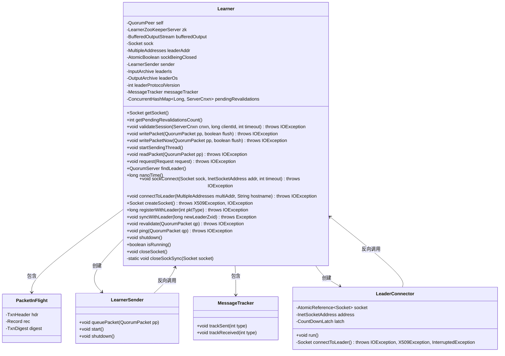
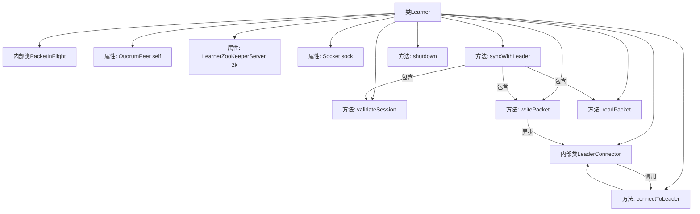
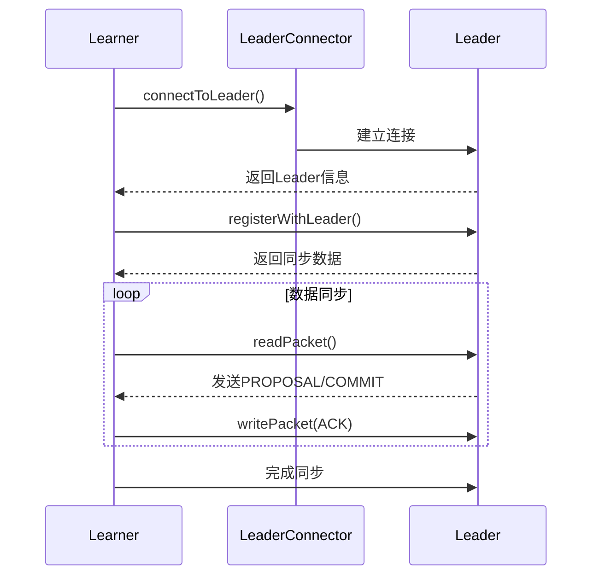

# 基础信息

|      |      |
|------|------|
| 名称 | Learner |
| 编码语言 | .java |
| 代码路径 | zookeeper/zookeeper-server/src/main/java/org/apache/zookeeper/server/quorum/Learner.java |
| 包名 | org.apache.zookeeper.server.quorum |
| 依赖项 | ['java.nio.charset.StandardCharsets.UTF_8', 'java.io.BufferedInputStream', 'java.io.BufferedOutputStream', 'java.io.ByteArrayInputStream', 'java.io.ByteArrayOutputStream', 'java.io.DataInputStream', 'java.io.DataOutputStream', 'java.io.IOException', 'java.net.InetSocketAddress', 'java.net.Socket', 'java.nio.ByteBuffer', 'java.util.ArrayDeque', 'java.util.Deque', 'java.util.Map', 'java.util.Map.Entry', 'java.util.Set', 'java.util.concurrent.ConcurrentHashMap', 'java.util.concurrent.CountDownLatch', 'java.util.concurrent.ExecutorService', 'java.util.concurrent.Executors', 'java.util.concurrent.TimeUnit', 'java.util.concurrent.atomic.AtomicBoolean', 'java.util.concurrent.atomic.AtomicReference', 'javax.net.ssl.SSLSocket', 'org.apache.jute.BinaryInputArchive', 'org.apache.jute.BinaryOutputArchive', 'org.apache.jute.InputArchive', 'org.apache.jute.OutputArchive', 'org.apache.jute.Record', 'org.apache.zookeeper.ZooDefs.OpCode', 'org.apache.zookeeper.common.Time', 'org.apache.zookeeper.common.X509Exception', 'org.apache.zookeeper.server.ExitCode', 'org.apache.zookeeper.server.Request', 'org.apache.zookeeper.server.ServerCnxn', 'org.apache.zookeeper.server.ServerMetrics', 'org.apache.zookeeper.server.TxnLogEntry', 'org.apache.zookeeper.server.ZooTrace', 'org.apache.zookeeper.server.quorum.QuorumPeer.QuorumServer', 'org.apache.zookeeper.server.quorum.flexible.QuorumVerifier', 'org.apache.zookeeper.server.util.ConfigUtils', 'org.apache.zookeeper.server.util.MessageTracker', 'org.apache.zookeeper.server.util.SerializeUtils', 'org.apache.zookeeper.server.util.ZxidUtils', 'org.apache.zookeeper.txn.SetDataTxn', 'org.apache.zookeeper.txn.TxnDigest', 'org.apache.zookeeper.txn.TxnHeader', 'org.apache.zookeeper.util.ServiceUtils', 'org.slf4j.Logger', 'org.slf4j.LoggerFactory'] |
| 概述说明 | Learner类实现ZooKeeper学习者节点功能，包含与Leader节点通信、数据同步、会话验证等核心逻辑。主要功能：1. 通过Socket连接Leader；2. 处理提案/提交事务；3. 支持同步/异步消息发送；4. 实现快照同步和日志截断；5. 维护待验证会话列表。关键属性：Socket连接、输入输出流、消息跟踪器、配置参数等。 |

# 说明

Learner类实现了ZooKeeper中学习者节点（Follower/Observer）与Leader节点的核心交互逻辑。主要功能包括：通过connectToLeader建立多地址连接，支持同步/异步数据包传输（writePacket），使用LeaderConnector线程池并行尝试连接；处理会话验证（validateSession/revalidate）、提案转发（request）和心跳响应（ping）；实现数据同步机制（syncWithLeader），支持DIFF/SNAP/TRUNC三种同步模式，处理提案队列（packetsNotLogged/packetsCommitted）和配置更新；包含线程安全的socket管理（closeSocket）和运行时状态控制（shutdown）。关键配置参数包括连接重试延迟（leaderConnectDelayDuringRetryMs）、TCP_NODELAY开关、异步发送模式（asyncSending）等。

# 类列表 Class Summary

| 名称   | 类型  | 说明 |
|-------|------|-------------|
| Learner | class | Learner类实现ZooKeeper学习者节点功能，包含与Leader的通信、数据同步、会话验证等核心逻辑。关键点：1.使用PacketInFlight跟踪事务包；2.支持同步/异步消息发送；3.提供连接重试机制；4.实现DIFF/SNAP/TRUNC三种同步模式；5.处理NEWLEADER/UPTODATE等控制消息；6.包含SSL连接支持。 |

## 类 Learner

|      |      |
|------|------|
| 访问范围 | public |
| 类型 | class |
| 名称 | Learner |
| 说明 | Learner类实现ZooKeeper学习者节点功能，包含与Leader的通信、数据同步、会话验证等核心逻辑。关键点：1.使用PacketInFlight跟踪事务包；2.支持同步/异步消息发送；3.提供连接重试机制；4.实现DIFF/SNAP/TRUNC三种同步模式；5.处理NEWLEADER/UPTODATE等控制消息；6.包含SSL连接支持。 |

### UML类图

这段代码实现了一个ZooKeeper Learner节点的核心功能，负责与Leader节点建立连接、同步数据、处理请求和心跳等关键操作。类图中展示了Learner作为主类，包含内部类PacketInFlight和LeaderConnector，以及与LearnerSender、MessageTracker的关联关系。Learner通过Socket与Leader通信，使用输入/输出归档(InputArchive/OutputArchive)处理网络数据，并维护待验证会话(pendingRevalidations)和消息跟踪(messageTracker)等状态。特别值得注意的是其多线程连接机制(LeaderConnector)和异步发送模式(LearnerSender)的设计，以及处理不同同步模式(DIFF/SNAP/TRUNC)的复杂逻辑。

### 内部方法调用关系图

该流程图展示了ZooKeeper Learner核心组件的类关系与通信流程。类结构包含主类Learner及其内部类PacketInFlight和LeaderConnector，关键方法如连接管理、数据包读写和同步机制。时序图详细描述了从建立连接到完成数据同步的完整过程，包括重试机制、异步通信和一致性验证等关键交互步骤。整体设计实现了ZAB协议的follower同步机制，通过状态跟踪和异常处理确保分布式一致性。

### 字段列表 Field List

| 名称  | 类型  | 说明 |
|-------|-------|------|
| sock | Socket | 声明一个受保护的Socket类型变量sock。 |
| leaderProtocolVersion = 0x01 | int | 声明一个受保护的整型变量leaderProtocolVersion，初始值为0x01。 |
| leaderIs | InputArchive | 输入存档保护字段leaderIs。 |
| leaderOs | OutputArchive | 保护类型的输出归档变量leaderOs。 |
| asyncSending =        Boolean.parseBoolean(ConfigUtils.getPropertyBackwardCompatibleWay(LEARNER_ASYNC_SENDING)) | boolean | 私有静态布尔变量asyncSending，通过ConfigUtils获取配置属性LEARNER_ASYNC_SENDING并转换为布尔值。 |
| sender = null | LearnerSender | 声明一个名为sender的LearnerSender类型变量，初始化为null。 |
| sockBeingClosed = new AtomicBoolean(false) | AtomicBoolean | 声明一个原子布尔变量sockBeingClosed，初始值为false，用于线程安全地标记套接字关闭状态。 |
| nodelay = System.getProperty("follower.nodelay", "true").equals("true") | boolean | 代码定义静态布尔变量nodelay，通过系统属性follower.nodelay获取值，默认true。 |
| bufferedOutput | BufferedOutputStream | 声明一个受保护的缓冲输出流变量bufferedOutput。 |
| closeSocketAsync = Boolean        .parseBoolean(ConfigUtils.getPropertyBackwardCompatibleWay(LEARNER_CLOSE_SOCKET_ASYNC)) | boolean | 静态常量closeSocketAsync通过配置工具获取属性值并转为布尔型，控制是否异步关闭socket。 |
| zk | LearnerZooKeeperServer | LearnerZooKeeperServer zk 是一个ZooKeeper服务器实例，用于分布式协调服务。 |
| messageTracker = new MessageTracker(BUFFERED_MESSAGE_SIZE) | MessageTracker | 保护成员messageTracker初始化为缓冲大小为BUFFERED_MESSAGE_SIZE的MessageTracker实例。 |
| leaderAddr | MultipleAddresses | 声明一个受保护的多地址变量leaderAddr。 |
| leaderConnectDelayDuringRetryMs = Integer.getInteger("zookeeper.leaderConnectDelayDuringRetryMs", 100) | int | 私有静态常量leaderConnectDelayDuringRetryMs默认值100，可通过系统属性zookeeper.leaderConnectDelayDuringRetryMs覆盖。 |
| LEARNER_ASYNC_SENDING = "zookeeper.learner.asyncSending" | String | 这是一个静态常量字符串，定义了一个ZooKeeper配置项键名，用于控制学习者节点的异步发送功能。 |
| self | QuorumPeer | QuorumPeer是ZooKeeper中负责集群选举和状态同步的核心组件。 |
| LEARNER_CLOSE_SOCKET_ASYNC = "zookeeper.learner.closeSocketAsync" | String | ZooKeeper配置项，控制学习者异步关闭Socket。 |
| BUFFERED_MESSAGE_SIZE = 10 | int | 定义常量BUFFERED_MESSAGE_SIZE，值为10，表示缓冲消息大小。 |
| LOG = LoggerFactory.getLogger(Learner.class) | Logger | 声明一个受保护的静态最终日志记录器，用于Learner类的日志记录。 |
| pendingRevalidations = new ConcurrentHashMap<>() | ConcurrentHashMap<Long, ServerCnxn> | 声明一个线程安全的ConcurrentHashMap变量pendingRevalidations，键为Long类型，值为ServerCnxn类型。 |

### 方法列表 Method List

| 名称  | 类型  | 说明 |
|-------|-------|------|
| getPendingRevalidationsCount | int | 该方法返回待重新验证项的数量，直接调用pendingRevalidations的size()获取。 |
| findLeader | QuorumServer | 该方法通过当前投票ID在集群视图中查找领导者服务器，若找到则重置其套接字地址后返回；未找到则记录警告日志并返回null。 |
| syncWithLeader | void | 该方法处理ZooKeeper follower与leader的数据同步，包括DIFF/SNAP/TRUNC三种同步模式，处理提案、提交、配置更新等消息，并确保事务日志和内存数据一致性。 |
| writePacket | void | 
根据asyncSending标志选择异步排队或立即写入数据包。 |
| writePacketNow | void | 方法writePacketNow同步写入QuorumPacket数据包到leaderOs流，可选刷新缓冲区。若pp非空则记录消息类型，flush为true时强制刷新输出流。 |
| setAsyncSending | void | 这是一个Java方法，用于设置异步发送模式。方法接受布尔参数newMode，更新静态变量asyncSending，并记录日志。日志包含常量LEARNER_ASYNC_SENDING和当前模式值。 |
| readPacket | void | 方法readPacket读取QuorumPacket数据包，同步处理并记录类型，若日志启用则跟踪PING或普通包信息。 |
| getAsyncSending | boolean | 这是一个Java静态方法，返回布尔值asyncSending的状态。方法为protected访问权限。 |
| createSocket | Socket | 创建Socket方法，支持SSL或普通Socket，设置超时为tickTime乘initLimit。 |
| connectToLeader | void | 连接领导者方法：检查地址可达性，多线程尝试连接，等待结果并处理异常，认证成功后建立IO流，支持异步发送。 |
| registerWithLeader | long | 方法registerWithLeader用于向Leader注册Follower信息，包括最后zxid和sid。发送LearnerInfo数据包后，处理Leader响应，更新epoch值，验证数据包类型，若为LEADERINFO则发送ACKEPOCH确认，否则检查是否为NEWLEADER。异常时抛出IO错误。 |
| revalidate | void | 方法revalidate处理会话验证，读取会话ID和验证状态，若会话存在则调用finishSessionInit，否则记录警告。验证结果会记录日志。 |
| ping | void | 该方法处理心跳包，将本地会话数据序列化后返回。使用字节流写入键值对，构建回复包并发送。 |
| shutdown | void | 关闭ZooKeeper服务，包括清空服务器实例、断开所有连接、停止发送器、关闭套接字，并根据同步模式强制关闭旧服务以确保一致性。 |
| isRunning | boolean | 检查运行状态，返回自身和zk是否都在运行。 |
| closeSocket | void | 关闭Socket连接的方法：若未建立连接则直接返回；支持同步或异步关闭，异步时创建守护线程执行关闭操作。 |
| closeSockSync | void | 关闭Socket并记录耗时，忽略异常。 |
| getSocket | Socket | 获取Socket对象的方法，返回成员变量sock。 |
| validateSession | void | 方法validateSession用于验证客户端会话，记录日志并发送QuorumPacket。参数包括连接对象、客户端ID和超时时间。处理过程包括数据序列化和写入待验证队列。 |
| startSendingThread | void | 启动发送线程，创建LearnerSender实例并运行。 |
| sockConnect | void | Java方法`sockConnect`用于连接Socket到指定地址和端口，设置超时时间，失败时抛出IOException。 |
| nanoTime | long | 该方法返回当前系统时间的纳秒级精度值，用于高精度计时。 |
| request | void | 方法处理请求：若被限流则报错退出；否则将请求数据序列化为字节流，封装为QuorumPacket后发送。 |

