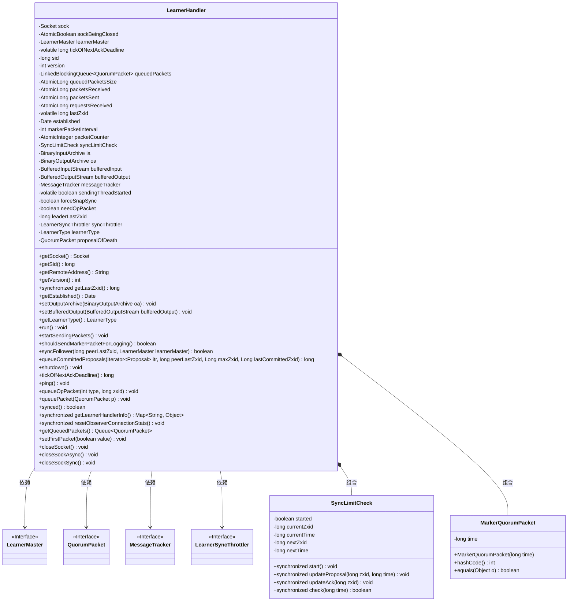
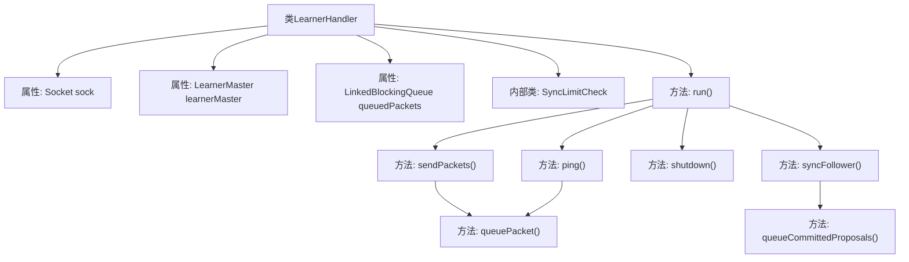
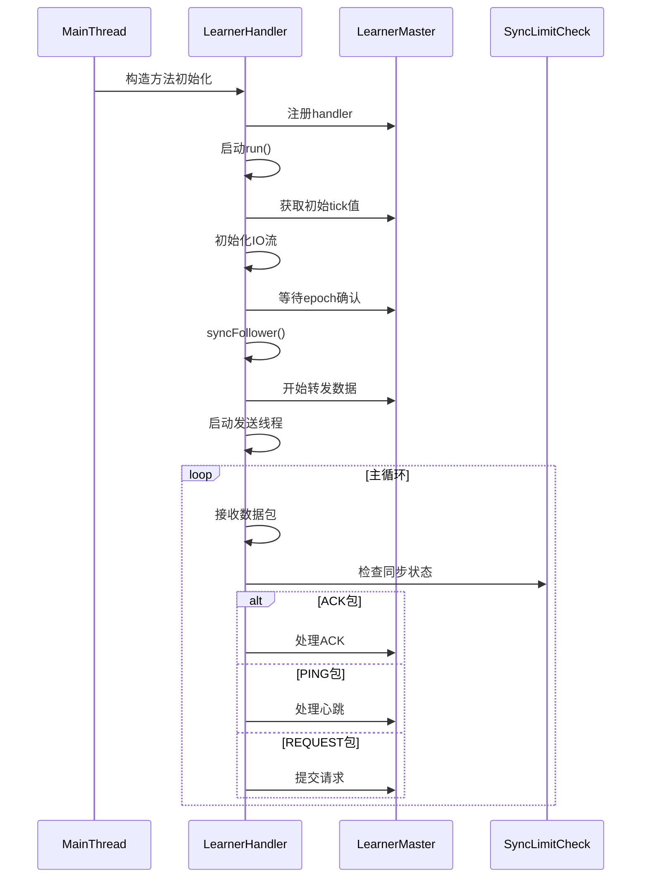

# 基础信息

|      |      |
|------|------|
| 名称 | LearnerHandler |
| 编码语言 | .java |
| 代码路径 | zookeeper/zookeeper-server/src/main/java/org/apache/zookeeper/server/quorum/LearnerHandler.java |
| 包名 | org.apache.zookeeper.server.quorum |
| 依赖项 | ['java.io.BufferedInputStream', 'java.io.BufferedOutputStream', 'java.io.ByteArrayInputStream', 'java.io.DataInputStream', 'java.io.IOException', 'java.net.Socket', 'java.nio.ByteBuffer', 'java.util.Date', 'java.util.Iterator', 'java.util.LinkedHashMap', 'java.util.Map', 'java.util.Objects', 'java.util.Queue', 'java.util.concurrent.LinkedBlockingQueue', 'java.util.concurrent.atomic.AtomicBoolean', 'java.util.concurrent.atomic.AtomicInteger', 'java.util.concurrent.atomic.AtomicLong', 'java.util.concurrent.locks.ReentrantReadWriteLock', 'java.util.concurrent.locks.ReentrantReadWriteLock.ReadLock', 'javax.security.sasl.SaslException', 'org.apache.jute.BinaryInputArchive', 'org.apache.jute.BinaryOutputArchive', 'org.apache.zookeeper.ZooDefs.OpCode', 'org.apache.zookeeper.common.Time', 'org.apache.zookeeper.server.Request', 'org.apache.zookeeper.server.RequestRecord', 'org.apache.zookeeper.server.ServerMetrics', 'org.apache.zookeeper.server.TxnLogProposalIterator', 'org.apache.zookeeper.server.ZKDatabase', 'org.apache.zookeeper.server.ZooKeeperThread', 'org.apache.zookeeper.server.ZooTrace', 'org.apache.zookeeper.server.quorum.Leader.Proposal', 'org.apache.zookeeper.server.quorum.QuorumPeer.LearnerType', 'org.apache.zookeeper.server.quorum.auth.QuorumAuthServer', 'org.apache.zookeeper.server.util.ConfigUtils', 'org.apache.zookeeper.server.util.MessageTracker', 'org.apache.zookeeper.server.util.ZxidUtils', 'org.slf4j.Logger', 'org.slf4j.LoggerFactory'] |
| 概述说明 | LearnerHandler是ZooKeeper中处理学习者（Follower/Observer）与Leader同步的线程类，主要功能包括：管理Socket连接、处理同步请求（DIFF/TRUNC/SNAP）、转发提案包、监控ACK超时。关键属性：Socket连接、待发送包队列、同步状态检查、学习者ID。核心逻辑：通过队列机制高效转发数据包，支持强制快照同步，确保集群数据一致性。 |

# 说明

LearnerHandler是ZooKeeper中处理Leader与Learner（Follower/Observer）通信的核心线程类，主要负责同步数据、处理请求及维持心跳。关键功能包括：

1. 初始化时通过Socket建立连接，进行身份验证，并读取Learner信息（如sid、版本号）。支持同步/异步关闭Socket，通过LEADER_CLOSE_SOCKET_ASYNC配置控制。

2. 数据同步机制：
   - 根据peerLastZxid判断同步策略（DIFF/TRUNC/SNAP），优先使用事务日志（txnLog）和提交日志（committedLog）同步，失败时回退到快照传输。
   - 使用SyncLimitCheck监控提案ACK超时，超时则断开连接。

3. 通信管理：
   - 通过queuedPackets队列异步发送提案包（PROPOSAL/COMMIT等），包含流量控制（markerPacketInterval）和延迟统计。
   - 处理Learner的ACK、PING、REQUEST等消息，转发给Leader处理。

4. 状态维护：
   - 记录最后处理的zxid、连接建立时间、收发包数量等指标。
   - 提供getLearnerHandlerInfo()方法暴露连接状态信息。

5. 容错机制：
   - 心跳检测（ping()）和超时处理。
   - 异常时自动清理资源（关闭Socket、移除注册信息）。

该类通过组合ZKDatabase、LearnerMaster等组件实现ZAB协议的关键交互逻辑，确保集群数据一致性与高可用性。

# 类列表 Class Summary

| 名称   | 类型  | 说明 |
|-------|------|-------------|
| LearnerHandler | class | LearnerHandler是ZooKeeper中处理学习者（Follower/Observer）与Leader间通信的线程类，负责同步数据、处理请求及维护连接状态。关键功能包括：同步策略（DIFF/TRUNC/SNAP）、心跳检测、请求转发、流量控制及连接管理。通过队列机制高效传输提案包，支持同步限流与异步关闭优化。 |

## 类 LearnerHandler

|      |      |
|------|------|
| 访问范围 | public |
| 类型 | class |
| 名称 | LearnerHandler |
| 说明 | LearnerHandler是ZooKeeper中处理学习者（Follower/Observer）与Leader间通信的线程类，负责同步数据、处理请求及维护连接状态。关键功能包括：同步策略（DIFF/TRUNC/SNAP）、心跳检测、请求转发、流量控制及连接管理。通过队列机制高效传输提案包，支持同步限流与异步关闭优化。 |

### UML类图

这段代码定义了一个`LearnerHandler`类，它是ZooKeeper中用于处理领导者与学习者（跟随者/观察者）之间通信的核心组件。主要功能包括：管理网络连接、同步数据状态、处理请求/响应包、流量控制等。类中包含多个内部状态（如socket连接、数据包队列、同步检查器等）和复杂的状态同步逻辑（DIFF/TRUNC/SNAP同步机制）。通过`SyncLimitCheck`内部类实现提案超时检测，`MarkerQuorumPacket`用于性能监控。整体设计采用生产者-消费者模式，通过队列实现异步通信，支持多种同步策略以适应不同网络环境。

### 内部方法调用关系图

这段代码是ZooKeeper中处理学习者(Learner)连接的Handler类，主要负责领导者(Leader)与跟随者(Follower)/观察者(Observer)之间的数据同步和消息传递。流程图展示了类的核心结构和主要方法调用关系，时序图描述了从初始化到运行时的完整交互流程。该类通过队列机制异步处理数据包，实现了高效的数据同步，同时包含心跳检测、超时处理、快照传输等多种同步策略，确保集群数据一致性的同时兼顾性能。

### 字段列表 Field List

| 名称  | 类型  | 说明 |
|-------|-------|------|
| closeSocketAsync = Boolean        .parseBoolean(ConfigUtils.getPropertyBackwardCompatibleWay(LEADER_CLOSE_SOCKET_ASYNC)) | boolean | 静态布尔常量closeSocketAsync，通过ConfigUtils获取LEADER_CLOSE_SOCKET_ASYNC配置值并转为布尔型，决定是否异步关闭套接字。 |
| packetsReceived = new AtomicLong() | AtomicLong | 声明一个受保护的final AtomicLong变量packetsReceived，用于原子性记录接收的数据包数量。 |
| messageTracker | MessageTracker | 受保护的最终消息跟踪器messageTracker。 |
| queuedPacketsSize = new AtomicLong() | AtomicLong | 私有原子长整型变量queuedPacketsSize，用于线程安全地记录队列数据包大小。 |
| sendingThreadStarted = false | boolean | 私有易变布尔变量，标记发送线程是否启动。 |
| FORCE_SNAP_SYNC = "zookeeper.forceSnapshotSync" | String | 定义静态常量FORCE_SNAP_SYNC，值为"zookeeper.forceSnapshotSync"。 |
| bufferedInput | BufferedInputStream | 私有成员变量bufferedInput，类型为BufferedInputStream。 |
| packetCounter = new AtomicInteger() | AtomicInteger | 私有原子整型变量packetCounter用于线程安全计数。 |
| learnerMaster | LearnerMaster | 声明一个名为learnerMaster的final类型LearnerMaster对象。 |
| requestsReceived = new AtomicLong() | AtomicLong | 受保护的原子长整型变量requestsReceived，用于记录接收到的请求数量。 |
| version = 0x1 | int | 声明一个受保护的整型变量version，初始值为0x1（十六进制1）。 |
| sid = 0 | long | 声明一个受保护的长整型变量sid，初始值为0。 |
| syncThrottler = null | LearnerSyncThrottler | 私有LearnerSyncThrottler同步限流器初始化为空。 |
| sockBeingClosed = new AtomicBoolean(false) | AtomicBoolean | 声明一个原子布尔变量sockBeingClosed，初始值为false，用于线程安全的状态控制。 |
| leaderLastZxid | long | 私有长整型变量，记录领导者的最后事务ID。 |
| markerPacketInterval = 1000 | int | 私有整型常量markerPacketInterval值为1000。 |
| packetsSent = new AtomicLong() | AtomicLong | 声明一个受保护的final AtomicLong变量packetsSent，用于原子操作记录发送的数据包数量。 |
| forceSnapSync = false | boolean | 强制启用快照同步的私有布尔变量，默认关闭。 |
| learnerType = LearnerType.PARTICIPANT | LearnerType | 学习者类型为参与者。 |
| oa | BinaryOutputArchive | 私有二进制输出归档对象oa。 |
| syncLimitCheck = new SyncLimitCheck() | SyncLimitCheck | 声明并初始化一个SyncLimitCheck类的私有实例syncLimitCheck。 |
| LEADER_CLOSE_SOCKET_ASYNC = "zookeeper.leader.closeSocketAsync" | String | ZooKeeper配置项，控制领导者是否异步关闭Socket连接。 |
| needOpPacket = true | boolean | 私有布尔变量needOpPacket初始值为true。 |
| ia | BinaryInputArchive | 私有二进制输入归档对象ia。 |
| sock | Socket | 受保护的最终Socket对象sock。 |
| LOG = LoggerFactory.getLogger(LearnerHandler.class) | Logger | 定义LearnerHandler类的私有静态日志对象LOG。 |
| bufferedOutput | BufferedOutputStream | 私有缓冲输出流变量bufferedOutput。 |
| established = new Date() | Date | 声明一个受保护的final日期变量，初始化为当前时间。 |
| lastZxid = -1 | long | 声明一个受保护的易变长整型变量lastZxid，初始值为-1。 |
| tickOfNextAckDeadline | long | volatile修饰的long类型变量tickOfNextAckDeadline，用于记录下次确认截止时间。 |
| proposalOfDeath = new QuorumPacket() | QuorumPacket | 创建QuorumPacket实例proposalOfDeath。 |
| queuedPackets = new LinkedBlockingQueue<>() | LinkedBlockingQueue<QuorumPacket> | 创建线程安全的阻塞队列queuedPackets，用于存储QuorumPacket类型数据。 |

### 方法列表 Method List

| 名称  | 类型  | 说明 |
|-------|-------|------|
| ping | void | 方法`ping()`检查学习者线程是否启动，未启动则返回。若同步检查通过，发送PING包；否则记录超时警告并关闭连接。 |
| packetToString | String | 该方法将QuorumPacket类型转换为字符串，包含类型、zxid和附加信息。处理REVALIDATE时读取sessionid，其他类型直接转换。 |
| shutdown | void | 该方法用于关闭系统，清空队列并发送终止包，关闭套接字，中断当前线程，并从主控节点移除学习器处理器及其注册信息。异常时记录警告。 |
| shouldSendMarkerPacketForLogging | boolean | 该方法返回布尔值true，表示应发送标记数据包用于日志记录。 |
| getLearnerType | LearnerType | 这是一个Java方法，返回LearnerType类型的私有变量learnerType的值。 |
| startSendingPackets | void | 启动发送数据包的线程，若未启动则创建新线程执行发送任务，线程名为"Sender-"加远程地址；若已启动则记录错误。异常中断时记录警告。 |
| setBufferedOutput | void | 设置缓冲输出流的方法，将参数赋给类的成员变量bufferedOutput。 |
| getRemoteAddress | String | 该方法返回远程套接字地址字符串，若套接字为空则返回"<null>"。 |
| packetSize | long | 计算QuorumPacket对象近似大小：基础大小（4+8+8+8）加上数据字节数组长度。 |
| synced | boolean | 检查节点存活且主节点当前周期未超过确认截止周期。 |
| getLearnerHandlerInfo | Map<String, Object> | 同步方法返回包含学习者处理器信息的映射，包括远程地址、会话ID、状态、队列包数量及大小、收发包数、请求数和最后事务ID。 |
| resetObserverConnectionStats | void | 同步方法resetObserverConnectionStats重置观察者连接统计：包收发数、请求数归零，lastZxid置-1。 |
| getQueuedPackets | Queue<QuorumPacket> | 获取队列中的QuorumPacket数据包。 |
| setFirstPacket | void | 设置首个数据包标志，控制是否需要操作包。 |
| closeSocket | void | 关闭socket连接，根据异步标志选择同步或异步方式，确保线程安全。 |
| closeSockAsync | void | 异步关闭套接字方法：创建守护线程执行同步关闭操作，线程名包含套接字ID。 |
| closeSockSync | void | 同步关闭套接字方法：检查非空后记录关闭耗时并关闭，异常时忽略并记录警告。 |
| queueCommittedProposals | long | 该方法处理提案队列，根据peer的zxid决定发送DIFF或TRUNC操作包，跳过已处理的提案，最后返回已处理的最高zxid。 |
| sendPackets | void | 该方法持续发送队列中的QuorumPacket数据包。若队列为空则刷新缓冲并等待新包。处理标记包时记录耗时，遇到死亡包则终止。记录提案包时间，跟踪日志，更新最后处理的zxid，通过输出流发送包。异常时关闭套接字并终止循环。 |
| queueOpPacket | void | 私有方法queueOpPacket接收类型和zxid参数，创建QuorumPacket对象并调用queuePacket方法处理。 |
| run | void | LearnerHandler处理与Leader的通信，验证初始数据包类型，同步状态，发送快照或差异数据，处理ACK和请求，确保数据一致性。异常时关闭连接并记录日志。 |
| setOutputArchive | void | 设置输出归档对象为指定参数。 |
| getSid | long | 方法getSid返回sid值。 |
| getEstablished | Date | 该方法返回一个日期的克隆副本，确保外部修改不影响原始数据。 |
| tickOfNextAckDeadline | long | 方法返回下一个确认截止时间的时间戳。 |
| queuePacket | void | 方法queuePacket将数据包p加入队列queuedPackets。若满足日志标记条件且计数器达到间隔值，则添加时间戳标记包MarkerQuorumPacket。最后累加数据包大小到queuedPacketsSize。 |
| syncFollower | boolean | 该方法处理主从节点同步逻辑，根据peer的zxid判断同步方式：若peer已同步则发送空DIFF；若peer有未处理事务则发送TRUNC；若peer在提交日志范围内则发送DIFF；否则尝试用事务日志同步，失败则发送快照。最终返回是否需要快照同步。 |
| getSocket | Socket | 获取Socket对象的方法，返回成员变量sock。 |
| toString | String | 重写toString方法，输出LearnerHandler的socket信息、下次ACK截止时间、同步状态及队列包长度。 |
| getVersion | int | 获取当前版本号的方法，返回值为整数类型。 |
| getLastZxid | long | 同步方法返回lastZxid值。 |

