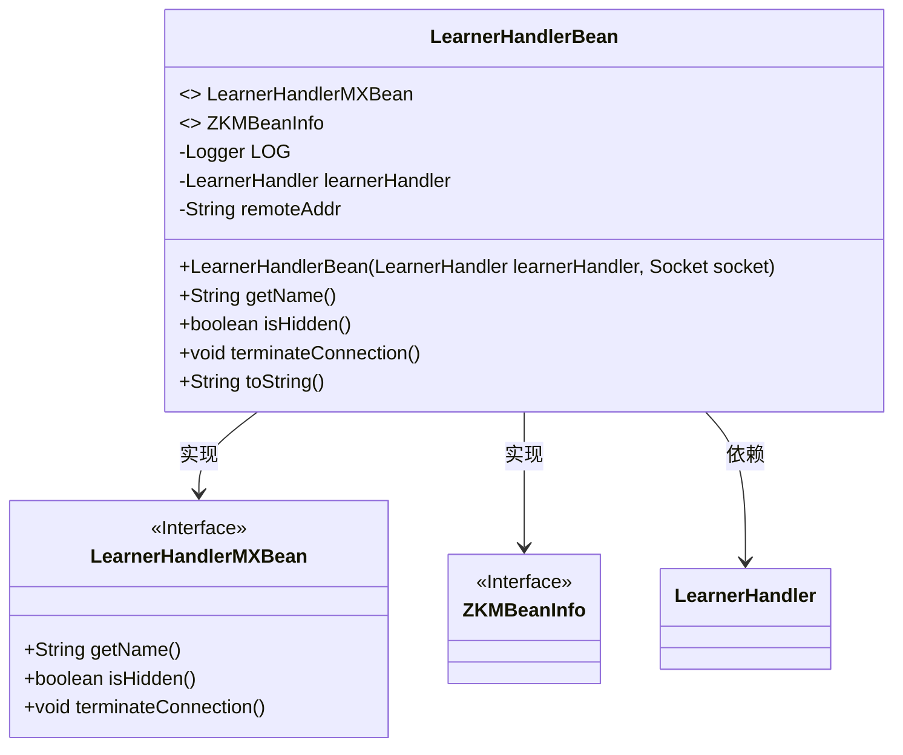
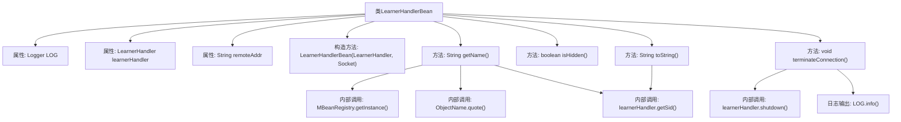

# 基础信息

|      |      |
|------|------|
| 名称 | LearnerHandlerBean |
| 编码语言 | .java |
| 代码路径 | zookeeper/zookeeper-server/src/main/java/org/apache/zookeeper/server/quorum/LearnerHandlerBean.java |
| 包名 | org.apache.zookeeper.server.quorum |
| 依赖项 | ['java.net.InetSocketAddress', 'java.net.Socket', 'javax.management.ObjectName', 'org.apache.zookeeper.jmx.MBeanRegistry', 'org.apache.zookeeper.jmx.ZKMBeanInfo', 'org.slf4j.Logger', 'org.slf4j.LoggerFactory'] |
| 概述说明 | LearnerHandlerBean类实现LearnerHandlerMXBean和ZKMBeanInfo接口，管理LearnerHandler连接，记录远程地址和服务器ID，提供终止连接方法。 |

# 说明

LearnerHandlerBean类实现了LearnerHandlerMXBean和ZKMBeanInfo接口，用于管理学习者连接。它包含LearnerHandler实例和远程地址字符串。构造函数接收LearnerHandler和Socket对象，从Socket提取远程地址信息。getName方法返回MBean注册路径，isHidden返回false表示不隐藏。terminateConnection方法可终止连接并记录日志。toString方法返回包含远程地址和服务ID的字符串描述。

# 类列表 Class Summary

| 名称   | 类型  | 说明 |
|-------|------|-------------|
| LearnerHandlerBean | class | LearnerHandlerBean类实现LearnerHandlerMXBean和ZKMBeanInfo接口，管理LearnerHandler连接，记录远程地址和端口，提供终止连接方法。 |

## 类 LearnerHandlerBean

|      |      |
|------|------|
| 访问范围 | public |
| 类型 | class |
| 名称 | LearnerHandlerBean |
| 说明 | LearnerHandlerBean类实现LearnerHandlerMXBean和ZKMBeanInfo接口，管理LearnerHandler连接，记录远程地址和端口，提供终止连接方法。 |

### UML类图

这段代码描述了一个名为LearnerHandlerBean的类，它实现了LearnerHandlerMXBean和ZKMBeanInfo两个接口。该类主要用于管理学习者连接处理器，包含远程地址记录、连接终止等功能。私有成员包括日志记录器、学习者处理器实例和远程地址字符串。公有方法涵盖构造器、名称获取、连接终止及对象字符串表示。类图清晰展示了实现关系与关键依赖。

### 内部方法调用关系图

该流程图展示了LearnerHandlerBean类的完整结构，包含4个核心属性（LOG日志器、learnerHandler处理器、remoteAddr远程地址）、5个关键方法（构造方法、getName命名、isHidden隐藏标志、terminateConnection终止连接、toString字符串化）。重点突出了方法间的调用链，如getName()通过MBeanRegistry获取实例并组合对象路径，terminateConnection()触发learnerHandler的关闭和日志记录。类设计遵循JMX规范，实现了MXBean接口和ZKMBeanInfo，用于监控学习者连接状态。

### 字段列表 Field List

| 名称  | 类型  | 说明 |
|-------|-------|------|
| LOG = LoggerFactory.getLogger(LearnerHandlerBean.class) | Logger | 定义LearnerHandlerBean类的私有静态日志对象LOG，使用LoggerFactory获取实例。 |
| learnerHandler | LearnerHandler | 私有终态的学习处理器实例。 |
| remoteAddr | String | 私有字符串变量remoteAddr，存储远程地址信息。 |

### 方法列表 Method List

| 名称  | 类型  | 说明 |
|-------|-------|------|
| isHidden | boolean | 重写isHidden方法，始终返回false。 |
| getName | String | Java方法重写，返回包含远程地址和ID的完整路径字符串，用于Learner连接MBean命名。 |
| terminateConnection | void | 该方法重写终止连接逻辑，记录日志并调用learnerHandler的shutdown方法。 |
| toString | String | Java重写toString方法，返回包含remoteIP和ServerId的LearnerHandlerBean对象信息。 |

