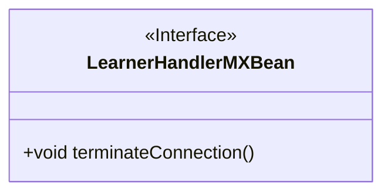
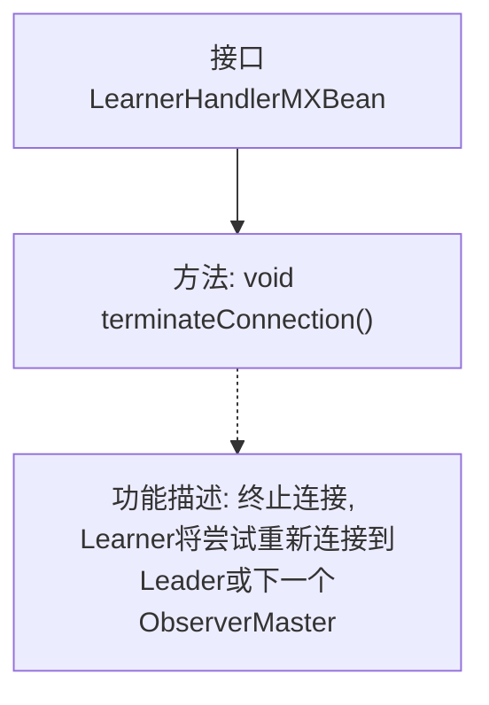

# 基础信息

|      |      |
|------|------|
| 名称 | LearnerHandlerMXBean |
| 编码语言 | .java |
| 代码路径 | zookeeper/zookeeper-server/src/main/java/org/apache/zookeeper/server/quorum/LearnerHandlerMXBean.java |
| 包名 | org.apache.zookeeper.server.quorum |
| 依赖项 | [] |
| 概述说明 | LearnerHandlerMXBean接口提供终止连接功能，断开后学习者会尝试重新连接领导者或下一个ObserverMaster。 |

# 说明

这是一个名为LearnerHandlerMXBean的公共接口，定义了一个用于管理学习者连接的方法。接口中的terminateConnection方法用于终止当前连接，学习者会尝试重新连接到领导者或下一个ObserverMaster（如果该功能已启用）。该接口主要用于处理分布式系统中的学习者节点连接管理。

# 类列表 Class Summary

| 名称   | 类型  | 说明 |
|-------|------|-------------|
| LearnerHandlerMXBean | interface | LearnerHandlerMXBean接口提供终止连接功能，学习者会尝试重新连接领导者或下一个ObserverMaster。 |

## 类 LearnerHandlerMXBean

|      |      |
|------|------|
| 访问范围 | public |
| 类型 | interface |
| 名称 | LearnerHandlerMXBean |
| 说明 | LearnerHandlerMXBean接口提供终止连接功能，学习者会尝试重新连接领导者或下一个ObserverMaster。 |

### UML类图

这段代码定义了一个名为LearnerHandlerMXBean的接口，该接口包含一个terminateConnection()方法，用于终止连接并使学习者尝试重新连接到领导者或下一个ObserverMaster（如果该功能已启用）。接口使用<<Interface>>标记明确表示其接口性质，方法为公有方法且无返回值。这个接口可能用于分布式系统中处理学习者节点与领导者节点之间的连接管理。

### 内部方法调用关系图

这段代码的流程图展示了LearnerHandlerMXBean接口的结构和功能。该接口仅包含一个terminateConnection()方法，用于终止当前连接并触发重新连接机制。当调用此方法时，Learner会尝试重新连接到Leader节点，如果启用了ObserverMaster功能，则会尝试连接到下一个ObserverMaster节点。这种设计常用于分布式系统中处理节点间连接异常的场景，通过JMX管理接口提供连接控制能力。

### 字段列表 Field List

| 名称  | 类型  | 说明 |
|-------|-------|------|

### 方法列表 Method List

| 名称  | 类型  | 说明 |
|-------|-------|------|
| terminateConnection | void | 终止连接。 |

