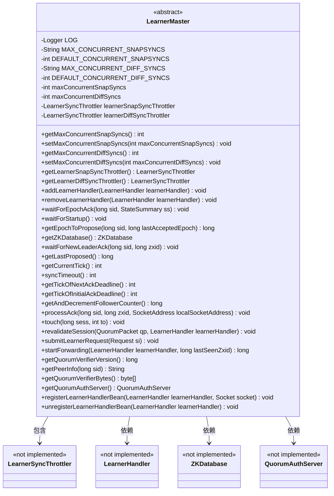

# 基础信息

|      |      |
|------|------|
| 名称 | LearnerMaster |
| 编码语言 | .java |
| 代码路径 | zookeeper/zookeeper-server/src/main/java/org/apache/zookeeper/server/quorum/LearnerMaster.java |
| 包名 | org.apache.zookeeper.server.quorum |
| 依赖项 | ['java.io.IOException', 'java.net.Socket', 'java.net.SocketAddress', 'org.apache.zookeeper.server.Request', 'org.apache.zookeeper.server.ZKDatabase', 'org.apache.zookeeper.server.quorum.auth.QuorumAuthServer', 'org.slf4j.Logger', 'org.slf4j.LoggerFactory'] |
| 概述说明 | LearnerMaster类管理ZooKeeper学习者的同步和请求处理，包含快照和差异同步的限流控制，处理学习者连接、会话验证、请求转发及领导者选举相关操作。 |

# 说明

LearnerMaster是一个抽象类，主要用于管理ZooKeeper中学习者的同步和请求处理。它包含两个关键配置参数：maxConcurrentSnapSyncs和maxConcurrentDiffSyncs，分别控制并发快照同步和差异同步的最大数量，默认值分别为10和100。类中提供了对应的getter和setter方法，并通过LearnerSyncThrottler实现同步流量的控制。此外，LearnerMaster定义了一系列抽象方法，用于处理学习者处理器的添加和移除、等待新领导者确认、处理ACK包、会话验证、请求转发等功能。这些方法涉及学习者与领导者之间的交互、同步超时管理、会话状态维护以及请求处理流程。类还包含与仲裁验证器、对等节点信息和认证服务器相关的抽象方法。整体设计旨在协调学习者与领导者之间的数据同步和状态管理。

# 类列表 Class Summary

| 名称   | 类型  | 说明 |
|-------|------|-------------|
| LearnerMaster | class | LearnerMaster类管理ZooKeeper学习者的同步和请求处理，包含快照和差异同步的限流控制，处理学习者连接、会话验证及请求转发，并提供多种抽象方法支持集群协调和状态管理。 |

## 类 LearnerMaster

|      |      |
|------|------|
| 访问范围 | public abstract |
| 类型 | class |
| 名称 | LearnerMaster |
| 说明 | LearnerMaster类管理ZooKeeper学习者的同步和请求处理，包含快照和差异同步的限流控制，处理学习者连接、会话验证及请求转发，并提供多种抽象方法支持集群协调和状态管理。 |

### UML类图

这段类图描述了一个抽象类LearnerMaster，它作为ZooKeeper中领导者与学习者之间同步控制的核心组件。该类通过两个LearnerSyncThrottler实例（learnerSnapSyncThrottler和learnerDiffSyncThrottler）分别控制快照同步和差异同步的并发量，提供了对学习者处理器（LearnerHandler）的生命周期管理方法，并定义了多个抽象方法用于处理选举确认、会话验证、请求转发等分布式协调功能。该类与ZKDatabase、QuorumAuthServer等组件存在依赖关系，共同构成了ZooKeeper领导者选举和状态同步的基础架构。

### 内部方法调用关系图

该流程图展示了ZooKeeper中LearnerMaster抽象类的完整结构，包含静态配置加载机制、并发同步控制器实例化、以及23个关键抽象方法。类核心功能包括：通过Throttler机制控制快照同步(SNAP)和差异同步(DIFF)的并发量，提供观察者模式下的各种状态等待方法（如waitForEpochAck），处理ACK报文和会话验证，同时管理LearnerHandler的生命周期和JMX监控注册。所有抽象方法均需由具体子类实现分布式一致性协议的具体逻辑。

### 字段列表 Field List

| 名称  | 类型  | 说明 |
|-------|-------|------|
| learnerDiffSyncThrottler = new LearnerSyncThrottler(maxConcurrentDiffSyncs, LearnerSyncThrottler.SyncType.DIFF) | LearnerSyncThrottler | 创建私有LearnerSyncThrottler实例，限制最大并发差异同步数。 |
| MAX_CONCURRENT_DIFF_SYNCS = "zookeeper.leader.maxConcurrentDiffSyncs" | String | 私有静态常量MAX_CONCURRENT_DIFF_SYNCS定义ZooKeeper领导节点最大并发差异同步数配置键。 |
| maxConcurrentDiffSyncs = DEFAULT_CONCURRENT_DIFF_SYNCS | int | 私有可变整型变量maxConcurrentDiffSyncs，初始值为默认并发差异同步数。 |
| learnerSnapSyncThrottler = new LearnerSyncThrottler(maxConcurrentSnapSyncs, LearnerSyncThrottler.SyncType.SNAP) | LearnerSyncThrottler | 私有LearnerSyncThrottler实例learnerSnapSyncThrottler，限制最大并发快照同步数，同步类型为SNAP。 |
| DEFAULT_CONCURRENT_SNAPSYNCS | int | 私有静态常量，默认并发快照同步数。 |
| maxConcurrentSnapSyncs = DEFAULT_CONCURRENT_SNAPSYNCS | int | 私有可变整型变量maxConcurrentSnapSyncs，默认值为DEFAULT_CONCURRENT_SNAPSYNCS，用于控制并发快照同步数量。 |
| LOG = LoggerFactory.getLogger(LearnerMaster.class) | Logger | 定义LearnerMaster类的私有静态日志常量LOG。 |
| DEFAULT_CONCURRENT_DIFF_SYNCS | int | 私有静态常量，默认并发差异同步数。 |
| MAX_CONCURRENT_SNAPSYNCS = "zookeeper.leader.maxConcurrentSnapSyncs" | String | 私有静态常量MAX_CONCURRENT_SNAPSYNCS定义ZooKeeper领导节点最大并发快照同步数配置键。 |

### 方法列表 Method List

| 名称  | 类型  | 说明 |
|-------|-------|------|
| waitForStartup | void | 等待启动完成，可能抛出中断异常。 |
| getMaxConcurrentDiffSyncs | int | 该方法返回最大并发差异同步数maxConcurrentDiffSyncs的值。 |
| getZKDatabase | ZKDatabase | 获取ZKDatabase实例的方法，返回类型为ZKDatabase。 |
| waitForEpochAck | void | 等待指定节点的纪元确认，参数为节点ID和状态摘要，可能抛出IO或中断异常。 |
| submitLearnerRequest | void | 提交学习者请求的方法。 |
| getCurrentTick | int | 获取当前时间刻度的整数值。 |
| setMaxConcurrentDiffSyncs | void | 设置最大并发差异同步数方法：记录日志并更新配置，同时调整学习器差异同步限流器的并发数上限。 |
| removeLearnerHandler | void | 移除指定学习处理器的方法。 |
| getLearnerSnapSyncThrottler | LearnerSyncThrottler | 获取LearnerSnapSyncThrottler实例的方法，返回learnerSnapSyncThrottler对象。 |
| setMaxConcurrentSnapSyncs | void | 设置最大并发快照同步数方法，更新日志并调用限流器同步该数值。 |
| getPeerInfo | String | 获取指定节点ID的详细信息。 |
| processAck | void | 处理确认消息，参数包括会话ID(sid)、事务ID(zxid)和本地套接字地址(localSocketAddress)。 |
| getQuorumVerifierVersion | long | 获取法定人数验证器版本号的方法。 |
| addLearnerHandler | void | 添加学习者处理程序的方法。 |
| getAndDecrementFollowerCounter | long | 获取并递减关注者计数器。 |
| getLearnerDiffSyncThrottler | LearnerSyncThrottler | 方法`getLearnerDiffSyncThrottler`返回`learnerDiffSyncThrottler`对象实例，用于控制同步速率。 |
| waitForNewLeaderAck | void | 等待新领导确认，参数为服务器ID和事务ID，可能抛出中断异常。 |
| syncTimeout | int | 方法syncTimeout用于获取同步超时时间。 |
| getLastProposed | long | 获取最后提议的方法。 |
| getTickOfInitialAckDeadline | int | 获取初始确认截止时间的刻度值。 |
| touch | void | 抽象方法，用于处理会话触摸事件，参数为会话ID和目标值。 |
| getTickOfNextAckDeadline | int | 获取下一个确认截止时间的刻度值。 |
| revalidateSession | void | 重新验证会话，处理QuorumPacket和LearnerHandler，可能抛出IOException异常。 |
| getEpochToPropose | long | 获取提议的纪元编号，需传入服务器ID和最后接受的纪元，可能抛出中断或IO异常。 |
| startForwarding | long | 启动转发功能，处理LearnerHandler实例和最后看到的Zxid。 |
| getMaxConcurrentSnapSyncs | int | 方法getMaxConcurrentSnapSyncs返回maxConcurrentSnapSyncs的值。 |
| getQuorumVerifierBytes | byte[] | 获取法定验证器的字节数组。 |
| getQuorumAuthServer | QuorumAuthServer | 获取QuorumAuthServer实例的方法。 |
| registerLearnerHandlerBean | void | 注册学习者处理器的Bean，关联Socket连接。 |
| unregisterLearnerHandlerBean | void | 移除已注册的学习者处理器Bean。 |

