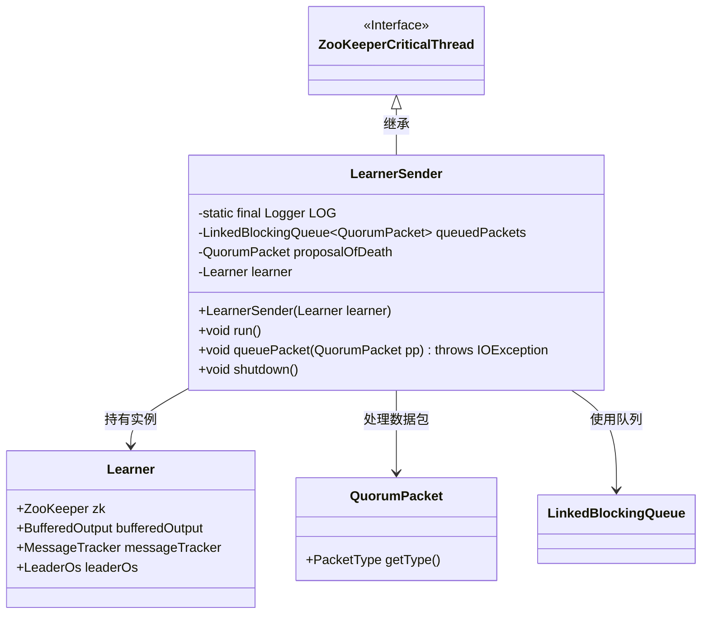
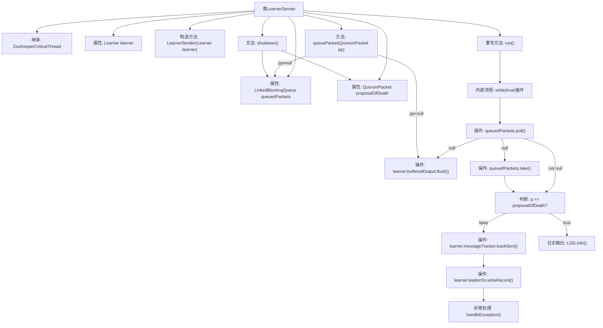

# 基础信息

|      |      |
|------|------|
| 名称 | LearnerSender |
| 编码语言 | .java |
| 代码路径 | zookeeper/zookeeper-server/src/main/java/org/apache/zookeeper/server/quorum/LearnerSender.java |
| 包名 | org.apache.zookeeper.server.quorum |
| 依赖项 | ['java.io.IOException', 'java.util.concurrent.LinkedBlockingQueue', 'org.apache.zookeeper.server.ZooKeeperCriticalThread', 'org.slf4j.Logger', 'org.slf4j.LoggerFactory'] |
| 概述说明 | LearnerSender是ZooKeeper线程类，负责处理QuorumPacket队列，发送消息给Leader，支持刷新缓冲、异常处理和优雅关闭。 |

# 说明

LearnerSender是ZooKeeperCriticalThread的子类，用于处理QuorumPacket消息队列。它包含一个LinkedBlockingQueue队列queuedPackets和特殊的proposalOfDeath数据包。构造函数接收Learner实例并初始化线程名称。run方法循环处理队列中的消息，遇到proposalOfDeath时终止线程，正常消息则通过leaderOs写入。queuePacket方法用于向队列添加数据包，shutdown方法通过添加proposalOfDeath终止线程。异常处理会记录日志并终止线程。

# 类列表 Class Summary

| 名称   | 类型  | 说明 |
|-------|------|-------------|
| LearnerSender | class | LearnerSender是ZooKeeper线程，负责处理队列中的QuorumPacket消息，通过leaderOs发送。支持消息跟踪、异常处理和优雅关闭。 |

## 类 LearnerSender

|      |      |
|------|------|
| 访问范围 | public |
| 类型 | class |
| 名称 | LearnerSender |
| 说明 | LearnerSender是ZooKeeper线程，负责处理队列中的QuorumPacket消息，通过leaderOs发送。支持消息跟踪、异常处理和优雅关闭。 |

### UML类图

类图描述：LearnerSender类继承自ZooKeeperCriticalThread接口，主要负责处理QuorumPacket数据包的发送。它通过LinkedBlockingQueue管理待发送数据包队列，持有Learner实例用于实际数据操作。核心方法包括运行循环(run)、数据包入队(queuePacket)和关闭(shutdown)，通过proposalOfDeath特殊包实现优雅终止机制。

### 内部方法调用关系图

这段代码是ZooKeeper中用于处理学习者节点（Learner）与领导者节点通信的核心线程类。流程图展示了类结构继承关系、关键属性以及主要方法调用链。run()方法实现了持续监听消息队列的核心逻辑，包含消息获取、死亡包检测、消息跟踪和网络写入等关键步骤，同时处理IO异常和中断异常。queuePacket()方法实现消息入队，shutdown()方法通过死亡包机制优雅终止线程。整个设计体现了生产者-消费者模式和可靠消息传输机制。

### 字段列表 Field List

| 名称  | 类型  | 说明 |
|-------|-------|------|
| proposalOfDeath = new QuorumPacket() | QuorumPacket | 私有不可变QuorumPacket实例proposalOfDeath被初始化。 |
| LOG = LoggerFactory.getLogger(LearnerSender.class) | Logger | 定义日志记录器常量LOG，用于LearnerSender类的日志输出。 |
| learner | Learner | 学习者对象实例。 |
| queuedPackets = new LinkedBlockingQueue<>() | LinkedBlockingQueue<QuorumPacket> | 私有队列存储QuorumPacket，使用LinkedBlockingQueue实现线程安全。 |

### 方法列表 Method List

| 名称  | 类型  | 说明 |
|-------|-------|------|
| run | void | 线程循环处理队列数据包，非空时发送并跟踪类型，遇到异常或终止包时退出。 |
| queuePacket | void | 方法queuePacket处理QuorumPacket对象，若为空则刷新输出缓冲区，否则将包加入队列。可能抛出IOException。 |
| shutdown | void | LearnerSender关闭时清空队列并添加死亡提案。 |

