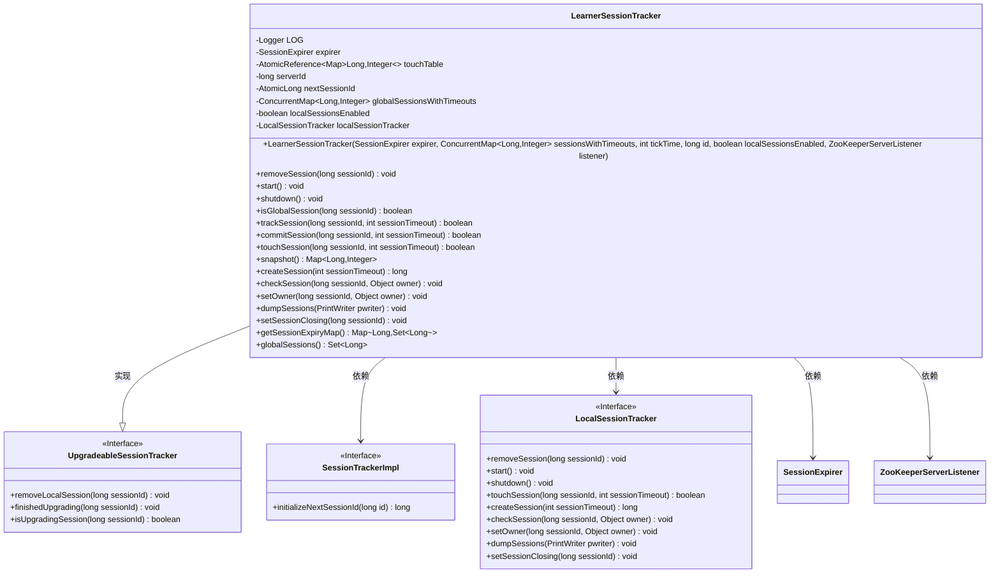

# 基础信息

|      |      |
|------|------|
| 名称 | LearnerSessionTracker |
| 编码语言 | .java |
| 代码路径 | zookeeper/zookeeper-server/src/main/java/org/apache/zookeeper/server/quorum/LearnerSessionTracker.java |
| 包名 | org.apache.zookeeper.server.quorum |
| 依赖项 | ['java.io.PrintWriter', 'java.util.HashMap', 'java.util.Map', 'java.util.Set', 'java.util.SortedSet', 'java.util.TreeSet', 'java.util.concurrent.ConcurrentHashMap', 'java.util.concurrent.ConcurrentMap', 'java.util.concurrent.atomic.AtomicLong', 'java.util.concurrent.atomic.AtomicReference', 'org.apache.zookeeper.KeeperException.SessionExpiredException', 'org.apache.zookeeper.KeeperException.SessionMovedException', 'org.apache.zookeeper.KeeperException.UnknownSessionException', 'org.apache.zookeeper.server.SessionTrackerImpl', 'org.apache.zookeeper.server.ZooKeeperServerListener', 'org.slf4j.Logger', 'org.slf4j.LoggerFactory'] |
| 概述说明 | LearnerSessionTracker类继承UpgradeableSessionTracker，管理本地和全局会话，支持会话创建、移除、触摸及状态检查，确保会话一致性并处理竞态条件。 |

# 说明

LearnerSessionTracker是ZooKeeper中用于跟踪会话的类，继承自UpgradeableSessionTracker。它管理全局会话和本地会话（若启用），包含会话超时处理、会话创建、移除、触摸等核心功能。通过touchTable记录会话活动，支持会话提交、检查、所有权设置等操作。该类还处理会话升级过程中的竞态条件，确保全局和本地会话的一致性，并提供会话状态转储和过期管理功能。

# 类列表 Class Summary

| 名称   | 类型  | 说明 |
|-------|------|-------------|
| LearnerSessionTracker | class | LearnerSessionTracker类用于跟踪会话，支持本地和全局会话管理，包含会话创建、移除、触摸和检查等功能，确保会话状态同步和一致性。 |

## 类 LearnerSessionTracker

|      |      |
|------|------|
| 访问范围 | public |
| 类型 | class |
| 名称 | LearnerSessionTracker |
| 说明 | LearnerSessionTracker类用于跟踪会话，支持本地和全局会话管理，包含会话创建、移除、触摸和检查等功能，确保会话状态同步和一致性。 |

### UML类图

这段代码描述了一个分布式系统中的会话跟踪器实现，主要用于管理全局和本地会话的生命周期。LearnerSessionTracker继承自UpgradeableSessionTracker接口，负责处理会话的创建、移除、超时检测和状态同步等核心功能。它通过ConcurrentMap维护全局会话超时表，使用AtomicReference保证线程安全，并支持本地会话跟踪器的动态创建。该设计体现了分布式会话管理的典型模式，包括会话升级机制、线程安全控制和主从节点协同工作等关键特性。

### 内部方法调用关系图

```mermaid
graph TD
    A["类LearnerSessionTracker"]
    B["属性: Logger LOG"]
    C["属性: SessionExpirer expirer"]
    D["属性: AtomicReference<Map<Long, Integer>> touchTable"]
    E["属性: long serverId"]
    F["属性: AtomicLong nextSessionId"]
    G["属性: ConcurrentMap<Long, Integer> globalSessionsWithTimeouts"]
    H["构造方法: LearnerSessionTracker"]
    I["方法: removeSession"]
    J["方法: start"]
    K["方法: shutdown"]
    L["方法: isGlobalSession"]
    M["方法: trackSession"]
    N["方法: commitSession"]
    O["方法: touchSession"]
    P["方法: snapshot"]
    Q["方法: createSession"]
    R["方法: checkSession"]
    S["方法: setOwner"]
    T["方法: dumpSessions"]
    U["方法: setSessionClosing"]
    V["方法: getSessionExpiryMap"]
    W["方法: globalSessions"]

    A --> B
    A --> C
    A --> D
    A --> E
    A --> F
    A --> G
    A --> H
    A --> I
    A --> J
    A --> K
    A --> L
    A --> M
    A --> N
    A --> O
    A --> P
    A --> Q
    A --> R
    A --> S
    A --> T
    A --> U
    A --> V
    A --> W
```

这段代码定义了一个`LearnerSessionTracker`类，用于跟踪和管理会话。该类继承自`UpgradeableSessionTracker`，包含多个属性和方法，用于处理会话的创建、移除、检查、触摸等操作。流程图展示了类的结构，包括属性、构造方法和各个方法的调用关系。该类主要用于分布式系统中会话的管理，支持本地和全局会话的跟踪，并提供了会话超时和关闭的功能。

### 字段列表 Field List

| 名称  | 类型  | 说明 |
|-------|-------|------|
| expirer | SessionExpirer | 私有不可变的会话过期器实例。 |
| serverId | long | 私有长整型变量serverId，用于存储服务器ID。 |
| LOG = LoggerFactory.getLogger(LearnerSessionTracker.class) | Logger | 声明一个私有静态常量日志记录器LOG，用于LearnerSessionTracker类的日志输出。 |
| globalSessionsWithTimeouts | ConcurrentMap<Long, Integer> | 私有并发映射，键为长整型，值为整型，存储全局会话及超时信息。 |
| nextSessionId = new AtomicLong() | AtomicLong | 私有原子长整型变量nextSessionId，用于生成唯一会话ID。 |
| touchTable = new AtomicReference<>() | AtomicReference<Map<Long, Integer>> | 私有原子引用变量touchTable，存储Long到Integer的映射，确保线程安全。 |

### 方法列表 Method List

| 名称  | 类型  | 说明 |
|-------|-------|------|
| shutdown | void | 方法shutdown()检查localSessionTracker非空后调用其shutdown()方法。 |
| start | void | 方法start检查localSessionTracker非空后调用其start方法。 |
| snapshot | Map<Long, Integer> | 方法`snapshot()`返回并重置线程安全的`touchTable`为新的空`ConcurrentHashMap`。 |
| getSessionExpiryMap | Map<Long, Set<Long>> | 重写方法返回空HashMap，键值类型为Long和Set<Long>。 |
| checkSession | void | 检查会话有效性，若本地会话存在则验证，否则检查是否为全局会话，非全局会话抛出过期异常。 |
| removeSession | void | 移除指定会话ID的相关数据，包括本地会话跟踪器、全局会话超时记录和触摸表中的对应条目。 |
| commitSession | boolean | 同步方法commitSession提交会话，将sessionId和sessionTimeout存入全局会话表，返回是否新增。若新增则记录日志。若启用本地会话，移除对应本地会话并标记升级完成。最后更新会话超时表。 |
| dumpSessions | void | 该方法用于输出会话信息，先检查并打印本地会话，再统计并打印全局会话数量及每个会话ID和超时时间（以毫秒为单位）。 |
| trackSession | boolean | 方法不跟踪全局会话，直接返回false。 |
| setSessionClosing | void | 方法`setSessionClosing`用于设置会话关闭状态，仅当`localSessionTracker`非空时对指定`sessionId`执行操作，否则无操作。适用于全局和本地会话场景。 |
| createSession | long | 方法根据localSessionsEnabled决定创建会话方式：若启用则调用localSessionTracker创建带超时的会话，否则返回自增ID。 |
| touchSession | boolean | 该方法用于更新会话有效期。若本地会话启用且存在，返回true；若非全局或升级会话且本地不存在，返回false；否则更新会话超时表并返回true。 |
| isGlobalSession | boolean | 检查sessionId是否存在于globalSessionsWithTimeouts中，存在返回true，否则false。 |
| setOwner | void | 该方法设置会话所有者，若本地会话跟踪器存在则尝试设置，全局会话异常可忽略，非全局会话则重新抛出异常。避免会话升级竞争条件。 |
| globalSessions | Set<Long> | 该方法返回全局会话ID集合，直接获取键集。 |

