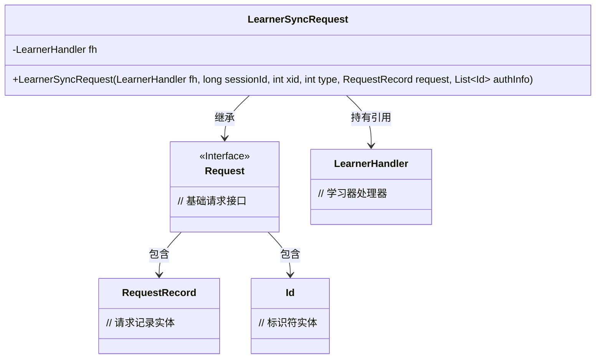
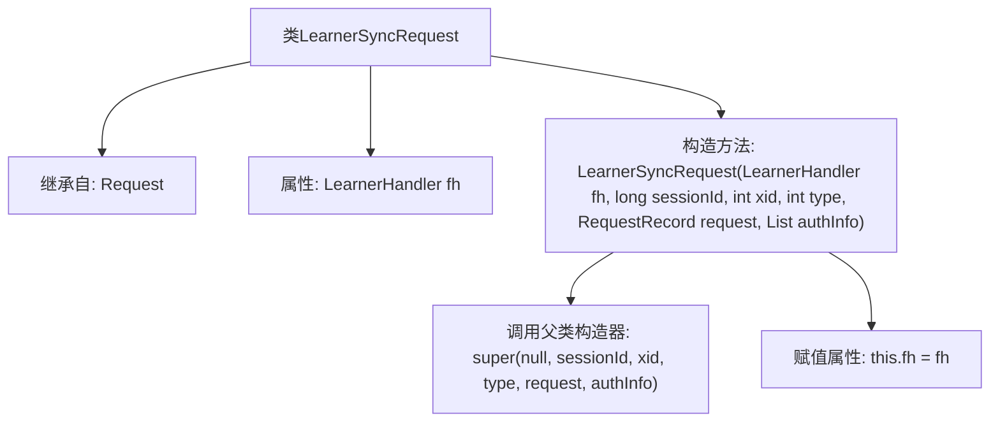

# 基础信息

|      |      |
|------|------|
| 名称 | LearnerSyncRequest |
| 编码语言 | .java |
| 代码路径 | zookeeper/zookeeper-server/src/main/java/org/apache/zookeeper/server/quorum/LearnerSyncRequest.java |
| 包名 | org.apache.zookeeper.server.quorum |
| 依赖项 | ['java.util.List', 'org.apache.zookeeper.data.Id', 'org.apache.zookeeper.server.Request', 'org.apache.zookeeper.server.RequestRecord'] |
| 概述说明 | LearnerSyncRequest类继承Request，包含LearnerHandler和父类参数，用于同步学习请求。 |

# 说明

LearnerSyncRequest类继承自Request类，用于处理学习者的同步请求。该类包含一个LearnerHandler类型的成员变量fh，通过构造函数初始化。构造函数接收LearnerHandler实例、会话ID、事务ID、请求类型、请求记录和认证信息列表作为参数，并调用父类Request的构造函数进行初始化。该类主要用于封装与学习者同步相关的请求数据。

# 类列表 Class Summary

| 名称   | 类型  | 说明 |
|-------|------|-------------|
| LearnerSyncRequest | class | LearnerSyncRequest类继承Request，包含LearnerHandler fh属性，通过构造函数初始化父类参数并设置fh。 |

## 类 LearnerSyncRequest

|      |      |
|------|------|
| 访问范围 | public |
| 类型 | class |
| 名称 | LearnerSyncRequest |
| 说明 | LearnerSyncRequest类继承Request，包含LearnerHandler fh属性，通过构造函数初始化父类参数并设置fh。 |

### UML类图

这段类图描述了ZooKeeper中LearnerSyncRequest类的结构，该类继承自Request接口并持有LearnerHandler引用。LearnerSyncRequest通过构造函数接收会话ID、事务ID等参数，用于在分布式一致性协议中同步学习器状态。Request接口关联RequestRecord和Id类，分别表示请求数据和认证信息。整体结构体现了请求处理的层级关系和依赖。

### 内部方法调用关系图

这段流程图描述了LearnerSyncRequest类的结构及其构造方法的执行流程。该类继承自Request基类，包含一个LearnerHandler类型的属性fh。构造方法接收多个参数，首先调用父类Request的构造器初始化基类属性，随后将传入的LearnerHandler参数赋值给实例变量fh。整个流程展示了从类定义到属性初始化的完整生命周期，重点突出了继承关系和构造方法中的关键操作步骤。

### 字段列表 Field List

| 名称  | 类型  | 说明 |
|-------|-------|------|
| fh | LearnerHandler | 声明一个名为fh的LearnerHandler类型变量。 |

### 方法列表 Method List

| 名称  | 类型  | 说明 |
|-------|-------|------|

