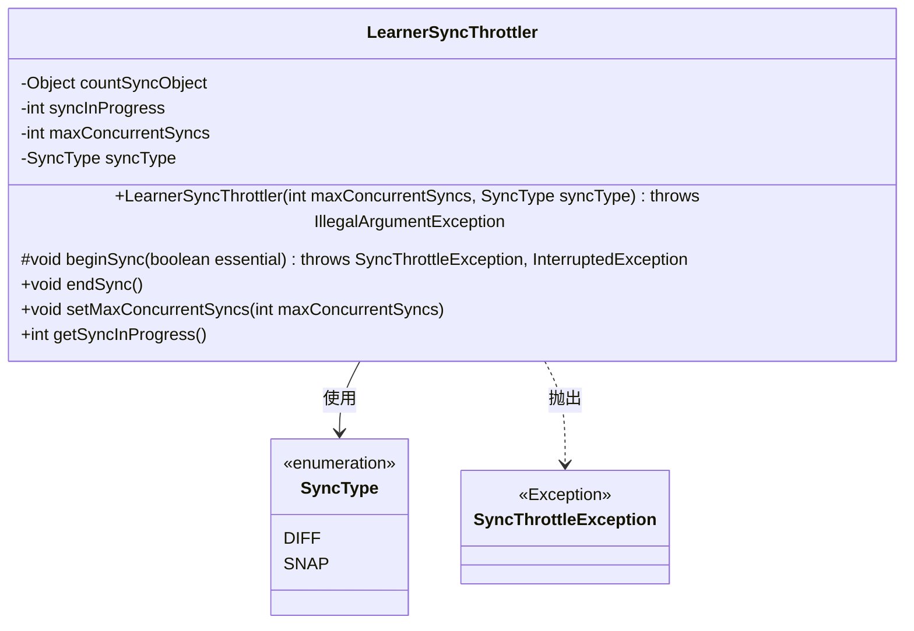
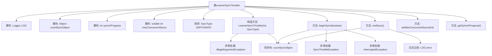

# 基础信息

|      |      |
|------|------|
| 名称 | LearnerSyncThrottler |
| 编码语言 | .java |
| 代码路径 | zookeeper/zookeeper-server/src/main/java/org/apache/zookeeper/server/quorum/LearnerSyncThrottler.java |
| 包名 | org.apache.zookeeper.server.quorum |
| 依赖项 | ['org.slf4j.Logger', 'org.slf4j.LoggerFactory'] |
| 概述说明 | LearnerSyncThrottler类用于限制并发同步操作数量，支持DIFF和SNAP两种同步类型，提供开始、结束同步及并发数设置功能。 |

# 说明

LearnerSyncThrottler是一个用于限制并发同步操作的类，通过maxConcurrentSyncs参数控制最大并发数。它支持两种同步类型：DIFF（事务差异同步）和SNAP（快照同步）。构造函数会校验maxConcurrentSyncs必须大于0，否则抛出异常。beginSync方法用于开始同步，若超过并发限制且非必要操作会抛出SyncThrottleException。endSync方法标记同步完成并减少计数，若计数异常会记录错误日志。类还提供了设置最大并发数和获取当前同步数的方法，所有操作均通过countSyncObject对象保证线程安全。

# 类列表 Class Summary

| 名称   | 类型  | 说明 |
|-------|------|-------------|
| LearnerSyncThrottler | class | LearnerSyncThrottler类用于限制并发同步操作数量，支持DIFF和SNAP两种同步类型，提供开始/结束同步方法及并发数控制功能。 |

## 类 LearnerSyncThrottler

|      |      |
|------|------|
| 访问范围 | public |
| 类型 | class |
| 名称 | LearnerSyncThrottler |
| 说明 | LearnerSyncThrottler类用于限制并发同步操作数量，支持DIFF和SNAP两种同步类型，提供开始/结束同步方法及并发数控制功能。 |

### UML类图

类图描述：
LearnerSyncThrottler是一个用于限制并发同步操作数量的控制器类，包含私有同步对象countSyncObject、当前进行中的同步计数syncInProgress和最大并发数maxConcurrentSyncs。它通过枚举SyncType区分同步类型(DIFF/SNAP)，当超出限制时会抛出SyncThrottleException。主要提供beginSync()开始同步、endSync()结束同步的方法，以及设置最大并发数和获取当前同步数的方法。

### 内部方法调用关系图

该流程图展示了LearnerSyncThrottler类的核心结构和行为。该类通过同步机制控制并发同步操作的数量，主要包含构造方法、开始同步(beginSync)、结束同步(endSync)等方法。关键点包括：使用countSyncObject进行线程安全控制，通过syncInProgress计数器跟踪进行中的同步操作，maxConcurrentSyncs限制最大并发数，以及完善的异常处理机制。日志系统用于记录错误情况，枚举类型区分同步类型(DIFF/SNAP)。整个设计体现了对并发控制和资源限制的精细管理。

### 字段列表 Field List

| 名称  | 类型  | 说明 |
|-------|-------|------|
| countSyncObject = new Object() | Object | 私有同步对象用于线程安全计数控制。 |
| syncInProgress | int | 私有整型变量syncInProgress，用于标记同步状态。 |
| maxConcurrentSyncs | int | 私有易变整型变量maxConcurrentSyncs，用于控制最大并发同步数。 |
| syncType | SyncType | 私有同步类型变量syncType。 |
| LOG = LoggerFactory.getLogger(LearnerSyncThrottler.class) | Logger | 声明一个私有静态不可变日志对象LOG，用于LearnerSyncThrottler类的日志记录。 |

### 方法列表 Method List

| 名称  | 类型  | 说明 |
|-------|-------|------|
| getSyncInProgress | int | 这是一个Java方法，返回整型变量syncInProgress的值。 |
| endSync | void | 
方法endSync()减少syncInProgress计数并通知等待线程，若计数小于0则记录错误。使用同步块确保线程安全。 |
| setMaxConcurrentSyncs | void | 设置最大并发同步数的方法，参数为maxConcurrentSyncs。 |
| beginSync | void | 同步方法beginSync控制并发同步数量，若非必需或已达上限则抛出异常，否则增加计数。 |

