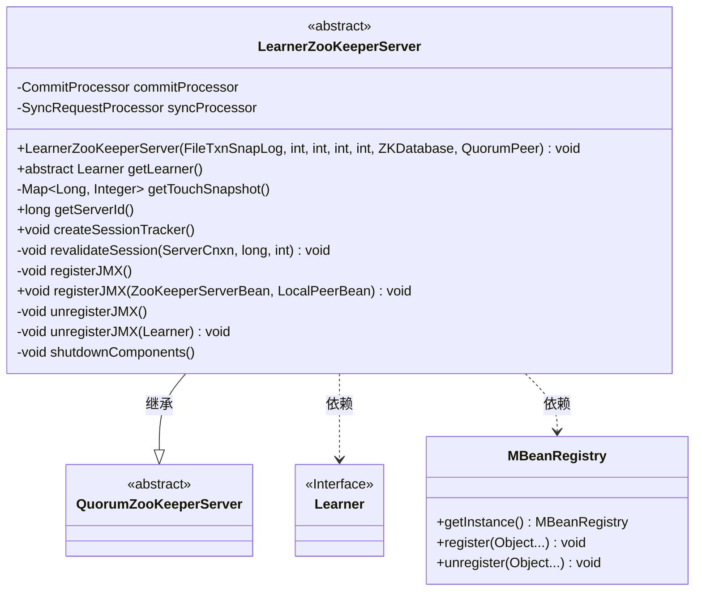
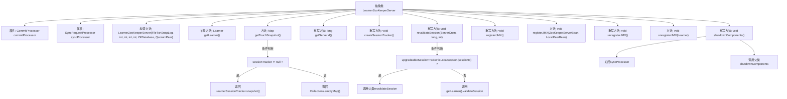

# 基础信息

|      |      |
|------|------|
| 名称 | LearnerZooKeeperServer |
| 编码语言 | .java |
| 代码路径 | zookeeper/zookeeper-server/src/main/java/org/apache/zookeeper/server/quorum/LearnerZooKeeperServer.java |
| 包名 | org.apache.zookeeper.server.quorum |
| 依赖项 | ['java.io.IOException', 'java.util.Collections', 'java.util.Map', 'org.apache.zookeeper.jmx.MBeanRegistry', 'org.apache.zookeeper.server.DataTreeBean', 'org.apache.zookeeper.server.ServerCnxn', 'org.apache.zookeeper.server.SyncRequestProcessor', 'org.apache.zookeeper.server.ZKDatabase', 'org.apache.zookeeper.server.ZooKeeperServerBean', 'org.apache.zookeeper.server.persistence.FileTxnSnapLog'] |
| 概述说明 | LearnerZooKeeperServer是QuorumZooKeeperServer的抽象子类，用于处理学习者节点的会话跟踪、JMX注册和请求处理。包含会话快照获取、服务器ID获取、会话验证和组件关闭等功能。 |

# 说明

LearnerZooKeeperServer是QuorumZooKeeperServer的抽象子类，主要用于处理ZooKeeper学习者的服务器逻辑。它包含CommitProcessor和SyncRequestProcessor等关键组件，并提供了会话跟踪、JMX注册与注销、组件关闭等功能。该类要求子类实现getLearner方法以获取关联的学习者实例，支持会话验证和状态管理，并能通过getServerId获取唯一标识。此外，它还处理JMX监控的注册与清理，确保系统资源的正确释放。

# 类列表 Class Summary

| 名称   | 类型  | 说明 |
|-------|------|-------------|
| LearnerZooKeeperServer | class | LearnerZooKeeperServer是QuorumZooKeeperServer的抽象子类，用于ZooKeeper学习者服务器实现。主要功能包括：管理请求处理器（CommitProcessor、SyncRequestProcessor）、会话跟踪（LearnerSessionTracker）、JMX注册与注销、以及服务器组件关闭。提供抽象方法getLearner()获取关联学习者实例，支持会话验证与状态快照。继承自QuorumPeer的服务器ID作为唯一标识。 |

## 类 LearnerZooKeeperServer

|      |      |
|------|------|
| 访问范围 | public abstract |
| 类型 | class |
| 名称 | LearnerZooKeeperServer |
| 说明 | LearnerZooKeeperServer是QuorumZooKeeperServer的抽象子类，用于ZooKeeper学习者服务器实现。主要功能包括：管理请求处理器（CommitProcessor、SyncRequestProcessor）、会话跟踪（LearnerSessionTracker）、JMX注册与注销、以及服务器组件关闭。提供抽象方法getLearner()获取关联学习者实例，支持会话验证与状态快照。继承自QuorumPeer的服务器ID作为唯一标识。 |

### UML类图

这段代码展示了一个抽象类`LearnerZooKeeperServer`，它继承自`QuorumZooKeeperServer`并实现了ZooKeeper服务器的学习者角色功能。该类包含请求处理器、会话跟踪器管理、JMX注册/注销等核心功能，通过抽象方法`getLearner()`强制子类提供学习者实例。类图中清晰地体现了继承关系（QuorumZooKeeperServer）、接口依赖（Learner）和工具类依赖（MBeanRegistry）的层级结构，反映了ZooKeeper集群中学习者节点的核心职责和组件交互。

### 内部方法调用关系图

该流程图展示了ZooKeeper中LearnerZooKeeperServer抽象类的核心结构和关键方法调用关系。类继承自QuorumZooKeeperServer，主要处理学习者服务器的特有逻辑，包括会话跟踪、JMX注册/注销、组件关闭等操作。特别值得注意的是条件分支处理，如会话验证时区分本地会话和远程会话的不同处理路径，以及JMX管理时的异常捕获机制。类通过抽象方法强制子类实现学习者获取逻辑，体现了模板方法设计模式的应用。

### 字段列表 Field List

| 名称  | 类型  | 说明 |
|-------|-------|------|
| commitProcessor | CommitProcessor | 声明一个受保护的CommitProcessor类型变量commitProcessor。 |
| syncProcessor | SyncRequestProcessor | 声明一个受保护的同步请求处理器实例syncProcessor。 |

### 方法列表 Method List

| 名称  | 类型  | 说明 |
|-------|-------|------|
| getLearner | Learner | 抽象方法getLearner，返回Learner类型对象。 |
| registerJMX | void | 该方法用于注册JMX监控，先取消已有注册，再尝试注册新的ZooKeeper服务器和本地节点Bean。失败时记录警告并置空相关变量。 |
| revalidateSession | void | 方法重写，检查会话ID是否本地存在，是则调用父类方法，否则通过Learner验证会话。 |
| getServerId | long | 重写getServerId方法，直接返回self.getMyId()的结果。 |
| registerJMX | void | 代码重写registerJMX方法，尝试注册JMX数据树Bean，失败时记录警告并置空。 |
| getTouchSnapshot | Map<Long, Integer> | 方法getTouchSnapshot返回触摸快照。若sessionTracker非空，返回其快照；否则返回空映射。 |
| unregisterJMX | void | 方法unregisterJMX用于从JMX注销jmxDataTreeBean，失败时记录警告日志并置空该bean。 |
| unregisterJMX | void | 方法unregisterJMX用于从JMX注销Learner节点，处理异常并清空jmxServerBean。 |
| shutdownComponents | void | 覆盖方法shutdownComponents，先关闭syncProcessor并忽略异常，再调用父类方法并忽略异常。 |
| createSessionTracker | void | 重写方法创建会话跟踪器，初始化LearnerSessionTracker实例，参数包括当前对象、ZK数据库会话超时设置、tick时间、本地ID、本地会话启用状态及ZK服务器监听器。 |

