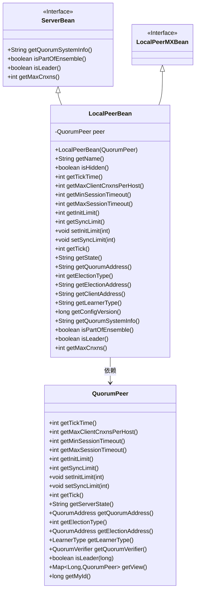

# 基础信息

|      |      |
|------|------|
| 名称 | LocalPeerBean |
| 编码语言 | .java |
| 代码路径 | zookeeper/zookeeper-server/src/main/java/org/apache/zookeeper/server/quorum/LocalPeerBean.java |
| 包名 | org.apache.zookeeper.server.quorum |
| 依赖项 | ['org.apache.zookeeper.common.NetUtils.formatInetAddr', 'java.util.stream.Collectors', 'org.apache.zookeeper.common.NetUtils', 'org.apache.zookeeper.server.ServerCnxnHelper'] |
| 概述说明 | LocalPeerBean类扩展ServerBean，实现LocalPeerMXBean接口，封装QuorumPeer功能，提供名称、状态、超时设置、选举地址等集群管理信息。 |

# 说明

LocalPeerBean类继承ServerBean并实现LocalPeerMXBean接口，用于管理QuorumPeer实例。它提供了一系列方法获取和设置节点配置信息，包括名称、隐藏状态、心跳间隔、客户端连接限制、会话超时范围、初始化与同步限制、当前状态、选举类型、地址信息（仲裁、选举、客户端）、学习者类型、配置版本等。此外，它还支持检查节点是否在集群中、是否为领导者，并获取最大连接数。所有方法均通过内部QuorumPeer实例实现功能调用。

# 类列表 Class Summary

| 名称   | 类型  | 说明 |
|-------|------|-------------|
| LocalPeerBean | class | LocalPeerBean类扩展ServerBean，实现LocalPeerMXBean接口，封装QuorumPeer功能，提供节点名称、状态、超时设置、选举地址等集群管理信息。 |

## 类 LocalPeerBean

|      |      |
|------|------|
| 访问范围 | public |
| 类型 | class |
| 名称 | LocalPeerBean |
| 说明 | LocalPeerBean类扩展ServerBean，实现LocalPeerMXBean接口，封装QuorumPeer功能，提供节点名称、状态、超时设置、选举地址等集群管理信息。 |

### UML类图

该类图展示了LocalPeerBean作为ServerBean和LocalPeerMXBean接口的实现类，通过聚合QuorumPeer对象来提供ZooKeeper集群节点的管理功能。LocalPeerBean封装了QuorumPeer的核心方法，提供节点状态查询、配置管理、选举信息等JMX监控接口，实现了从MXBean接口到QuorumPeer实际操作的转换层。图中清晰呈现了接口继承、类依赖关系以及主要方法的结构化设计。

### 内部方法调用关系图

这段代码定义了一个名为`LocalPeerBean`的类，该类继承自`ServerBean`并实现了`LocalPeerMXBean`接口。它主要用于管理ZooKeeper集群中本地对等节点的配置和状态信息，包括会话超时、选举类型、地址信息等。通过封装`QuorumPeer`对象，提供了丰富的getter和setter方法来访问和修改这些配置。类中还包含多个重写方法，用于获取集群系统信息、判断节点角色等核心功能。整体设计体现了对ZooKeeper服务器状态的全面监控能力。

### 字段列表 Field List

| 名称  | 类型  | 说明 |
|-------|-------|------|
| peer | QuorumPeer | 私有成员peer，类型为QuorumPeer。 |

### 方法列表 Method List

| 名称  | 类型  | 说明 |
|-------|-------|------|
| getInitLimit | int | 获取peer的初始限制值。 |
| getElectionAddress | String | 获取选举地址方法：将peer的选举地址转为格式化字符串，多个地址用"|"分隔。 |
| getState | String | 该方法返回peer对象的服务器状态，调用peer.getServerState()获取结果。 |
| getMaxSessionTimeout | int | 方法getMaxSessionTimeout返回peer对象的最大会话超时时间。 |
| isPartOfEnsemble | boolean | 方法检查当前节点是否为集群成员，通过判断peer视图是否包含自身ID。返回布尔值结果。 |
| isLeader | boolean | 重写isLeader方法，调用peer的isLeader方法并传入当前ID判断是否为领导者。 |
| getMaxCnxns | int | 重写getMaxCnxns方法，返回peer对象中安全与非安全连接工厂的最大连接数。 |
| getQuorumSystemInfo | String | 重写getQuorumSystemInfo方法，返回peer的QuorumVerifier字符串信息。 |
| getElectionType | int | 方法getElectionType返回peer的选举类型值。 |
| getTick | int | 获取peer对象的tick值并返回。 |
| getMaxClientCnxnsPerHost | int | 获取每个主机的最大客户端连接数，返回peer对象中的对应值。 |
| getName | String | 该方法返回字符串"replica."拼接上peer对象的myId属性值。 |
| getMinSessionTimeout | int | 该方法返回最小会话超时时间，调用peer对象的getMinSessionTimeout方法获取值。 |
| getClientAddress | String | 获取客户端地址方法：检查peer.cnxnFactory非空则返回格式化本地地址，否则返回空字符串。 |
| getLearnerType | String | 该方法返回peer对象的LearnerType属性字符串形式。 |
| setSyncLimit | void | 设置同步限制参数，调用peer对象的setSyncLimit方法。 |
| getConfigVersion | long | 获取配置版本号的方法，返回peer的仲裁验证器版本。 |
| isHidden | boolean | 方法isHidden返回固定值false，表示对象非隐藏状态。 |
| getSyncLimit | int | 方法getSyncLimit返回peer对象的同步限制值。 |
| getTickTime | int | 方法getTickTime返回peer对象的tickTime值。 |
| setInitLimit | void | 设置初始限制值的方法，将参数传递给peer对象处理。 |
| getQuorumAddress | String | 该方法返回节点仲裁地址，将多个地址格式化为字符串并用"|"分隔。 |

