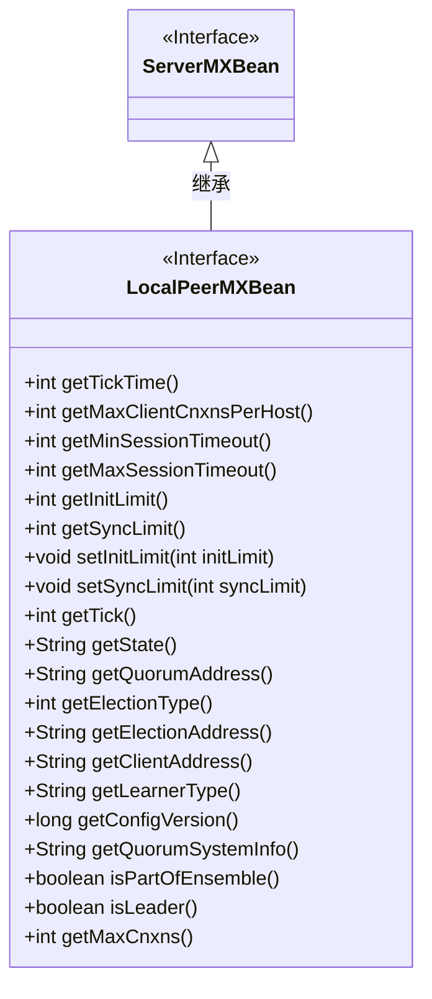

# 基础信息

|      |      |
|------|------|
| 名称 | LocalPeerMXBean |
| 编码语言 | .java |
| 代码路径 | zookeeper/zookeeper-server/src/main/java/org/apache/zookeeper/server/quorum/LocalPeerMXBean.java |
| 包名 | org.apache.zookeeper.server.quorum |
| 依赖项 | [] |
| 概述说明 | LocalPeerMXBean接口扩展ServerMXBean，提供获取和设置本地对等节点配置的方法，包括超时、同步限制、选举地址、状态等关键信息。 |

# 说明

LocalPeerMXBean接口扩展了ServerMXBean，提供了管理本地对等节点的多种方法。包括获取和设置初始同步阶段的tick数（initLimit）及请求确认间隔的tick数（syncLimit），获取每个tick的毫秒数、最大客户端连接数、会话超时范围、当前tick值、服务器状态、仲裁地址、选举类型和地址、客户端地址、学习者类型、配置版本、仲裁系统信息等。还提供检查节点是否属于集群及是否为当前领导者的方法，以及获取单个ZooKeeper服务器最大连接数的功能。

# 类列表 Class Summary

| 名称   | 类型  | 说明 |
|-------|------|-------------|
| LocalPeerMXBean | interface | LocalPeerMXBean接口扩展ServerMXBean，提供获取和设置集群配置的方法，包括会话超时、同步限制、选举地址等，并支持查询服务器状态和连接数限制。 |

## 类 LocalPeerMXBean

|      |      |
|------|------|
| 访问范围 | public |
| 类型 | interface |
| 名称 | LocalPeerMXBean |
| 说明 | LocalPeerMXBean接口扩展ServerMXBean，提供获取和设置集群配置的方法，包括会话超时、同步限制、选举地址等，并支持查询服务器状态和连接数限制。 |

### UML类图

这段类图展示了LocalPeerMXBean接口继承自ServerMXBean接口，并定义了多个与ZooKeeper服务器配置和状态相关的方法。LocalPeerMXBean提供了获取和设置各种服务器参数的能力，包括会话超时时间、同步限制、选举类型等，同时还包含查询服务器当前状态和配置版本的方法，主要用于监控和管理ZooKeeper服务器的运行状态。

### 内部方法调用关系图

```mermaid
graph TD
    A["接口LocalPeerMXBean"]
    B["继承: ServerMXBean"]
    C["方法: int getTickTime()"]
    D["方法: int getMaxClientCnxnsPerHost()"]
    E["方法: int getMinSessionTimeout()"]
    F["方法: int getMaxSessionTimeout()"]
    G["方法: int getInitLimit()"]
    H["方法: int getSyncLimit()"]
    I["方法: void setInitLimit(int initLimit)"]
    J["方法: void setSyncLimit(int syncLimit)"]
    K["方法: int getTick()"]
    L["方法: String getState()"]
    M["方法: String getQuorumAddress()"]
    N["方法: int getElectionType()"]
    O["方法: String getElectionAddress()"]
    P["方法: String getClientAddress()"]
    Q["方法: String getLearnerType()"]
    R["方法: long getConfigVersion()"]
    S["方法: String getQuorumSystemInfo()"]
    T["方法: boolean isPartOfEnsemble()"]
    U["方法: boolean isLeader()"]
    V["方法: int getMaxCnxns()"]

    A --> B
    A --> C
    A --> D
    A --> E
    A --> F
    A --> G
    A --> H
    A --> I
    A --> J
    A --> K
    A --> L
    A --> M
    A --> N
    A --> O
    A --> P
    A --> Q
    A --> R
    A --> S
    A --> T
    A --> U
    A --> V
```

该流程图展示了LocalPeerMXBean接口的结构，它继承自ServerMXBean并定义了19个方法，主要用于获取和设置ZooKeeper服务器的配置参数、状态信息和网络地址等。这些方法涵盖了从基本时间参数（如tick时间、会话超时）到集群管理功能（如选举类型、仲裁系统信息）的各个方面，为监控和管理分布式系统提供了全面的接口支持。

### 字段列表 Field List

| 名称  | 类型  | 说明 |
|-------|-------|------|

### 方法列表 Method List

| 名称  | 类型  | 说明 |
|-------|-------|------|
| getElectionAddress | String | 获取选举地址的字符串方法。 |
| getQuorumSystemInfo | String | 获取法定人数系统信息的方法，返回字符串类型数据。 |
| getState | String | 获取当前状态的方法。 |
| getConfigVersion | long | 获取配置版本号的方法。 |
| isPartOfEnsemble | boolean | 方法isPartOfEnsemble用于检查是否属于组合的一部分，返回布尔值。 |
| getMinSessionTimeout | int | 获取最小会话超时时间的方法。 |
| getMaxSessionTimeout | int | 获取最大会话超时时间。 |
| getInitLimit | int | 获取初始限制值的函数，无参数，返回整数类型。 |
| setSyncLimit | void | 设置同步限制参数syncLimit。 |
| getClientAddress | String | 获取客户端地址的方法。 |
| getTick | int | 获取当前系统滴答计数。 |
| setInitLimit | void | 设置初始限制值的方法，参数为整型initLimit。 |
| getSyncLimit | int | 获取同步限制值的方法。 |
| isLeader | boolean | 方法isLeader返回布尔值，表示是否为领导者。 |
| getElectionType | int | 获取选举类型函数，返回整型值。 |
| getQuorumAddress | String | 获取法定人数地址的方法。 |
| getLearnerType | String | 获取学习者类型的方法。 |
| getMaxCnxns | int | 获取最大连接数的方法。 |
| getMaxClientCnxnsPerHost | int | 获取每个客户端的最大连接数。 |
| getTickTime | int | 获取当前系统时间戳的函数，返回值为整数类型。 |

