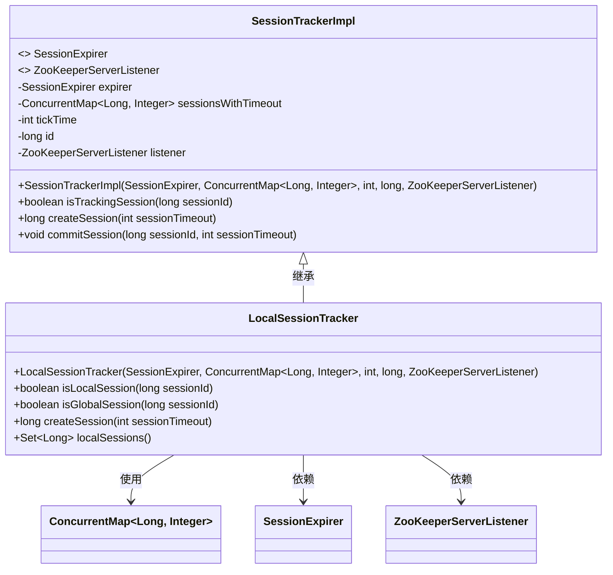
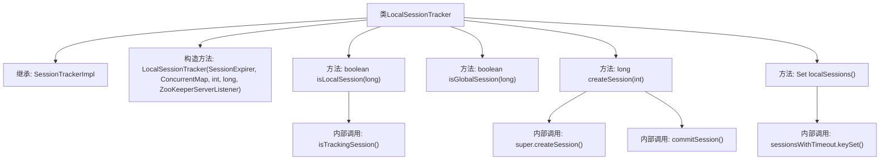

# 基础信息

|      |      |
|------|------|
| 名称 | LocalSessionTracker |
| 编码语言 | .java |
| 代码路径 | zookeeper/zookeeper-server/src/main/java/org/apache/zookeeper/server/quorum/LocalSessionTracker.java |
| 包名 | org.apache.zookeeper.server.quorum |
| 依赖项 | ['java.util.Set', 'java.util.concurrent.ConcurrentMap', 'org.apache.zookeeper.server.SessionTrackerImpl', 'org.apache.zookeeper.server.ZooKeeperServerListener'] |
| 概述说明 | LocalSessionTracker继承SessionTrackerImpl，管理本地会话，提供会话创建、查询及超时处理功能，不支持全局会话。 |

# 说明

LocalSessionTracker继承SessionTrackerImpl，用于本地会话管理。构造函数接收会话过期处理器、超时会话映射、时间间隔、ID和监听器。提供方法判断是否为本地或全局会话，创建会话并提交，以及获取所有本地会话ID集合。全局会话始终返回false。

# 类列表 Class Summary

| 名称   | 类型  | 说明 |
|-------|------|-------------|
| LocalSessionTracker | class | LocalSessionTracker类继承SessionTrackerImpl，用于管理本地会话，提供会话创建、本地/全局会话判断及获取本地会话集合功能。 |

## 类 LocalSessionTracker

|      |      |
|------|------|
| 访问范围 | public |
| 类型 | class |
| 名称 | LocalSessionTracker |
| 说明 | LocalSessionTracker类继承SessionTrackerImpl，用于管理本地会话，提供会话创建、本地/全局会话判断及获取本地会话集合功能。 |

### UML类图

该类图展示了LocalSessionTracker继承自SessionTrackerImpl的关系，其中SessionTrackerImpl包含核心会话跟踪功能，而LocalSessionTracker扩展了本地会话管理能力。LocalSessionTracker通过继承获得父类的会话管理基础能力，同时新增了本地会话判断、创建和查询方法。图中明确展示了类之间的继承关系、依赖关系以及关键接口的使用情况，反映了ZooKeeper服务器中本地会话管理的核心结构。

### 内部方法调用关系图

该流程图展示了LocalSessionTracker类的结构及其方法调用关系。该类继承自SessionTrackerImpl，包含构造方法和四个核心方法：isLocalSession通过isTrackingSession验证会话，isGlobalSession固定返回false，createSession调用父类方法并提交会话，localSessions返回会话集合。箭头清晰地反映了方法间的调用层级和数据流向，如createSession依赖于父类实现和commit操作。

### 字段列表 Field List

| 名称  | 类型  | 说明 |
|-------|-------|------|

### 方法列表 Method List

| 名称  | 类型  | 说明 |
|-------|-------|------|
| isLocalSession | boolean | 检查会话ID是否为本地会话，调用isTrackingSession方法判断。 |
| localSessions | Set<Long> | 该方法返回本地会话的ID集合，数据来自sessionsWithTimeout的键集。 |
| isGlobalSession | boolean | 方法isGlobalSession检查sessionId是否为全局会话，当前始终返回false。 |
| createSession | long | 
创建会话并提交，返回会话ID。参数为会话超时时间。 |

