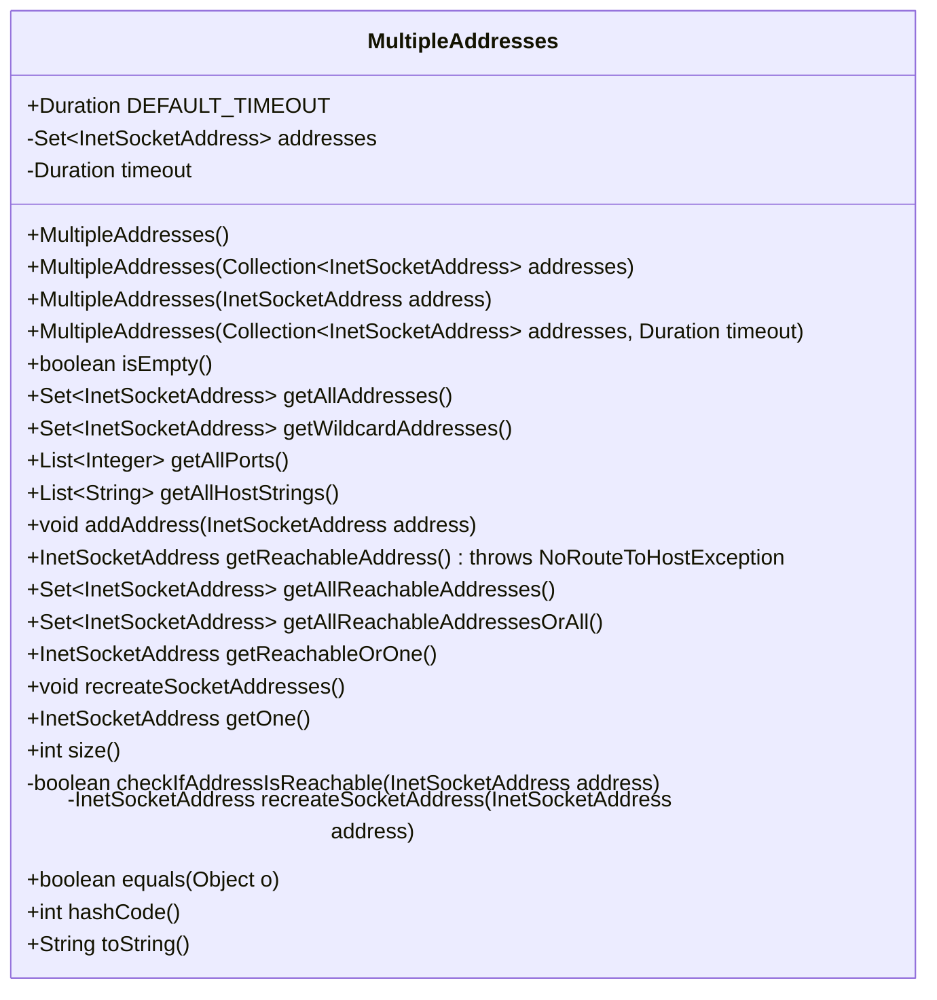

# 基础信息

|      |      |
|------|------|
| 名称 | MultipleAddresses |
| 编码语言 | .java |
| 代码路径 | zookeeper/zookeeper-server/src/main/java/org/apache/zookeeper/server/quorum/MultipleAddresses.java |
| 包名 | org.apache.zookeeper.server.quorum |
| 依赖项 | ['java.util.Arrays.asList', 'java.io.IOException', 'java.net.InetAddress', 'java.net.InetSocketAddress', 'java.net.NoRouteToHostException', 'java.net.UnknownHostException', 'java.time.Duration', 'java.util.Collection', 'java.util.Collections', 'java.util.List', 'java.util.NoSuchElementException', 'java.util.Objects', 'java.util.Set', 'java.util.concurrent.ConcurrentHashMap', 'java.util.stream.Collectors'] |
| 概述说明 | MultipleAddresses类管理多个InetSocketAddress，支持并发操作，提供地址增删查、可达性检查、DNS重解析及超时设置功能。 |

# 说明

这是一个名为MultipleAddresses的Java类，用于管理多个InetSocketAddress地址集合。主要功能包括：存储地址集合，提供默认1000毫秒超时设置；支持获取所有地址、通配符地址、所有端口和主机名；检查地址可达性并返回可达地址或任意地址；支持并行DNS查找重新创建套接字地址；包含集合操作如添加地址、判断空集、获取大小等。类内部使用并发集合保证线程安全，并重写了equals、hashCode和toString方法。

# 类列表 Class Summary

| 名称   | 类型  | 说明 |
|-------|------|-------------|
| MultipleAddresses | class | MultipleAddresses类管理多个InetSocketAddress，提供地址集合操作、可达性检查、DNS重解析等功能，默认超时1秒，线程安全。 |

## 类 MultipleAddresses

|      |      |
|------|------|
| 访问范围 | public final |
| 类型 | class |
| 名称 | MultipleAddresses |
| 说明 | MultipleAddresses类管理多个InetSocketAddress，提供地址集合操作、可达性检查、DNS重解析等功能，默认超时1秒，线程安全。 |

### UML类图

这段代码定义了一个`MultipleAddresses`类，用于管理多个`InetSocketAddress`地址集合。主要功能包括：地址集合的增删查改、地址可达性检查、DNS重新解析、获取通配符地址和端口列表等。类内部使用线程安全的`ConcurrentHashMap`存储地址，并提供了多种构造方法和查询方法。关键特性包括并行流处理网络可达性检查、异常处理机制以及地址集合的各种视图获取方法。

### 内部方法调用关系图

```mermaid
graph TD
    A["类MultipleAddresses"]
    B["常量: DEFAULT_TIMEOUT = Duration.ofMillis(1000)"]
    C["私有方法: newConcurrentHashSet()"]
    D["属性: Set<InetSocketAddress> addresses"]
    E["属性: Duration timeout"]
    F["构造方法: MultipleAddresses()"]
    G["构造方法: MultipleAddresses(Collection<InetSocketAddress>)"]
    H["构造方法: MultipleAddresses(InetSocketAddress)"]
    I["构造方法: MultipleAddresses(Collection<InetSocketAddress>, Duration)"]
    J["方法: isEmpty()"]
    K["方法: getAllAddresses()"]
    L["方法: getWildcardAddresses()"]
    M["方法: getAllPorts()"]
    N["方法: getAllHostStrings()"]
    O["方法: addAddress(InetSocketAddress)"]
    P["方法: getReachableAddress()"]
    Q["方法: getAllReachableAddresses()"]
    R["方法: getAllReachableAddressesOrAll()"]
    S["方法: getReachableOrOne()"]
    T["方法: recreateSocketAddresses()"]
    U["方法: getOne()"]
    V["方法: size()"]
    W["私有方法: checkIfAddressIsReachable(InetSocketAddress)"]
    X["私有方法: recreateSocketAddress(InetSocketAddress)"]
    Y["重写方法: equals(Object)"]
    Z["重写方法: hashCode()"]
    AA["重写方法: toString()"]

    A --> B
    A --> C
    A --> D
    A --> E
    A --> F
    A --> G
    A --> H
    A --> I
    A --> J
    A --> K
    A --> L
    A --> M
    A --> N
    A --> O
    A --> P
    A --> Q
    A --> R
    A --> S
    A --> T
    A --> U
    A --> V
    A --> W
    A --> X
    A --> Y
    A --> Z
    A --> AA
```

这段代码定义了一个名为MultipleAddresses的类，用于管理多个InetSocketAddress地址。该类提供了多种构造方法，可以初始化地址集合和超时时间。主要功能包括检查地址是否可达、获取所有地址或端口、添加新地址、重新创建套接字地址等。类中还包含了一些私有方法用于地址可达性检查和地址重建，并重写了equals、hashCode和toString方法。该类使用了并行流来提高网络操作的效率，并处理了各种边缘情况，如地址不可达或DNS查找失败。

### 字段列表 Field List

| 名称  | 类型  | 说明 |
|-------|-------|------|
| timeout | Duration | 私有不可变超时时长变量。 |
| DEFAULT_TIMEOUT = Duration.ofMillis(1000) | Duration | 定义默认超时时间为1000毫秒的静态常量。 |
| addresses | Set<InetSocketAddress> | 私有成员变量，存储InetSocketAddress类型的集合。 |

### 方法列表 Method List

| 名称  | 类型  | 说明 |
|-------|-------|------|
| recreateSocketAddress | InetSocketAddress | 方法recreateSocketAddress接收InetSocketAddress参数，尝试通过主机名和端口重建新实例，失败时返回原地址。 |
| isEmpty | boolean | 检查地址列表是否为空，返回布尔值。 |
| getOne | InetSocketAddress | 获取地址列表中的第一个地址。 |
| getAllReachableAddresses | Set<InetSocketAddress> | 该方法使用并行流筛选可达的网络地址，返回一个包含所有可达地址的集合。 |
| getWildcardAddresses | Set<InetSocketAddress> | 方法getWildcardAddresses返回一组InetSocketAddress，通过流处理将端口号映射为新对象并收集为Set。 |
| newConcurrentHashSet | Set<InetSocketAddress> | 创建一个线程安全的并发哈希集合，基于ConcurrentHashMap实现。 |
| addAddress | void | 这是一个Java方法，功能是将给定的InetSocketAddress对象添加到一个地址集合中。方法名为addAddress，接受一个参数address，无返回值。 |
| checkIfAddressIsReachable | boolean | 检查地址是否可达：若未解析返回false；尝试连接，超时内可达返回true；忽略IO异常，不可达返回false。 |
| getAllPorts | List<Integer> | 该方法返回地址列表中所有不重复的端口号列表。 |
| getReachableOrOne | InetSocketAddress | 方法getReachableOrOne返回可达的InetSocketAddress，若地址列表仅含一个则直接返回；若无法连接则返回任意一个地址。 |
| getReachableAddress | InetSocketAddress | 方法getReachableAddress并行检查地址列表，返回首个可达地址，若无则抛出NoRouteToHostException异常。 |
| getAllHostStrings | List<String> | 该方法返回地址列表中所有不重复的主机名字符串集合。 |
| equals | boolean | 重写equals方法，先检查对象是否相同或类型是否一致，再比较addresses属性是否相等。 |
| getAllAddresses | Set<InetSocketAddress> | 该方法返回一个不可修改的地址集合。 |
| getAllReachableAddressesOrAll | Set<InetSocketAddress> | 方法检查可达地址：若仅一个地址直接返回；否则返回所有可达地址，若无可达则返回全部地址。 |
| recreateSocketAddresses | void | 该方法使用并行流重新创建所有套接字地址，并将结果收集到新的并发哈希集合中。 |
| size | int | 该方法返回地址列表的大小，即元素数量。 |
| hashCode | int | 重写hashCode方法，使用Objects.hash计算addresses的哈希值。 |
| toString | String | 重写toString方法，将addresses流中的InetSocketAddress对象转为字符串并用"|"连接。 |

