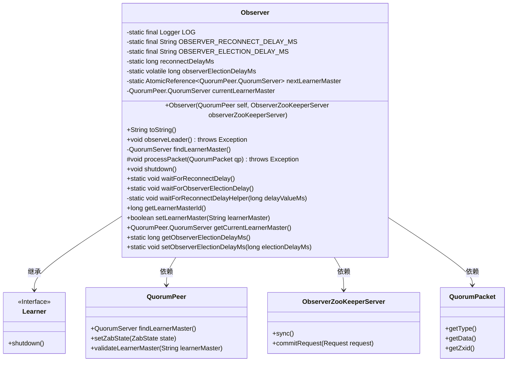

# 基础信息

|      |      |
|------|------|
| 名称 | Observer |
| 编码语言 | .java |
| 代码路径 | zookeeper/zookeeper-server/src/main/java/org/apache/zookeeper/server/quorum/Observer.java |
| 包名 | org.apache.zookeeper.server.quorum |
| 依赖项 | ['java.nio.charset.StandardCharsets.UTF_8', 'java.nio.ByteBuffer', 'java.util.concurrent.ThreadLocalRandom', 'java.util.concurrent.atomic.AtomicReference', 'org.apache.jute.Record', 'org.apache.zookeeper.common.Time', 'org.apache.zookeeper.server.ObserverBean', 'org.apache.zookeeper.server.Request', 'org.apache.zookeeper.server.ServerMetrics', 'org.apache.zookeeper.server.TxnLogEntry', 'org.apache.zookeeper.server.quorum.QuorumPeer.QuorumServer', 'org.apache.zookeeper.server.quorum.flexible.QuorumVerifier', 'org.apache.zookeeper.server.util.SerializeUtils', 'org.apache.zookeeper.txn.SetDataTxn', 'org.apache.zookeeper.txn.TxnDigest', 'org.apache.zookeeper.txn.TxnHeader', 'org.slf4j.Logger', 'org.slf4j.LoggerFactory'] |
| 概述说明 | Observer类用于ZooKeeper观察者节点，处理与领导者的连接、同步及数据包处理。包含重连延迟和选举延迟配置，支持动态切换主节点，记录同步状态和性能指标。 |

# 说明

Observer类是ZooKeeper中负责观察Leader的组件，继承自Learner类。它包含两个关键配置参数：OBSERVER_RECONNECT_DELAY_MS（默认0毫秒）控制观察者与Leader断开后重连前的随机等待时间，防止集群同时重连；OBSERVER_ELECTION_DELAY_MS（默认200毫秒）延迟观察者参与选举的时间，减轻投票节点负载。核心方法observeLeader()实现观察流程：通过findLearnerMaster()定位Leader，建立连接后同步数据，进入广播状态处理Leader发送的QuorumPacket。processPacket()方法处理不同类型的数据包，如忽略PROPOSAL/COMMIT，处理INFORM消息提交事务等。类还提供主节点切换、延迟等待、连接管理等辅助功能，并通过JMX暴露监控接口。

# 类列表 Class Summary

| 名称   | 类型  | 说明 |
|-------|------|-------------|
| Observer | class | Observer类用于观察Leader行为，包含重连延迟和选举延迟配置，处理Leader消息，支持主节点切换和同步操作。 |

## 类 Observer

|      |      |
|------|------|
| 访问范围 | public |
| 类型 | class |
| 名称 | Observer |
| 说明 | Observer类用于观察Leader行为，包含重连延迟和选举延迟配置，处理Leader消息，支持主节点切换和同步操作。 |

### UML类图

这段代码描述了一个Observer类，它继承自Learner接口，主要用于在分布式系统中观察Leader节点的状态。Observer类包含了对Leader的连接管理、数据同步、消息处理等功能，通过静态配置参数控制重连和选举延迟，并提供了对当前Learner Master的查询和设置接口。类图中清晰地展示了Observer与QuorumPeer、ObserverZooKeeperServer等关键组件的关系，体现了其在ZooKeeper集群中的观察者角色。

### 内部方法调用关系图

```mermaid
graph TD
    A["类Observer继承Learner"]
    B["静态常量: OBSERVER_RECONNECT_DELAY_MS"]
    C["静态常量: OBSERVER_ELECTION_DELAY_MS"]
    D["静态变量: reconnectDelayMs"]
    E["静态变量: observerElectionDelayMs"]
    F["静态初始化块: 加载配置参数"]
    G["原子引用: nextLearnerMaster"]
    H["实例变量: currentLearnerMaster"]
    I["构造方法: Observer(QuorumPeer, ObserverZooKeeperServer)"]
    J["方法: toString()"]
    K["核心方法: observeLeader()"]
    L["辅助方法: findLearnerMaster()"]
    M["关键方法: processPacket(QuorumPacket)"]
    N["关闭方法: shutdown()"]
    O["延迟方法: waitForReconnectDelay()"]
    P["延迟方法: waitForObserverElectionDelay()"]
    Q["工具方法: waitForReconnectDelayHelper(long)"]
    R["访问器: getLearnerMasterId()"]
    S["设置器: setLearnerMaster(String)"]
    T["访问器: getCurrentLearnerMaster()"]
    U["静态访问器: getObserverElectionDelayMs()"]
    V["静态设置器: setObserverElectionDelayMs(long)"]

    A -->|继承| Learner
    A --> B
    A --> C
    A --> D
    A --> E
    A --> F
    A --> G
    A --> H
    A --> I
    A --> J
    A --> K
    K --> L
    K --> M
    K --> N
    A --> O
    O --> Q
    A --> P
    P --> Q
    A --> R
    A --> S
    A --> T
    A --> U
    A --> V
    M -->|处理| Leader.PING
    M -->|处理| Leader.PROPOSAL
    M -->|处理| Leader.COMMIT
    M -->|处理| Leader.UPTODATE
    M -->|处理| Leader.REVALIDATE
    M -->|处理| Leader.SYNC
    M -->|处理| Leader.INFORM
    M -->|处理| Leader.INFORMANDACTIVATE
```

这段代码实现了一个ZooKeeper Observer节点，主要负责观察Leader节点的状态变化并同步数据。流程图展示了类结构关系，包括静态配置加载、核心观察逻辑（包含连接建立、状态同步、数据包处理等）、延迟控制机制和主节点切换功能。Observer通过processPacket方法处理来自Leader的7种不同类型的消息包，并在断开连接时采用随机延迟策略避免集群震荡，体现了分布式系统中观察者角色的完整实现。

### 字段列表 Field List

| 名称  | 类型  | 说明 |
|-------|-------|------|
| OBSERVER_ELECTION_DELAY_MS = "zookeeper.observer.election.DelayMs" | String | 这是一个静态常量字符串，定义了ZooKeeper中观察者选举延迟的配置项键名。 |
| nextLearnerMaster = new AtomicReference<>() | AtomicReference<QuorumPeer.QuorumServer> | 私有静态原子引用，存储下一个学习者主节点QuorumServer实例。 |
| reconnectDelayMs | long | 私有静态长整型常量reconnectDelayMs，用于重连延迟时间（毫秒）。 |
| OBSERVER_RECONNECT_DELAY_MS = "zookeeper.observer.reconnectDelayMs" | String | 该代码定义了一个静态常量字符串，用于配置ZooKeeper观察者重连延迟时间（毫秒）。 |
| currentLearnerMaster = null | QuorumPeer.QuorumServer | QuorumPeer类中的currentLearnerMaster变量，初始值为null，用于存储当前学习主节点信息。 |
| LOG = LoggerFactory.getLogger(Observer.class) | Logger | 定义Observer类的静态日志对象LOG。 |
| observerElectionDelayMs | long | 私有静态可变长整型变量，用于观察者选举延迟毫秒数。 |

### 方法列表 Method List

| 名称  | 类型  | 说明 |
|-------|-------|------|
| setObserverElectionDelayMs | void | 静态方法setObserverElectionDelayMs用于设置观察者选举延迟时间（毫秒），并记录日志。参数为electionDelayMs，赋值给类变量observerElectionDelayMs。 |
| getCurrentLearnerMaster | QuorumPeer.QuorumServer | 获取当前学习主节点的QuorumServer对象。 |
| observeLeader | void | 观察者节点连接并同步Leader状态，包括注册JMX、寻找Leader、建立连接、同步数据和处理消息包，异常时关闭连接并清理。 |
| toString | String | 重写toString方法，输出Observer加sock值和pendingRevalidationCount加pendingRevalidations大小。 |
| processPacket | void | 处理不同类型的数据包：PING直接处理；忽略PROPOSAL和COMMIT；UPTODATE报错；REVALIDATE重新验证；SYNC同步；INFORM记录并提交请求；INFORMANDACTIVATE处理重新配置请求；未知类型报警告。 |
| setLearnerMaster | boolean | 该方法用于设置学习者主节点。首先验证输入的主节点是否有效，无效则返回false。若与当前主节点相同则直接返回true，否则请求断开并重新连接到新主节点，返回true。 |
| waitForReconnectDelayHelper | void | 私有方法waitForReconnectDelayHelper用于延迟重连。若延迟参数大于0，生成随机延迟时间并休眠，被中断时记录日志。 |
| shutdown | void | 方法shutdown()记录日志"shutdown Observer"并调用父类shutdown方法。 |
| getObserverElectionDelayMs | long | 获取观察者选举延迟时间的方法，返回长整型数值observerElectionDelayMs。 |
| waitForObserverElectionDelay | void | 静态方法waitForObserverElectionDelay调用waitForReconnectDelayHelper，参数为observerElectionDelayMs。 |
| findLearnerMaster | QuorumServer | 查找并验证学习主节点，若无指定则自动选择，更新当前主节点并记录日志。 |
| getLearnerMasterId | long | 获取当前学习主节点ID，若无则返回-1。 |
| waitForReconnectDelay | void | 静态方法waitForReconnectDelay调用辅助方法waitForReconnectDelayHelper，参数为reconnectDelayMs。 |

