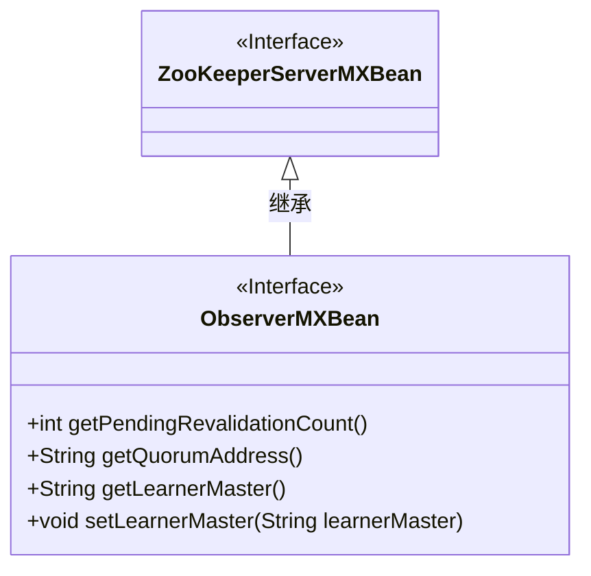
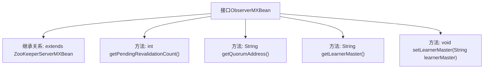

# 基础信息

|      |      |
|------|------|
| 名称 | ObserverMXBean |
| 编码语言 | .java |
| 代码路径 | zookeeper/zookeeper-server/src/main/java/org/apache/zookeeper/server/quorum/ObserverMXBean.java |
| 包名 | org.apache.zookeeper.server.quorum |
| 依赖项 | ['org.apache.zookeeper.server.ZooKeeperServerMXBean'] |
| 概述说明 | ObserverMXBean接口扩展ZooKeeperServerMXBean，提供获取待验证数、仲裁地址和主节点地址的方法，并支持设置新主节点地址。 |

# 说明

ObserverMXBean接口继承ZooKeeperServerMXBean，提供观察者节点的监控和管理功能。包含四个方法：获取待重新验证任务数量的getPendingRevalidationCount；获取仲裁地址的getQuorumAddress；获取当前学习者主节点地址的getLearnerMaster；以及设置新学习者主节点地址的setLearnerMaster方法。该接口主要用于观察者节点的状态监控和主节点切换操作。

# 类列表 Class Summary

| 名称   | 类型  | 说明 |
|-------|------|-------------|
| ObserverMXBean | interface | ObserverMXBean接口扩展ZooKeeperServerMXBean，提供获取待验证数、仲裁地址和主节点地址的方法，支持设置新主节点地址。 |

## 类 ObserverMXBean

|      |      |
|------|------|
| 访问范围 | public |
| 类型 | interface |
| 名称 | ObserverMXBean |
| 说明 | ObserverMXBean接口扩展ZooKeeperServerMXBean，提供获取待验证数、仲裁地址和主节点地址的方法，支持设置新主节点地址。 |

### UML类图

这段类图展示了ObserverMXBean接口继承自ZooKeeperServerMXBean接口的关系。ObserverMXBean定义了四个方法：获取待验证数量(getPendingRevalidationCount)、获取仲裁地址(getQuorumAddress)、获取当前学习主节点地址(getLearnerMaster)以及设置学习主节点(setLearnerMaster)。该接口主要用于监控和管理ZooKeeper观察者节点的状态信息，特别是与主节点连接相关的配置和统计信息。通过继承关系，ObserverMXBean扩展了基础ZooKeeper服务器监控功能。

### 内部方法调用关系图

该流程图展示了ObserverMXBean接口的结构及其与父接口ZooKeeperServerMXBean的继承关系。接口定义了四个核心方法：获取待验证计数、获取仲裁地址、获取当前学习主节点地址，以及设置新的学习主节点。这些方法共同构成了Observer节点的监控和管理功能，适用于分布式系统中Observer角色的状态查询和主节点切换操作。

### 字段列表 Field List

| 名称  | 类型  | 说明 |
|-------|-------|------|

### 方法列表 Method List

| 名称  | 类型  | 说明 |
|-------|-------|------|
| getQuorumAddress | String | 获取法定人数地址的方法。 |
| getPendingRevalidationCount | int | 获取待重新验证数量的函数。 |
| getLearnerMaster | String | 获取学习者掌握情况的方法。 |
| setLearnerMaster | void | 设置学习者的主控对象。 |

