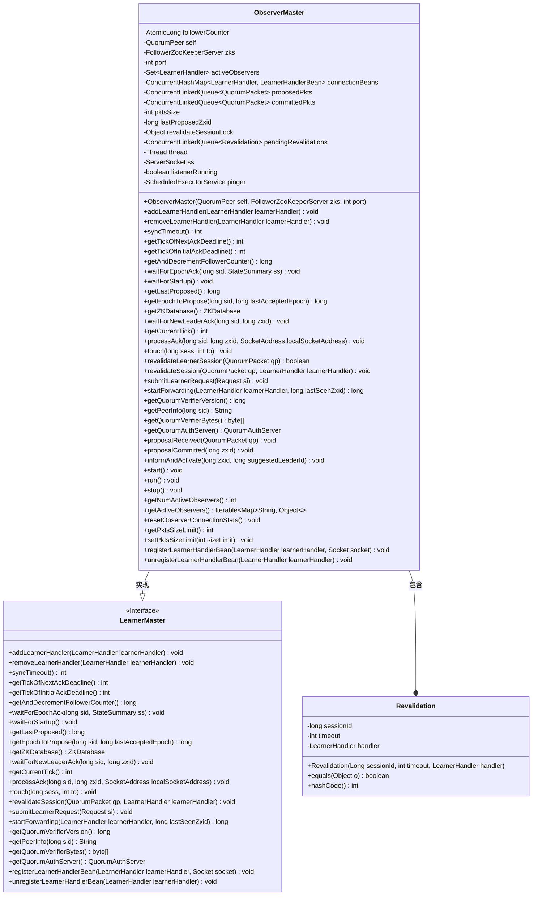

# 基础信息

|      |      |
|------|------|
| 名称 | ObserverMaster |
| 编码语言 | .java |
| 代码路径 | zookeeper/zookeeper-server/src/main/java/org/apache/zookeeper/server/quorum/ObserverMaster.java |
| 包名 | org.apache.zookeeper.server.quorum |
| 依赖项 | ['java.nio.charset.StandardCharsets.UTF_8', 'java.io.BufferedInputStream', 'java.io.ByteArrayInputStream', 'java.io.DataInputStream', 'java.io.IOException', 'java.net.InetAddress', 'java.net.ServerSocket', 'java.net.Socket', 'java.net.SocketAddress', 'java.util.ArrayList', 'java.util.Arrays', 'java.util.Collections', 'java.util.HashSet', 'java.util.Iterator', 'java.util.Map', 'java.util.Set', 'java.util.concurrent.ConcurrentHashMap', 'java.util.concurrent.ConcurrentLinkedQueue', 'java.util.concurrent.Executors', 'java.util.concurrent.ScheduledExecutorService', 'java.util.concurrent.TimeUnit', 'java.util.concurrent.atomic.AtomicLong', 'org.apache.zookeeper.jmx.MBeanRegistry', 'org.apache.zookeeper.server.Request', 'org.apache.zookeeper.server.ZKDatabase', 'org.apache.zookeeper.server.quorum.auth.QuorumAuthServer', 'org.slf4j.Logger', 'org.slf4j.LoggerFactory'] |
| 概述说明 | ObserverMaster是ZooKeeper中管理观察者节点的类，继承LearnerMaster并实现Runnable。主要功能包括处理观察者连接、同步事务包、维护会话验证队列、管理网络通信及JMX监控。通过线程和定时任务维护活跃连接，支持事务包缓存与转发，确保观察者与集群同步。 |

# 说明

ObserverMaster是ZooKeeper中管理观察者节点的核心类，继承自LearnerMaster并实现Runnable接口。它维护活跃观察者连接集合，通过原子计数器跟踪追随者数量，使用并发队列缓存提案和提交的事务包（限制内存占用为32MB）。核心功能包括处理观察者请求、会话重新验证、数据包同步转发及心跳检测。启动时会创建监听线程处理新连接，并定时发送ping包保活。提供JMX监控接口，支持动态调整缓存大小。关键操作如提案提交、激活通知均通过线程安全队列实现，确保观察者与集群状态同步。

# 类列表 Class Summary

| 名称   | 类型  | 说明 |
|-------|------|-------------|
| ObserverMaster | class | ObserverMaster是ZooKeeper中管理观察者节点的类，继承LearnerMaster并实现Runnable。主要功能包括处理观察者连接、同步事务包、维护会话验证及心跳检测。通过线程监听端口，管理活跃观察者列表，并限制事务包内存占用。支持JMX监控，提供启动、停止及状态查询方法。 |

## 类 ObserverMaster

|      |      |
|------|------|
| 访问范围 | public |
| 类型 | class |
| 名称 | ObserverMaster |
| 说明 | ObserverMaster是ZooKeeper中管理观察者节点的类，继承LearnerMaster并实现Runnable。主要功能包括处理观察者连接、同步事务包、维护会话验证及心跳检测。通过线程监听端口，管理活跃观察者列表，并限制事务包内存占用。支持JMX监控，提供启动、停止及状态查询方法。 |

### UML类图

这段类图展示了ObserverMaster类的完整结构，它实现了LearnerMaster接口并管理观察者节点的连接和通信。ObserverMaster作为ZooKeeper集群中负责处理观察者节点同步的核心组件，维护了活跃观察者集合、待处理验证会话队列以及事务包缓存队列等关键数据结构。通过定时ping机制保持连接活性，并提供事务包转发、会话验证、JMX监控等核心功能，确保观察者节点能及时同步集群状态变更。

### 内部方法调用关系图

这段代码是ZooKeeper中ObserverMaster类的实现，主要负责管理观察者（Observer）节点的连接和消息同步。类继承自LearnerMaster并实现Runnable接口，包含核心功能如处理观察者连接请求、维护事务包队列、会话验证、心跳检测等。通过ConcurrentHashMap和ConcurrentLinkedQueue实现线程安全的数据存储，使用原子计数器跟踪观察者状态。关键方法包括startForwarding()实现事务包转发、revalidateSession()处理会话续期、proposalCommitted()处理已提交提案等，整体构成ZooKeeper观察者模式的核心协调机制。

### 字段列表 Field List

| 名称  | 类型  | 说明 |
|-------|-------|------|
| port | int | 私有整型变量port，用于存储端口号。 |
| activeObservers = Collections.newSetFromMap(new ConcurrentHashMap<>()) | Set<LearnerHandler> | 并发安全的活跃观察者集合，使用ConcurrentHashMap实现线程安全。 |
| LOG = LoggerFactory.getLogger(ObserverMaster.class) | Logger | 定义ObserverMaster类的私有静态日志对象LOG。 |
| lastProposedZxid | long | 私有长整型变量，记录最后提议的事务ID。 |
| pendingRevalidations = new ConcurrentLinkedQueue<>() | ConcurrentLinkedQueue<Revalidation> | 私有并发队列，存储待重新验证对象，线程安全。 |
| listenerRunning | boolean | 私有布尔变量，标记监听器运行状态。 |
| zks | FollowerZooKeeperServer | 私有变量zks，类型为FollowerZooKeeperServer。 |
| pinger | ScheduledExecutorService | 私有定时任务执行服务pinger。 |
| pktsSize = 0 | int | 定义私有整型变量pktsSize，初始值为0。 |
| pktsSizeLimit = Integer.getInteger("zookeeper.observerMaster.sizeLimit", PKTS_SIZE_LIMIT) | int | 定义私有静态可变整型变量pktsSizeLimit，默认值为PKTS_SIZE_LIMIT，可通过系统属性zookeeper.observerMaster.sizeLimit覆盖。 |
| connectionBeans = new ConcurrentHashMap<>() | ConcurrentHashMap<LearnerHandler, LearnerHandlerBean> | 私有并发哈希映射，键值类型为LearnerHandler和LearnerHandlerBean，用于存储连接信息。 |
| followerCounter = new AtomicLong(-1) | AtomicLong | 私有原子长整型计数器followerCounter，初始值为-1。 |
| committedPkts = new ConcurrentLinkedQueue<>() | ConcurrentLinkedQueue<QuorumPacket> | 私有并发队列，存储已提交的QuorumPacket数据包。 |
| ss | ServerSocket | 声明私有ServerSocket变量ss。 |
| thread | Thread | 私有线程变量thread。 |
| proposedPkts = new ConcurrentLinkedQueue<>() | ConcurrentLinkedQueue<QuorumPacket> | 私有队列proposedPkts，存储QuorumPacket类型数据，线程安全。 |
| PKTS_SIZE_LIMIT = 32 * 1024 * 1024 | int | 定义私有静态常量PKTS_SIZE_LIMIT，值为32MB。 |
| revalidateSessionLock = new Object() | Object | 私有对象锁用于会话重新验证同步控制。 |
| ping = new Runnable() {        @Override        public void run() {            for (LearnerHandler lh : activeObservers) {                lh.ping();            }        }    } | Runnable | 创建Runnable对象ping，其run方法遍历activeObservers列表并调用每个元素的ping方法。 |
| self | QuorumPeer | 私有QuorumPeer实例变量self。 |

### 方法列表 Method List

| 名称  | 类型  | 说明 |
|-------|-------|------|
| getLastProposed | long | 同步方法返回最后提议的Zxid值。 |
| getQuorumVerifierVersion | long | Java方法重写，返回当前对象的仲裁验证器版本号。 |
| getTickOfNextAckDeadline | int | 方法返回当前时间戳加同步延迟值作为下次确认截止时间。 |
| proposalReceived | void | 方法proposalReceived接收QuorumPacket参数，将其数据封装为新QuorumPacket并加入proposedPkts集合，类型为Leader.INFORM。 |
| run | void | 服务器监听循环：获取Socket连接，设置超时并启动LearnerHandler处理请求，异常时记录日志但不中断循环，监听停止时自动关闭资源。 |
| getQuorumAuthServer | QuorumAuthServer | 重写QuorumAuthServer的getQuorumAuthServer方法，返回当前实例的authServer，若实例为空则返回null。 |
| getActiveObservers | Iterable<Map<String, Object>> | 获取活跃观察者信息的方法，返回包含观察者信息的集合。遍历activeObservers，调用getLearnerHandlerInfo获取信息并存入HashSet后返回。 |
| getTickOfInitialAckDeadline | int | 代码重写getTickOfInitialAckDeadline方法，返回当前tick值加上初始限制和同步限制的和。 |
| getAndDecrementFollowerCounter | long | 重写getAndDecrementFollowerCounter方法，使用原子操作递减followerCounter并返回原值。 |
| getCurrentTick | int | 重写方法getCurrentTick，返回self.tick的当前值。 |
| start | void | 同步启动方法，检查线程存活则返回。设置监听标志，根据配置创建安全或普通ServerSocket，启动ObserverMaster线程和定时ping任务。 |
| revalidateLearnerSession | boolean | 方法验证学习者会话：读取ID和有效性，检查待验证列表，匹配则移除并复制数据包发送给处理器，更新有效会话状态，返回验证结果。 |
| waitForStartup | void | 方法waitForStartup为空实现，因主动跟随者无需等待启动。 |
| getPeerInfo | String | 重写getPeerInfo方法，根据sid获取对应服务器信息，若不存在则返回空字符串。 |
| submitLearnerRequest | void | 重写方法submitLearnerRequest，调用zks.processObserverRequest处理请求si。 |
| waitForNewLeaderAck | void | 方法重写，无需等待新Leader确认，当前为Follower角色。 |
| informAndActivate | void | 同步方法informAndActivate处理zxid和leaderId，移除对应数据包后构建并发送INFORMANDACTIVATE包。 |
| startForwarding | long | 同步方法检查LearnerHandler的ZXID是否落后，若落后则断开连接，否则将数据包加入队列并记录同步信息，最后将其加入活跃观察者列表。 |
| addLearnerHandler | void | 重写方法addLearnerHandler，检查listenerRunning状态，未运行则抛出异常。 |
| getQuorumVerifierBytes | byte[] | 重写方法getQuorumVerifierBytes，返回最后所见QuorumVerifier的UTF-8字节数组。 |
| revalidateSession | void | 重写revalidateSession方法，处理会话重新验证请求。读取数据包中的ID和超时时间，同步添加待验证队列。若存在Learner实例，转发数据包。 |
| getEpochToPropose | long | 该方法返回当前节点的纪元值，忽略输入参数。 |
| sendPacket | void | 私有同步方法，向所有活跃观察者发送QuorumPacket数据包，并更新lastProposedZxid为数据包的zxid值。 |
| syncTimeout | int | 方法syncTimeout返回同步限制乘以时间单位的结果。 |
| processAck | void | 方法处理ACK响应：若zxid低32位为0则忽略（旧版NEWLEADER ACK），否则抛出异常（观察者不应发送ACK）。 |
| getZKDatabase | ZKDatabase | 重写getZKDatabase方法，返回zks的ZKDatabase实例。 |
| waitForEpochAck | void | 该方法为空实现，表示活跃的跟随者无需等待任何确认。 |
| removeLearnerHandler | void | 重写方法removeLearnerHandler，从activeObservers集合中移除指定learnerHandler对象。 |
| cacheCommittedPacket | void | 私有同步方法缓存已提交数据包，添加新包并更新总大小。当大小接近限制时，每添加1个包移除5个旧包。若仍超限则持续移除直至合规。空队列时重置大小。 |
| stop | void | 同步方法stop()：停止监听器，关闭pinger和ss资源，终止所有活跃的LearnerHandler。异常时打印堆栈。 |
| proposalCommitted | void | 同步方法proposalCommitted处理zxid对应提案：移除提案包，若存在则缓存并发送。 |
| getNumActiveObservers | int | 获取当前活跃观察者数量，返回activeObservers集合的大小。 |
| removeProposedPacket | QuorumPacket | 私有同步方法移除指定zxid的提案包，检查包存在且zxid匹配，否则报错或忽略。成功时返回移除的包。 |
| touch | void | 重写touch方法，调用会话追踪器的touchSession方法更新会话时间。 |
| resetObserverConnectionStats | void | 该方法重置所有活跃观察者的连接统计信息，遍历activeObservers集合并调用每个LearnerHandler实例的resetObserverConnectionStats方法。 |
| getPktsSizeLimit | int | 获取数据包大小限制的函数，返回pktsSizeLimit值。 |
| setPktsSizeLimit | void | 静态方法setPktsSizeLimit用于设置数据包大小限制，参数为整型sizeLimit。 |
| registerLearnerHandlerBean | void | 重写方法registerLearnerHandlerBean，创建LearnerHandlerBean实例并注册JMX，成功后将bean存入connectionBeans。 |
| unregisterLearnerHandlerBean | void | 移除学习者处理器Bean并取消注册。若存在则从MBeanRegistry注销。 |

