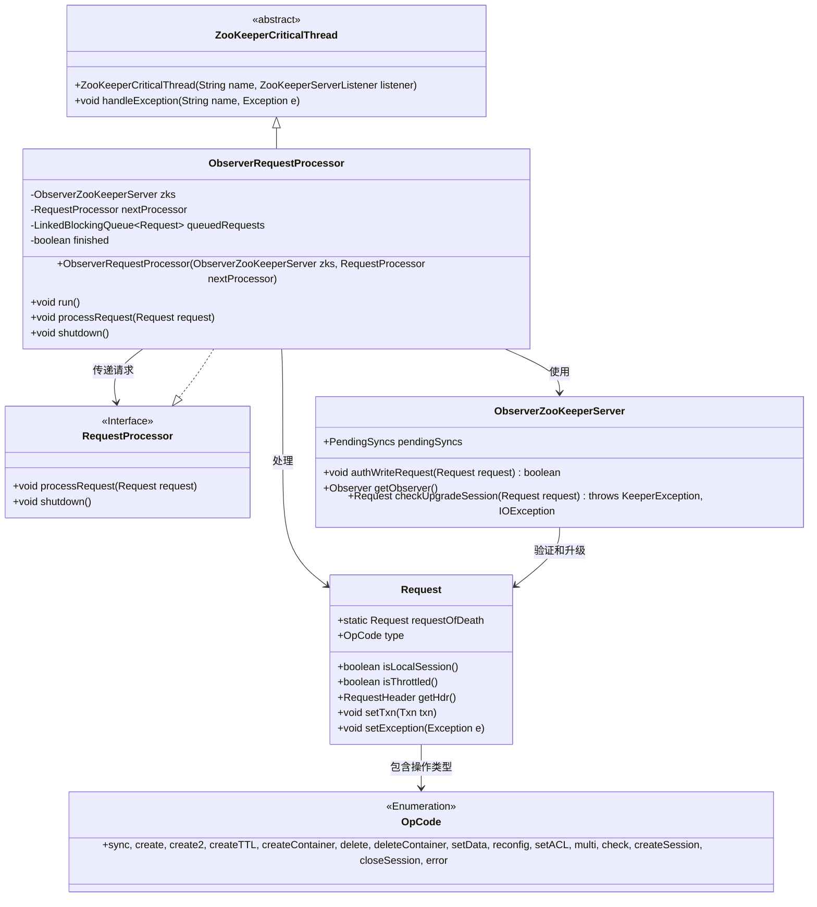
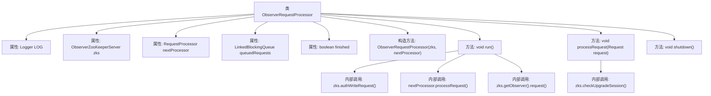

# 基础信息

|      |      |
|------|------|
| 名称 | ObserverRequestProcessor |
| 编码语言 | .java |
| 代码路径 | zookeeper/zookeeper-server/src/main/java/org/apache/zookeeper/server/quorum/ObserverRequestProcessor.java |
| 包名 | org.apache.zookeeper.server.quorum |
| 依赖项 | ['java.io.IOException', 'java.util.concurrent.LinkedBlockingQueue', 'org.apache.zookeeper.KeeperException', 'org.apache.zookeeper.ZooDefs.OpCode', 'org.apache.zookeeper.server.Request', 'org.apache.zookeeper.server.RequestProcessor', 'org.apache.zookeeper.server.ServerMetrics', 'org.apache.zookeeper.server.ZooKeeperCriticalThread', 'org.apache.zookeeper.server.ZooTrace', 'org.apache.zookeeper.txn.ErrorTxn', 'org.slf4j.Logger', 'org.slf4j.LoggerFactory'] |
| 概述说明 | ObserverRequestProcessor是ZooKeeper观察者服务器的请求处理器，继承ZooKeeperCriticalThread。它通过队列处理请求，检查ACL后转发给下一处理器或领导者，支持多种操作类型如创建、删除等，并处理会话和异常情况。 |

# 说明

ObserverRequestProcessor是ZooKeeperCriticalThread的子类，实现了RequestProcessor接口，用于处理ObserverZooKeeperServer的请求。它维护一个请求队列queuedRequests，通过run方法循环处理队列中的请求。请求处理包括ACL验证、转发给下一个处理器nextProcessor，并根据请求类型决定是否发送给Leader。支持多种操作类型如create、delete、setData等，并处理会话创建和关闭。shutdown方法用于停止处理器。异常处理和日志记录完善。

# 类列表 Class Summary

| 名称   | 类型  | 说明 |
|-------|------|-------------|
| ObserverRequestProcessor | class | ObserverRequestProcessor是ZooKeeper的观察者请求处理器，继承ZooKeeperCriticalThread并实现RequestProcessor接口。主要功能包括：通过队列处理请求，验证ACL，将请求转发给Leader，处理会话升级和关闭。包含运行循环、请求处理和关闭方法。 |

## 类 ObserverRequestProcessor

|      |      |
|------|------|
| 访问范围 | public |
| 类型 | class |
| 名称 | ObserverRequestProcessor |
| 说明 | ObserverRequestProcessor是ZooKeeper的观察者请求处理器，继承ZooKeeperCriticalThread并实现RequestProcessor接口。主要功能包括：通过队列处理请求，验证ACL，将请求转发给Leader，处理会话升级和关闭。包含运行循环、请求处理和关闭方法。 |

### UML类图

该类图展示了ObserverRequestProcessor的核心结构，它继承自ZooKeeperCriticalThread并实现了RequestProcessor接口。作为ZooKeeper观察者模式的关键组件，它通过队列处理请求，依赖ObserverZooKeeperServer进行ACL验证和会话升级，并将合法请求转发给下一个处理器。图中清晰呈现了请求处理流程中涉及的类关系，包括请求类型枚举、线程控制和服务器交互等关键元素。

### 内部方法调用关系图

该流程图展示了ObserverRequestProcessor类的核心结构和调用关系。作为ZooKeeper的观察者请求处理器，它通过队列管理请求流，包含三个主要方法：run()持续处理队列请求并进行ACL验证和类型分发，processRequest()将请求加入处理队列，shutdown()终止处理器。关键交互包括与ObserverZooKeeperServer的权限校验和请求转发，以及级联调用下一个处理器。

### 字段列表 Field List

| 名称  | 类型  | 说明 |
|-------|-------|------|
| nextProcessor | RequestProcessor | 声明一个名为nextProcessor的RequestProcessor类型变量。 |
| LOG = LoggerFactory.getLogger(ObserverRequestProcessor.class) | Logger | 定义ObserverRequestProcessor类的私有静态日志对象LOG，使用LoggerFactory创建。 |
| finished = false | boolean | 定义布尔变量finished并初始化为false。 |
| zks | ObserverZooKeeperServer | ObserverZooKeeperServer实例zks，用于监控ZooKeeper服务状态。 |
| queuedRequests = new LinkedBlockingQueue<>() | LinkedBlockingQueue<Request> | 创建线程安全的阻塞队列queuedRequests，用于存储Request对象。 |

### 方法列表 Method List

| 名称  | 类型  | 说明 |
|-------|-------|------|
| run | void | 该代码是ObserverRequestProcessor的run方法，循环处理队列请求，包括ACL验证、请求分类处理（如sync、create等操作），并转发给leader。异常时调用handleException，结束时记录日志。 |
| processRequest | void | 方法处理请求时检查会话升级，失败则记录错误并设置异常，成功则将升级请求和原请求加入队列。 |
| shutdown | void | 方法shutdown()执行关闭操作：记录日志、标记完成、清空请求队列并添加终止请求，最后调用下一处理器关闭。 |

