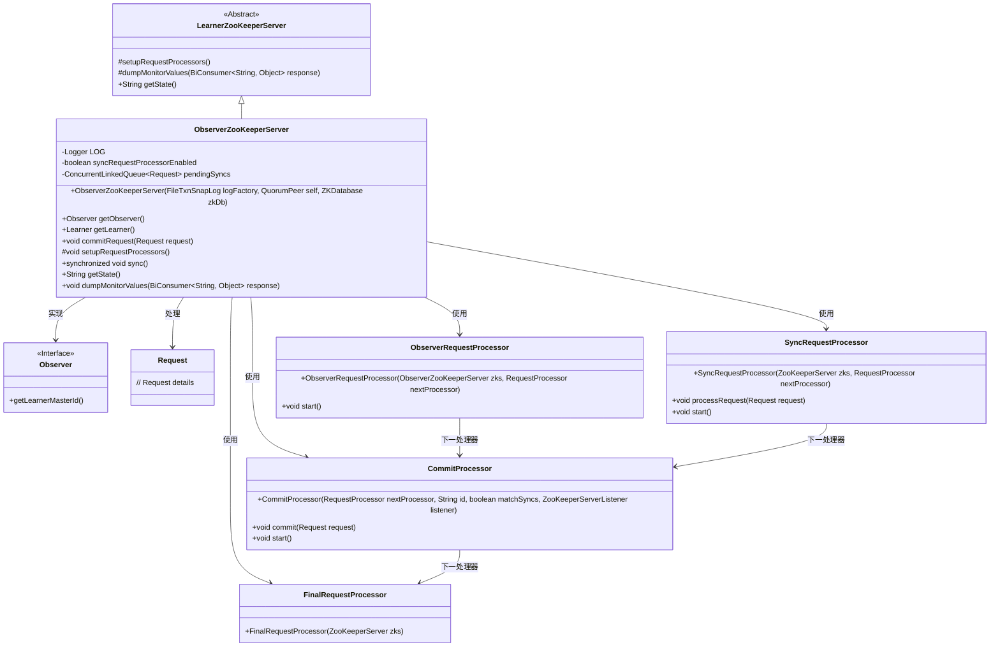
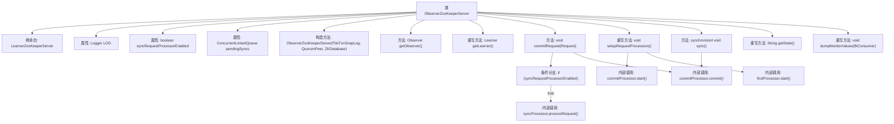

# 基础信息

|      |      |
|------|------|
| 名称 | ObserverZooKeeperServer |
| 编码语言 | .java |
| 代码路径 | zookeeper/zookeeper-server/src/main/java/org/apache/zookeeper/server/quorum/ObserverZooKeeperServer.java |
| 包名 | org.apache.zookeeper.server.quorum |
| 依赖项 | ['java.io.IOException', 'java.util.concurrent.ConcurrentLinkedQueue', 'java.util.function.BiConsumer', 'org.apache.zookeeper.server.FinalRequestProcessor', 'org.apache.zookeeper.server.Request', 'org.apache.zookeeper.server.RequestProcessor', 'org.apache.zookeeper.server.SyncRequestProcessor', 'org.apache.zookeeper.server.ZKDatabase', 'org.apache.zookeeper.server.persistence.FileTxnSnapLog', 'org.slf4j.Logger', 'org.slf4j.LoggerFactory'] |
| 概述说明 | ObserverZooKeeperServer是ZooKeeper的观察者服务器实现，继承自LearnerZooKeeperServer。主要功能包括处理来自Leader的INFORM请求、提交请求到处理器链、支持同步请求处理器写入事务日志和定期快照。观察者行为与Follower类似，但优化了请求处理流程。 |

# 说明

ObserverZooKeeperServer是ZooKeeper中观察者节点的实现类，继承自LearnerZooKeeperServer。它通过syncRequestProcessorEnabled控制是否启用同步请求处理器来写入事务日志和定期快照。构造函数初始化时记录同步启用状态。观察者通过commitRequest处理来自领导者的INFORM包请求，若启用同步则写入日志。其处理器链为firstProcessor→commitProcessor→finalProcessor，与追随者类似但可能调整行为。观察者需写入磁盘以避免请求过旧事务，但可能影响性能。sync方法处理待同步请求，getState返回节点状态为observer。dumpMonitorValues输出监控信息包含观察者主节点ID。

# 类列表 Class Summary

| 名称   | 类型  | 说明 |
|-------|------|-------------|
| ObserverZooKeeperServer | class | ObserverZooKeeperServer是ZooKeeper的观察者服务器实现，继承自LearnerZooKeeperServer。它处理来自领导者的INFORM请求，支持同步请求处理器写入事务日志和定期快照。通过setupRequestProcessors方法配置请求处理器链，包括ObserverRequestProcessor、CommitProcessor和FinalRequestProcessor。观察者行为类似于跟随者，但可能增加磁盘写入和内存需求。 |

## 类 ObserverZooKeeperServer

|      |      |
|------|------|
| 访问范围 | public |
| 类型 | class |
| 名称 | ObserverZooKeeperServer |
| 说明 | ObserverZooKeeperServer是ZooKeeper的观察者服务器实现，继承自LearnerZooKeeperServer。它处理来自领导者的INFORM请求，支持同步请求处理器写入事务日志和定期快照。通过setupRequestProcessors方法配置请求处理器链，包括ObserverRequestProcessor、CommitProcessor和FinalRequestProcessor。观察者行为类似于跟随者，但可能增加磁盘写入和内存需求。 |

### UML类图

这段类图描述了ZooKeeper中Observer服务器的核心结构。ObserverZooKeeperServer继承自LearnerZooKeeperServer，实现了Observer接口，负责处理来自Leader的INFORM请求。它包含多个请求处理器（FinalRequestProcessor、CommitProcessor等），通过责任链模式处理请求，支持可选的磁盘同步功能。类图清晰地展示了各组件间的继承、实现和使用关系，体现了Observer节点在ZooKeeper集群中的特殊角色和处理逻辑。

### 内部方法调用关系图

该流程图展示了ObserverZooKeeperServer类的完整结构，包括继承关系、关键属性和方法调用链。核心逻辑体现在请求处理流程中：构造方法初始化日志和同步标志，commitRequest()方法根据syncRequestProcessorEnabled标志决定是否写入事务日志，setupRequestProcessors()建立了firstProcessor→commitProcessor→finalProcessor的处理链。同步控制通过sync()方法处理pendingSyncs队列，整体设计遵循Observer模式与ZooKeeper的领导者-跟随者架构。

### 字段列表 Field List

| 名称  | 类型  | 说明 |
|-------|-------|------|
| LOG = LoggerFactory.getLogger(ObserverZooKeeperServer.class) | Logger | ObserverZooKeeperServer类中定义了一个私有静态日志记录器LOG，用于记录日志信息。 |
| pendingSyncs = new ConcurrentLinkedQueue<>() | ConcurrentLinkedQueue<Request> | 创建线程安全的请求队列pendingSyncs，用于并发操作。 |
| syncRequestProcessorEnabled = this.self.getSyncEnabled() | boolean | 私有布尔变量syncRequestProcessorEnabled，其值由self.getSyncEnabled()方法决定。 |

### 方法列表 Method List

| 名称  | 类型  | 说明 |
|-------|-------|------|
| getState | String | 重写getState方法，返回字符串"observer"。 |
| setupRequestProcessors | void | 方法setupRequestProcessors配置请求处理器链：FinalRequestProcessor作为最终处理器，CommitProcessor启动处理链，ObserverRequestProcessor作为首个处理器。可选启用SyncRequestProcessor进行磁盘同步，但可能影响性能。 |
| sync | void | 同步方法检查待处理队列，若为空则记录警告并返回；否则移除队列头部请求并提交处理。 |
| commitRequest | void | 该方法处理请求提交，先检查同步处理器是否启用，若启用则调用同步处理器处理请求并记录事务日志，最后调用提交处理器完成提交。 |
| getLearner | Learner | 重写getLearner方法，返回self.observer对象。 |
| getObserver | Observer | 获取观察者实例的方法，返回当前对象的observer属性。 |
| dumpMonitorValues | void | 重写dumpMonitorValues方法，调用父类方法后添加observer_master_id到响应。 |

