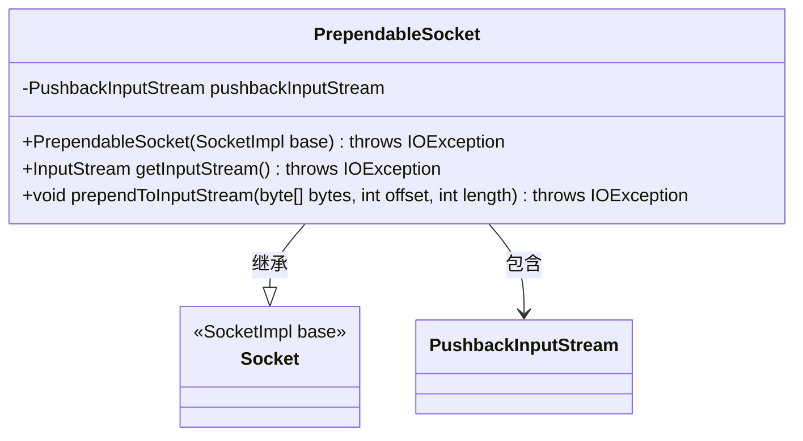
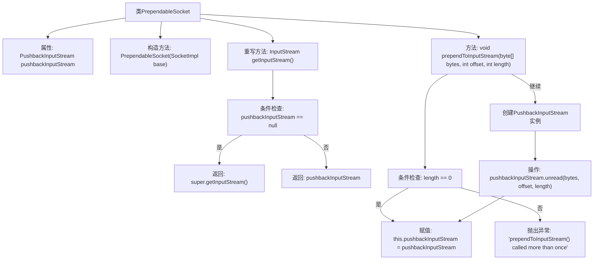

# 基础信息

|      |      |
|------|------|
| 名称 | PrependableSocket |
| 编码语言 | .java |
| 代码路径 | zookeeper/zookeeper-server/src/main/java/org/apache/zookeeper/server/quorum/PrependableSocket.java |
| 包名 | org.apache.zookeeper.server.quorum |
| 依赖项 | ['java.io.IOException', 'java.io.InputStream', 'java.io.PushbackInputStream', 'java.net.Socket', 'java.net.SocketImpl'] |
| 概述说明 | PrependableSocket扩展Socket类，允许将已读字节重新放回输入流。通过prependToInputStream方法实现，仅能调用一次且字节长度非零。使用PushbackInputStream处理字节回推。 |

# 说明

PrependableSocket类扩展了Socket，允许将已读取的字节重新放回输入流。它通过PushbackInputStream实现这一功能。构造函数接受SocketImpl参数。getInputStream方法返回原始输入流或PushbackInputStream。prependToInputStream方法将指定字节数组放回流中，只能调用一次且长度非零，否则抛出IOException。该方法会检查长度和是否重复调用，确保操作合法性。

# 类列表 Class Summary

| 名称   | 类型  | 说明 |
|-------|------|-------------|
| PrependableSocket | class | PrependableSocket扩展Socket类，允许将已读字节重新放回输入流，仅限一次操作。通过PushbackInputStream实现回退功能。 |

## 类 PrependableSocket

|      |      |
|------|------|
| 访问范围 | public |
| 类型 | class |
| 名称 | PrependableSocket |
| 说明 | PrependableSocket扩展Socket类，允许将已读字节重新放回输入流，仅限一次操作。通过PushbackInputStream实现回退功能。 |

### UML类图

这段代码展示了一个继承自Socket类的PrependableSocket类，主要用于实现将已读取的字节重新放回输入流的功能。类中包含一个私有PushbackInputStream成员变量，通过prependToInputStream方法将指定字节数组回推到输入流中，且该方法只能调用一次。getInputStream方法根据是否已回推字节决定返回原始输入流或回推后的流。该类扩展了标准Socket功能，适用于需要"回放"网络数据的特殊场景。

### 内部方法调用关系图

这段代码定义了一个`PrependableSocket`类，继承自`Socket`，主要用于在输入流前添加字节。流程图展示了类结构、方法调用和逻辑分支。构造方法初始化基础套接字，`getInputStream()`根据是否已存在`pushbackInputStream`返回不同输入流，`prependToInputStream()`方法通过创建`PushbackInputStream`实例实现字节回推功能，包含长度检查、重复调用校验等边界处理。整体设计实现了对已读字节的重新插入能力。

### 字段列表 Field List

| 名称  | 类型  | 说明 |
|-------|-------|------|
| pushbackInputStream | PushbackInputStream | 私有成员变量pushbackInputStream，类型为PushbackInputStream。 |

### 方法列表 Method List

| 名称  | 类型  | 说明 |
|-------|-------|------|
| getInputStream | InputStream | 重写getInputStream方法，检查pushbackInputStream是否为空，为空则返回父类输入流，否则返回pushbackInputStream。 |
| prependToInputStream | void | 方法prependToInputStream将字节数组插入输入流前部。若数组为空或无数据则直接返回。多次调用会抛出异常。创建PushbackInputStream并回写数据，保存引用。 |

