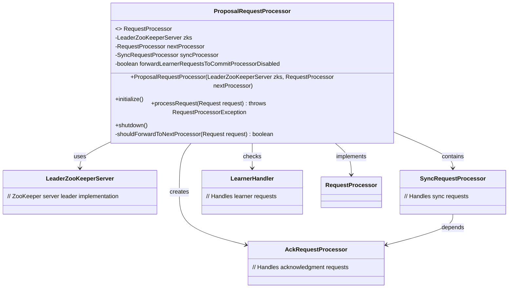
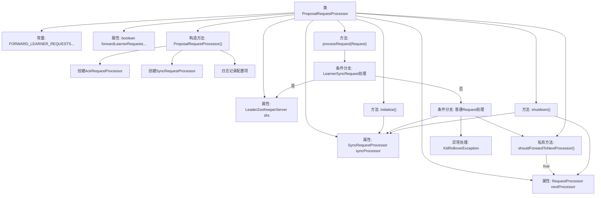

# 基础信息

|      |      |
|------|------|
| 名称 | ProposalRequestProcessor |
| 编码语言 | .java |
| 代码路径 | zookeeper/zookeeper-server/src/main/java/org/apache/zookeeper/server/quorum/ProposalRequestProcessor.java |
| 包名 | org.apache.zookeeper.server.quorum |
| 依赖项 | ['org.apache.zookeeper.server.Request', 'org.apache.zookeeper.server.RequestProcessor', 'org.apache.zookeeper.server.ServerMetrics', 'org.apache.zookeeper.server.SyncRequestProcessor', 'org.apache.zookeeper.server.quorum.Leader.XidRolloverException', 'org.slf4j.Logger', 'org.slf4j.LoggerFactory'] |
| 概述说明 | ProposalRequestProcessor是ZooKeeper请求处理器，处理Leader的同步请求和事务提议。根据配置决定是否转发Learner请求，包含初始化、处理和关闭逻辑。 |

# 说明

ProposalRequestProcessor是ZooKeeper中处理请求的组件，实现了RequestProcessor接口。它负责处理来自Learner的同步请求，并决定是否将请求转发给下一个处理器。该类包含关键配置项FORWARD_LEARNER_REQUESTS_TO_COMMIT_PROCESSOR_DISABLED，用于控制是否转发Learner请求以节省资源。初始化时会启动SyncRequestProcessor，处理请求时会根据类型决定执行同步操作或转发请求。关闭时会依次关闭下级处理器。

# 类列表 Class Summary

| 名称   | 类型  | 说明 |
|-------|------|-------------|
| ProposalRequestProcessor | class | ProposalRequestProcessor是ZooKeeper请求处理器，处理Leader的同步请求和事务提议。根据配置决定是否转发Learner请求，包含初始化、处理请求和关闭功能。关键点：同步处理、事务提议、请求转发控制。 |

## 类 ProposalRequestProcessor

|      |      |
|------|------|
| 访问范围 | public |
| 类型 | class |
| 名称 | ProposalRequestProcessor |
| 说明 | ProposalRequestProcessor是ZooKeeper请求处理器，处理Leader的同步请求和事务提议。根据配置决定是否转发Learner请求，包含初始化、处理请求和关闭功能。关键点：同步处理、事务提议、请求转发控制。 |

### UML类图

类图描述：ProposalRequestProcessor实现了RequestProcessor接口，处理ZooKeeper提案请求。它依赖LeaderZooKeeperServer进行领导节点操作，包含SyncRequestProcessor处理同步请求，并创建AckRequestProcessor处理确认。通过shouldForwardToNextProcessor方法判断是否将学习者请求转发给下一个处理器，实现了请求处理链的核心逻辑。

### 内部方法调用关系图

该流程图展示了ZooKeeper提案请求处理器的核心结构，包含构造初始化、请求处理流程和关闭操作。处理器通过条件分支区分学习者同步请求和普通请求，在普通请求处理中会检查是否应转发到下一处理器，并可能触发提案和同步操作。整个流程严格遵循责任链模式，各组件通过清晰的层级关系协作，同时考虑了异常处理和资源释放。

### 字段列表 Field List

| 名称  | 类型  | 说明 |
|-------|-------|------|
| LOG = LoggerFactory.getLogger(ProposalRequestProcessor.class) | Logger | 定义私有静态日志常量LOG，用于ProposalRequestProcessor类的日志记录。 |
| nextProcessor | RequestProcessor | 声明一个名为nextProcessor的RequestProcessor类型变量。 |
| zks | LeaderZooKeeperServer | LeaderZooKeeperServer实例zks，用于管理ZooKeeper集群的主节点服务。 |
| FORWARD_LEARNER_REQUESTS_TO_COMMIT_PROCESSOR_DISABLED =          "zookeeper.forward_learner_requests_to_commit_processor_disabled" | String | ZooKeeper配置项，控制是否禁用将学习者请求转发至提交处理器。 |
| syncProcessor | SyncRequestProcessor | SyncRequestProcessor同步处理器实例声明。 |
| forwardLearnerRequestsToCommitProcessorDisabled | boolean | 私有布尔变量，控制是否禁用将学习者请求转发至提交处理器。 |

### 方法列表 Method List

| 名称  | 类型  | 说明 |
|-------|-------|------|
| initialize | void | 初始化方法启动同步处理器。 |
| shutdown | void | 方法shutdown()用于关闭系统，记录日志并依次关闭nextProcessor和syncProcessor两个处理器。 |
| processRequest | void | 处理请求方法：若为LearnerSyncRequest则由leader处理，否则检查是否转发下一处理器。非空请求头需leader提议并同步处理，异常时抛出RequestProcessorException。 |
| shouldForwardToNextProcessor | boolean | 该方法决定是否将请求转发给下一个处理器。若未禁用转发且请求非来自LearnerHandler则转发，否则不转发并记录指标。 |

