# 基础信息

|      |      |
|------|------|
| 名称 | QuorumBean |
| 编码语言 | .java |
| 代码路径 | zookeeper/zookeeper-server/src/main/java/org/apache/zookeeper/server/quorum/QuorumBean.java |
| 包名 | org.apache.zookeeper.server.quorum |
| 依赖项 | ['org.apache.zookeeper.jmx.ZKMBeanInfo', 'org.apache.zookeeper.server.ZooKeeperServer'] |
| 概述说明 | QuorumBean类实现QuorumMXBean和ZKMBeanInfo接口，封装QuorumPeer功能，提供集群大小、同步限制、SSL设置等管理方法。 |

# 说明

QuorumBean类实现了QuorumMXBean和ZKMBeanInfo接口，用于管理QuorumPeer节点的配置和状态。它通过构造函数接收QuorumPeer实例并生成唯一名称。提供获取和设置法定人数大小、同步限制、初始化限制的方法，支持SSL加密和端口统一配置。可调整观察者选举延迟时间，并控制摘要功能启用状态。该类封装了对底层QuorumPeer和ZooKeeperServer的核心操作，作为JMX管理接口暴露关键参数。

# 类列表 Class Summary

| 名称   | 类型  | 说明 |
|-------|------|-------------|
| QuorumBean | class | QuorumBean类实现QuorumMXBean和ZKMBeanInfo接口，管理QuorumPeer的配置和状态，包括法定人数、同步限制、SSL设置及观察者选举延迟等。 |


## 类 QuorumBean

|      |      |
|------|------|
| 访问范围 | public |
| 类型 | class |
| 名称 | QuorumBean |
| 说明 | QuorumBean类实现QuorumMXBean和ZKMBeanInfo接口，管理QuorumPeer的配置和状态，包括法定人数、同步限制、SSL设置及观察者选举延迟等。 |


### UML类图

```mermaid
classDiagram
    class QuorumBean {
        -QuorumPeer peer
        -String name
        +QuorumBean(QuorumPeer peer)
        +String getName()
        +boolean isHidden()
        +int getQuorumSize()
        +int getSyncLimit()
        +int getInitLimit()
        +void setInitLimit(int initLimit)
        +void setSyncLimit(int syncLimit)
        +boolean isSslQuorum()
        +boolean isPortUnification()
        +long getObserverElectionDelayMS()
        +void setObserverElectionDelayMS(long delayMS)
        +boolean getDigestEnabled()
        +void disableDigest()
    }

    <<Interface>> QuorumMXBean
    <<Interface>> ZKMBeanInfo

    QuorumBean ..|> QuorumMXBean : 实现
    QuorumBean ..|> ZKMBeanInfo : 实现
    QuorumBean --> QuorumPeer : 依赖
    QuorumBean --> Observer : 依赖
    QuorumBean --> ZooKeeperServer : 依赖
```

这段代码定义了一个名为QuorumBean的类，该类实现了QuorumMXBean和ZKMBeanInfo两个接口。QuorumBean主要用于管理QuorumPeer的相关配置和状态，包括集群大小、同步限制、初始化限制等参数，同时提供了对SSL、端口统一、观察者选举延迟等功能的支持。该类通过依赖QuorumPeer、Observer和ZooKeeperServer等类来实现其功能，是一个典型的JMX管理Bean实现。


### 内部方法调用关系图

```mermaid
graph TD
    A["类QuorumBean"]
    B["实现接口: QuorumMXBean, ZKMBeanInfo"]
    C["属性: QuorumPeer peer"]
    D["属性: String name"]
    E["构造方法: QuorumBean(QuorumPeer peer)"]
    F["方法: String getName()"]
    G["方法: boolean isHidden()"]
    H["方法: int getQuorumSize()"]
    I["方法: int getSyncLimit()"]
    J["方法: int getInitLimit()"]
    K["方法: void setInitLimit(int initLimit)"]
    L["方法: void setSyncLimit(int syncLimit)"]
    M["方法: boolean isSslQuorum()"]
    N["方法: boolean isPortUnification()"]
    O["方法: long getObserverElectionDelayMS()"]
    P["方法: void setObserverElectionDelayMS(long delayMS)"]
    Q["方法: boolean getDigestEnabled()"]
    R["方法: void disableDigest()"]

    A --> B
    A --> C
    A --> D
    A --> E
    A --> F
    A --> G
    A --> H
    A --> I
    A --> J
    A --> K
    A --> L
    A --> M
    A --> N
    A --> O
    A --> P
    A --> Q
    A --> R
```



这段代码定义了一个名为QuorumBean的类，实现了QuorumMXBean和ZKMBeanInfo接口。该类主要用于管理ZooKeeper集群的配置和状态，提供了获取和设置集群参数的方法，如quorum大小、同步限制、初始化限制等。它还包含与SSL、端口统一、观察者选举延迟和摘要认证相关的功能。构造方法初始化peer对象并生成名称，其他方法则通过peer对象或静态方法调用实现具体功能。

### 字段列表 Field List

| 名称  | 类型  | 说明 |
|-------|-------|------|
| name | String | 私有字符串变量name |
| peer | QuorumPeer | 私有成员变量peer，类型为QuorumPeer。 |

### 方法列表 Method List

| 名称  | 类型  | 说明 |
|-------|-------|------|
| getInitLimit | int | 获取peer的初始限制值。 |
| getDigestEnabled | boolean | 重写getDigestEnabled方法，直接返回ZooKeeperServer的digest启用状态。 |
| setInitLimit | void | 设置初始限制值，将参数传递给peer对象。 |
| getObserverElectionDelayMS | long | 重写方法getObserverElectionDelayMS，返回Observer类中getObserverElectionDelayMs方法的调用结果。 |
| isHidden | boolean | 重写方法isHidden，始终返回false。 |
| getName | String | 重写Java的getName方法，返回name变量值。 |
| isPortUnification | boolean | 重写方法isPortUnification，返回peer的端口统一设置状态。 |
| getSyncLimit | int | 方法getSyncLimit返回peer对象的同步限制值。 |
| setObserverElectionDelayMS | void | 重写setObserverElectionDelayMS方法，调用Observer类的setObserverElectionDelayMs设置选举延迟时间。 |
| getQuorumSize | int | 重写getQuorumSize方法，直接返回peer对象的quorumSize值。 |
| isSslQuorum | boolean | 重写方法isSslQuorum，直接返回peer对象的isSslQuorum结果。 |
| setSyncLimit | void | 设置同步限制参数的方法，调用peer对象的setSyncLimit方法。 |
| disableDigest | void | 覆盖方法disableDigest，调用ZooKeeperServer.setDigestEnabled(false)禁用摘要功能。 |


