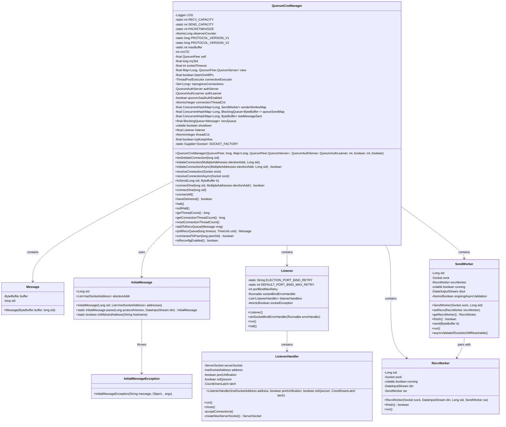
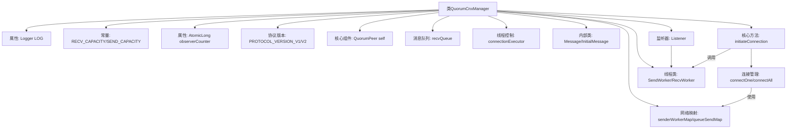
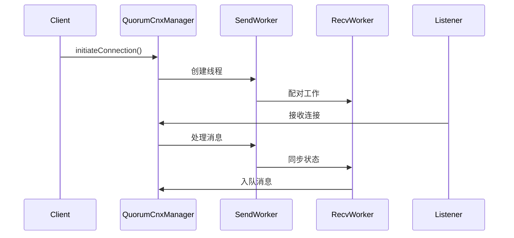

# 基础信息

|      |      |
|------|------|
| 名称 | QuorumCnxManager |
| 编码语言 | .java |
| 代码路径 | zookeeper/zookeeper-server/src/main/java/org/apache/zookeeper/server/quorum/QuorumCnxManager.java |
| 包名 | org.apache.zookeeper.server.quorum |
| 依赖项 | ['java.nio.charset.StandardCharsets.UTF_8', 'org.apache.zookeeper.common.NetUtils.formatInetAddr', 'java.io.BufferedInputStream', 'java.io.BufferedOutputStream', 'java.io.Closeable', 'java.io.DataInputStream', 'java.io.DataOutputStream', 'java.io.IOException', 'java.net.InetAddress', 'java.net.InetSocketAddress', 'java.net.ServerSocket', 'java.net.Socket', 'java.net.SocketException', 'java.net.SocketTimeoutException', 'java.net.UnknownHostException', 'java.nio.BufferUnderflowException', 'java.nio.ByteBuffer', 'java.nio.channels.UnresolvedAddressException', 'java.time.Duration', 'java.util.ArrayList', 'java.util.Arrays', 'java.util.Collection', 'java.util.Collections', 'java.util.Enumeration', 'java.util.HashSet', 'java.util.List', 'java.util.Map', 'java.util.Set', 'java.util.concurrent.BlockingQueue', 'java.util.concurrent.ConcurrentHashMap', 'java.util.concurrent.CountDownLatch', 'java.util.concurrent.ExecutorService', 'java.util.concurrent.Executors', 'java.util.concurrent.SynchronousQueue', 'java.util.concurrent.ThreadFactory', 'java.util.concurrent.ThreadPoolExecutor', 'java.util.concurrent.TimeUnit', 'java.util.concurrent.atomic.AtomicBoolean', 'java.util.concurrent.atomic.AtomicInteger', 'java.util.concurrent.atomic.AtomicLong', 'java.util.function.Supplier', 'java.util.stream.Collectors', 'javax.net.ssl.SSLSocket', 'org.apache.zookeeper.common.NetUtils', 'org.apache.zookeeper.common.X509Exception', 'org.apache.zookeeper.server.ExitCode', 'org.apache.zookeeper.server.ZooKeeperThread', 'org.apache.zookeeper.server.quorum.QuorumPeerConfig.ConfigException', 'org.apache.zookeeper.server.quorum.auth.QuorumAuthLearner', 'org.apache.zookeeper.server.quorum.auth.QuorumAuthServer', 'org.apache.zookeeper.server.quorum.flexible.QuorumVerifier', 'org.apache.zookeeper.server.util.ConfigUtils', 'org.apache.zookeeper.util.CircularBlockingQueue', 'org.apache.zookeeper.util.ServiceUtils', 'org.slf4j.Logger', 'org.slf4j.LoggerFactory'] |
| 概述说明 | QuorumCnxManager是ZooKeeper中管理集群节点间网络通信的核心类，负责建立连接、消息收发及线程池管理。主要功能包括：处理节点间异步连接请求（支持SSL和SASL认证）、维护发送/接收队列、管理SendWorker和RecvWorker线程、支持多地址选举协议（PROTOCOL_VERSION_V2），并提供连接重试、流量控制及异常处理机制。关键参数含RECV_CAPACITY(100)、SEND_CAPACITY(1)、PACKETMAXSIZE(512KB)。通过ConcurrentHashMap维护各节点的消息队列和工作线程。 |

# 说明

QuorumCnxManager是ZooKeeper中管理集群节点间网络通信的核心组件，主要功能包括：建立并维护节点间的TCP连接，处理消息收发，支持SSL/TLS加密和SASL认证。关键特性有：使用SendWorker和RecvWorker线程处理消息队列，支持多地址连接（PROTOCOL_VERSION_V2），提供连接超时（cnxTO=5000ms）和容量控制（RECV_CAPACITY=100）。通过ConcurrentHashMap管理发送队列和连接状态，包含Listener线程监听连接请求，并实现连接重试机制。异常处理涵盖网络中断、认证失败等场景，通过原子计数器统计线程数，确保高可用性。

# 类列表 Class Summary

| 名称   | 类型  | 说明 |
|-------|------|-------------|
| QuorumCnxManager | class | QuorumCnxManager是ZooKeeper中管理集群节点间网络通信的核心类，负责建立连接、发送/接收消息及处理协议版本兼容性。关键功能包括：支持多地址连接、SSL认证、异步消息队列、线程池管理及连接重试机制。通过SendWorker和RecvWorker线程实现双向通信，并处理选举消息的传输。 |

## 类 QuorumCnxManager

|      |      |
|------|------|
| 访问范围 | public |
| 类型 | class |
| 名称 | QuorumCnxManager |
| 说明 | QuorumCnxManager是ZooKeeper中管理集群节点间网络通信的核心类，负责建立连接、发送/接收消息及处理协议版本兼容性。关键功能包括：支持多地址连接、SSL认证、异步消息队列、线程池管理及连接重试机制。通过SendWorker和RecvWorker线程实现双向通信，并处理选举消息的传输。 |

### UML类图

该代码实现了一个ZooKeeper集群节点间的网络通信管理器，主要处理选举和消息传递。核心类QuorumCnxManager管理发送/接收队列、工作线程和连接状态，包含内部类Message、InitialMessage、Listener、SendWorker和RecvWorker。Listener处理入站连接，SendWorker/RecvWorker负责消息收发，InitialMessage解析初始握手消息。通过线程池异步处理连接，支持SSL/TLS和SASL认证，实现了高可用的集群通信机制。

### 内部方法调用关系图

该流程图展示了ZooKeeper的QuorumCnxManager核心架构，主要包含网络连接管理、消息队列处理和多线程协作三大模块。时序图详细描述了从连接初始化到消息收发的完整流程，包括SendWorker和RecvWorker线程的配对工作机制，以及Listener对入站连接的处理过程。整个设计通过并发队列和原子操作保证分布式选举场景下的线程安全，其中协议版本兼容性和SASL认证是关键的边缘情况处理点。

### 字段列表 Field List

| 名称  | 类型  | 说明 |
|-------|-------|------|
| listener | Listener | 公开不可变的监听器实例。 |
| SOCKET_FACTORY = DEFAULT_SOCKET_FACTORY | Supplier<Socket> | 私有静态变量SOCKET_FACTORY，类型为Supplier<Socket>，初始化为默认套接字工厂。 |
| threadCnt = new AtomicInteger(0) | AtomicInteger | 定义一个线程安全的整型变量threadCnt，初始值为0，用于多线程环境下的计数操作。 |
| DEFAULT_SOCKET_FACTORY = () -> new Socket() | Supplier<Socket> | 静态常量DEFAULT_SOCKET_FACTORY，使用Supplier接口提供默认Socket实例。 |
| PROTOCOL_VERSION_V1 = -65536L | long | 定义协议版本V1的常量，值为-65536。 |
| mySid | long | 声明一个最终长整型变量mySid。 |
| quorumSaslAuthEnabled | boolean | 私有布尔变量quorumSaslAuthEnabled，用于启用或禁用SASL认证。 |
| authLearner | QuorumAuthLearner | 私有成员变量authLearner，类型为QuorumAuthLearner。 |
| tcpKeepAlive = Boolean.getBoolean("zookeeper.tcpKeepAlive") | boolean | 私有布尔变量tcpKeepAlive，通过系统属性zookeeper.tcpKeepAlive初始化。 |
| recvQueue | BlockingQueue<Message> | 声明一个不可变阻塞队列recvQueue，用于接收Message类型消息。 |
| senderWorkerMap | ConcurrentHashMap<Long, SendWorker> | final修饰的ConcurrentHashMap，键为Long类型，值为SendWorker类型，变量名为senderWorkerMap。 |
| observerCounter = new AtomicLong(-1) | AtomicLong | 定义一个线程安全的AtomicLong变量observerCounter，初始值为-1。 |
| maxBuffer = 2048 | int | 定义静态常量maxBuffer，值为2048。 |
| lastMessageSent | ConcurrentHashMap<Long, ByteBuffer> | final修饰的ConcurrentHashMap，键为Long类型，值为ByteBuffer类型，变量名为lastMessageSent。 |
| inprogressConnections = Collections.synchronizedSet(new HashSet<>()) | Set<Long> | 私有同步集合，存储进行中的长连接ID。 |
| connectionExecutor | ThreadPoolExecutor | 私有线程池执行器connectionExecutor。 |
| RECV_CAPACITY = 100 | int | 静态常量RECV_CAPACITY值为100。 |
| PROTOCOL_VERSION_V2 = -65535L | long | 静态常量PROTOCOL_VERSION_V2值为-65535L，表示协议版本2。 |
| PACKETMAXSIZE = 1024 * 512 | int | 定义常量PACKETMAXSIZE，值为512KB。 |
| self | QuorumPeer | QuorumPeer是ZooKeeper中负责集群选举和协调的核心组件。 |
| cnxTO = 5000 | int | 私有整型变量cnxTO，初始值为5000。 |
| shutdown = false | boolean | 声明一个易变的布尔变量shutdown，初始值为false。 |
| listenOnAllIPs | boolean | 监听所有IP地址的布尔配置项。 |
| connectionThreadCnt = new AtomicInteger(0) | AtomicInteger | 定义原子整型变量connectionThreadCnt，初始值为0，用于线程安全计数。 |
| SEND_CAPACITY = 1 | int | 静态常量SEND_CAPACITY值为1，用于定义发送容量。 |
| LOG = LoggerFactory.getLogger(QuorumCnxManager.class) | Logger | QuorumCnxManager类中定义了一个私有静态日志记录器LOG，用于记录日志信息。 |
| authServer | QuorumAuthServer | 私有QuorumAuthServer实例authServer。 |
| socketTimeout | int | final修饰的整型socketTimeout变量，用于设置套接字超时时间。 |
| view | Map<Long, QuorumPeer.QuorumServer> | 最终成员视图映射，键为长整型，值为仲裁服务器对象。 |
| queueSendMap | ConcurrentHashMap<Long, BlockingQueue<ByteBuffer>> | 线程安全的ConcurrentHashMap，键为Long类型，值为阻塞队列BlockingQueue，队列元素为ByteBuffer。 |

### 方法列表 Method List

| 名称  | 类型  | 说明 |
|-------|-------|------|
| resetConnectionThreadCount | void | 重置连接线程计数为0。 |
| setSockOpts | void | 设置Socket选项：启用TCP无延迟、保持连接和超时。 |
| pollSendQueue | ByteBuffer | 从阻塞队列获取ByteBuffer，超时返回。参数：队列、时长、单位。异常：InterruptedException。 |
| connectOne | void | 同步方法connectOne处理服务器连接：检查现有连接，支持多地址检测；更新地址后尝试连接，优先使用已知视图中的地址，失败则尝试备用地址；无效ID会告警。 |
| initiateConnection | void | 方法初始化连接至选举地址，支持SSL或普通Socket。连接成功后启动SSL握手或记录连接信息，异常时关闭Socket并记录错误。 |
| startConnection | boolean | 方法startConnection建立Socket连接，处理协议版本、ID和地址交换，验证对方身份，根据ID大小决定是否保持连接，成功则启动收发线程。失败关闭连接。 |
| handleConnection | void | 处理Socket连接，读取协议版本或服务器ID，验证身份后根据ID决定关闭连接或启动收发线程。异常时记录日志并关闭连接。 |
| isSendQueueEmpty | boolean | 检查阻塞队列是否为空，返回布尔值。 |
| receiveConnection | void | 接收Socket连接，处理输入流，记录日志。异常时关闭连接并记录错误。 |
| addToSendQueue | void | 方法将缓冲区加入发送队列，若失败则抛出运行时异常。 |
| connectOne | boolean | 方法connectOne检查sid对应连接是否存在，存在则验证多地址可达性后返回true；否则异步初始化连接。 |
| connectAll | void | 连接队列中所有ID对应的节点。遍历发送队列的键，逐个调用connectOne方法建立连接。 |
| halt | void | 方法halt()执行以下操作：设置shutdown标志，停止监听器并等待其终止，处理中断异常，调用softHalt()，关闭连接执行器，清空连接数据结构和重置连接线程计数。 |
| receiveConnectionAsync | void | 异步处理来自远程地址的Socket连接，使用线程池执行接收任务，异常时关闭连接并记录错误。 |
| toSend | void | 方法toSend根据sid判断消息处理方式：若目标为自身，直接加入接收队列；否则存入对应发送队列并建立连接。 |
| softHalt | void | 该方法softHalt用于软停止所有发送工作线程，遍历senderWorkerMap中的每个SendWorker，记录调试日志并调用finish方法结束线程。 |
| getThreadCount | long | 获取当前线程计数。 |
| initializeConnectionExecutor | void | 初始化连接执行器，创建守护线程工厂和线程池，设置线程超时允许。线程命名包含SID和索引，线程池大小可配置。 |
| initiateConnectionAsync | boolean | 异步连接初始化方法：检查sid是否已连接，若未连接则提交线程任务，成功返回true；异常时移除sid并返回false。 |
| closeSocket | void | 关闭Socket连接，若为空则直接返回，捕获并记录关闭时的IO异常。 |
| testInitiateConnection | void | 方法testInitiateConnection用于初始化与指定服务器的连接，记录调试日志并调用initiateConnection方法。参数sid标识目标服务器。 |
| setSocketFactory | void | 静态方法setSocketFactory用于设置Socket工厂，接受Supplier<Socket>参数并赋值给静态变量SOCKET_FACTORY。 |
| haveDelivered | boolean | 检查所有发送队列是否为空，若任一队列非空则返回false，全空返回true。 |
| getConnectionThreadCount | long | 获取当前连接线程数的方法，返回长整型数值。 |
| addToRecvQueue | void | 方法将消息加入接收队列，失败时抛出异常。 |
| pollRecvQueue | Message | 方法pollRecvQueue在指定超时时间内从队列recvQueue获取消息，超时或中断时抛出InterruptedException。 |
| connectedToPeer | boolean | 检查指定peerSid是否存在发送者工作映射。存在返回true，否则false。 |
| isReconfigEnabled | boolean | 方法isReconfigEnabled返回自身对象的重新配置启用状态。 |

