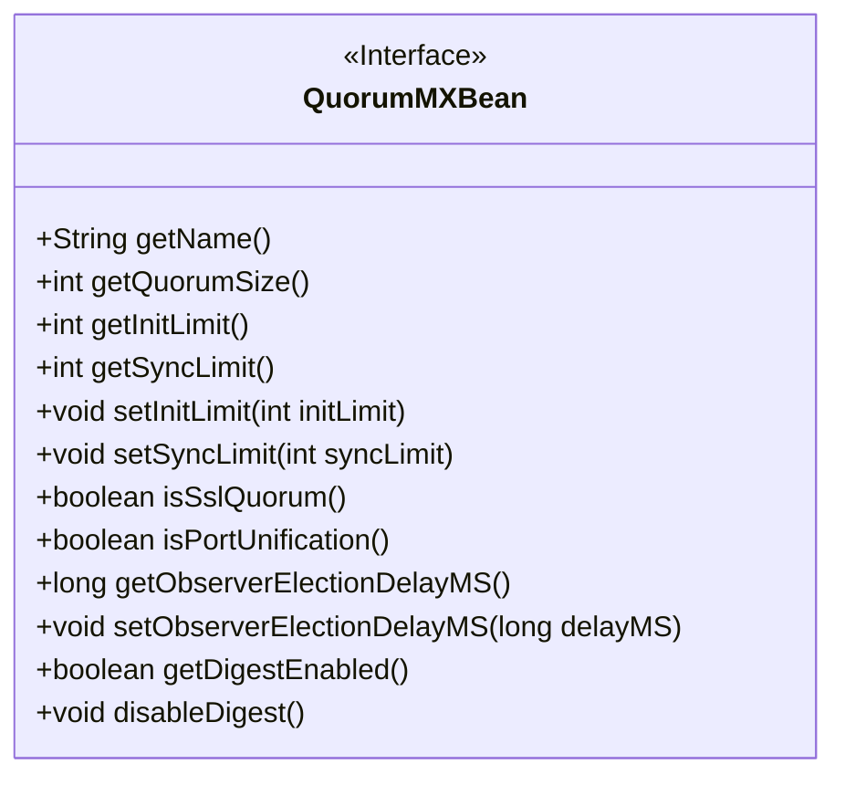

# 基础信息

|      |      |
|------|------|
| 名称 | QuorumMXBean |
| 编码语言 | .java |
| 代码路径 | zookeeper/zookeeper-server/src/main/java/org/apache/zookeeper/server/quorum/QuorumMXBean.java |
| 包名 | org.apache.zookeeper.server.quorum |
| 依赖项 | [] |
| 概述说明 | QuorumMXBean接口提供仲裁组管理功能，包括名称、成员数、同步限制设置、SSL通信状态及观察者选举延迟配置。支持获取和修改关键参数。 |

# 说明

QuorumMXBean接口定义了管理仲裁集群的核心方法，包括获取集群名称、成员数量、初始同步时间限制、请求响应超时限制等配置参数。提供设置同步时间限制和请求响应超时的修改方法，支持查询SSL通信状态和端口统一配置。包含观察者节点重连延迟时间的获取和设置功能，以及摘要功能的启用状态查询和禁用操作。该接口全面覆盖仲裁集群的配置管理和状态监控需求。

# 类列表 Class Summary

| 名称   | 类型  | 说明 |
|-------|------|-------------|
| QuorumMXBean | interface | QuorumMXBean接口定义了仲裁集群的管理方法，包括名称、节点数、同步限制、SSL设置及选举延迟等配置项的获取与设置。 |

## 类 QuorumMXBean

|      |      |
|------|------|
| 访问范围 | public |
| 类型 | interface |
| 名称 | QuorumMXBean |
| 说明 | QuorumMXBean接口定义了仲裁集群的管理方法，包括名称、节点数、同步限制、SSL设置及选举延迟等配置项的获取与设置。 |

### UML类图

这段代码定义了一个名为QuorumMXBean的接口，该接口主要用于管理分布式系统中仲裁(quorum)的相关配置和状态。接口提供了获取仲裁名称、仲裁大小、同步限制等基本信息的方法，同时包含设置初始化限制、同步限制等配置的方法，还提供了SSL通信相关状态检查以及观察者选举延迟时间管理的功能。该接口的设计目的是为分布式系统提供统一的仲裁管理能力，通过MXBean标准暴露给监控系统使用。

### 内部方法调用关系图

```mermaid
graph TD
    A["接口QuorumMXBean"]
    B["方法: String getName()"]
    C["方法: int getQuorumSize()"]
    D["方法: int getInitLimit()"]
    E["方法: int getSyncLimit()"]
    F["方法: void setInitLimit(int initLimit)"]
    G["方法: void setSyncLimit(int syncLimit)"]
    H["方法: boolean isSslQuorum()"]
    I["方法: boolean isPortUnification()"]
    J["方法: long getObserverElectionDelayMS()"]
    K["方法: void setObserverElectionDelayMS(long delayMS)"]
    L["方法: boolean getDigestEnabled()"]
    M["方法: void disableDigest()"]

    A --> B
    A --> C
    A --> D
    A --> E
    A --> F
    A --> G
    A --> H
    A --> I
    A --> J
    A --> K
    A --> L
    A --> M
```

该流程图展示了QuorumMXBean接口的所有方法定义。该接口主要用于管理分布式系统中法定人数(quorum)的配置和状态，包括获取/设置初始化同步时间限制(getInitLimit/setInitLimit)、请求响应时间限制(getSyncLimit/setSyncLimit)、SSL通信配置(isSslQuorum/isPortUnification)以及观察者选举延迟时间(getObserverElectionDelayMS/setObserverElectionDelayMS)等功能。每个方法都对应着法定人数配置管理的一个具体方面，共同构成了完整的法定人数管理接口。

### 字段列表 Field List

| 名称  | 类型  | 说明 |
|-------|-------|------|

### 方法列表 Method List

| 名称  | 类型  | 说明 |
|-------|-------|------|
| getDigestEnabled | boolean | 获取摘要功能是否启用的布尔值方法。 |
| getInitLimit | int | 获取初始限制的整数值函数。 |
| getSyncLimit | int | 获取同步限制值的方法。 |
| setInitLimit | void | 设置初始限制值的方法，参数为整型initLimit。 |
| isSslQuorum | boolean | 方法isSslQuorum用于检查是否使用SSL加密的法定人数通信。 |
| getName | String | 获取名称的方法。 |
| setSyncLimit | void | 设置同步限制参数syncLimit。 |
| getQuorumSize | int | 获取法定人数大小的方法。 |
| getObserverElectionDelayMS | long | 获取观察者选举延迟毫秒数的方法。 |
| isPortUnification | boolean | 方法isPortUnification用于检查是否启用端口统一功能，返回布尔值表示状态。 |
| setObserverElectionDelayMS | void | 设置观察者选举延迟时间（毫秒）。 |
| disableDigest | void | 禁用摘要功能。 |

