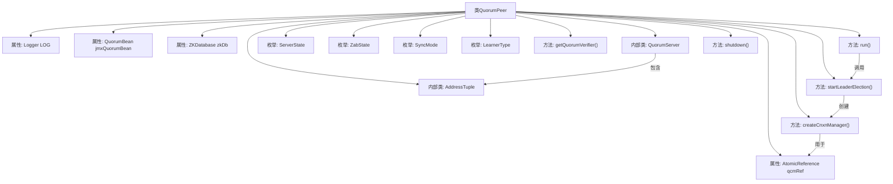
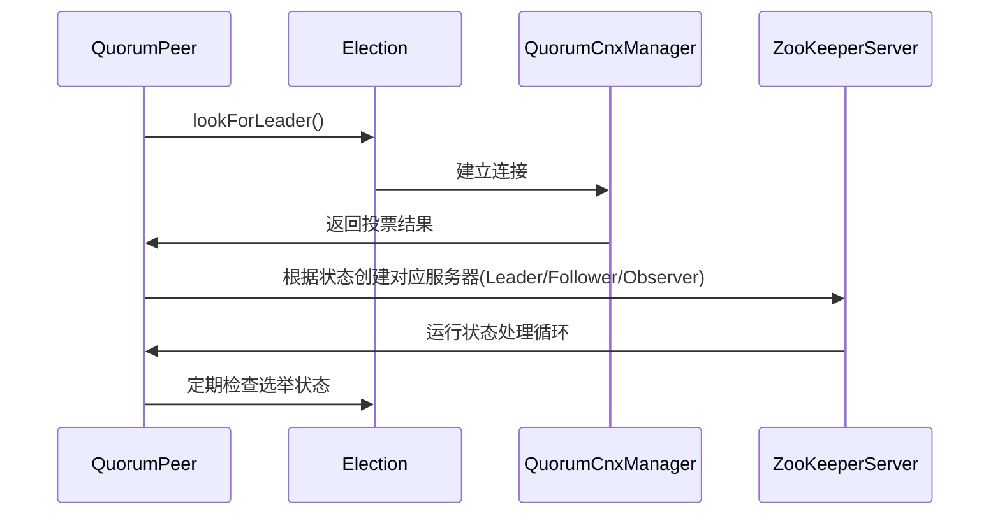

# 基础信息

|      |      |
|------|------|
| 名称 | QuorumPeer |
| 编码语言 | .java |
| 代码路径 | zookeeper/zookeeper-server/src/main/java/org/apache/zookeeper/server/quorum/QuorumPeer.java |
| 包名 | org.apache.zookeeper.server.quorum |
| 依赖项 | ['org.apache.zookeeper.common.NetUtils.formatInetAddr', 'org.apache.zookeeper.server.quorum.QuorumPeerConfig.configureSSLAuth', 'java.io.BufferedReader', 'java.io.File', 'java.io.FileNotFoundException', 'java.io.FileReader', 'java.io.IOException', 'java.io.StringReader', 'java.io.StringWriter', 'java.io.Writer', 'java.net.DatagramPacket', 'java.net.DatagramSocket', 'java.net.InetAddress', 'java.net.InetSocketAddress', 'java.nio.ByteBuffer', 'java.util.ArrayList', 'java.util.Collections', 'java.util.Comparator', 'java.util.HashMap', 'java.util.HashSet', 'java.util.LinkedList', 'java.util.List', 'java.util.Map', 'java.util.Map.Entry', 'java.util.Properties', 'java.util.Set', 'java.util.concurrent.atomic.AtomicBoolean', 'java.util.concurrent.atomic.AtomicInteger', 'java.util.concurrent.atomic.AtomicLong', 'java.util.concurrent.atomic.AtomicReference', 'java.util.function.Function', 'java.util.stream.Collectors', 'java.util.stream.IntStream', 'javax.security.sasl.SaslException', 'org.apache.yetus.audience.InterfaceAudience', 'org.apache.zookeeper.KeeperException.BadArgumentsException', 'org.apache.zookeeper.common.AtomicFileOutputStream', 'org.apache.zookeeper.common.AtomicFileWritingIdiom', 'org.apache.zookeeper.common.AtomicFileWritingIdiom.WriterStatement', 'org.apache.zookeeper.common.QuorumX509Util', 'org.apache.zookeeper.common.Time', 'org.apache.zookeeper.common.X509Exception', 'org.apache.zookeeper.jmx.MBeanRegistry', 'org.apache.zookeeper.jmx.ZKMBeanInfo', 'org.apache.zookeeper.server.ServerCnxn', 'org.apache.zookeeper.server.ServerCnxnFactory', 'org.apache.zookeeper.server.ServerMetrics', 'org.apache.zookeeper.server.ZKDatabase', 'org.apache.zookeeper.server.ZooKeeperServer', 'org.apache.zookeeper.server.ZooKeeperThread', 'org.apache.zookeeper.server.admin.AdminServer', 'org.apache.zookeeper.server.admin.AdminServer.AdminServerException', 'org.apache.zookeeper.server.admin.AdminServerFactory', 'org.apache.zookeeper.server.persistence.FileTxnSnapLog', 'org.apache.zookeeper.server.quorum.QuorumPeerConfig.ConfigException', 'org.apache.zookeeper.server.quorum.auth.NullQuorumAuthLearner', 'org.apache.zookeeper.server.quorum.auth.NullQuorumAuthServer', 'org.apache.zookeeper.server.quorum.auth.QuorumAuth', 'org.apache.zookeeper.server.quorum.auth.QuorumAuthLearner', 'org.apache.zookeeper.server.quorum.auth.QuorumAuthServer', 'org.apache.zookeeper.server.quorum.auth.SaslQuorumAuthLearner', 'org.apache.zookeeper.server.quorum.auth.SaslQuorumAuthServer', 'org.apache.zookeeper.server.quorum.flexible.QuorumMaj', 'org.apache.zookeeper.server.quorum.flexible.QuorumOracleMaj', 'org.apache.zookeeper.server.quorum.flexible.QuorumVerifier', 'org.apache.zookeeper.server.util.ConfigUtils', 'org.apache.zookeeper.server.util.JvmPauseMonitor', 'org.apache.zookeeper.server.util.ZxidUtils', 'org.slf4j.Logger', 'org.slf4j.LoggerFactory'] |
| 概述说明 | QuorumPeer是ZooKeeper的核心类，负责集群选举、状态管理及配置处理。主要功能包括：维护集群成员视图、处理动态配置更新、管理选举算法（如FastLeaderElection）、协调服务器角色（Leader/Follower/Observer切换）。关键属性含myid、选举类型、会话超时设置，支持JMX监控和SASL认证。通过原子操作确保配置一致性，处理网络通信（QuorumCnxManager）及数据持久化（ZKDatabase）。 |

# 说明

QuorumPeer是ZooKeeper的核心类，负责集群选举和状态管理。它继承自ZooKeeperThread并实现QuorumStats.Provider接口，主要功能包括：

1. 管理集群配置和成员信息，支持动态重配置
2. 处理领导者选举流程，支持多种选举算法
3. 维护服务器状态（LOOKING/FOLLOWING/LEADING/OBSERVING）
4. 管理网络连接和通信
5. 提供JMX监控支持

关键特性：
- 支持SSL加密通信
- 提供SASL认证机制
- 支持多地址配置和可达性检查
- 包含观察者模式支持
- 维护ZK数据库和事务日志
- 处理会话超时设置

该类通过状态机模式管理服务器角色转换，包含完整的选举、同步和广播流程实现，同时提供丰富的配置选项和监控指标。

# 类列表 Class Summary

| 名称   | 类型  | 说明 |
|-------|------|-------------|
| QuorumPeer | class | QuorumPeer是ZooKeeper的核心类，负责集群选举、状态管理及配置处理。主要功能包括：初始化选举算法、管理服务器状态（LOOKING/FOLLOWING/LEADING/OBSERVING）、处理动态配置更新、维护JMX监控、支持SASL认证、管理网络连接（QuorumCnxManager）及数据持久化（ZKDatabase）。关键属性包含选举类型、会话超时配置、集群成员视图（QuorumVerifier）及当前投票信息（Vote）。通过线程模型驱动状态转换，确保集群一致性。 |

## 类 QuorumPeer

|      |      |
|------|------|
| 访问范围 | public |
| 类型 | class |
| 名称 | QuorumPeer |
| 说明 | QuorumPeer是ZooKeeper的核心类，负责集群选举、状态管理及配置处理。主要功能包括：初始化选举算法、管理服务器状态（LOOKING/FOLLOWING/LEADING/OBSERVING）、处理动态配置更新、维护JMX监控、支持SASL认证、管理网络连接（QuorumCnxManager）及数据持久化（ZKDatabase）。关键属性包含选举类型、会话超时配置、集群成员视图（QuorumVerifier）及当前投票信息（Vote）。通过线程模型驱动状态转换，确保集群一致性。 |

### UML类图

```mermaid
classDiagram
    class QuorumPeer {
        <<Interface>> QuorumStats~Provider~
        -Logger LOG
        -QuorumBean jmxQuorumBean
        -LocalPeerBean jmxLocalPeerBean
        -Map~Long, RemotePeerBean~ jmxRemotePeerBean
        -LeaderElectionBean jmxLeaderElectionBean
        -AtomicReference~QuorumCnxManager~ qcmRef
        -QuorumAuthServer authServer
        -QuorumAuthLearner authLearner
        -ZKDatabase zkDb
        -JvmPauseMonitor jvmPauseMonitor
        -AtomicBoolean suspended
        -int observerMasterPort
        -boolean multiAddressEnabled
        -int multiAddressReachabilityCheckTimeoutMs
        -boolean multiAddressReachabilityCheckEnabled
        -LearnerType learnerType
        -String configFilename
        -QuorumVerifier quorumVerifier
        -QuorumVerifier lastSeenQuorumVerifier
        -Object QV_LOCK
        -long myid
        -boolean sslQuorum
        -boolean shouldUsePortUnification
        -QuorumX509Util x509Util
        -Vote currentVote
        -boolean running
        -String initialConfig
        -int tickTime
        -boolean localSessionsEnabled
        -boolean localSessionsUpgradingEnabled
        -int minSessionTimeout
        -int maxSessionTimeout
        -int clientPortListenBacklog
        -int maxClientCnxns
        -int initLimit
        -int syncLimit
        -int connectToLearnerMasterLimit
        -boolean syncEnabled
        -AtomicInteger tick
        -boolean quorumListenOnAllIPs
        -long electionTimeTaken
        -boolean quorumSaslEnableAuth
        -boolean quorumServerSaslAuthRequired
        -boolean quorumLearnerSaslAuthRequired
        -String quorumServicePrincipal
        -String quorumLearnerLoginContext
        -String quorumServerLoginContext
        -int quorumCnxnThreadsSize
        -ServerState state
        -AtomicReference~ZabState~ zabState
        -AtomicReference~SyncMode~ syncMode
        -AtomicReference~String~ leaderAddress
        -AtomicLong leaderId
        -boolean reconfigFlag
        -DatagramSocket udpSocket
        -AtomicReference~AddressTuple~ myAddrs
        -int electionType
        -Election electionAlg
        -ServerCnxnFactory cnxnFactory
        -ServerCnxnFactory secureCnxnFactory
        -FileTxnSnapLog logFactory
        -QuorumStats quorumStats
        -AdminServer adminServer
        -boolean reconfigEnabled
        -Follower follower
        -Leader leader
        -Observer observer
        -boolean shuttingDownLE
        -long acceptedEpoch
        -long currentEpoch
        -ArrayList~QuorumServer~ observerMasters
        -int nextObserverMaster
        +QuorumPeer()
        +QuorumPeer(Map~Long, QuorumServer~, File, File, int, long, int, int, int, int, ServerCnxnFactory, QuorumVerifier)
        +initialize() void
        +start() void
        +shutdown() void
        +getView() Map~Long, QuorumServer~
        +getVotingView() Map~Long, QuorumServer~
        +getObservingView() Map~Long, QuorumServer~
        +getCurrentAndNextConfigVoters() Set~Long~
        +viewContains(Long) boolean
        +getQuorumPeers() String[]
        +getServerState() String
        +setMyid(long) void
        +setInitialConfig(String) void
        +getInitialConfig() String
        +getTickTime() int
        +setTickTime(int) void
        +getMaxClientCnxnsPerHost() int
        +areLocalSessionsEnabled() boolean
        +enableLocalSessions(boolean) void
        +isLocalSessionsUpgradingEnabled() boolean
        +enableLocalSessionsUpgrading(boolean) void
        +getMinSessionTimeout() int
        +setMinSessionTimeout(int) void
        +getMaxSessionTimeout() int
        +setMaxSessionTimeout(int) void
        +getClientPortListenBacklog() int
        +setClientPortListenBacklog(int) void
        +getMaxClientCnxns() int
        +setMaxClientCnxns(int) void
        +getInitLimit() int
        +setInitLimit(int) void
        +getTick() int
        +configFromString(String) QuorumVerifier
        +getQuorumVerifier() QuorumVerifier
        +getLastSeenQuorumVerifier() QuorumVerifier
        +restartLeaderElection(QuorumVerifier, QuorumVerifier) void
        +getNextDynamicConfigFilename() String
        +setLastSeenQuorumVerifier(QuorumVerifier, boolean) void
        +setQuorumVerifier(QuorumVerifier, boolean) QuorumVerifier
        +getElectionAlg() Election
        +getSyncLimit() int
        +setSyncLimit(int) void
        +getConnectToLearnerMasterLimit() int
        +setConnectToLearnerMasterLimit(int) void
        +getSyncEnabled() boolean
        +setSyncEnabled(boolean) void
        +getElectionType() int
        +setElectionType(int) void
        +getQuorumListenOnAllIPs() boolean
        +setQuorumListenOnAllIPs(boolean) void
        +setCnxnFactory(ServerCnxnFactory) void
        +setSecureCnxnFactory(ServerCnxnFactory) void
        +setSslQuorum(boolean) void
        +setUsePortUnification(boolean) void
        +setZooKeeperServer(ZooKeeperServer) void
        +closeAllConnections() void
        +getClientPort() int
        +getSecureClientPort() int
        +setTxnFactory(FileTxnSnapLog) void
        +getTxnFactory() FileTxnSnapLog
        +setZKDatabase(ZKDatabase) void
        +getZkDb() ZKDatabase
        +initConfigInZKDatabase() void
        +isRunning() boolean
        +getQuorumCnxManager() QuorumCnxManager
        +readLongFromFile(String) long
        +writeLongToFile(String, long) void
        +getCurrentEpoch() long
        +getAcceptedEpoch() long
        +setCurrentEpoch(long) void
        +setAcceptedEpoch(long) void
        +processReconfig(QuorumVerifier, Long, Long, boolean) boolean
        +isLeader(long) boolean
        +isReconfigEnabled() boolean
        +getSynced_observers_metric() Integer
        +createFromConfig(QuorumPeerConfig) QuorumPeer
    }

    class QuorumServer {
        -MultipleAddresses addr
        -MultipleAddresses electionAddr
        -InetSocketAddress clientAddr
        -InetSocketAddress secureClientAddr
        -long id
        -String hostname
        -LearnerType type
        -boolean isClientAddrFromStatic
        -boolean isSecureClientAddrFromStatic
        -List~InetSocketAddress~ myAddrs
        +QuorumServer(long, InetSocketAddress, InetSocketAddress, InetSocketAddress)
        +QuorumServer(long, InetSocketAddress, InetSocketAddress, InetSocketAddress, InetSocketAddress)
        +QuorumServer(long, InetSocketAddress, InetSocketAddress, InetSocketAddress, LearnerType)
        +QuorumServer(long, InetSocketAddress, InetSocketAddress)
        +QuorumServer(long, InetSocketAddress)
        +getId() long
        +recreateSocketAddresses() void
        +getType(String) LearnerType
        +QuorumServer(long, String) throws ConfigException
        +QuorumServer(long, String, Function~InetSocketAddress, InetAddress~) throws ConfigException
        +QuorumServer(long, InetSocketAddress, InetSocketAddress, LearnerType)
        +QuorumServer(long, InetSocketAddress, InetSocketAddress, InetSocketAddress, InetSocketAddress, LearnerType)
        +initializeWithAddressString(String, Function~InetSocketAddress, InetAddress~) void
        +getInetAddress(InetSocketAddress) InetAddress
        +setMyAddrs() void
        +delimitedHostString(InetSocketAddress) String
        +toString() String
        +hashCode() int
        +equals(Object) boolean
        +checkAddressDuplicate(QuorumServer) void
        +excludedSpecialAddresses(List~InetSocketAddress~) List~InetSocketAddress~
    }

    class ServerState {
        <<Enumeration>>
        LOOKING
        FOLLOWING
        LEADING
        OBSERVING
    }

    class ZabState {
        <<Enumeration>>
        ELECTION
        DISCOVERY
        SYNCHRONIZATION
        BROADCAST
    }

    class SyncMode {
        <<Enumeration>>
        NONE
        DIFF
        SNAP
        TRUNC
    }

    class LearnerType {
        <<Enumeration>>
        PARTICIPANT
        OBSERVER
    }

    class AddressTuple {
        -MultipleAddresses quorumAddr
        -MultipleAddresses electionAddr
        -InetSocketAddress clientAddr
        -InetSocketAddress secureClientAddr
        +AddressTuple(MultipleAddresses, MultipleAddresses, InetSocketAddress, InetSocketAddress)
    }

    class ResponderThread {
        -boolean running
        +ResponderThread()
        +run() void
    }

    QuorumPeer --> QuorumServer : contains
    QuorumPeer --> ServerState : uses
    QuorumPeer --> ZabState : uses
    QuorumPeer --> SyncMode : uses
    QuorumPeer --> LearnerType : uses
    QuorumPeer --> AddressTuple : contains
    QuorumPeer --> ResponderThread : contains
    QuorumPeer --> QuorumStats~Provider~ : implements
```

这段代码是Apache ZooKeeper中QuorumPeer类的实现，它负责管理ZooKeeper集群中的节点状态和选举过程。QuorumPeer继承自ZooKeeperThread并实现了QuorumStats.Provider接口，包含了处理集群配置、选举算法、网络通信和状态转换的核心逻辑。类图中展示了QuorumPeer的主要成员变量和方法，以及它与QuorumServer、ServerState等辅助类的关联关系。该类通过维护当前视图、选举状态和连接管理器来协调集群中的节点行为，支持动态配置变更和多种选举算法。

### 内部方法调用关系图

这段代码是ZooKeeper的核心组件QuorumPeer的实现，主要功能包括：

1. 管理集群成员状态和配置（通过QuorumVerifier）
2. 处理领导者选举流程（通过Election算法）
3. 维护与其他节点的网络连接（通过QuorumCnxManager）
4. 根据角色切换不同的服务器状态（Leader/Follower/Observer）
5. 提供JMX监控和管理接口

代码结构复杂，包含多个内部类和枚举类型，主要处理ZooKeeper集群的共识协议实现。关键流程包括领导者选举、配置变更、状态转换和网络通信等核心功能，通过状态机模式管理服务器在不同角色间的转换。

### 字段列表 Field List

| 名称  | 类型  | 说明 |
|-------|-------|------|
| isClientAddrFromStatic = null | Boolean | 声明一个私有布尔变量isClientAddrFromStatic，初始值为null。 |
| myAddrs = new AtomicReference<>() | AtomicReference<AddressTuple> | 私有原子引用变量myAddrs，存储AddressTuple对象，确保线程安全。 |
| secureCnxnFactory | ServerCnxnFactory | 安全连接工厂实例。 |
| localSessionsUpgradingEnabled = true | boolean | 本地会话升级功能已启用。 |
| jmxQuorumBean | QuorumBean | 私有QuorumBean类型的jmxQuorumBean变量。 |
| quorumCnxnTimeoutMs | int | 私有静态整型变量quorumCnxnTimeoutMs，用于设置仲裁连接超时时间（毫秒）。 |
| SYNC_ENABLED = "zookeeper.observer.syncEnabled" | String | 这是一个Java静态常量，定义ZooKeeper观察者的同步启用配置项键名。 |
| localSessionsEnabled = false | boolean | 本地会话功能已禁用。 |
| initLimit | int | 受保护的易变整型变量initLimit。 |
| quorumServerLoginContext | String | quorumServerLoginContext是受保护的字符串变量，用于存储服务器登录上下文信息。 |
| CONFIG_KEY_MULTI_ADDRESS_ENABLED = "zookeeper.multiAddress.enabled" | String | 这是一个Java常量定义，表示ZooKeeper多地址功能的配置键，键名为"zookeeper.multiAddress.enabled"。 |
| quorumLearnerLoginContext | String | quorumLearnerLoginContext是一个受保护的字符串变量。 |
| x509Util | QuorumX509Util | 私有成员变量x509Util，类型为QuorumX509Util。 |
| adminServer | AdminServer | 声明一个AdminServer类型的adminServer变量。 |
| shouldUsePortUnification | boolean | 私有布尔变量，用于判断是否启用端口统一。 |
| quorumStats | QuorumStats | 私有成员变量quorumStats，类型为QuorumStats。 |
| reconfigEnabled | boolean | 私有布尔变量reconfigEnabled，表示是否启用重新配置。 |
| sslQuorum | boolean | SSL仲裁开关，控制是否启用SSL加密。 |
| logFactory = null | FileTxnSnapLog | 私有文件事务日志工厂初始化为空。 |
| currentVote | Vote | 私有易变投票变量currentVote |
| quorumServerSaslAuthRequired | boolean | 受保护的布尔变量，表示是否要求仲裁服务器启用SASL认证。 |
| isSecureClientAddrFromStatic = null | Boolean | 私有布尔变量isSecureClientAddrFromStatic初始化为null。 |
| connectToLearnerMasterLimit | int | 受保护的易变整型变量，限制连接到主学习节点的数量。 |
| authLearner | QuorumAuthLearner | QuorumAuthLearner的authLearner实例声明。 |
| quorumServicePrincipal | String | 声明受保护字符串变量quorumServicePrincipal。 |
| authServer | QuorumAuthServer | QuorumAuthServer实例authServer。 |
| learnerType = LearnerType.PARTICIPANT | LearnerType | 学习者类型为参与者。 |
| udpSocket | DatagramSocket | 创建UDP套接字对象udpSocket。 |
| unavailableStartTime | long | 私有长整型变量unavailableStartTime，记录不可用状态的开始时间。 |
| observerMasters = new ArrayList<>() | ArrayList<QuorumServer> | 私有观察者主节点列表。 |
| follower | Follower | 公开的跟随者对象。 |
| syncLimit | int | 受保护的易变整型变量syncLimit |
| qcmRef = new AtomicReference<>() | AtomicReference<QuorumCnxManager> | 声明一个原子引用qcmRef，用于线程安全地存储和访问QuorumCnxManager对象。 |
| FLE_TIME_UNIT = "MS" | String | 定义静态常量字符串FLE_TIME_UNIT，值为"MS"。 |
| configFilename = null | String | 私有字符串变量configFilename初始化为null。 |
| leaderAddress = new AtomicReference<>("") | AtomicReference<String> | 私有原子引用变量leaderAddress，初始值为空字符串。 |
| minSessionTimeout = -1 | int | 受保护的整型变量minSessionTimeout，默认值为-1。 |
| jmxLocalPeerBean | LocalPeerBean | 本地对等节点JMX管理对象。 |
| acceptedEpoch = -1 | long | 私有长整型变量acceptedEpoch，初始值为-1。 |
| zkDb | ZKDatabase | 私有变量zkDb，类型为ZKDatabase。 |
| QUORUM_CNXN_TIMEOUT_MS = "zookeeper.quorumCnxnTimeoutMs" | String | ZooKeeper集群连接超时配置参数。 |
| shuttingDownLE = false | boolean | 变量shuttingDownLE初始化为false，表示未关闭。 |
| multiAddressReachabilityCheckTimeoutMs = (int) MultipleAddresses.DEFAULT_TIMEOUT.toMillis() | int | 私有整型变量multiAddressReachabilityCheckTimeoutMs，默认值为MultipleAddresses.DEFAULT_TIMEOUT的毫秒值。 |
| CONFIG_KEY_MULTI_ADDRESS_REACHABILITY_CHECK_TIMEOUT_MS = "zookeeper.multiAddress.reachabilityCheckTimeoutMs" | String | 配置键：zookeeper多地址可达性检查超时（毫秒）。 |
| CONFIG_KEY_MULTI_ADDRESS_REACHABILITY_CHECK_ENABLED = "zookeeper.multiAddress.reachabilityCheckEnabled" | String | 这是一个Java静态常量，定义了一个配置键"zookeeper.multiAddress.reachabilityCheckEnabled"，用于控制ZooKeeper多地址可达性检查的开关。 |
| quorumCnxnThreadsSize = QUORUM_CNXN_THREADS_SIZE_DEFAULT_VALUE | int | 受保护的整型变量quorumCnxnThreadsSize，默认值为QUORUM_CNXN_THREADS_SIZE_DEFAULT_VALUE。 |
| observer | Observer | 声明一个公共的Observer类型变量observer。 |
| tickTime | int | 声明一个受保护的整型变量tickTime。 |
| CONFIG_DEFAULT_KERBEROS_CANONICALIZE_HOST_NAMES = "false" | String | 静态常量CONFIG_DEFAULT_KERBEROS_CANONICALIZE_HOST_NAMES默认值为false，用于配置Kerberos主机名规范化。 |
| leaderId = new AtomicLong(-1) | AtomicLong | 声明一个原子长整型变量leaderId，初始值为-1，用于线程安全地维护领导者ID。 |
| currentEpoch = -1 | long | 当前纪元初始值为-1。 |
| CONFIG_KEY_KERBEROS_CANONICALIZE_HOST_NAMES = "zookeeper.kerberos.canonicalizeHostNames" | String | 配置键：用于ZooKeeper Kerberos主机名规范化设置。 |
| quorumVerifier | QuorumVerifier | 私有成员变量quorumVerifier，类型为QuorumVerifier。 |
| multiAddressEnabled = true | boolean | 私有布尔变量multiAddressEnabled默认值为true。 |
| nextObserverMaster = 0 | int | 私有整型变量nextObserverMaster初始值为0。 |
| running = true | boolean | 私有易变布尔变量running初始值为true。 |
| QUORUM_CNXN_THREADS_SIZE_DEFAULT_VALUE = 20 | int | 私有静态常量，默认连接线程池大小为20。 |
| initialConfig | String | 私有字符串变量initialConfig，用于存储初始配置信息。 |
| state = ServerState.LOOKING | ServerState | 私有变量state初始化为ServerState.LOOKING状态。 |
| CONFIG_DEFAULT_MULTI_ADDRESS_ENABLED = "false" | String | 静态常量CONFIG_DEFAULT_MULTI_ADDRESS_ENABLED默认值为false，表示多地址功能默认禁用。 |
| LOG = LoggerFactory.getLogger(QuorumPeer.class) | Logger | QuorumPeer类中定义了一个私有静态日志记录器LOG。 |
| myid | long | 私有长整型变量myid。 |
| electionTimeTaken = -1 | long | 私有长整型变量electionTimeTaken，初始值为-1。 |
| multiAddressReachabilityCheckEnabled = true | boolean | 启用多地址可达性检查的私有布尔变量。 |
| quorumLearnerSaslAuthRequired | boolean | 受保护的布尔变量，表示仲裁学习者是否需要SASL认证。 |
| suspended = new AtomicBoolean(false) | AtomicBoolean | 私有原子布尔变量suspended初始值为false。 |
| cnxnFactory | ServerCnxnFactory | 服务器连接工厂实例。 |
| QV_LOCK = new Object() | Object | 创建名为QV_LOCK的final对象锁。 |
| quorumListenOnAllIPs = false | boolean | 保护型布尔变量quorumListenOnAllIPs默认值为false，控制是否监听所有IP。 |
| observerMasterPort | int | 私有整型变量observerMasterPort，用于存储观察者主端口号。 |
| jvmPauseMonitor | JvmPauseMonitor | 私有JVM暂停监控器变量jvmPauseMonitor。 |
| electionAlg | Election | 选举算法变量声明。 |
| responder | ResponderThread | 声明一个名为responder的ResponderThread类型变量。 |
| lastSeenQuorumVerifier = null | QuorumVerifier | 私有变量lastSeenQuorumVerifier初始化为null，用于存储最近的QuorumVerifier实例。 |
| tick = new AtomicInteger() | AtomicInteger | 声明一个线程安全的原子整型变量tick，初始值为0。 |
| electionType | int | 私有整型变量electionType，用于存储选举类型。 |
| syncEnabled = true | boolean | 同步功能已启用。 |
| quorumSaslEnableAuth | boolean | 受保护的布尔变量quorumSaslEnableAuth，用于控制SASL认证是否启用。 |
| reconfigFlag = false | boolean | 私有布尔变量reconfigFlag初始值为false。 |
| ACCEPTED_EPOCH_FILENAME = "acceptedEpoch" | String | 定义常量字符串"acceptedEpoch"用于表示接受纪元文件名。 |
| maxClientCnxns = -1 | int | 该代码定义了一个受保护的整型变量maxClientCnxns，初始值为-1，用于限制客户端连接数。 |
| jmxLeaderElectionBean | LeaderElectionBean | JMX管理的LeaderElectionBean实例，用于领导者选举。 |
| end_fle | long | 定义两个长整型变量：start_fle和end_fle。 |
| clientPortListenBacklog = -1 | int | 客户端端口监听队列长度，默认值为-1。 |
| CURRENT_EPOCH_FILENAME = "currentEpoch" | String | 静态常量字符串，文件名"currentEpoch"用于存储当前周期信息。 |
| maxSessionTimeout = -1 | int | 受保护的整型变量maxSessionTimeout，默认值为-1。 |
| syncMode = new AtomicReference<>(SyncMode.NONE) | AtomicReference<SyncMode> | 声明一个原子引用类型变量syncMode，初始值为SyncMode.NONE。 |
| OBSERVER_ID = Long.MAX_VALUE | long | 定义常量OBSERVER_ID，值为长整型最大值。 |
| zabState = new AtomicReference<>(ZabState.ELECTION) | AtomicReference<ZabState> | 私有原子引用zabState初始化为ELECTION状态。 |
| jmxRemotePeerBean | Map<Long, RemotePeerBean> | 私有映射，键为长整型，值为RemotePeerBean对象。 |
| leader | Leader | 公开的Leader类实例变量leader。 |

### 方法列表 Method List

| 名称  | 类型  | 说明 |
|-------|-------|------|
| getTick | int | 获取当前tick值的方法，返回整数类型。 |
| getCurrentVote | Vote | 同步方法获取当前投票对象。 |
| setQuorumLearnerSaslRequired | void | 方法设置仲裁学习者SASL认证需求，更新变量并记录日志。 |
| setConfigFileName | void | 这是一个Java同步方法，用于设置配置文件名。方法名为setConfigFileName，参数为字符串s，将s赋值给成员变量configFilename。使用synchronized关键字确保线程安全。 |
| setTickTime | void | 方法setTickTime设置tickTime值并记录日志。 |
| setZKDatabase | void | 设置ZKDatabase实例，将参数database赋值给成员变量zkDb。 |
| setElectionTimeTaken | void | 设置选举耗时方法，参数为长整型electionTimeTaken，赋值给类成员变量。 |
| createElectionAlgorithm | Election | 该方法根据选举算法类型创建选举实例。算法1和2不支持，算法3初始化连接管理器并启动监听器，创建快速选举实例。默认情况断言失败。 |
| recreateSocketAddresses | void | 方法recreateSocketAddresses根据ID重新创建QuorumServer的socket地址，并更新当前节点的地址信息。 |
| start | void | 同步启动方法，检查ID有效性后加载数据、启动服务、管理服务器和选举，最后调用父类启动。异常时记录警告。 |
| setLearnerType | void | 设置学习者的类型，将参数p赋值给learnerType变量。 |
| getTxnFactory | FileTxnSnapLog | 该方法返回当前对象的日志工厂实例。 |
| getTickTime | int | 获取tickTime的整数值。 |
| setSslQuorum | void | 该方法设置SSL加密的仲裁通信，根据参数值记录使用TLS加密或不加密的通信状态，并更新成员变量sslQuorum。 |
| getDetailedPeerState | String | 该方法生成对等节点状态详情：先转小写输出基础状态，若非选举态则追加Zab状态，若同步模式非空则追加同步模式，最终拼接为字符串返回。 |
| getLeaderId | long | 方法getLeaderId返回leaderId的当前值，类型为long。 |
| isMultiAddressReachabilityCheckEnabled | boolean | 该方法返回布尔值，表示是否启用了多地址可达性检查。 |
| enableLocalSessions | void | 方法enableLocalSessions用于设置本地会话开关状态，通过布尔参数flag控制，并记录日志显示当前状态。 |
| setMyid | void | 设置对象ID的方法，将参数myid赋值给对象的myid属性。 |
| makeLeader | Leader | 创建Leader实例，传入日志工厂、当前对象及数据库，可能抛出IO或X509异常。 |
| setQuorumListenOnAllIPs | void | 设置仲裁监听所有IP地址的布尔值参数方法。 |
| getSyncMode | SyncMode | 方法`getSyncMode`返回当前同步模式，通过调用`syncMode.get()`获取值。 |
| shutdown | void | 该方法用于关闭系统，依次停止运行标志、x509工具、领导/跟随者节点、服务器连接工厂、UDP套接字、JVM监控、管理服务器、选举算法及ZK数据库，并记录异常。 |
| stopLeaderElection | void | 停止领导选举方法：设置运行标志为false并中断响应线程。 |
| isLocalSessionsUpgradingEnabled | boolean | 方法检查本地会话升级是否启用，返回布尔值。 |
| setInitLimit | void | 方法setInitLimit用于设置initLimit值，记录日志并更新成员变量。 |
| setMultiAddressEnabled | void | 设置多地址功能开关，更新状态并记录日志。 |
| getQuorumListenOnAllIPs | boolean | 这是一个Java方法，返回布尔值quorumListenOnAllIPs，表示是否监听所有IP。 |
| getZabState | ZabState | 获取当前ZabState状态值的方法。 |
| getInitLimit | int | 方法返回整型变量initLimit的值。 |
| isQuorumSaslAuthEnabled | boolean | 检查是否启用Quorum SASL认证，返回布尔值quorumSaslEnableAuth。 |
| setQuorumCnxnThreadsSize | void | 设置法定连接线程数大小，若输入值大于默认值则更新，并记录日志。 |
| getClientPort | int | 获取客户端端口方法：若连接工厂存在则返回其本地端口，否则返回-1。 |
| setPeerState | void | 同步方法设置节点状态：若新状态为LOOKING，清空领导者信息并设为选举状态；否则记录状态变更日志。 |
| useObserverMasters | boolean | 方法检查是否为观察者类型且观察主节点列表非空。 |
| enableLocalSessionsUpgrading | void | 该方法用于启用或禁用本地会话升级功能，通过布尔参数flag控制，并记录日志状态变更。执行后将flag值赋给localSessionsUpgradingEnabled变量。 |
| viewContains | boolean | 检查视图是否包含指定ID。返回布尔值表示存在与否。 |
| createX509Util | QuorumX509Util | 创建QuorumX509Util实例的方法。 |
| getX509Util | QuorumX509Util | 方法getX509Util返回x509Util对象实例。 |
| getSyncEnabled | boolean | 检查系统属性SYNC_ENABLED是否存在，存在则返回其布尔值并记录日志，否则返回默认值syncEnabled。 |
| getView | Map<Long, QuorumPeer.QuorumServer> | 该方法返回一个不可修改的Map，包含QuorumVerifier中所有成员的视图。键为Long类型，值为QuorumPeer.QuorumServer对象。 |
| setObserverMasterPort | void | 设置观察者主端口的方法，参数为observerMasterPort。 |
| getCurrentEpoch | long | 方法getCurrentEpoch读取文件中的当前纪元值，若未初始化则从文件读取并缓存，避免重复IO操作。返回长整型currentEpoch。 |
| checkSuspended | void | 检查线程挂起状态，若挂起则休眠10毫秒循环等待，被中断时恢复线程中断状态。 |
| getQuorumCnxManager | QuorumCnxManager | 获取QuorumCnxManager实例的方法，返回qcmRef引用的当前值。 |
| setQuorumSaslEnabled | void | 方法setQuorumSaslEnabled用于设置SASL认证开关，禁用时记录不安全警告，启用时记录当前状态。 |
| setObserver | void | 同步方法设置观察者对象，确保线程安全。 |
| nextObserverMaster | QuorumServer | 方法nextObserverMaster循环选择观察者主节点，若遍历完列表则重置索引并等待重连延迟，最后返回下一个主节点。 |
| getNextDynamicConfigFilename | String | 方法getNextDynamicConfigFilename用于生成下一个动态配置文件名。若configFilename为空，记录警告并返回null；否则返回configFilename加上动态配置后缀。 |
| getClientAddress | InetSocketAddress | 获取客户端地址方法：检查myAddrs中的AddressTuple，若存在则返回其clientAddr，否则返回null。 |
| isMultiAddressEnabled | boolean | 方法isMultiAddressEnabled返回布尔值multiAddressEnabled的状态。 |
| getMyId | long | 这是一个Java方法，返回名为myid的long类型变量值。 |
| getSyncLimit | int | 获取同步限制值的方法，返回syncLimit变量。 |
| isQuorumServerSaslAuthRequired | boolean | 检查是否需对仲裁服务器启用SASL认证。 |
| isLeader | boolean | 检查给定ID是否为当前投票的领导者。若当前投票存在且ID匹配则返回真，否则返回假。 |
| isReconfigEnabled | boolean | 该方法返回布尔值reconfigEnabled，表示是否启用重新配置。 |
| getSynced_observers_metric | Integer | 私有方法获取同步观察者数量，根据节点角色（leader或follower）返回对应值，无角色时返回null。 |
| processReconfig | boolean | 处理ZooKeeper集群重配置：检查配置更新，更新成员信息，重启选举，调整客户端连接工厂，返回角色或领导者变更状态。 |
| updateThreadName | void | 方法updateThreadName设置线程名，包含节点ID、普通连接地址（若存在）和安全连接地址（若存在），否则显示"disabled"。 |
| makeObserver | Observer | 创建Observer实例，使用FileTxnSnapLog工厂，可能抛出IOException。 |
| getPeerState | ServerState | 这是一个同步方法，返回当前服务器的状态。方法名为getPeerState，返回类型为ServerState，使用synchronized确保线程安全。 |
| isSslQuorum | boolean | 这是一个Java方法，返回布尔值sslQuorum，表示是否启用SSL加密的quorum通信。 |
| setTxnFactory | void | 
定义方法setTxnFactory，将参数factory赋值给类变量logFactory。 |
| getInitialConfig | String | 这是一个Java方法，返回字符串类型的初始配置值。方法名为getInitialConfig，无参数，直接返回成员变量initialConfig的值。 |
| restartLeaderElection | void | 方法restartLeaderElection在旧新选举验证器不同时重启选举：关闭当前选举，重置标志并启动新选举。 |
| updateElectionVote | void | 更新选举投票方法，接收新纪元参数。若当前投票非空，则基于当前投票ID、zxid、选举纪元、新纪元和状态创建新投票并设置。 |
| setLastSeenQuorumVerifier | void | 方法setLastSeenQuorumVerifier用于更新最新QuorumVerifier配置。若动态重配禁用则直接返回。通过双重锁机制避免死锁，检查版本有效性后更新配置，必要时写入磁盘或连接新节点。 |
| setMultiAddressReachabilityCheckEnabled | void | 设置多地址可达性检查功能的开关状态，并记录日志。 |
| updateServerState | void | 私有同步方法updateServerState根据条件更新服务器状态：无重配置标志设为LOOKING；当前投票ID匹配设为LEADING；参与者设为FOLLOWING；观察者设为OBSERVER；否则设为LOOKING。最后重置重配置标志。 |
| setInitialConfig | void | 这是一个Java方法，用于设置初始配置字符串。方法名为setInitialConfig，接受一个String参数initialConfig，并将其赋值给类的同名成员变量。 |
| getLastSeenQuorumVerifier | QuorumVerifier | 方法getLastSeenQuorumVerifier同步返回lastSeenQuorumVerifier，使用QV_LOCK确保线程安全。 |
| makeFollower | Follower | 这是一个受保护的Java方法，用于创建Follower实例，接收FileTxnSnapLog参数并可能抛出IOException。方法内部通过FollowerZooKeeperServer构造Follower对象。 |
| setMultiAddressReachabilityCheckTimeoutMs | void | 设置多地址可达性检查超时时间（毫秒），并记录日志。 |
| reconfigFlagSet | void | 同步方法reconfigFlagSet将reconfigFlag设为true。 |
| getServerState | String | 方法根据节点状态返回对应字符串：LOOKING返回LOOKING_STATE，LEADING返回LEADING_STATE，FOLLOWING返回FOLLOWING_STATE，OBSERVING返回OBSERVING_STATE，其他返回UNKNOWN_STATE。 |
| validateLearnerMaster | QuorumServer | 验证学习者主节点方法：检查是否启用观察者主节点，解析目标ID或地址匹配现有节点，未找到则记录日志并返回null。 |
| configFromString | QuorumVerifier | 解析字符串配置生成QuorumVerifier对象，处理异常并加载属性。 |
| getClientAddress | InetSocketAddress | 获取客户端地址方法：根据节点ID从集群成员中查找对应配置，若不存在或端口不匹配则抛出异常，否则返回配置的客户端地址或指定端口的新地址。 |
| setUsePortUnification | void | 方法setUsePortUnification设置端口统一使用状态，记录启用或禁用日志并更新对应变量。 |
| setCnxnFactory | void | 设置服务器连接工厂实例的方法。 |
| shouldUsePortUnification | boolean | 方法返回是否使用端口统一的布尔值。 |
| setLeaderAddressAndId | void | 方法设置领导地址和ID：若地址非空，拼接所有主机字符串；否则设为null。同时更新领导ID。 |
| getMultiAddressReachabilityCheckTimeoutMs | int | 该方法返回多地址可达性检查的超时时间（毫秒）。 |
| getLearnerType | LearnerType | 这是一个Java方法，返回LearnerType类型的learnerType变量值。 |
| findLearnerMaster | QuorumServer | 方法`findLearnerMaster`根据配置决定返回观察者主节点或延迟后返回原主节点。若启用观察者主节点则调用`nextObserverMaster`，否则运行中会延迟等待后返回原主节点。 |
| setQuorumVerifier | QuorumVerifier | 方法setQuorumVerifier更新法定人数验证器，处理版本检查、磁盘写入和成员地址更新。若新版本低于当前版本则忽略，否则更新并可选写入磁盘配置。同时更新观察者主列表。返回旧验证器。 |
| getQuorumPeers | String[] | 获取法定节点列表：若存在领导者，收集所有已同步学习者的地址并标记*；若存在跟随者，仅返回其地址。结果以字符串数组返回。 |
| loadDataBase | void | 方法加载数据库并处理纪元数据，检查文件是否存在或创建默认值，验证纪元有效性，出错时抛出异常。 |
| setCurrentEpoch | void | 方法setCurrentEpoch将输入的长整型值e写入文件并更新currentEpoch变量，可能抛出IO异常。 |
| setZabState | void | 方法setZabState更新ZabState状态。若新状态为BROADCAST且unavailableStartTime非零，则计算不可用时间并记录到指标，若当前是LEADING状态则额外记录领导不可用时间。最后更新状态并记录日志。 |
| getVotingView | Map<Long, QuorumPeer.QuorumServer> | 该方法返回一个映射，包含投票成员的ID及其对应的服务器信息。 |
| getSecureClientPort | int | 该方法检查安全连接工厂是否存在，存在则返回其本地端口号，否则返回-1。 |
| initialize | void | 初始化方法检查是否启用Quorum SASL认证，若启用则创建认证服务器和学习器，否则创建空实例。 |
| getMaxClientCnxns | int | 方法返回最大客户端连接数maxClientCnxns。 |
| closeAllConnections | void | 关闭所有连接，包括普通和安全连接，原因设为服务器关闭。 |
| setSyncEnabled | void | 设置同步启用状态的公共方法，参数为布尔值syncEnabled。 |
| getAcceptedEpoch | long | 读取文件中的acceptedEpoch值，若未初始化则从文件读取并返回。 |
| updateLearnerType | boolean | 方法updateLearnerType根据新配置更新节点角色。若新配置中为观察者且当前非观察者，则切换并返回true；若为投票成员且当前非参与者，则切换并返回true；若不在配置中且非参与者，则设为非投票参与者并返回true；否则返回false。每次变更会记录日志并设置重配标志。 |
| getQuorumVerifier | QuorumVerifier | 同步获取法定人数验证器实例。 |
| getLastLoggedZxid | long | 获取最后处理的Zxid，若未初始化则先加载数据库。 |
| connectNewPeers | void | 方法`connectNewPeers`用于连接新节点：检查当前和上次的仲裁成员视图，若发现新成员且非自身ID，则通过`QuorumCnxManager`建立连接。 |
| setSecureCnxnFactory | void | 设置安全连接工厂实例。 |
| getLeaderAddress | String | 获取当前领导节点地址的方法，返回字符串类型的地址值。 |
| countParticipants | int | 静态方法统计参与者数量：遍历peers映射，若QuorumServer类型为PARTICIPANT则计数，返回总数。 |
| getCurrentAndNextConfigVoters | Set<Long> | 获取当前及下一配置的投票成员ID集合，合并现有和上次记录的投票成员。 |
| updateObserverMasterList | void | 更新观察者主节点列表：若端口未启用则退出；清空现有列表并遍历投票成员，生成新地址列表，记录日志后打乱顺序并重置索引。 |
| setElectionType | void | 设置选举类型的方法，参数为整数类型，赋值给成员变量electionType。 |
| setAcceptedEpoch | void | 方法setAcceptedEpoch接受长整型参数e，将其写入文件并赋值给acceptedEpoch变量，可能抛出IO异常。 |
| startServerCnxnFactory | void | 启动服务器连接工厂方法，检查并启动普通和安全连接工厂。 |
| reconfigFlagClear | void | Java方法：同步清除重配置标志，将reconfigFlag设为false。 |
| areLocalSessionsEnabled | boolean | 检查本地会话是否启用，返回布尔值。 |
| getObservingView | Map<Long, QuorumPeer.QuorumServer> | 获取观察者成员视图，返回类型为Map<Long, QuorumServer>。 |
| quorumStats | QuorumStats | 这是一个返回quorumStats对象的方法，名为quorumStats。 |
| setMaxClientCnxns | void | 设置客户端最大连接数的方法，参数为maxClientCnxns。 |
| getObserverMasterPort | int | 获取观察者主端口号的方法，返回整型值observerMasterPort。 |
| makeDynamicConfigFilename | String | 动态配置文件名生成方法：基础名+动态标记+版本号的十六进制字符串。 |
| getElectionType | int | 这是一个Java方法，返回整型变量electionType的值。方法名为getElectionType，访问修饰符为public。 |
| setQuorumServerLoginContext | void | 方法setQuorumServerLoginContext设置quorumServerLoginContext值并记录日志。 |
| updateRemotePeerMXBeans | void | 更新远程Peer的JMX Bean：处理现有成员更新、新成员注册及离开成员注销，异常时记录日志。 |
| setCurrentVote | void | 同步方法设置当前投票对象，确保线程安全。 |
| startLeaderElection | void | 同步方法startLeaderElection启动领导者选举：若服务器状态为LOOKING，则创建新投票；异常时包装抛出；最后创建选举算法实例。 |
| getClientPortListenBacklog | int | 该方法返回客户端端口监听队列的积压数量。 |
| testingQuorumPeer | QuorumPeer | 静态方法testingQuorumPeer创建并返回QuorumPeer实例，可能抛出SaslException异常。 |
| shutdownServerCnxnFactory | void | 关闭服务器连接工厂，包括普通和安全连接工厂。 |
| setConnectToLearnerMasterLimit | void | 设置连接学习主节点限制的方法，记录日志并更新变量值。 |
| isReconfigStateChange | boolean | 这是一个同步方法，检查并返回reconfigFlag的布尔值，表示是否处于重新配置状态。 |
| writeLongToFile | void | 该方法将长整数值写入指定文件，使用原子操作确保数据完整性。若出错则抛出IO异常。 |
| setQuorumLearnerLoginContext | void | 方法setQuorumLearnerLoginContext用于设置quorumLearnerLoginContext的值，并记录日志信息。 |
| setSuspended | void | 设置对象挂起状态的公共方法，参数为布尔值suspended，将其赋值给内部状态变量。 |
| setSyncMode | void | 方法setSyncMode设置同步模式并记录状态变更日志。 |
| setSyncLimit | void | 设置同步限制值，记录日志并更新变量。 |
| setMaxSessionTimeout | void | 设置最大会话超时时间方法，记录日志并更新变量maxSessionTimeout。 |
| setAddrs | void | 该方法用于设置地址信息，包括仲裁地址、选举地址、客户端地址和安全客户端地址。使用同步锁确保线程安全，设置完成后通知所有等待线程。 |
| needEraseClientInfoFromStaticConfig | boolean | 检查静态配置中是否需要清除客户端信息：若当前服务器存在且客户端地址非静态配置，则返回真。 |
| getConnectToLearnerMasterLimit | int | 该方法返回连接学习者主节点的限制值。 |
| readLongFromFile | long | 从文件读取长整型数据，处理异常并关闭资源。若格式错误抛出IO异常。 |
| setQuorumServicePrincipal | void | 设置仲裁服务主体，记录日志信息。 |
| getActiveServer | ZooKeeperServer | 获取当前活跃的ZooKeeper服务器实例，按leader、follower、observer优先级顺序返回，若无则返回null。 |
| getMaxSessionTimeout | int | 方法返回最大会话超时时间。 |
| getSecureClientAddress | InetSocketAddress | 获取安全客户端地址，返回InetSocketAddress对象。若addrs为空则返回null，否则返回其secureClientAddr属性。 |
| updateVote | boolean | 方法updateVote检查当前投票，若指定领导与当前投票ID不同则更新投票，设置重配标志并记录日志，返回true；否则返回false。 |
| setZooKeeperServer | void | 方法设置ZooKeeper服务器实例，若存在连接工厂和安全连接工厂，则分别设置。 |
| isRunning | boolean | 方法isRunning返回布尔值running，表示运行状态。 |
| setClientPortListenBacklog | void | 该方法用于设置客户端端口监听队列的最大长度，参数backlog指定队列大小。 |
| createFromConfig | QuorumPeer | 根据配置创建QuorumPeer实例，设置事务工厂、会话参数、选举类型、超时限制、SSL配置、SASL认证及多地址支持等关键属性。 |
| setFollower | void | 同步方法设置跟随者对象，确保线程安全。 |
| startJvmPauseMonitor | void | 启动JVM暂停监控服务，若监控器存在则调用其启动方法。 |
| getElectionAddress | MultipleAddresses | 该方法返回选举地址，通过调用getAddrs()获取地址对象并返回其electionAddr属性。 |
| recreateSocketAddressesFromQV | void | 该方法遍历仲裁验证器中的所有成员，为每个成员重新创建套接字地址。 |
| setJvmPauseMonitor | void | 设置JVM暂停监控器的方法，将传入的jvmPauseMonitor赋值给当前对象的同名属性。 |
| getElectionAlg | Election | 获取选举算法方法：返回当前选举算法实例。 |
| setId | void | 这是一个Java方法，用于设置对象的ID属性。方法接收一个长整型参数id，并将其赋值给对象的myid成员变量。 |
| initConfigInZKDatabase | void | 同步方法initConfigInZKDatabase初始化ZK数据库配置，若zkDb非空则调用其init方法并传入仲裁验证器。 |
| setQuorumServerSaslRequired | void | 方法设置法定服务器SASL认证需求，更新变量并记录日志。 |
| setLeader | void | 同步方法设置新领导，确保线程安全。 |
| getQuorumAddress | MultipleAddresses | 获取Quorum地址的方法，返回MultipleAddresses类型的quorumAddr值。 |
| getQuorumSize | int | 方法返回投票视图的大小作为法定人数。 |
| needEraseSecureClientInfoFromStaticConfig | boolean | 检查当前服务器是否需要从静态配置中删除安全客户端信息：若服务器存在、有安全地址且非静态配置，则返回真。 |
| getMaxClientCnxnsPerHost | int | 获取每个主机的最大客户端连接数，优先检查普通连接工厂，其次检查安全连接工厂，均无则返回-1。 |
| getMinSessionTimeout | int | 获取最小会话超时时间的方法，返回整型变量minSessionTimeout的值。 |
| getZkDb | ZKDatabase | 获取zkDb的受保护方法。 |
| setMinSessionTimeout | void | 该方法设置最小会话超时时间，记录日志并更新成员变量。 |
| getElectionTimeTaken | long | 方法getElectionTimeTaken返回electionTimeTaken值。 |
| makeLEStrategy | Election | 代码定义了一个受保护方法makeLEStrategy，用于初始化领导者选举协议，返回electionAlg对象，并忽略弃用警告。方法内记录调试日志。 |
| run | void | 代码实现了一个QuorumPeer的主循环，包括JMX注册、状态切换（LOOKING、OBSERVING、FOLLOWING、LEADING）及异常处理，最后清理资源。 |
| getAddrs | AddressTuple | 方法getAddrs获取地址：检查缓存，无则加锁等待，被中断则抛异常。 |
| isQuorumLearnerSaslAuthRequired | boolean | 方法检查是否需SASL认证，返回布尔值quorumLearnerSaslAuthRequired。 |
| createCnxnManager | QuorumCnxManager | 创建QuorumCnxManager实例，设置超时时间并初始化参数，包括节点ID、视图、认证及线程大小等。 |

