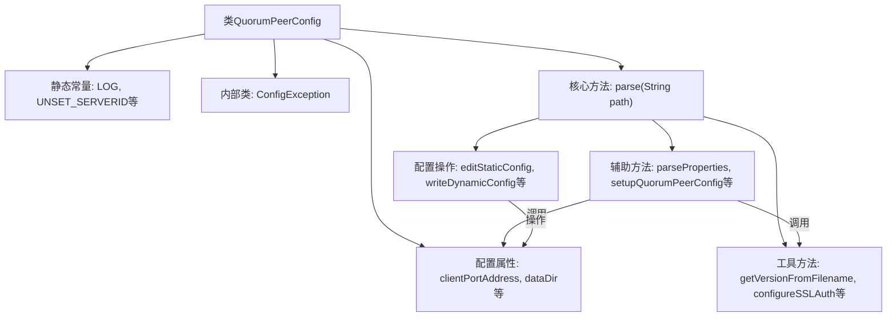

# 基础信息

|      |      |
|------|------|
| 名称 | QuorumPeerConfig |
| 编码语言 | .java |
| 代码路径 | zookeeper/zookeeper-server/src/main/java/org/apache/zookeeper/server/quorum/QuorumPeerConfig.java |
| 包名 | org.apache.zookeeper.server.quorum |
| 依赖项 | ['org.apache.zookeeper.common.NetUtils.formatInetAddr', 'java.io.BufferedReader', 'java.io.File', 'java.io.FileInputStream', 'java.io.FileReader', 'java.io.IOException', 'java.io.InputStream', 'java.io.OutputStream', 'java.io.StringReader', 'java.io.Writer', 'java.net.InetAddress', 'java.net.InetSocketAddress', 'java.nio.file.Files', 'java.util.ArrayList', 'java.util.Collections', 'java.util.List', 'java.util.Map', 'java.util.Map.Entry', 'java.util.Properties', 'org.apache.yetus.audience.InterfaceAudience', 'org.apache.zookeeper.common.AtomicFileWritingIdiom', 'org.apache.zookeeper.common.AtomicFileWritingIdiom.OutputStreamStatement', 'org.apache.zookeeper.common.AtomicFileWritingIdiom.WriterStatement', 'org.apache.zookeeper.common.ClientX509Util', 'org.apache.zookeeper.common.PathUtils', 'org.apache.zookeeper.common.StringUtils', 'org.apache.zookeeper.common.Time', 'org.apache.zookeeper.metrics.impl.DefaultMetricsProvider', 'org.apache.zookeeper.server.ZooKeeperServer', 'org.apache.zookeeper.server.auth.ProviderRegistry', 'org.apache.zookeeper.server.quorum.QuorumPeer.LearnerType', 'org.apache.zookeeper.server.quorum.QuorumPeer.QuorumServer', 'org.apache.zookeeper.server.quorum.auth.QuorumAuth', 'org.apache.zookeeper.server.quorum.flexible.QuorumHierarchical', 'org.apache.zookeeper.server.quorum.flexible.QuorumMaj', 'org.apache.zookeeper.server.quorum.flexible.QuorumOracleMaj', 'org.apache.zookeeper.server.quorum.flexible.QuorumVerifier', 'org.apache.zookeeper.server.util.JvmPauseMonitor', 'org.apache.zookeeper.server.util.VerifyingFileFactory', 'org.slf4j.Logger', 'org.slf4j.LoggerFactory', 'org.slf4j.MDC'] |
| 概述说明 | QuorumPeerConfig类用于配置ZooKeeper集群节点参数，包含端口、数据目录、会话超时、选举算法等核心配置项，支持动态配置和SSL认证，并处理服务器角色（参与者/观察者）及SASL安全验证。 |

# 说明

QuorumPeerConfig类是ZooKeeper中用于配置仲裁对等节点的核心类，主要功能包括解析静态和动态配置文件、管理集群成员信息及各项运行时参数。该类包含以下关键配置项：客户端端口地址、SSL设置、数据目录路径、会话超时控制、选举算法参数、快照保留策略、SASL认证开关、多地址支持标志等。通过parse()方法解析配置文件，支持动态配置更新，并验证配置合法性。类中还定义了服务器ID管理、端口绑定检查、节点角色设置等方法，同时提供对JVM暂停监控、指标收集等辅助功能的配置支持。配置异常通过ConfigException抛出，确保集群配置的正确性和一致性。

# 类列表 Class Summary

| 名称   | 类型  | 说明 |
|-------|------|-------------|
| QuorumPeerConfig | class | QuorumPeerConfig类用于配置ZooKeeper集群节点参数，包含端口、会话超时、数据目录、选举算法等设置，支持动态配置和SSL认证。 |

## 类 QuorumPeerConfig

|      |      |
|------|------|
| 访问范围 | @InterfaceAudience.Public;public |
| 类型 | class |
| 名称 | QuorumPeerConfig |
| 说明 | QuorumPeerConfig类用于配置ZooKeeper集群节点参数，包含端口、会话超时、数据目录、选举算法等设置，支持动态配置和SSL认证。 |

### UML类图

```mermaid
classDiagram
    class QuorumPeerConfig {
        -Logger LOG
        -int UNSET_SERVERID = -1
        +String nextDynamicConfigFileSuffix
        -static boolean standaloneEnabled
        -static boolean reconfigEnabled
        -InetSocketAddress clientPortAddress
        -InetSocketAddress secureClientPortAddress
        -boolean sslQuorum
        -boolean shouldUsePortUnification
        -int observerMasterPort
        -boolean sslQuorumReloadCertFiles
        -File dataDir
        -File dataLogDir
        -String dynamicConfigFileStr
        -String configFileStr
        -int tickTime
        -int maxClientCnxns
        -int minSessionTimeout
        -int maxSessionTimeout
        -String metricsProviderClassName
        -Properties metricsProviderConfiguration
        -boolean localSessionsEnabled
        -boolean localSessionsUpgradingEnabled
        -int clientPortListenBacklog
        -int initLimit
        -int syncLimit
        -int connectToLearnerMasterLimit
        -int electionAlg
        -int electionPort
        -boolean quorumListenOnAllIPs
        -long serverId
        -QuorumVerifier quorumVerifier
        -QuorumVerifier lastSeenQuorumVerifier
        -int snapRetainCount
        -int purgeIntervalInMs
        -boolean syncEnabled
        -String initialConfig
        -LearnerType peerType
        -boolean quorumServerRequireSasl
        -boolean quorumLearnerRequireSasl
        -boolean quorumEnableSasl
        -String quorumServicePrincipal
        -String quorumLearnerLoginContext
        -String quorumServerLoginContext
        -int quorumCnxnThreadsSize
        -boolean multiAddressEnabled
        -boolean multiAddressReachabilityCheckEnabled
        -int multiAddressReachabilityCheckTimeoutMs
        -String oraclePath
        -int MIN_SNAP_RETAIN_COUNT = 3
        -boolean jvmPauseMonitorToRun
        -long jvmPauseWarnThresholdMs
        -long jvmPauseInfoThresholdMs
        -long jvmPauseSleepTimeMs
        +parse(String path) void throws ConfigException
        +parseProperties(Properties zkProp) void throws IOException, ConfigException
        +setupQuorumPeerConfig(Properties prop, boolean configBackwardCompatibilityMode) void throws IOException, ConfigException
        +getVersionFromFilename(String filename) String
        +configureSSLAuth() void throws ConfigException
        +backupOldConfig() void throws IOException
        +writeDynamicConfig(String dynamicConfigFilename, QuorumVerifier qv, boolean needKeepVersion) void throws IOException
        +editStaticConfig(String configFileStr, String dynamicFileStr, boolean eraseClientPortAddress, boolean eraseSecureClientPortAddress) void throws IOException
        +deleteFile(String filename) void
        -createQuorumVerifier(Properties dynamicConfigProp, boolean isHierarchical, String oraclePath) QuorumVerifier throws ConfigException
        -createQuorumVerifier(Properties dynamicConfigProp, boolean isHierarchical) QuorumVerifier throws ConfigException
        -setupMyId() void throws IOException
        -setupClientPort() void throws ConfigException
        -setupSecureClientPort() void throws ConfigException
        -setupPeerType() void
        -checkValidity() void throws IOException, ConfigException
        -parseBoolean(String key, String value) boolean throws ConfigException
        +getClientPortAddress() InetSocketAddress
        +getSecureClientPortAddress() InetSocketAddress
        +getObserverMasterPort() int
        +getDataDir() File
        +getDataLogDir() File
        +getInitialConfig() String
        +getTickTime() int
        +getMaxClientCnxns() int
        +getMinSessionTimeout() int
        +getMaxSessionTimeout() int
        +getMetricsProviderClassName() String
        +getMetricsProviderConfiguration() Properties
        +areLocalSessionsEnabled() boolean
        +isLocalSessionsUpgradingEnabled() boolean
        +isSslQuorum() boolean
        +shouldUsePortUnification() boolean
        +getClientPortListenBacklog() int
        +getInitLimit() int
        +getSyncLimit() int
        +getConnectToLearnerMasterLimit() int
        +getElectionAlg() int
        +getElectionPort() int
        +getSnapRetainCount() int
        +getPurgeIntervalInMs() int
        +getSyncEnabled() boolean
        +getQuorumVerifier() QuorumVerifier
        +getLastSeenQuorumVerifier() QuorumVerifier
        +getServers() Map~Long, QuorumServer~
        +getJvmPauseInfoThresholdMs() long
        +getJvmPauseWarnThresholdMs() long
        +getJvmPauseSleepTimeMs() long
        +isJvmPauseMonitorToRun() boolean
        +getServerId() long
        +isDistributed() boolean
        +getPeerType() LearnerType
        +getConfigFilename() String
        +getQuorumListenOnAllIPs() Boolean
        +isMultiAddressEnabled() boolean
        +isMultiAddressReachabilityCheckEnabled() boolean
        +getMultiAddressReachabilityCheckTimeoutMs() int
        +isStandaloneEnabled() boolean
        +setStandaloneEnabled(boolean enabled) void
        +isReconfigEnabled() boolean
        +setReconfigEnabled(boolean enabled) void
    }

    class ConfigException {
        +ConfigException(String msg)
        +ConfigException(String msg, Exception e)
    }

    class QuorumVerifier {
        <<Interface>>
        +getVotingMembers() Map~Long, QuorumServer~
        +getObservingMembers() Map~Long, QuorumServer~
        +getAllMembers() Map~Long, QuorumServer~
    }

    class QuorumMaj {
        +QuorumMaj(Properties dynamicConfigProp)
    }

    class QuorumHierarchical {
        +QuorumHierarchical(Properties dynamicConfigProp)
    }

    class QuorumOracleMaj {
        +QuorumOracleMaj(Properties dynamicConfigProp, String oraclePath)
    }

    QuorumPeerConfig --> ConfigException : throws
    QuorumPeerConfig --> QuorumVerifier : uses
    QuorumVerifier <|-- QuorumMaj
    QuorumVerifier <|-- QuorumHierarchical
    QuorumVerifier <|-- QuorumOracleMaj
```

这段代码定义了一个ZooKeeper的QuorumPeer配置类，用于解析和管理ZooKeeper服务器的配置参数。QuorumPeerConfig类包含了大量的配置属性，如端口设置、会话超时、数据目录等，并提供了配置解析、验证和动态配置管理的方法。它还定义了内部异常类ConfigException和QuorumVerifier接口及其实现类，用于处理集群配置验证。该类支持静态和动态配置管理，能够处理多种集群配置场景，包括SSL认证、SASL认证和多种选举算法配置。

### 内部方法调用关系图

流程图描述：
该流程图展示了ZooKeeper的QuorumPeerConfig类结构，核心是parse方法处理配置文件，分为三个逻辑层：1) 主解析流程调用parseProperties处理属性；2) 动态配置处理涉及setupQuorumPeerConfig和版本控制；3) 文件操作层包含editStaticConfig等IO操作。类包含40+配置属性和10+工具方法，支持静态/动态配置、SSL认证、多地址等特性，通过ConfigException处理配置错误，整体构成ZooKeeper集群配置管理的核心组件。

### 字段列表 Field List

| 名称  | 类型  | 说明 |
|-------|-------|------|
| minSessionTimeout = -1 | int | 受保护的整型变量minSessionTimeout，默认值为-1。 |
| electionAlg = 3 | int | 保护级别整型变量electionAlg，初始值为3。 |
| configFileStr = null | String | 声明一个受保护的字符串变量configFileStr，初始值为null。 |
| dataLogDir | File | 声明一个受保护的File类型变量dataLogDir。 |
| oraclePath | String | 声明了一个受保护的字符串变量oraclePath。 |
| clientPortListenBacklog = -1 | int | 客户端端口监听队列大小，默认值为-1。 |
| electionPort = 2182 | int | 保护类型整型变量electionPort，默认值2182。 |
| sslQuorumReloadCertFiles = false | boolean | SSL仲裁证书文件不自动重载。 |
| tickTime = ZooKeeperServer.DEFAULT_TICK_TIME | int | ZooKeeper服务器默认心跳间隔时间，受保护整型变量tickTime。 |
| connectToLearnerMasterLimit | int | 受保护的整型变量，用于限制连接到学习主节点的数量。 |
| maxClientCnxns = 60 | int | 受保护的整型变量maxClientCnxns，默认值为60。 |
| jvmPauseInfoThresholdMs = JvmPauseMonitor.INFO_THRESHOLD_DEFAULT | long | JVM暂停信息阈值设为默认值。 |
| UNSET_SERVERID = -1 | int | 声明一个私有静态常量UNSET_SERVERID，值为-1，表示未设置服务器ID。 |
| quorumServerLoginContext = QuorumAuth.QUORUM_SERVER_SASL_LOGIN_CONTEXT_DFAULT_VALUE | String | 该代码定义了一个受保护的字符串变量quorumServerLoginContext，其默认值为QuorumAuth.QUORUM_SERVER_SASL_LOGIN_CONTEXT_DFAULT_VALUE。 |
| observerMasterPort | int | 保护类型整型变量observerMasterPort，用于存储主观察者端口号。 |
| jvmPauseWarnThresholdMs = JvmPauseMonitor.WARN_THRESHOLD_DEFAULT | long | JVM暂停警告阈值设为默认值。 |
| multiAddressReachabilityCheckEnabled =        Boolean.parseBoolean(System.getProperty(QuorumPeer.CONFIG_KEY_MULTI_ADDRESS_REACHABILITY_CHECK_ENABLED, "true")) | boolean | 私有布尔变量multiAddressReachabilityCheckEnabled，通过系统属性QuorumPeer.CONFIG_KEY_MULTI_ADDRESS_REACHABILITY_CHECK_ENABLED获取值，默认true。 |
| quorumServerRequireSasl = false | boolean | 保护布尔变量quorumServerRequireSasl默认值为false，控制是否要求SASL认证。 |
| dynamicConfigFileStr = null | String | 动态配置字符串变量初始化为空。 |
| quorumEnableSasl = false | boolean | 保护布尔变量quorumEnableSasl默认值为false。 |
| metricsProviderConfiguration = new Properties() | Properties | 声明并初始化一个受保护的Properties对象metricsProviderConfiguration。 |
| lastSeenQuorumVerifier = null | QuorumVerifier | 声明两个受保护的QuorumVerifier类型变量：quorumVerifier和lastSeenQuorumVerifier，初始值均为null。 |
| localSessionsUpgradingEnabled = false | boolean | 本地会话升级功能已禁用。 |
| multiAddressReachabilityCheckTimeoutMs =        Integer.parseInt(System.getProperty(QuorumPeer.CONFIG_KEY_MULTI_ADDRESS_REACHABILITY_CHECK_TIMEOUT_MS,                                            String.valueOf(MultipleAddresses.DEFAULT_TIMEOUT.toMillis()))) | int | 代码片段从系统属性读取多地址可达性检查超时时间，未设置时使用默认值。 |
| peerType = LearnerType.PARTICIPANT | LearnerType | 声明一个受保护的LearnerType变量peerType，初始值为PARTICIPANT。 |
| jvmPauseSleepTimeMs = JvmPauseMonitor.SLEEP_TIME_MS_DEFAULT | long | 该代码定义了一个受保护的长整型变量jvmPauseSleepTimeMs，并初始化为JvmPauseMonitor的默认休眠时间值。 |
| syncEnabled = true | boolean | 同步功能默认启用。 |
| sslQuorum = false | boolean | 保护成员变量sslQuorum，默认值为false，用于控制SSL加密是否启用。 |
| quorumCnxnThreadsSize | int | 保护型整型变量，用于记录法定连接线程池大小。 |
| initLimit | int | 保护整型变量initLimit，用于初始化限制。 |
| multiAddressEnabled = Boolean.parseBoolean(        System.getProperty(QuorumPeer.CONFIG_KEY_MULTI_ADDRESS_ENABLED, QuorumPeer.CONFIG_DEFAULT_MULTI_ADDRESS_ENABLED)) | boolean | 私有布尔变量multiAddressEnabled通过系统属性QuorumPeer.CONFIG_KEY_MULTI_ADDRESS_ENABLED获取，默认值为QuorumPeer.CONFIG_DEFAULT_MULTI_ADDRESS_ENABLED。 |
| MIN_SNAP_RETAIN_COUNT = 3 | int | 私有常量MIN_SNAP_RETAIN_COUNT值为3，表示最小快照保留数量。 |
| jvmPauseMonitorToRun = false | boolean | 保护布尔变量jvmPauseMonitorToRun初始值为false。 |
| initialConfig | String | 声明了一个受保护的字符串变量initialConfig。 |
| standaloneEnabled = true | boolean | 私有静态布尔变量standaloneEnabled初始值为true。 |
| maxSessionTimeout = -1 | int | 受保护的整型变量maxSessionTimeout，默认值为-1。 |
| nextDynamicConfigFileSuffix = ".dynamic.next" | String | 静态常量字符串，定义动态配置文件的后续命名后缀为“.dynamic.next”。 |
| clientPortAddress | InetSocketAddress | 受保护的InetSocketAddress类型变量clientPortAddress。 |
| dataDir | File | 声明一个受保护的文件目录变量dataDir。 |
| LOG = LoggerFactory.getLogger(QuorumPeerConfig.class) | Logger | QuorumPeerConfig类中定义了一个私有静态日志记录器LOG，用于记录日志信息。 |
| reconfigEnabled = false | boolean | 私有静态布尔变量reconfigEnabled初始值为false。 |
| purgeIntervalInMs = 0 | int | 保护整型变量purgeIntervalInMs，初始值为0毫秒。 |
| snapRetainCount = 3 | int | 保护整型变量snapRetainCount，默认值为3。 |
| shouldUsePortUnification = false | boolean | 保护布尔变量shouldUsePortUnification初始值为false。 |
| serverId = UNSET_SERVERID | long | 声明一个受保护的长整型变量serverId，初始值为UNSET_SERVERID。 |
| localSessionsEnabled = false | boolean | 本地会话功能已禁用。 |
| metricsProviderClassName = DefaultMetricsProvider.class.getName() | String | 代码定义了一个受保护的字符串变量metricsProviderClassName，其值为DefaultMetricsProvider类的全限定名。 |
| quorumLearnerLoginContext = QuorumAuth.QUORUM_LEARNER_SASL_LOGIN_CONTEXT_DFAULT_VALUE | String | 保护字符串变量quorumLearnerLoginContext，赋值为QuorumAuth类中的默认SASL登录上下文常量。 |
| syncLimit | int | 同步限制的整型保护变量。 |
| quorumLearnerRequireSasl = false | boolean | 这是一个Java代码片段，定义了一个受保护的布尔变量quorumLearnerRequireSasl，初始值为false，用于控制是否要求SASL认证。 |
| quorumServicePrincipal = QuorumAuth.QUORUM_KERBEROS_SERVICE_PRINCIPAL_DEFAULT_VALUE | String | 保护字符串quorumServicePrincipal设为QuorumAuth默认Kerberos服务主体值。 |
| secureClientPortAddress | InetSocketAddress | 受保护的InetSocketAddress安全客户端端口地址。 |
| quorumListenOnAllIPs = false | boolean | 保护布尔变量quorumListenOnAllIPs默认值为false。 |

### 方法列表 Method List

| 名称  | 类型  | 说明 |
|-------|-------|------|
| isDistributed | boolean | 检查是否为分布式系统：需满足quorumVerifier非空且（独立模式禁用或投票成员数大于1）。 |
| isJvmPauseMonitorToRun | boolean | 方法返回布尔值jvmPauseMonitorToRun，表示是否运行JVM暂停监控。 |
| getVersionFromFilename | String | 从文件名提取版本号：取最后一个点后的16进制字符串转为长整型，再转回16进制字符串返回，无效则返回null。 |
| getQuorumVerifier | QuorumVerifier | 获取法定人数验证器的方法，返回quorumVerifier对象。 |
| getObserverMasterPort | int | 获取观察者主端口号的方法，返回整型值observerMasterPort。 |
| getJvmPauseWarnThresholdMs | long | 方法返回JVM暂停警告阈值毫秒值。 |
| getMaxSessionTimeout | int | 方法返回最大会话超时时间。 |
| getSecureClientPortAddress | InetSocketAddress | 获取安全客户端端口地址的方法，返回InetSocketAddress类型值。 |
| parseProperties | void | 解析ZooKeeper配置属性，包括端口、目录、会话参数、SSL设置等，并进行有效性校验和默认值处理。 |
| getSyncEnabled | boolean | 方法返回布尔值syncEnabled，表示同步是否启用。 |
| getClientPortAddress | InetSocketAddress | 方法返回客户端端口地址的InetSocketAddress对象。 |
| backupOldConfig | void | 备份旧配置文件到.bak文件，使用原子写入和流复制确保数据完整性。 |
| getDataLogDir | File | 获取数据日志目录的方法，返回dataLogDir对象。 |
| getElectionPort | int | 获取选举端口号的方法，返回整型变量electionPort的值。 |
| getInitLimit | int | 获取初始限制值的方法，返回整型变量initLimit。 |
| setupMyId | void | 方法setupMyId从文件myid读取服务器ID，若文件不存在则跳过。读取内容转为长整型并存入MDC，非数字则抛出异常。 |
| checkValidity | void | 检查分布式配置有效性：若为分布式模式，需验证initLimit、syncLimit和serverId是否设置，否则抛出异常。 |
| getElectionAlg | int | 这是一个Java方法，返回选举算法类型值electionAlg。方法名为getElectionAlg，访问修饰符为public，返回类型为int。 |
| getConnectToLearnerMasterLimit | int | 该方法返回连接学习者主节点的限制值。 |
| writeDynamicConfig | void | 静态方法writeDynamicConfig将动态配置写入文件，处理QuorumVerifier数据，过滤版本信息并按需排序输出。 |
| getSyncLimit | int | 获取同步限制值的方法，返回syncLimit变量。 |
| shouldUsePortUnification | boolean | 方法返回是否使用端口统一的布尔值。 |
| getSnapRetainCount | int | 该方法返回snapRetainCount的整数值。 |
| getMetricsProviderConfiguration | Properties | 获取metricsProviderConfiguration配置属性的公共方法。 |
| getJvmPauseSleepTimeMs | long | 获取JVM暂停休眠时间（毫秒）。 |
| getMaxClientCnxns | int | 方法返回最大客户端连接数maxClientCnxns。 |
| getTickTime | int | 方法getTickTime返回整型变量tickTime的值。 |
| getJvmPauseInfoThresholdMs | long | 获取JVM暂停信息阈值毫秒值的方法。 |
| getMinSessionTimeout | int | 方法返回最小会话超时时间。 |
| getInitialConfig | String | 这是一个Java方法，返回字符串类型的初始配置值。方法名为getInitialConfig，无参数，直接返回成员变量initialConfig。 |
| getServers | Map<Long, QuorumServer> | 该方法返回所有配置服务器（参与者和观察者）的不可修改映射，键为Long类型，值为QuorumServer对象。 |
| getLastSeenQuorumVerifier | QuorumVerifier | 获取最近使用的Quorum验证器实例。 |
| getDataDir | File | 该方法返回数据目录对象。 |
| parse | void | 解析配置文件方法：读取指定路径的配置文件，验证文件有效性并加载属性。处理动态配置文件，检查版本和内容格式，设置集群配置。若存在下一动态配置文件，解析并创建仲裁验证器。异常时抛出配置错误。 |
| configureSSLAuth | void | 方法configureSSLAuth配置SSL认证，检查系统属性是否设置x509认证提供者，未设置则默认使用ZooKeeper的X509AuthenticationProvider，否则抛出异常。 |
| parseDynamicConfig | QuorumVerifier | 解析动态配置生成QuorumVerifier，检查参数有效性。若配置含group或weight则为层级结构，否则验证参数合法性。检查参与者和观察者数量，确保至少3个参与者且为奇数，否则警告或报错。验证选举端口存在。返回QuorumVerifier实例。 |
| setupSecureClientPort | void | 方法检查并确保安全客户端端口配置一致，若静态与动态配置不符则抛出异常，否则同步配置信息。 |
| createQuorumVerifier | QuorumVerifier | 根据isHierarchical参数选择创建QuorumHierarchical或默认QuorumMaj实例，均需dynamicConfigProp参数，可能抛出ConfigException。 |
| isSslQuorum | boolean | 这是一个Java方法，返回布尔值sslQuorum，表示是否启用SSL加密的仲裁通信。 |
| createQuorumVerifier | QuorumVerifier | 根据参数创建QuorumVerifier：若oraclePath为空调用原方法，否则创建QuorumOracleMaj实例。 |
| getPurgeIntervalInMs | int | 该方法返回整型变量purgeIntervalInMs的值，单位为毫秒。 |
| isLocalSessionsUpgradingEnabled | boolean | 该方法返回本地会话升级功能是否启用的布尔值。 |
| setupClientPort | void | 方法setupClientPort验证并同步客户端端口配置。若serverId未设置则返回。检查静态与动态配置的客户端地址是否一致，不一致则抛出异常。动态配置优先，若动态配置缺失则使用静态配置并标记来源。 |
| setupPeerType | void | 方法检查服务器列表中当前服务器的角色类型（观察者或参与者），若与预设角色不一致，则发出警告并采用列表中的角色类型。 |
| deleteFile | void | 静态方法deleteFile接收文件名，若文件存在则删除，失败时记录警告日志。 |
| getMetricsProviderClassName | String | 方法返回metricsProviderClassName字符串值。 |
| areLocalSessionsEnabled | boolean | 检查本地会话是否启用，返回布尔值。 |
| getClientPortListenBacklog | int | 方法返回客户端端口监听队列长度。 |
| getServerId | long | 获取服务器ID的方法，返回长整型数值serverId。 |
| editStaticConfig | void | 静态配置编辑方法，处理文件路径验证，过滤特定属性后写入更新内容，并动态更新文件指针。 |
| setupQuorumPeerConfig | void | 方法配置ZooKeeper仲裁节点参数，包括动态配置解析、节点ID、客户端端口、安全端口、节点类型及有效性检查。 |
| getPeerType | LearnerType | 获取peerType的方法，返回LearnerType类型。 |
| getConfigFilename | String | 该方法返回配置文件名，变量为configFileStr。 |
| getQuorumListenOnAllIPs | Boolean | 这是一个Java方法，返回布尔值quorumListenOnAllIPs，表示是否监听所有IP。 |
| isMultiAddressEnabled | boolean | 方法isMultiAddressEnabled返回布尔值multiAddressEnabled的状态。 |
| isMultiAddressReachabilityCheckEnabled | boolean | 该方法返回布尔值，表示多地址可达性检查是否启用。 |
| getMultiAddressReachabilityCheckTimeoutMs | int | 该方法返回多地址可达性检查的超时时间（毫秒）。 |
| isStandaloneEnabled | boolean | 检查是否启用独立模式。返回布尔值standaloneEnabled。 |
| setStandaloneEnabled | void | 这是一个Java静态方法，用于设置standaloneEnabled布尔变量的值。方法接受一个布尔参数enabled，并将其赋值给类变量standaloneEnabled。 |
| isReconfigEnabled | boolean | 检查是否启用重新配置功能。 |
| setReconfigEnabled | void | 设置重新配置功能的开关状态。参数enabled控制是否启用重新配置。 |
| parseBoolean | boolean | 解析字符串为布尔值，若为"true"或"false"返回对应值，否则抛出异常提示必须为'true'或'false'。 |

