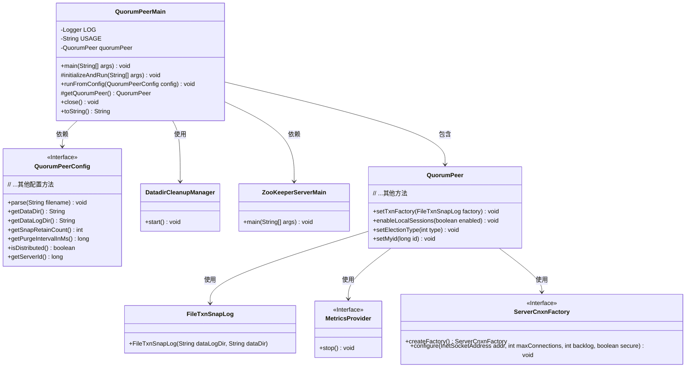

# 基础信息

|      |      |
|------|------|
| 名称 | QuorumPeerMain |
| 编码语言 | .java |
| 代码路径 | zookeeper/zookeeper-server/src/main/java/org/apache/zookeeper/server/quorum/QuorumPeerMain.java |
| 包名 | org.apache.zookeeper.server.quorum |
| 依赖项 | ['java.io.IOException', 'javax.management.JMException', 'javax.security.sasl.SaslException', 'org.apache.yetus.audience.InterfaceAudience', 'org.apache.zookeeper.audit.ZKAuditProvider', 'org.apache.zookeeper.jmx.ManagedUtil', 'org.apache.zookeeper.metrics.MetricsProvider', 'org.apache.zookeeper.metrics.MetricsProviderLifeCycleException', 'org.apache.zookeeper.metrics.impl.MetricsProviderBootstrap', 'org.apache.zookeeper.server.DatadirCleanupManager', 'org.apache.zookeeper.server.ExitCode', 'org.apache.zookeeper.server.ServerCnxnFactory', 'org.apache.zookeeper.server.ServerMetrics', 'org.apache.zookeeper.server.ZKDatabase', 'org.apache.zookeeper.server.ZooKeeperServerMain', 'org.apache.zookeeper.server.admin.AdminServer.AdminServerException', 'org.apache.zookeeper.server.auth.ProviderRegistry', 'org.apache.zookeeper.server.persistence.FileTxnSnapLog', 'org.apache.zookeeper.server.persistence.FileTxnSnapLog.DatadirException', 'org.apache.zookeeper.server.quorum.QuorumPeerConfig.ConfigException', 'org.apache.zookeeper.server.util.JvmPauseMonitor', 'org.apache.zookeeper.util.ServiceUtils', 'org.slf4j.Logger', 'org.slf4j.LoggerFactory'] |
| 概述说明 | QuorumPeerMain是ZooKeeper的主类，用于启动和管理分布式集群。它解析配置文件，初始化数据清理任务，并根据配置决定以集群或单机模式运行。支持多种异常处理和日志记录，确保服务稳定运行。 |

# 说明

QuorumPeerMain是ZooKeeper的公开类，用于启动和管理分布式仲裁节点。主方法处理命令行参数，调用initializeAndRun初始化配置并运行服务。支持分布式和独立模式，包含错误处理、日志记录和审计功能。runFromConfig方法配置仲裁节点参数，如端口、会话超时、选举算法等，并启动相关服务。支持SSL、SASL认证和指标监控，提供优雅关闭功能。

# 类列表 Class Summary

| 名称   | 类型  | 说明 |
|-------|------|-------------|
| QuorumPeerMain | class | QuorumPeerMain是ZooKeeper的法定节点主类，负责初始化配置、启动服务和处理异常。支持分布式和单机模式，包含数据清理、连接工厂、指标监控等功能，异常时记录日志并退出。 |


## 类 QuorumPeerMain

|      |      |
|------|------|
| 访问范围 | @InterfaceAudience.Public;public |
| 类型 | class |
| 名称 | QuorumPeerMain |
| 说明 | QuorumPeerMain是ZooKeeper的法定节点主类，负责初始化配置、启动服务和处理异常。支持分布式和单机模式，包含数据清理、连接工厂、指标监控等功能，异常时记录日志并退出。 |


### UML类图



类图描述：
该图展示了ZooKeeper中QuorumPeerMain类的核心结构及其关联组件。QuorumPeerMain作为分布式协调服务的入口点，负责初始化配置、启动清理管理器和创建QuorumPeer实例。QuorumPeer代表集群中的单个节点，依赖FileTxnSnapLog处理数据存储，使用MetricsProvider进行监控，并通过ServerCnxnFactory管理网络连接。类图清晰呈现了主程序与配置管理、网络通信、数据存储等模块的协作关系，体现了ZooKeeper分布式架构的关键设计。


### 内部方法调用关系图

```mermaid
graph TD
    A["类QuorumPeerMain"]
    B["属性: Logger LOG"]
    C["属性: String USAGE"]
    D["属性: QuorumPeer quorumPeer"]
    E["main方法: main(String[] args)"]
    F["方法: initializeAndRun(String[] args)"]
    G["方法: runFromConfig(QuorumPeerConfig config)"]
    H["方法: getQuorumPeer()"]
    I["方法: close()"]
    J["重写方法: toString()"]
    K["异常处理: IllegalArgumentException"]
    L["异常处理: ConfigException"]
    M["异常处理: DatadirException"]
    N["异常处理: AdminServerException"]
    O["异常处理: Exception"]

    A --> B
    A --> C
    A --> D
    A --> E
    A --> F
    A --> G
    A --> H
    A --> I
    A --> J
    E --> F
    F -->|成功| G
    F -->|失败| K
    F -->|失败| L
    F -->|失败| M
    F -->|失败| N
    F -->|失败| O
    G --> H
    G -->|配置检查| '创建DatadirCleanupManager'
    G -->|模式判断| '调用ZooKeeperServerMain.main()或runFromConfig()'
    G -->|初始化| '注册Log4jMBeans'
    G -->|启动| '初始化MetricsProvider'
    G -->|网络配置| '创建ServerCnxnFactory'
    G -->|参数设置| '配置quorumPeer属性'
    G -->|启动服务| 'quorumPeer.start()'
```

这段代码是ZooKeeper服务器启动的核心类QuorumPeerMain，主要功能包括初始化集群配置、启动数据清理任务、根据配置选择独立/集群模式运行。流程图展示了从main方法入口到完整启动流程的调用关系，包含5种异常处理路径和核心配置加载过程，最终通过quorumPeer对象实现集群管理功能。该流程涉及日志记录、JMX监控、网络连接工厂创建等关键步骤，体现了高可用分布式系统的启动复杂性。

### 字段列表 Field List

| 名称  | 类型  | 说明 |
|-------|-------|------|
| LOG = LoggerFactory.getLogger(QuorumPeerMain.class) | Logger | QuorumPeerMain类中定义了一个私有静态日志记录器LOG，用于记录日志信息。 |
| USAGE = "Usage: QuorumPeerMain configfile" | String | QuorumPeerMain的启动命令需指定配置文件路径。 |
| quorumPeer | QuorumPeer | 声明一个受保护的QuorumPeer类实例变量quorumPeer。 |

### 方法列表 Method List

| 名称  | 类型  | 说明 |
|-------|-------|------|
| runFromConfig | void | 启动QuorumPeer服务，配置包括网络连接、会话参数、选举算法、SSL设置及SASL认证，初始化ZK数据库，启动监控并处理异常。 |
| getQuorumPeer | QuorumPeer | 创建QuorumPeer实例的方法，可能抛出SaslException异常。 |
| initializeAndRun | void | 方法初始化并运行ZooKeeper服务，解析配置后启动清理任务。若配置为分布式则运行集群模式，否则以单机模式启动。 |
| close | void | 关闭方法：若quorumPeer非空，先调用其shutdown方法，最终置空。 |
| main | void | 主程序启动QuorumPeerMain，处理初始化异常：参数错误、配置错误、数据目录访问失败、AdminServer启动失败等，记录日志并退出。正常结束时也记录日志并退出。 |
| toString | String | 重写toString方法，若quorumPeer非空则返回其字符串表示，否则返回空字符串。 |


