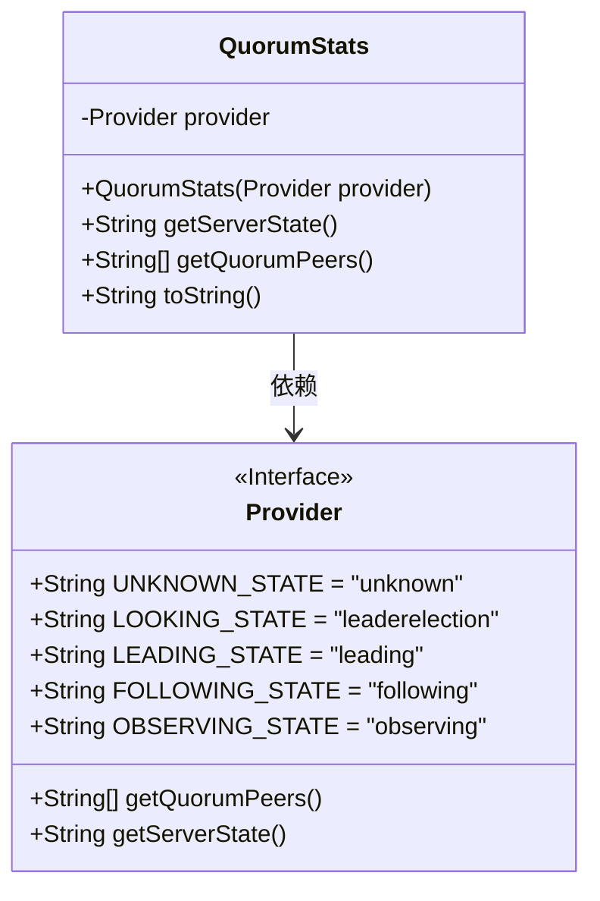
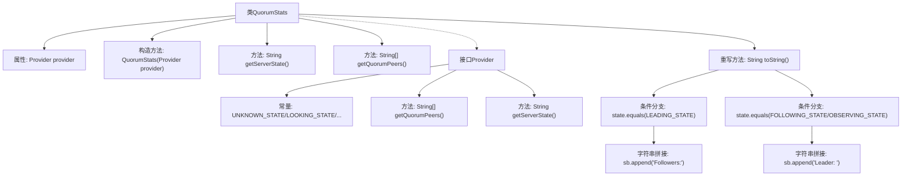

# 基础信息

|      |      |
|------|------|
| 名称 | QuorumStats |
| 编码语言 | .java |
| 代码路径 | zookeeper/zookeeper-server/src/main/java/org/apache/zookeeper/server/quorum/QuorumStats.java |
| 包名 | org.apache.zookeeper.server.quorum |
| 依赖项 | [] |
| 概述说明 | QuorumStats类用于管理集群状态，提供服务器状态和节点列表，支持领导者、跟随者等角色，并输出相关信息。 |

# 说明

QuorumStats类用于管理集群节点状态信息，包含Provider接口定义五种节点状态常量及获取节点列表和状态的方法。构造函数接收Provider实例，提供getServerState和getQuorumPeers方法获取状态和节点列表。toString方法根据当前状态生成不同格式的字符串输出：若为领导者状态则列出所有跟随者节点，若为跟随者或观察者状态则显示领导者节点信息，未连接时提示未连接。

# 类列表 Class Summary

| 名称   | 类型  | 说明 |
|-------|------|-------------|
| QuorumStats | class | QuorumStats类用于管理集群状态，提供获取服务器状态和节点列表的方法，并根据状态生成不同格式的字符串输出。 |

## 类 QuorumStats

|      |      |
|------|------|
| 访问范围 | public |
| 类型 | class |
| 名称 | QuorumStats |
| 说明 | QuorumStats类用于管理集群状态，提供获取服务器状态和节点列表的方法，并根据状态生成不同格式的字符串输出。 |

### UML类图

这段代码展示了一个QuorumStats类，它通过Provider接口获取集群状态信息。QuorumStats包含一个Provider实例，提供获取服务器状态(getServerState)和集群节点列表(getQuorumPeers)的方法，并重写toString()方法根据不同状态(LEADING/FOLLOWING/OBSERVING)生成不同的输出格式。Provider接口定义了5种状态常量和2个抽象方法，QuorumStats通过组合方式使用该接口，遵循了依赖倒置原则。

### 内部方法调用关系图

这段代码实现了一个ZooKeeper集群状态统计器，核心是通过Provider接口获取节点状态和集群成员信息。流程图展示了类结构关系和主要逻辑分支：当节点状态为LEADING时输出所有Follower列表，为FOLLOWING/OBSERVING时输出Leader信息。toString()方法通过条件判断和字符串拼接动态生成不同角色的拓扑信息，体现了状态模式的设计思想。接口Provider定义了五种节点状态常量和两个关键方法，实现了与具体实现的解耦。

### 字段列表 Field List

| 名称  | 类型  | 说明 |
|-------|-------|------|
| provider | Provider | 私有Provider实例变量。 |

### 方法列表 Method List

| 名称  | 类型  | 说明 |
|-------|-------|------|
| getServerState | String | 该方法返回服务器状态，调用provider的getServerState方法获取结果。 |
| getQuorumPeers | String[] | 获取法定节点列表的方法，调用provider的getQuorumPeers返回字符串数组。 |
| toString | String | 重写toString方法，根据服务器状态拼接信息：若为领导者则列出跟随者，若为跟随者或观察者则显示领导者，无连接时提示未连接。 |

