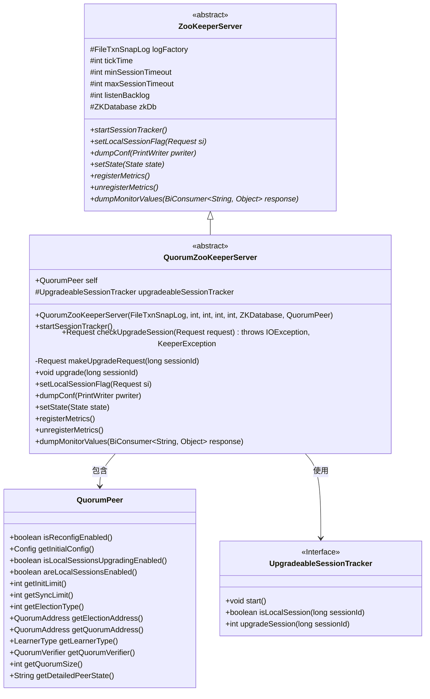
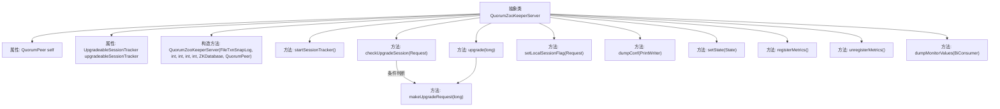

# 基础信息

|      |      |
|------|------|
| 名称 | QuorumZooKeeperServer |
| 编码语言 | .java |
| 代码路径 | zookeeper/zookeeper-server/src/main/java/org/apache/zookeeper/server/quorum/QuorumZooKeeperServer.java |
| 包名 | org.apache.zookeeper.server.quorum |
| 依赖项 | ['java.io.IOException', 'java.io.PrintWriter', 'java.util.Objects', 'java.util.function.BiConsumer', 'java.util.stream.Collectors', 'org.apache.zookeeper.CreateMode', 'org.apache.zookeeper.KeeperException', 'org.apache.zookeeper.MultiOperationRecord', 'org.apache.zookeeper.Op', 'org.apache.zookeeper.ZooDefs.OpCode', 'org.apache.zookeeper.metrics.MetricsContext', 'org.apache.zookeeper.proto.CreateRequest', 'org.apache.zookeeper.server.Request', 'org.apache.zookeeper.server.RequestRecord', 'org.apache.zookeeper.server.ServerMetrics', 'org.apache.zookeeper.server.ZKDatabase', 'org.apache.zookeeper.server.ZooKeeperServer', 'org.apache.zookeeper.server.persistence.FileTxnSnapLog', 'org.apache.zookeeper.txn.CreateSessionTxn'] |
| 概述说明 | QuorumZooKeeperServer扩展ZooKeeperServer，支持会话升级、本地会话管理及集群配置。包含会话检查、状态设置、指标注册和监控信息输出功能。 |

# 说明

QuorumZooKeeperServer是ZooKeeperServer的抽象子类，专用于集群环境。它通过QuorumPeer实例管理集群配置，并包含升级本地会话为全局会话的功能。核心逻辑包括：检查请求是否需要会话升级（针对创建临时节点的本地会话），生成升级请求并提交到集群。类还实现了会话跟踪器启动、状态管理、监控指标注册/注销及配置信息输出等功能，支持动态调整集群参数如initLimit、syncLimit等。所有操作均线程安全，确保在分布式环境下的正确性。

# 类列表 Class Summary

| 名称   | 类型  | 说明 |
|-------|------|-------------|
| QuorumZooKeeperServer | class | QuorumZooKeeperServer是ZooKeeper的集群版本，扩展了ZooKeeperServer功能，支持会话升级、配置转储和监控指标注册。 |

## 类 QuorumZooKeeperServer

|      |      |
|------|------|
| 访问范围 | public abstract |
| 类型 | class |
| 名称 | QuorumZooKeeperServer |
| 说明 | QuorumZooKeeperServer是ZooKeeper的集群版本，扩展了ZooKeeperServer功能，支持会话升级、配置转储和监控指标注册。 |

### UML类图

这段代码描述了一个ZooKeeper集群服务器的抽象类`QuorumZooKeeperServer`，它继承自`ZooKeeperServer`并扩展了集群相关的功能。该类主要处理会话升级、本地会话管理、配置转储和监控指标注册等功能。通过`QuorumPeer`获取集群配置信息，使用`UpgradeableSessionTracker`接口管理会话升级过程。类图中清晰地展示了继承关系、依赖关系和主要方法，体现了该组件在ZooKeeper集群中的核心协调作用。

### 内部方法调用关系图

这段代码展示了QuorumZooKeeperServer类的结构，这是一个抽象类，继承自ZooKeeperServer。主要功能包括会话管理（如会话升级、本地会话标志设置）、配置信息输出、状态管理和监控指标注册/注销。核心逻辑集中在会话升级流程，通过checkUpgradeSession和makeUpgradeRequest方法实现本地会话到全局会话的转换，同时维护了与QuorumPeer的关联关系。类中还包含多种辅助方法用于系统监控和状态管理，体现了ZooKeeper服务器在集群环境中的特殊处理逻辑。

### 字段列表 Field List

| 名称  | 类型  | 说明 |
|-------|-------|------|
| upgradeableSessionTracker | UpgradeableSessionTracker | 受保护的升级会话追踪器变量upgradeableSessionTracker。 |
| self | QuorumPeer | QuorumPeer类的final实例变量self。 |

### 方法列表 Method List

| 名称  | 类型  | 说明 |
|-------|-------|------|
| setState | void | 重写setState方法，更新当前状态。 |
| unregisterMetrics | void | 覆盖方法unregisterMetrics，先调用父类方法，再获取根上下文并取消注册名为quorum_size的指标。 |
| upgrade | void | 方法upgrade接收sessionId参数，创建升级请求。若请求非空，记录日志并提交全局请求。 |
| registerMetrics | void | 重写父类方法注册指标，添加自定义指标quorum_size，其值通过getQuorumSize方法动态获取。 |
| dumpMonitorValues | void | 重写方法dumpMonitorValues，调用父类方法后，添加peer_state及其详细状态到响应中。 |
| checkUpgradeSession | Request | 检查并升级会话请求：若请求被限流或非创建临时节点操作则返回空；否则验证是否为本地会话且支持升级，最终生成升级请求或抛出异常。 |
| makeUpgradeRequest | Request | 私有方法生成升级请求，同步检查本地会话状态并升级，创建新会话请求后返回，否则返回空。 |
| setLocalSessionFlag | void | 方法setLocalSessionFlag根据请求类型设置本地会话标志：创建会话时若启用本地会话则设为true；关闭会话时检查是否为本地会话并相应设置标志，记录日志。其他情况不处理。 |
| dumpConf | void | 重写dumpConf方法，输出配置信息：initLimit、syncLimit、electionAlg、electionPort、quorumPort、peerType及membership详情。 |
| startSessionTracker | void | 重写startSessionTracker方法，将sessionTracker转为UpgradeableSessionTracker并启动。 |

