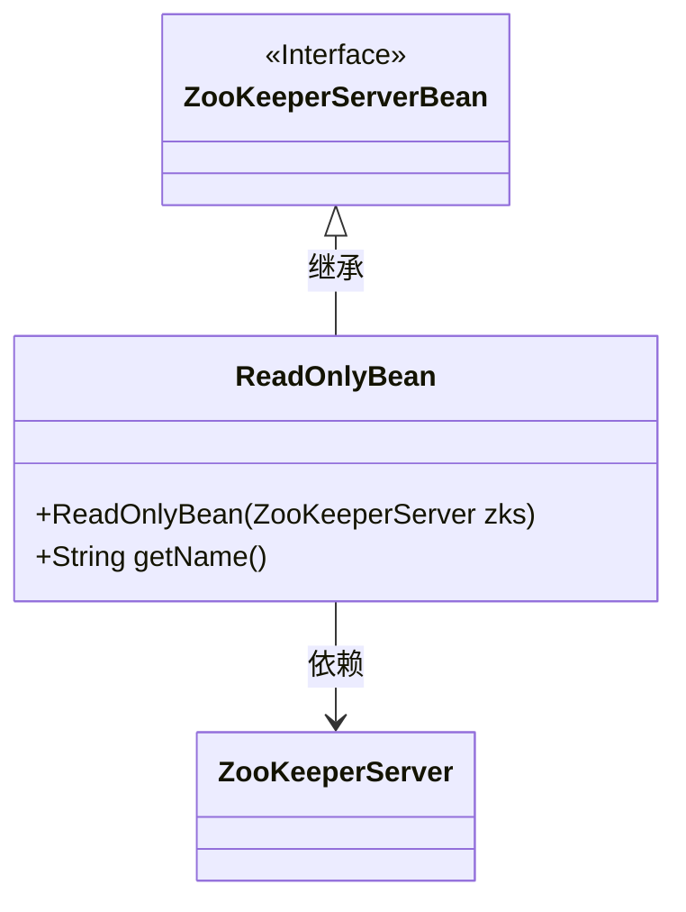
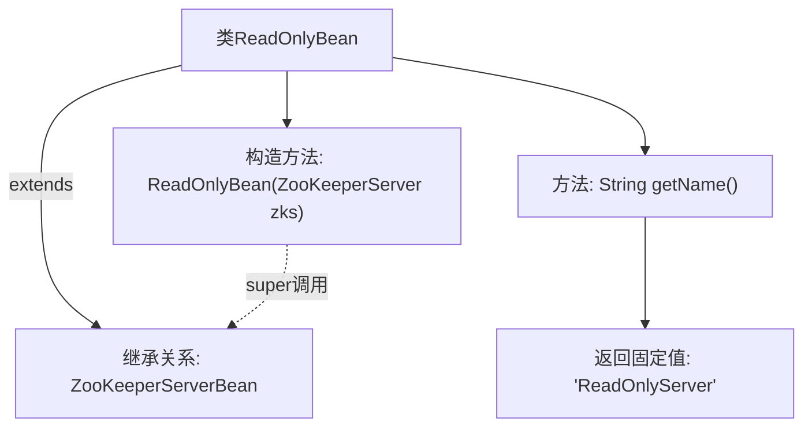

# 基础信息

|      |      |
|------|------|
| 名称 | ReadOnlyBean |
| 编码语言 | .java |
| 代码路径 | zookeeper/zookeeper-server/src/main/java/org/apache/zookeeper/server/quorum/ReadOnlyBean.java |
| 包名 | org.apache.zookeeper.server.quorum |
| 依赖项 | ['org.apache.zookeeper.server.ZooKeeperServer', 'org.apache.zookeeper.server.ZooKeeperServerBean'] |
| 概述说明 | ReadOnlyBean继承ZooKeeperServerBean，构造方法接收ZooKeeperServer参数，getName方法返回"ReadOnlyServer"。 |

# 说明

该内容描述了一个名为ReadOnlyBean的Java类，该类继承自ZooKeeperServerBean。它包含一个构造函数，接受ZooKeeperServer类型的参数并调用父类构造函数。此外，该类重写了getName方法，返回固定字符串"ReadOnlyServer"。这个类主要用于表示只读服务器相关的功能或属性。

# 类列表 Class Summary

| 名称   | 类型  | 说明 |
|-------|------|-------------|
| ReadOnlyBean | class | ReadOnlyBean继承ZooKeeperServerBean，构造方法接收ZooKeeperServer参数，getName方法返回"ReadOnlyServer"。 |

## 类 ReadOnlyBean

|      |      |
|------|------|
| 访问范围 | public |
| 类型 | class |
| 名称 | ReadOnlyBean |
| 说明 | ReadOnlyBean继承ZooKeeperServerBean，构造方法接收ZooKeeperServer参数，getName方法返回"ReadOnlyServer"。 |

### UML类图

这段代码展示了一个继承关系，其中ReadOnlyBean类实现了ZooKeeperServerBean接口，并包含一个构造方法和获取名称的方法。类图清晰地表达了这种层级结构和依赖关系，ReadOnlyBean通过继承获得基础功能，同时依赖ZooKeeperServer类完成初始化。

### 内部方法调用关系图

该流程图展示了ReadOnlyBean类的结构，它是一个继承自ZooKeeperServerBean的子类。主要包含一个构造方法（通过super调用父类构造）和一个返回固定字符串"ReadOnlyServer"的getName方法。继承关系通过实线箭头标注，方法调用通过虚线箭头表示super调用，体现了简单的类层次结构和单一职责设计。

### 字段列表 Field List

| 名称  | 类型  | 说明 |
|-------|-------|------|

### 方法列表 Method List

| 名称  | 类型  | 说明 |
|-------|-------|------|
| getName | String | 方法返回字符串"ReadOnlyServer"。 |

