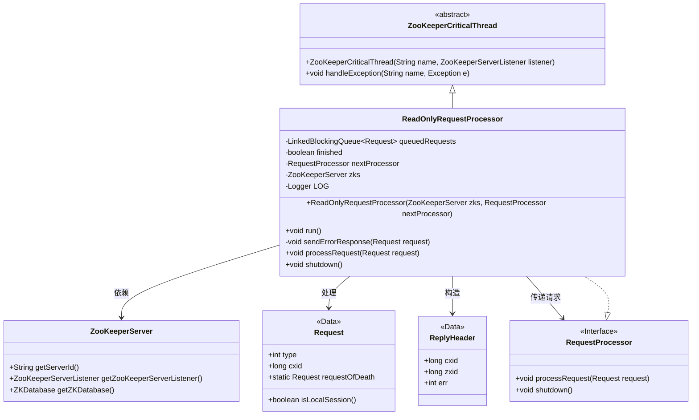
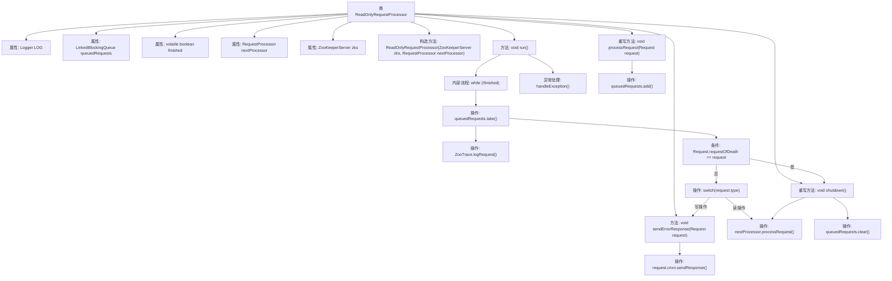

# 基础信息

|      |      |
|------|------|
| 名称 | ReadOnlyRequestProcessor |
| 编码语言 | .java |
| 代码路径 | zookeeper/zookeeper-server/src/main/java/org/apache/zookeeper/server/quorum/ReadOnlyRequestProcessor.java |
| 包名 | org.apache.zookeeper.server.quorum |
| 依赖项 | ['java.io.IOException', 'java.util.concurrent.LinkedBlockingQueue', 'org.apache.zookeeper.KeeperException.Code', 'org.apache.zookeeper.ZooDefs.OpCode', 'org.apache.zookeeper.proto.ReplyHeader', 'org.apache.zookeeper.server.Request', 'org.apache.zookeeper.server.RequestProcessor', 'org.apache.zookeeper.server.ZooKeeperCriticalThread', 'org.apache.zookeeper.server.ZooKeeperServer', 'org.apache.zookeeper.server.ZooTrace', 'org.slf4j.Logger', 'org.slf4j.LoggerFactory'] |
| 概述说明 | 这是一个ZooKeeper的只读请求处理器类，继承自ZooKeeperCriticalThread并实现RequestProcessor接口。主要功能是过滤非读请求并转发合法请求到下一处理器。包含请求队列、异常处理和关闭逻辑。 |

# 说明

该代码定义了一个名为ReadOnlyRequestProcessor的类，继承自ZooKeeperCriticalThread并实现RequestProcessor接口。其主要功能是处理只读请求，过滤非读操作并转发合法请求。类中包含一个阻塞队列queuedRequests用于存储待处理请求，通过volatile变量finished控制线程运行状态。构造函数接收ZooKeeperServer实例和下一个处理器nextProcessor。run方法循环处理队列请求，记录日志并过滤写操作，对非法请求返回NOTREADONLY错误。合法请求会传递给nextProcessor处理。shutdown方法用于终止处理器，清空队列并通知下游处理器。异常处理通过handleException方法实现。

# 类列表 Class Summary

| 名称   | 类型  | 说明 |
|-------|------|-------------|
| ReadOnlyRequestProcessor | class | ReadOnlyRequestProcessor是ZooKeeper的只读请求处理器，继承自ZooKeeperCriticalThread。它通过队列处理请求，过滤非读操作并返回错误响应，支持本地会话操作，异常处理和优雅关闭。 |

## 类 ReadOnlyRequestProcessor

|      |      |
|------|------|
| 访问范围 | public |
| 类型 | class |
| 名称 | ReadOnlyRequestProcessor |
| 说明 | ReadOnlyRequestProcessor是ZooKeeper的只读请求处理器，继承自ZooKeeperCriticalThread。它通过队列处理请求，过滤非读操作并返回错误响应，支持本地会话操作，异常处理和优雅关闭。 |

### UML类图

这段类图展示了ZooKeeper中ReadOnlyRequestProcessor的核心结构。该处理器继承自ZooKeeperCriticalThread并实现了RequestProcessor接口，专门用于处理只读请求。它通过队列管理请求，过滤非读操作，并将合法请求转发给下一个处理器。图中清晰呈现了与ZooKeeperServer的依赖关系、请求处理流程以及错误响应机制，体现了只读模式下的安全控制策略。

### 内部方法调用关系图

这段代码描述了一个ZooKeeper的只读请求处理器，继承自ZooKeeperCriticalThread并实现RequestProcessor接口。主要功能是过滤写操作请求，只允许读操作请求传递给下一个处理器。流程图展示了类结构、主要方法调用关系以及核心处理逻辑，包括请求队列管理、请求类型判断、错误响应发送和异常处理等关键流程。

### 字段列表 Field List

| 名称  | 类型  | 说明 |
|-------|-------|------|
| queuedRequests = new LinkedBlockingQueue<>() | LinkedBlockingQueue<Request> | 私有阻塞队列queuedRequests，用于存储Request对象。 |
| LOG = LoggerFactory.getLogger(ReadOnlyRequestProcessor.class) | Logger | 声明一个静态不可变的日志记录器实例，用于ReadOnlyRequestProcessor类的日志输出。 |
| nextProcessor | RequestProcessor | 私有成员变量nextProcessor，类型为RequestProcessor，用于链式处理请求。 |
| finished = false | boolean | 私有易变布尔变量finished初始值为false。 |
| zks | ZooKeeperServer | 私有ZooKeeper服务器实例变量zks。 |

### 方法列表 Method List

| 名称  | 类型  | 说明 |
|-------|-------|------|
| processRequest | void | 重写processRequest方法，若未完成则将请求加入队列。 |
| shutdown | void | 方法shutdown设置完成标志，清空请求队列并添加终止请求，最后调用下一处理器关闭。 |
| sendErrorResponse | void | 方法sendErrorResponse处理请求错误响应，创建ReplyHeader并发送，捕获IO异常记录日志。 |
| run | void | 处理请求队列，记录请求日志，过滤读请求并转发至下一处理器，异常时处理错误，最后退出循环。 |

