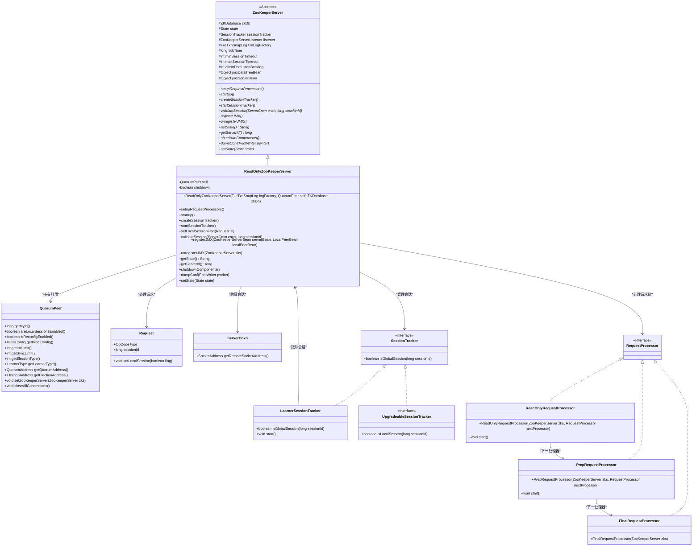

# 基础信息

|      |      |
|------|------|
| 名称 | ReadOnlyZooKeeperServer |
| 编码语言 | .java |
| 代码路径 | zookeeper/zookeeper-server/src/main/java/org/apache/zookeeper/server/quorum/ReadOnlyZooKeeperServer.java |
| 包名 | org.apache.zookeeper.server.quorum |
| 依赖项 | ['java.io.IOException', 'java.io.PrintWriter', 'java.util.Objects', 'java.util.stream.Collectors', 'org.apache.zookeeper.ZooDefs.OpCode', 'org.apache.zookeeper.jmx.MBeanRegistry', 'org.apache.zookeeper.server.DataTreeBean', 'org.apache.zookeeper.server.FinalRequestProcessor', 'org.apache.zookeeper.server.PrepRequestProcessor', 'org.apache.zookeeper.server.Request', 'org.apache.zookeeper.server.RequestProcessor', 'org.apache.zookeeper.server.ServerCnxn', 'org.apache.zookeeper.server.ZKDatabase', 'org.apache.zookeeper.server.ZooKeeperServer', 'org.apache.zookeeper.server.ZooKeeperServerBean', 'org.apache.zookeeper.server.persistence.FileTxnSnapLog'] |
| 概述说明 | ReadOnlyZooKeeperServer扩展ZooKeeperServer，实现只读模式，处理请求、会话跟踪及JMX注册，支持启动关闭和配置转储。 |

# 说明

该内容描述了一个名为ReadOnlyZooKeeperServer的类，它继承自ZooKeeperServer，主要用于实现只读模式的ZooKeeper服务器。类中包含初始化配置、请求处理器设置、启动与关闭逻辑、会话管理、JMX注册与注销等功能。关键点包括：通过QuorumPeer获取配置参数，使用特定处理器处理只读请求，防止全局会话在只读模式下重新连接，以及详细的JMX管理机制。此外，还提供了服务器状态管理、唯一ID获取和配置信息输出等方法。

# 类列表 Class Summary

| 名称   | 类型  | 说明 |
|-------|------|-------------|
| ReadOnlyZooKeeperServer | class | 这是一个只读模式的ZooKeeper服务器实现，继承自ZooKeeperServer，包含初始化、请求处理、会话管理、JMX注册和状态控制等功能。 |

## 类 ReadOnlyZooKeeperServer

|      |      |
|------|------|
| 访问范围 | public |
| 类型 | class |
| 名称 | ReadOnlyZooKeeperServer |
| 说明 | 这是一个只读模式的ZooKeeper服务器实现，继承自ZooKeeperServer，包含初始化、请求处理、会话管理、JMX注册和状态控制等功能。 |

### UML类图

这段代码定义了一个`ReadOnlyZooKeeperServer`类，它是`ZooKeeperServer`的子类，专门用于处理只读模式的ZooKeeper服务器。该类通过`QuorumPeer`管理集群配置，使用`RequestProcessor`链处理客户端请求，并通过`SessionTracker`管理会话状态。核心功能包括启动/关闭服务器、处理会话验证、JMX注册以及维护只读模式下的特殊逻辑（如拒绝全局会话重新连接）。类图展示了其继承关系、关键依赖组件以及处理器链的组成结构。

### 内部方法调用关系图

```mermaid
graph TD
    A["类ReadOnlyZooKeeperServer"]
    B["属性: QuorumPeer self"]
    C["属性: boolean shutdown"]
    D["构造方法: ReadOnlyZooKeeperServer(FileTxnSnapLog, QuorumPeer, ZKDatabase)"]
    E["方法: setupRequestProcessors()"]
    F["方法: startup()"]
    G["方法: createSessionTracker()"]
    H["方法: startSessionTracker()"]
    I["方法: setLocalSessionFlag(Request)"]
    J["方法: validateSession(ServerCnxn, long)"]
    K["方法: registerJMX()"]
    L["方法: registerJMX(ZooKeeperServerBean, LocalPeerBean)"]
    M["方法: unregisterJMX()"]
    N["方法: unregisterJMX(ZooKeeperServer)"]
    O["方法: getState()"]
    P["方法: getServerId()"]
    Q["方法: shutdownComponents()"]
    R["方法: dumpConf(PrintWriter)"]
    S["方法: setState(State)"]

    A --> B
    A --> C
    A --> D
    A --> E
    A --> F
    A --> G
    A --> H
    A --> I
    A --> J
    A --> K
    A --> L
    A --> M
    A --> N
    A --> O
    A --> P
    A --> Q
    A --> R
    A --> S
```

该流程图展示了ReadOnlyZooKeeperServer类的完整结构，包含2个关键属性和16个主要方法。这个只读ZooKeeper服务器实现通过构造方法初始化核心组件，通过setupRequestProcessors建立请求处理链，提供会话管理、JMX注册/注销、状态控制等功能，并特别处理了只读模式下的会话验证和关闭逻辑。shutdownComponents方法确保服务器关闭时能正确清理资源，体现了高可用分布式系统的设计特点。

### 字段列表 Field List

| 名称  | 类型  | 说明 |
|-------|-------|------|
| shutdown = false | boolean | 私有易变布尔变量shutdown初始值为false。 |
| self | QuorumPeer | 受保护的最终QuorumPeer实例self。 |

### 方法列表 Method List

| 名称  | 类型  | 说明 |
|-------|-------|------|
| getState | String | 重写getState方法，返回"read-only"字符串。 |
| registerJMX | void | 重写registerJMX方法，尝试注册JMX数据树Bean，失败时记录警告并置空Bean。 |
| setLocalSessionFlag | void | 方法setLocalSessionFlag根据请求类型设置本地会话标志：创建会话时若启用本地会话则设置标志；关闭会话时检查是否为本地会话，否则警告全局关闭请求。 |
| unregisterJMX | void | 该方法用于从JMX注销ZooKeeperServer实例。若jmxServerBean非空，则调用MBeanRegistry注销。异常时记录警告日志，最后置空jmxServerBean。 |
| getServerId | long | 重写getServerId方法，直接返回self.getMyId()的结果。 |
| registerJMX | void | 注册JMX服务：将ZooKeeperServerBean和LocalPeerBean注册到JMX，失败时记录警告并清空jmxServerBean。 |
| validateSession | void | 代码验证会话ID，拒绝全局会话在只读模式下的重连，记录日志并抛出异常。 |
| unregisterJMX | void | 方法unregisterJMX用于从JMX注销jmxDataTreeBean，失败时记录警告日志并置空该bean。 |
| startSessionTracker | void | 重写startSessionTracker方法，调用sessionTracker的start方法，需强制转换为LearnerSessionTracker类型。 |
| createSessionTracker | void | 重写createSessionTracker方法，创建LearnerSessionTracker实例，参数包括当前对象、ZK数据库会话超时、tick时间、本地ID、本地会话启用状态及服务器监听器。 |
| startup | void | Java方法重写，检查关闭状态后注册JMX并启动服务，设置ZooKeeper服务器实例，记录启动日志。 |
| setupRequestProcessors | void | 代码重写setupRequestProcessors方法，创建并启动请求处理器链：FinalRequestProcessor作为最终处理器，PrepRequestProcessor预处理并链接到最终处理器，ReadOnlyRequestProcessor作为首个处理器链接到预处理。 |
| shutdownComponents | void | 方法关闭组件：设置关闭标志，注销JMX，清空服务器引用，关闭所有连接，最后调用父类关闭方法。 |
| dumpConf | void | 重写dumpConf方法，输出配置信息：initLimit、syncLimit、electionAlg、electionPort、quorumPort和peerType。 |
| setState | void | 重写父类方法，设置当前状态。 |

