# 基础信息

|      |      |
|------|------|
| 名称 | RemotePeerBean |
| 编码语言 | .java |
| 代码路径 | zookeeper/zookeeper-server/src/main/java/org/apache/zookeeper/server/quorum/RemotePeerBean.java |
| 包名 | org.apache.zookeeper.server.quorum |
| 依赖项 | ['org.apache.zookeeper.common.NetUtils.formatInetAddr', 'java.util.stream.Collectors', 'org.apache.zookeeper.common.NetUtils', 'org.apache.zookeeper.jmx.ZKMBeanInfo'] |
| 概述说明 | RemotePeerBean类实现远程管理接口，封装QuorumPeer节点信息，提供名称、地址、选举地址、客户端地址及角色查询功能。 |

# 说明

RemotePeerBean类实现了RemotePeerMXBean和ZKMBeanInfo接口，用于管理ZooKeeper集群中的远程对等节点信息。该类包含两个核心属性：peer表示远程对等节点配置，localPeer表示本地节点实例。主要功能包括获取节点名称、判断是否隐藏、获取仲裁地址、选举地址和客户端地址，以及判断节点是否为领导者。地址信息通过格式化工具处理，支持多地址合并显示。

# 类列表 Class Summary

| 名称   | 类型  | 说明 |
|-------|------|-------------|
| RemotePeerBean | class | RemotePeerBean类实现远程对等节点管理，包含节点地址、选举地址、客户端地址及角色查询功能，支持动态更新节点信息。 |


## 类 RemotePeerBean

|      |      |
|------|------|
| 访问范围 | public |
| 类型 | class |
| 名称 | RemotePeerBean |
| 说明 | RemotePeerBean类实现远程对等节点管理，包含节点地址、选举地址、客户端地址及角色查询功能，支持动态更新节点信息。 |


### UML类图

```mermaid
classDiagram
    class RemotePeerBean {
        -QuorumPeer.QuorumServer peer
        -QuorumPeer localPeer
        +RemotePeerBean(QuorumPeer localPeer, QuorumPeer.QuorumServer peer)
        +setQuorumServer(QuorumPeer.QuorumServer peer) void
        +getName() String
        +isHidden() boolean
        +getQuorumAddress() String
        +getElectionAddress() String
        +getClientAddress() String
        +getLearnerType() String
        +isLeader() boolean
    }

    <<Interface>> RemotePeerMXBean
    <<Interface>> ZKMBeanInfo

    RemotePeerBean ..|> RemotePeerMXBean : 实现
    RemotePeerBean ..|> ZKMBeanInfo : 实现

    class QuorumPeer {
        <<内部类>>
        class QuorumServer {
            +id
            +addr
            +electionAddr
            +clientAddr
            +type
        }
        +isLeader(id) boolean
    }

    RemotePeerBean --> QuorumPeer : 依赖
    RemotePeerBean --> QuorumPeer.QuorumServer : 组合
```

这段类图展示了RemotePeerBean类的结构及其与相关接口和类的关系。RemotePeerBean实现了RemotePeerMXBean和ZKMBeanInfo两个接口，包含对QuorumPeer及其内部类QuorumServer的依赖关系。该类主要功能是封装远程对等节点的信息，提供获取节点名称、地址、选举地址、客户端地址以及判断是否为Leader等方法，用于ZooKeeper集群管理中节点状态的监控和查询。


### 内部方法调用关系图

```mermaid
graph TD
    A["类RemotePeerBean"]
    B["实现接口: RemotePeerMXBean, ZKMBeanInfo"]
    C["属性: QuorumPeer.QuorumServer peer"]
    D["属性: final QuorumPeer localPeer"]
    E["构造方法: RemotePeerBean(QuorumPeer localPeer, QuorumPeer.QuorumServer peer)"]
    F["方法: setQuorumServer(QuorumPeer.QuorumServer peer)"]
    G["方法: String getName()"]
    H["方法: boolean isHidden()"]
    I["方法: String getQuorumAddress()"]
    J["方法: String getElectionAddress()"]
    K["方法: String getClientAddress()"]
    L["方法: String getLearnerType()"]
    M["重写方法: boolean isLeader()"]

    A --> B
    A --> C
    A --> D
    A --> E
    A --> F
    A --> G
    A --> H
    A --> I
    A --> J
    A --> K
    A --> L
    A --> M
```



该流程图展示了RemotePeerBean类的完整结构，该类实现了两个接口并包含9个核心方法。构造方法初始化两个关键属性peer和localPeer，其中peer可通过setQuorumServer动态更新。主要功能包括获取节点名称、地址信息（仲裁/选举/客户端）、学习者类型判断以及领导者状态检查。地址处理方法均采用流式操作进行格式转换，isLeader方法通过localPeer验证当前节点是否为主节点。所有方法均围绕ZooKeeper集群节点管理功能设计。

### 字段列表 Field List

| 名称  | 类型  | 说明 |
|-------|-------|------|
| localPeer | QuorumPeer | 私有成员变量，类型为QuorumPeer，命名为localPeer。 |
| peer | QuorumPeer.QuorumServer | 私有QuorumPeer.QuorumServer类型变量peer。 |

### 方法列表 Method List

| 名称  | 类型  | 说明 |
|-------|-------|------|
| isHidden | boolean | 方法isHidden返回false，表示对象未隐藏。 |
| getClientAddress | String | 获取客户端地址方法：若peer.clientAddr为空返回空字符串，否则返回格式化后的地址。 |
| getName | String | 该方法返回字符串"replica."拼接上peer对象的id属性值。 |
| getElectionAddress | String | 该方法返回选举地址列表，格式为用竖线分隔的字符串。通过流处理获取所有地址并格式化后拼接而成。 |
| setQuorumServer | void | 方法setQuorumServer用于设置QuorumPeer的QuorumServer实例，将传入的peer赋值给当前对象的peer属性。 |
| isLeader | boolean | 重写Java方法isLeader，检查当前peer是否为领导者，通过localPeer的isLeader方法判断peer的ID。 |
| getQuorumAddress | String | 该方法返回节点所有地址的字符串，格式为以竖线分隔的地址列表。 |
| getLearnerType | String | 该方法返回学习者类型字符串，调用peer对象的type属性并转为字符串。 |


