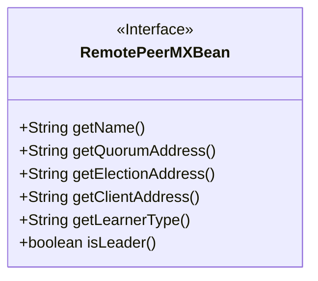
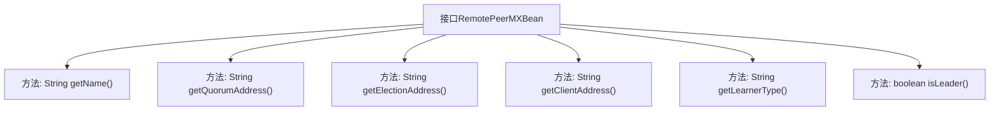

# 基础信息

|      |      |
|------|------|
| 名称 | RemotePeerMXBean |
| 编码语言 | .java |
| 代码路径 | zookeeper/zookeeper-server/src/main/java/org/apache/zookeeper/server/quorum/RemotePeerMXBean.java |
| 包名 | org.apache.zookeeper.server.quorum |
| 依赖项 | [] |
| 概述说明 | RemotePeerMXBean接口定义了获取远程节点信息的方法，包括名称、仲裁地址、选举地址、客户端地址、学习类型及是否为主节点。 |

# 说明

该内容定义了一个名为RemotePeerMXBean的公共接口，属于JMX管理Bean。接口包含六个方法：getName返回对等节点名称；getQuorumAddress返回仲裁对等节点的IP地址；getElectionAddress返回选举地址；getClientAddress返回客户端地址；getLearnerType返回学习者类型；isLeader返回布尔值表示当前节点是否为领导者。每个方法均有注释说明其功能。

# 类列表 Class Summary

| 名称   | 类型  | 说明 |
|-------|------|-------------|
| RemotePeerMXBean | interface | RemotePeerMXBean接口定义了获取远程对等节点信息的方法，包括名称、仲裁地址、选举地址、客户端地址、学习者类型及是否为主节点。 |

## 类 RemotePeerMXBean

|      |      |
|------|------|
| 访问范围 | public |
| 类型 | interface |
| 名称 | RemotePeerMXBean |
| 说明 | RemotePeerMXBean接口定义了获取远程对等节点信息的方法，包括名称、仲裁地址、选举地址、客户端地址、学习者类型及是否为主节点。 |

### UML类图

这段代码定义了一个名为RemotePeerMXBean的JMX管理接口，用于监控分布式系统中远程对等节点的状态信息。该接口提供了6个方法，分别用于获取节点名称、仲裁地址、选举地址、客户端地址、学习者类型以及判断当前节点是否为领导者。这些方法暴露了关键的集群管理信息，适用于ZooKeeper等分布式协调服务的监控场景，通过JMX可实现远程管理和状态查询功能。

### 内部方法调用关系图

该流程图展示了RemotePeerMXBean接口的结构，包含6个关键方法：获取对等节点名称(getName)、仲裁地址(getQuorumAddress)、选举地址(getElectionAddress)、客户端地址(getClientAddress)、学习者类型(getLearnerType)以及领导状态检查(isLeader)。每个方法都通过箭头与接口主体相连，清晰地反映了这个JMX管理接口提供的全部监控功能，用于获取分布式系统中对等节点的网络配置和角色状态信息。

### 字段列表 Field List

| 名称  | 类型  | 说明 |
|-------|-------|------|

### 方法列表 Method List

| 名称  | 类型  | 说明 |
|-------|-------|------|
| getElectionAddress | String | 获取选举地址的字符串方法。 |
| getClientAddress | String | 获取客户端地址的方法。 |
| getQuorumAddress | String | 获取法定人数地址的方法。 |
| getLearnerType | String | 获取学习者类型的方法。 |
| getName | String | 获取名称的方法。 |
| isLeader | boolean | 方法isLeader返回布尔值，表示是否为领导者。 |

