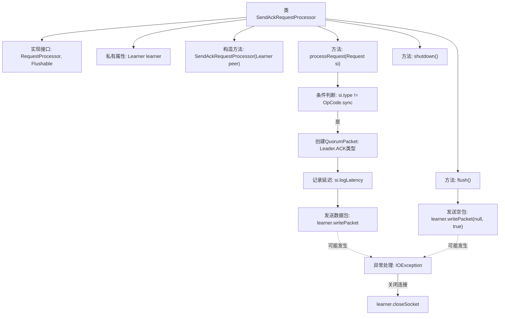

# 基础信息

|      |      |
|------|------|
| 名称 | SendAckRequestProcessor |
| 编码语言 | .java |
| 代码路径 | zookeeper/zookeeper-server/src/main/java/org/apache/zookeeper/server/quorum/SendAckRequestProcessor.java |
| 包名 | org.apache.zookeeper.server.quorum |
| 依赖项 | ['java.io.Flushable', 'java.io.IOException', 'org.apache.zookeeper.ZooDefs.OpCode', 'org.apache.zookeeper.server.Request', 'org.apache.zookeeper.server.RequestProcessor', 'org.apache.zookeeper.server.ServerMetrics', 'org.slf4j.Logger', 'org.slf4j.LoggerFactory'] |
| 概述说明 | SendAckRequestProcessor类处理非同步请求，向Learner发送ACK响应，异常时关闭连接，提供flush和空shutdown方法。 |

# 说明

SendAckRequestProcessor是一个实现了RequestProcessor和Flushable接口的类，用于处理请求并发送确认响应。它包含一个Learner对象作为成员变量，通过构造函数初始化。processRequest方法处理非同步类型的请求，构造一个ACK类型的QuorumPacket并发送给Learner，同时记录延迟。若发生IO异常，会关闭连接。flush方法用于刷新数据包，同样处理可能的IO异常。shutdown方法为空实现。

# 类列表 Class Summary

| 名称   | 类型  | 说明 |
|-------|------|-------------|
| SendAckRequestProcessor | class | SendAckRequestProcessor处理非同步请求，向Learner发送ACK响应，异常时关闭连接，支持刷新和关闭操作。 |


## 类 SendAckRequestProcessor

|      |      |
|------|------|
| 访问范围 | public |
| 类型 | class |
| 名称 | SendAckRequestProcessor |
| 说明 | SendAckRequestProcessor处理非同步请求，向Learner发送ACK响应，异常时关闭连接，支持刷新和关闭操作。 |


### UML类图

```mermaid
classDiagram
    class SendAckRequestProcessor {
        -Learner learner
        +SendAckRequestProcessor(Learner peer)
        +processRequest(Request si) void
        +flush() void
        +shutdown() void
    }

    <<Interface>> RequestProcessor
    <<Interface>> Flushable

    SendAckRequestProcessor ..|> RequestProcessor : 实现
    SendAckRequestProcessor ..|> Flushable : 实现

    class Learner {
        +writePacket(QuorumPacket qp, boolean flush) void
        +closeSocket() void
    }

    class Request {
        -int type
        +getHdr() Header
        +logLatency(Metric metric) void
    }

    class QuorumPacket {
        +int type
        +long zxid
        +byte[] data
        +List<InetSocketAddress> authinfo
    }

    SendAckRequestProcessor --> Learner : 依赖
    SendAckRequestProcessor --> Request : 处理
    SendAckRequestProcessor --> QuorumPacket : 创建
```

这段代码展示了一个ZooKeeper中的确认请求处理器SendAckRequestProcessor，它实现了RequestProcessor和Flushable接口。主要功能是处理非同步类型的请求，生成ACK确认包并通过Learner发送给Leader。类图清晰地展示了与Learner、Request和QuorumPacket的依赖关系，以及处理请求和刷新数据包的核心方法。该处理器在出现IO异常时会关闭连接，体现了分布式系统中对网络故障的健壮性处理。


### 内部方法调用关系图



该流程图展示了SendAckRequestProcessor类的核心结构和处理逻辑。类实现了RequestProcessor和Flushable接口，主要功能包括处理请求（processRequest）和刷新操作（flush）。processRequest方法会检查请求类型，若非sync类型则创建ACK响应包并发送，过程中会记录延迟指标并处理可能的IO异常。flush方法专门用于发送空包进行连接刷新，两者在异常时都会关闭socket连接。shutdown方法为空实现，表明无需特殊关闭逻辑。整个流程体现了请求处理与网络通信的完整生命周期管理。

### 字段列表 Field List

| 名称  | 类型  | 说明 |
|-------|-------|------|
| LOG = LoggerFactory.getLogger(SendAckRequestProcessor.class) | Logger | 私有静态日志常量LOG，用于SendAckRequestProcessor类的日志记录。 |
| learner | Learner | 学习者对象实例化。 |

### 方法列表 Method List

| 名称  | 类型  | 说明 |
|-------|-------|------|
| shutdown | void | 空方法shutdown，无具体实现。 |
| flush | void | flush方法尝试发送空包，失败则关闭连接并记录异常。 |
| processRequest | void | 方法处理请求，若非同步类型则创建ACK响应包，记录延迟并发送，异常时关闭连接。 |


