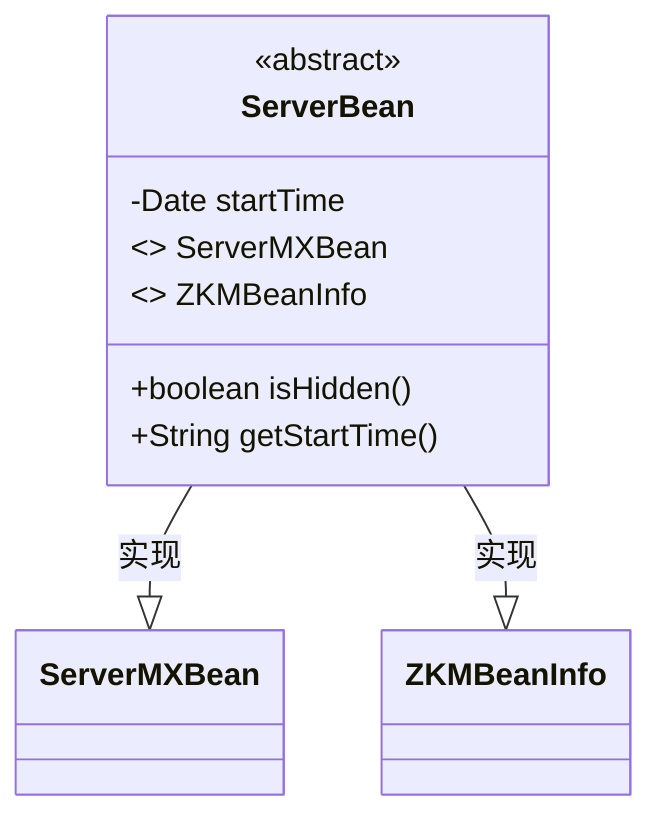
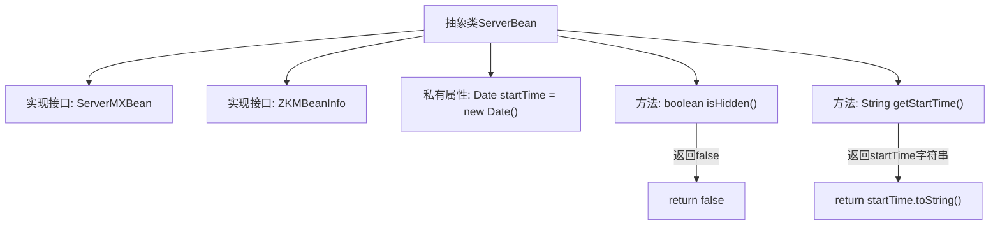

# 基础信息

|      |      |
|------|------|
| 名称 | ServerBean |
| 编码语言 | .java |
| 代码路径 | zookeeper/zookeeper-server/src/main/java/org/apache/zookeeper/server/quorum/ServerBean.java |
| 包名 | org.apache.zookeeper.server.quorum |
| 依赖项 | ['java.util.Date', 'org.apache.zookeeper.jmx.ZKMBeanInfo'] |
| 概述说明 | 抽象类ServerBean实现ServerMXBean和ZKMBeanInfo接口，包含启动时间和默认非隐藏状态。 |

# 说明

这是一个名为ServerBean的抽象类，实现了ServerMXBean和ZKMBeanInfo接口。该类包含一个私有不可变的startTime字段，类型为Date，初始化时自动设置为当前时间。提供了两个公共方法：isHidden()始终返回false，表示该Bean不隐藏；getStartTime()返回startTime的字符串表示形式。该类作为JMX管理Bean的基础抽象类，主要用于记录服务器启动时间信息。

# 类列表 Class Summary

| 名称   | 类型  | 说明 |
|-------|------|-------------|
| ServerBean | class | 抽象类ServerBean实现ServerMXBean和ZKMBeanInfo接口，包含启动时间和默认非隐藏状态。 |

## 类 ServerBean

|      |      |
|------|------|
| 访问范围 | public abstract |
| 类型 | class |
| 名称 | ServerBean |
| 说明 | 抽象类ServerBean实现ServerMXBean和ZKMBeanInfo接口，包含启动时间和默认非隐藏状态。 |

### UML类图

这段代码展示了一个抽象类ServerBean，它实现了ServerMXBean和ZKMBeanInfo两个接口。类中包含一个私有Date类型字段startTime记录启动时间，提供isHidden()方法默认返回false，以及getStartTime()方法返回启动时间的字符串表示。该设计用于定义服务器Bean的基础行为，通过接口实现确保符合特定管理规范。

### 内部方法调用关系图

这段代码描述了一个抽象类ServerBean，它实现了ServerMXBean和ZKMBeanInfo两个接口。类中包含一个私有属性startTime，记录对象创建时间，以及两个方法：isHidden()始终返回false，getStartTime()返回startTime的字符串表示。流程图清晰地展示了类的继承关系、属性定义和方法逻辑，其中方法调用路径通过箭头连接，体现了简单的布尔返回和时间格式转换功能。

### 字段列表 Field List

| 名称  | 类型  | 说明 |
|-------|-------|------|
| startTime = new Date() | Date | 声明一个私有不可变的Date类型变量startTime，初始化为当前时间。 |

### 方法列表 Method List

| 名称  | 类型  | 说明 |
|-------|-------|------|
| isHidden | boolean | 方法isHidden返回false，表示对象未被隐藏。 |
| getStartTime | String | 获取开始时间的字符串表示方法。 |

