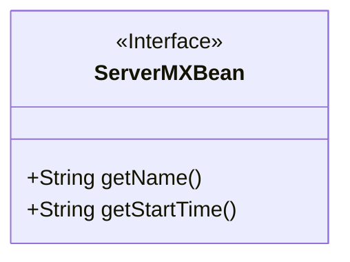
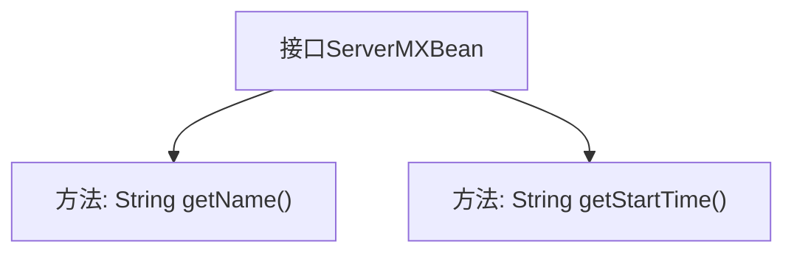

# 基础信息

|      |      |
|------|------|
| 名称 | ServerMXBean |
| 编码语言 | .java |
| 代码路径 | zookeeper/zookeeper-server/src/main/java/org/apache/zookeeper/server/quorum/ServerMXBean.java |
| 包名 | org.apache.zookeeper.server.quorum |
| 依赖项 | [] |
| 概述说明 | ServerMXBean接口定义获取服务器MBean名称和启动时间的方法。 |

# 说明

这是一个名为ServerMXBean的公共接口定义，属于MBean（管理Bean）类型。接口声明了两个关键方法：getName()用于获取服务器MBean的名称，getStartTime()用于获取服务器的启动时间。两个方法均通过Javadoc注释明确说明了其返回值的含义，前者返回字符串类型的MBean名称，后者返回字符串格式的服务器启动时间。该接口遵循标准JMX（Java管理扩展）规范设计，用于暴露服务器管理相关的监控属性。

# 类列表 Class Summary

| 名称   | 类型  | 说明 |
|-------|------|-------------|
| ServerMXBean | interface | ServerMXBean接口定义获取服务器MBean名称和启动时间的方法：getName()和getStartTime()。 |

## 类 ServerMXBean

|      |      |
|------|------|
| 访问范围 | public |
| 类型 | interface |
| 名称 | ServerMXBean |
| 说明 | ServerMXBean接口定义获取服务器MBean名称和启动时间的方法：getName()和getStartTime()。 |

### UML类图

这段代码定义了一个名为ServerMXBean的接口，该接口遵循JMX(Java Management Extensions)规范中的MBean(Managed Bean)标准。接口声明了两个公有方法：getName()用于获取服务器MBean的名称，getStartTime()用于获取服务器的启动时间。作为管理接口，它通常由服务器实现类来实现，以便通过JMX技术对外暴露服务器管理信息。该接口不包含任何实现细节，仅定义了管理服务器所需的最小API契约。

### 内部方法调用关系图

这段流程图展示了ServerMXBean接口的结构，该接口定义了两个关键方法：getName()用于获取服务器MBean的名称，getStartTime()用于获取服务器启动时间。作为JMX管理接口的标准设计，这两个方法分别提供了服务器实例的身份标识和运行状态信息，适用于监控系统需要的基础数据采集场景。

### 字段列表 Field List

| 名称  | 类型  | 说明 |
|-------|-------|------|

### 方法列表 Method List

| 名称  | 类型  | 说明 |
|-------|-------|------|
| getStartTime | String | 获取开始时间的方法。 |
| getName | String | 获取名称的方法。 |

